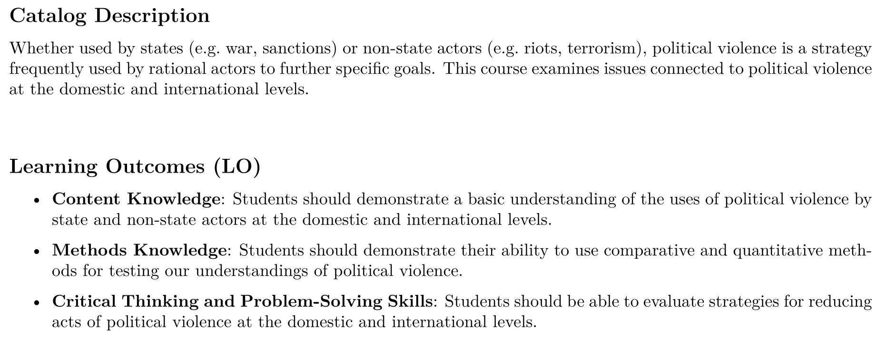
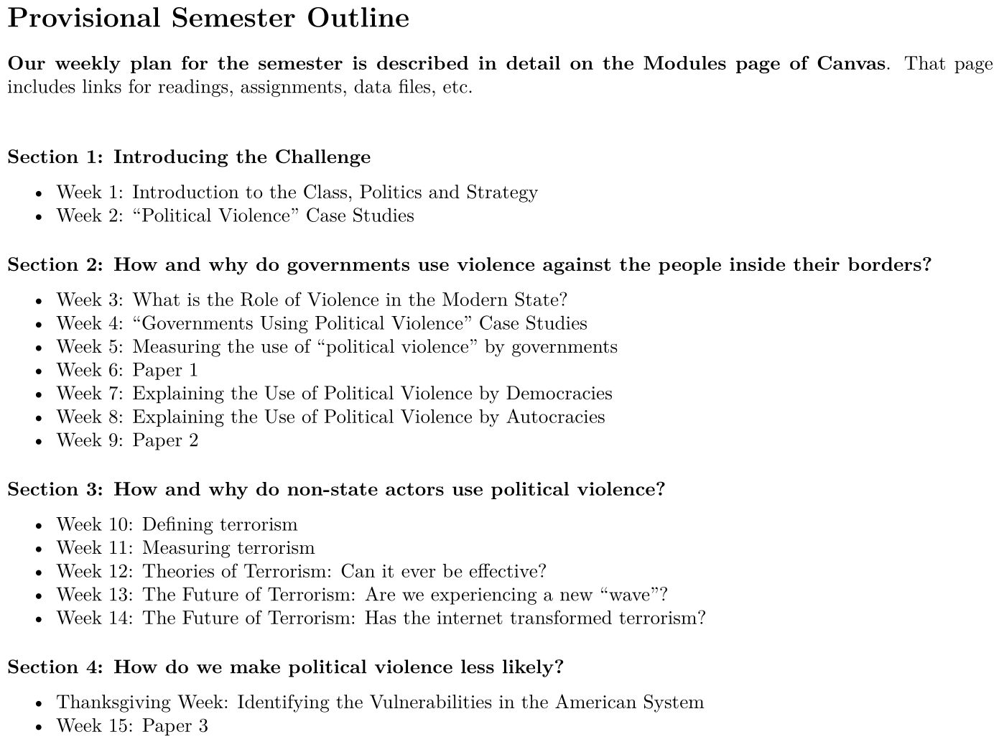
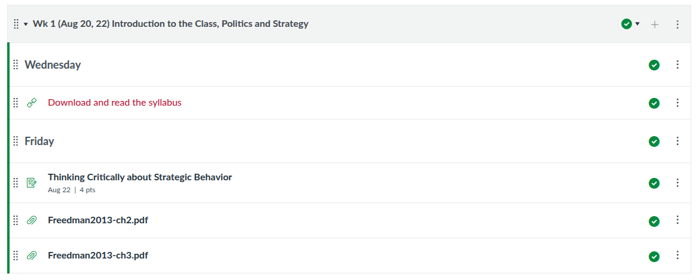

## Today's Agenda {background-image="Images/00-Leviathan_Cover_55.png" .center}

```{r}
library(tidyverse)
library(readxl)
library(kableExtra)
```

<br>

::: {.r-fit-text}

**Welcome to Issues in Political Violence**

- Define Key Concepts

- Plan for the Semester
:::

<br>

::: r-stack
Justin Leinaweaver (Fall 2025)
:::

::: notes
Prep for Class

1. ...

<br>

Welcome to PLSC 346: Political Violence

- I'm Dr. Leinaweaver

- **Is everybody in the right place?**

<br>

**SLIDE**: Intros

:::


## {background-image="Images/00-Leviathan_Cover_55.png" .center}


:::: {.r-fit-text}
**Introductions**

1. Name

2. Year in school

3. Major

::: {.fragment}

4. A specific act of **political** violence

:::

::::

::: notes

I'm Dr. Leinaweaver.

- 14th year at Drury

- Political scientist

- Research interests: public policy, international politics, environmental politics

<br>

Your turn!

- Let's hit the basics: name, year in school, major

- PLUS...

<br>

**REVEAL: What is one specific thing you could do today after class that you argue would be an example of POLITICAL violence?**

<br>

Everybody take a moment to think about this last piece and write down your answer!

- As we go around the room I want you to give the answer you wrote down, don't be influenced by what you hear from others!

<br>

**Can I have a volunteer to track the suggestions on the board?**

- Let's do it!

:::


## {background-image="Images/01_1-Red_Dark_Art_Abstract.jpg" .center}

::: {.r-fit-text}
**[Define "Violence"]{style="color:white;"}**
:::

::: notes

Ok, everybody pair up!

- Pairs I want you to compare and contrast all our class suggestions in order to extract a one sentence-ish definition of "violence."

- Don't Google it! Aim here is to derive a definition based on your suggested cases

- Therefore, these definitions can represent a sort of consensus-based, prior knowledge for the class

<br>

**Questions on the task?**

- Get to it!

<br>

PRESENT and DISCUSS proposals

- *ON BOARD*

<br>

**SLIDE**: Let's compare your definitions with a couple more established defintions.

:::


## {background-image="Images/01_1-Red_Dark_Art_Abstract_v3.png" .center}

**[Define "Violence"]{style="color:white;"}**

<br>

[**Oxford Languages Definition of "Violence"**]{style="color:white;"}

[1. "behavior involving physical force intended to hurt, damage, or kill someone or something."]{style="color:white;"}

[2. "strength of emotion or an unpleasant or destructive natural force."]{style="color:white;"}

[3. (LAW) "the unlawful exercise of physical force or intimidation by the exhibition of such force."]{style="color:white;"}

::: notes

This is otherwise known as the Google dictionary version.

- COMPARE and CONTRAST with our definitions

<br>

**SLIDE**: Let's look at one other well known definition

:::


## {background-image="Images/01_1-Red_Dark_Art_Abstract_v3.png" .center}

[**Oxford Languages Definition of "Violence"**]{style="color:white;"}

- ["behavior involving physical force intended to hurt, damage, or kill someone or something" OR "the unlawful exercise of physical force or intimidation by the exhibition of such force."]{style="color:white;"}

[**The WHO's Definition of "Violence"**]{style="color:white;"}

- ["...the intentional use of physical force or power, threatened or actual, against oneself, another person, or against a group or community, that either results in or has a high likelihood of resulting in injury, death, psychological harm, maldevelopment or deprivation" (2002).]{style="color:white;"}

::: notes

Source: The World Health Organization's "World Report on Violence and Health (WRVH), (Krug E, Dahlberg L, Mercy J.et alWorld report on violence and health. Geneva: World Health Organization, 2002).

<br>

**How is this different from the Oxford Languages definition?**

<br>

**Is it important to our definition that the WHO adds "threat" as a form of violence? Why or why not?**

- (Oxford focuses on physical and exhibition of force) 

<br>

**Doesn't adding threat make the term "violence" MUCH more vague/imprecise/subjective?**

- (Maybe that's a good thing? Easy doesn't mean accurate)

<br>

**So, where do we end up? What is "violence"?**

:::


## {background-image="Images/01_1-Blue_Art_Abstract.jpg" .center}

::: {.r-fit-text}
**[Define "Politics"]{style="color:white;"}**
:::

::: notes

Ok, now switch to the other concept and find a new partner!

- Pairs I want you to compare and contrast all our class suggestions in order to extract a one sentence-ish definition of "politics."

- Don't Google it! Aim here is to derive a definition based on your suggested cases

- Therefore, these definitions can represent a sort of consensus-based, prior knowledge for the class

<br>

### Questions on the task?

- Get to it!

<br>

PRESENT and DISCUSS proposals

- *ON BOARD*

:::


## {background-image="Images/01_1-Blue_Abstract_v3.png" .center}

<br>

::: {.r-fit-text}

[**"Politics" is...**]{style="color:white;"}

- [Decision-making in a community]{style="color:white;"}

- [How we make and enforce the "rules"]{style="color:white;"}

- [Who gets what, when and how?]{style="color:white;"}

:::

::: notes

These are all classic definitions of the word "politics."

<br>

"Politics" as:

- Decision-making in a community

- How we make and enforce “the rules”

- Who gets what, when and how?

<br>

**Any questions on this?**

- In these terms, politics is fundamental to the functioning of every society.

:::


## {background-image="Images/00-Leviathan_Cover_55.png" .center}

::: {.r-fit-text}
**Define "Political Violence"**
:::

::: notes

**So, at this point what is our working definition of "political violence"?**

- *ON BOARD*

<br>

Funny thing is, arguably, the only thing more fundamental and foundational to society than politics is violence.

+ Violence is an ancient human phenomenon and a powerful motivator in society.

+ To some scholars, it is the only explanation you need for politics

+ It isn't hard to see its effect around us whether you use it or are afraid of it.

<br>

Now, here's the deal.

- I'm actually less concerned with finding the end-all, be-all definition of political violence and am actually far more interested in explaining whatever acts we decide are relevant

- So, we pick our target and then the work begins: Why is it happening and how do we stop it from happening again?

<br>

**SLIDE**: With that in mind let's talk current events

:::


## {background-image="Images/01_1-Jan6th_Protest.jpg" .center}

::: notes

**Does the January 6th protest meet our definition of "political violence"? Why or why not?**

- (**SLIDE**: Definitely violent!)

:::


## {background-image="Images/01_1-Jan6th_Protest2.jpg" .center}

::: notes

[Link](https://www.washingtonpost.com/local/public-safety/police-union-says-140-officers-injured-in-capitol-riot/2021/01/27/60743642-60e2-11eb-9430-e7c77b5b0297_story.html)

<br>

Definitely violent!

+ "...about 140 officers were injured"

+ "Capitol Police Officer Brian D. Sicknick died after trying to defend the Capitol from rioters."

+ "...several concussions from head blows from various objects..."

+ "Other injuries included swollen ankles and wrists, bruised arms and legs, and irritated lungs from bear and pepper spray."

+ "Reports say officers were pushed down stairs, trampled by rioters, punched and run over in a stampede."

+ “I’ve talked to officers who have done two tours in Iraq who said this was scarier to them than their time in combat,” acting D.C. police chief Robert J. Contee III said at a news conference earlier this month."

<br>

**SLIDE**: But what does it mean to describe this as "political"?

:::


## {background-image="Images/01_1-Jan6th_Protest4.png" .center}

<br>

<br>

<br>

<br>

<br>

<br>

<br>

<br>

<br>

::: {.r-fit-text}
**Violence is a political strategy by rational, goal-seeking actors**
:::

::: notes

Our organizing assumption this semester is that violence is a strategy chosen by rational, goal-seeking actors.

<br>

**Can anybody tell me what that means in English?**

+ We assume that actors have preferences over outcomes.

+ In other words, people want things and act to try and get those things.

<br>

**So, what was the strategic goal of the January 6th protestors?**

<br>

**Does anybody want to make the argument these protestors were "crazy"? Why or why not?**

<br>

Here's the thing, most researchers of political violence start with this key assumption

- Assuming violent actors are "crazy" doesn't help us in any meaningful way.

    - The only way to stop "crazy" is with more violence.
    
- To understand or reduce violence we need to learn about these actors, their preferences and the systems they inhabit.

<br>

This is a big assumption and, in some case this semester, you will feel like it is a bad place to start.

- e.g. this assumes that acts of violence you find abhorent were still done for rational reasons.

<br>

I will make sure we have room to explore and consider this assumption during the semester.

- Unfortunately, current events are giving us many, many, many ongoing examples of political violence to explore

<br>

**SLIDE**: Ok, big picture class organization stuff!

:::


## {background-image="Images/00-Leviathan_Cover_55.png" .center}



::: notes

The syllabus has the full details on these but here is the heart of each.

- The LOs guide my design of the semester, my plan for each class, the pedagogies we use in class and the design of each assignment.

<br>

### Any questions on the LOs?


Get ready!

- LO1 means theory and models

- LO2 means data testing

- LO3 means using theories and data to solve real-world problems

:::


## {background-image="Images/00-Leviathan_Cover_55.png" .center}



::: notes

Outline is provisional

- Canvas Modules is our central repo for everything you need!

- Readings, daily assignments, datasets

:::


## Course Grade {background-image="Images/00-Leviathan_Cover_55.png" .center}

```{r}
tibble(
  col1 = c("Attendance & Participation", "Papers", "1. Evaluating Measures of Violence", "2. Political Violence Country Report", "3. Reducing Political Violence"),
  col3 = c("55%", "45%", "", "", "")
) |>
  kableExtra::kbl(align = c("l", "c"), col.names = c("", "")) |>
  kableExtra::kable_styling(font_size = 40) |>
  kableExtra::column_spec(1, width = "20em") |>
  # kableExtra::column_spec(2, width = "7em") |>
  kableExtra::row_spec(0, background = "lightblue") |>
  kableExtra::row_spec(1:5, background = "white")
```

::: notes

Everyone should download and read the syllabus.

- Tons of important course policies in there and by taking this class you are agreeing to all of them

<br>

More than half your course grade this semester is about showing up, being prepared and engaging in the work of our class.

- You'll see on the Modules page of Canvas that most of our class sessions have a reading plus an assignment

- To get credit you must submit these assignments BEFORE class begins.

<br>

There is an attendance cliff in this class

- Anyone with more than four unexcused absences in the semester cannot earn higher than a ‘C’ in the course (regardless of grades earned on other assignments).

- IFF you have an excused absence coming up **YOU** are required to contact me by email for excused absences
    
    - Coach emails alone DO NOT COUNT

<br>

**Any questions on these grades or policies?**

<br>

**SLIDE**: Speaking of grade policies in the syllabus

:::


## {background-image="Images/background-worldmap4.png" .center}

{style="display: block; margin: 0 auto"}

::: notes

You may not use any AI tools in this class. Any AI use will be treated as plagiarism.

<br>

That means: 

- No AI search

- No AI summaries of articles or books

- No AI for outlining or writing

- No AI for data analysis

- No AI to simply clean up your grammar (e.g. Grammarly).

<br>

Think of this class like training to play a sport

- The time you spend in the gym getting stronger and more flexible makes you a better athlete regardless of the sport you end up playing. 

- That's what we're doing in this class when we learn to critically analyze texts and become better writers.

- I'm getting you ready to succeed out in the real world

- Using AI tools is like bringing a forklift into the weight room. Yeah, you lifted the weights, but it was a waste of your time.

<br>

Other key point: Lots of people are worried about AI taking their jobs, e.g. replacing them in the workforce. 

- If you use AI to do your thinking for you then you are literally replacing yourself with AI

- You are setting yourself up with skills that are basically without value

<br>

So, let's not waste this opportunity working together this semester

- Let's get stronger and be better adapted to whatever the world looks like when you graduate

<br>

**Questions on this policy?**

<br>

**SLIDE**: The Canvas Modules page

:::


## Canvas Modules Page {background-image="Images/00-Leviathan_Cover_55.png" .center}



::: notes

Speaking of Canvas!

- ALL of the assigned readings and daily assignments are available on Canvas in the "Modules" section.

- I have organized the Modules by week of the semester to mirror the structure of the syllabus

<br>

The syllabus includes many web links, but if they don't work I have uploaded backups onto Canvas.

- ALL of the assigned readings should be on Canvas

- Please let me know BEFORE class if you ever can't find an assigned reading.

<br>

Here you can see your assignment for Friday.

- The readings are from the beginning of a PHENOMENAL book on "Strategy" by Lawrence Freedman.

- In these chapters Freedman is dipping back into history to root his exploration in the stories we tell to communicate the ideas of strategy.

- I want you to read these thinking about how we define "strategy" and what we learn from these stories.

<br>

### Questions on anything?

- See you next class!

:::
