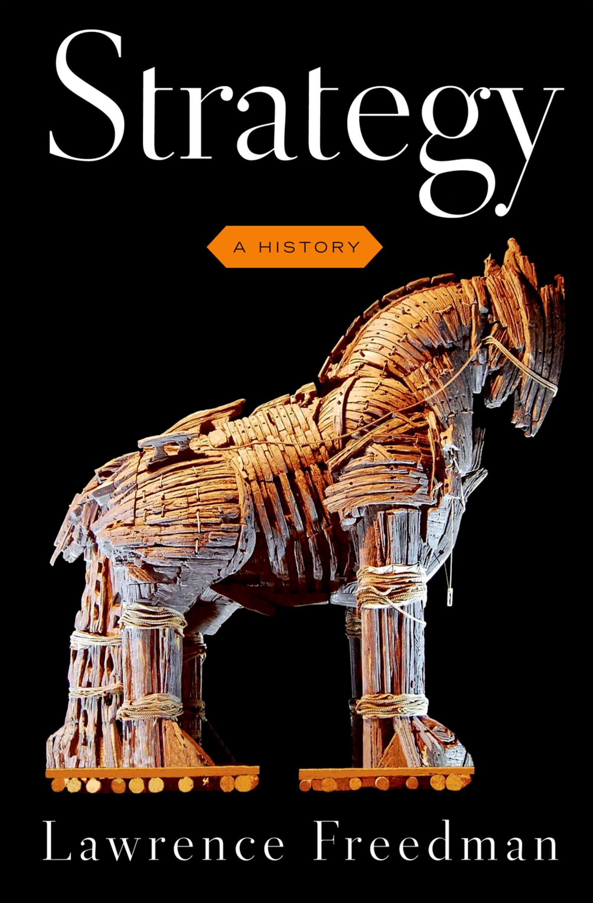

---
output:
  xaringan::moon_reader:
    css: ["default", "extra.css"]
    lib_dir: libs
    seal: false
    nature:
      highlightStyle: github
      highlightLines: true
      countIncrementalSlides: false
      ratio: '16:9'
---

```{r, echo = FALSE, warning = FALSE, message = FALSE}
##xaringan::inf_mr()
library(tidyverse)
library(readxl)
library(stargazer)
##library(kableExtra)
##library(modelr)

knitr::opts_chunk$set(echo = FALSE,
                      eval = TRUE,
                      error = FALSE,
                      message = FALSE,
                      warning = FALSE,
                      comment = NA)
```

background-image: url('libs/Images/00-Leviathan_Cover_55.png')
background-size: 100%
background-position: center
class: middle

.size70[**Today's Agenda**]

<br>

.size55[.center[
Explore the concept of "strategy" and how it applies to actor behavior
]]

<br>

<br>

.center[.size40[
  Justin Leinaweaver (Fall 2023)
]]

???

### Prep for Class
1. Bring deck of cards

2. Prep email with link to Google Doc for citations
- https://docs.google.com/document/d/1c4N7BPa8Ospj5b6gtU9ULqRBQQHOq3K4UxFEbPm34cc/edit?usp=sharing

<br>

Everybody stand up so we can play a game!


---

class: middle
background-image: url('libs/Images/background-red.png')
background-size: 100%
background-position: center

.size60[.center[**Game: Survive or Die!**]]

.size40[
+ Starting Lives: 1 (playing card)
]

--

.size40[
+ Survival requires 3 cards
]

--

.size40[
+ Duel: Rock-paper-scissors, winner takes **ALL**
]

--

.size40[
+ If you are challenged you MUST duel
]

--

.size40[
+ Lose your card, sit down (you're dead)
]

???

### Ready? GO!

<br>

Ok, back to your seats.


---

background-image: url('libs/Images/background-red.png')
background-size: 100%
background-position: center
class: middle

.size60[.center[**Reflections on the Game**]]

<br>

.size50[
1. What was your goal for the game?

2. How specifically did you try to achieve this goal?

3. How successful were you?
]

???

Time to gather some data.

Everybody take 2 minutes on your own to reflect on the game.

Get ready to answer these three questions

<br>

*Gather responses from around the room for each*

<br>

### WHAT WAS IT THAT YOU WANTED DURING THIS GAME?
#### - WHAT WAS YOUR GOAL?

<br>

### HOW DID YOU TRY TO ACHIEVE YOUR GOAL?
#### - TACTICS EMPLOYED?

<br>

### HOW SUCCESSFUL WERE YOU?
#### - WHAT STOOD IN YOUR WAY?


---

background-image: url('libs/Images/background-red.png')
background-size: 100%
background-position: center
class: middle

.pull-left[

<br>

<br>

.center[
.size70[
Define "strategy" as a concept
]]]

.pull-right[

```{r, fig.retina=3, fig.align='right', out.width='80%'}

```
]

???

Let's shift to the readings for today.

### Focusing first on the preface, how does lawrence freedman define strategy?
- word is ubiquitous and has many possible definitions

- p.x: "...attempts to think about actions in advance, in light of our goals and our capacities."

- p.xi: Balancing ends, ways and means. Identifying objectives and the resources and methods available to meet them.

- p.xii: The realm of strategy is one of bargaining and persuasion. "It's about getting more out of a situation than the starting balance of power would suggest. It's the art of creating power."

<br>

### Why is strategy "much more than a plan? (p.xi)
(A plan: a sequence of moves from one place to another)
(A strategy assumes others exist to frustrate your plans. It must be fluid and flexible, rooted to where you actually are.)

<br>

### What else stood out to you in the preface as important to our thinking about strategy?

<br>

### In these terms, were you  "strategic" during our game or not?


---

background-image: url('libs/Images/background-red.png')
background-size: 100%
background-position: center
class: middle


.pull-left[

<br>

<br>

.center[
.size60[
Identify the assumptions underpinning "strategic behavior"
]]]

.pull-right[

```{r, fig.retina=3, fig.align='right', out.width='80%'}

```
]

???

### What assumptions do we make about an actor we are classifying as "strategic"?
+ (Rational: Picks things they like over things they don't.)
    + Has preferences that can be ordered and are transitive 

+ (Goal-seeking: Has goals / objectives)

<br>

### Does everyone here satisfy these assumptions for our first game? Why or why not?
+ (Maybe not if you truly don't care about the class, the game or learning)

<br>

### Does everyone have to have the goal of survival in this game to be strategic or rational?
+ (No!!)

+ Maximize points vs avoid being judged by classmates vs get through class as painlessly as possible


---
background-image: url('libs/Images/01-2-multiple_identities.png')
background-size: 100%
background-position: center

???

Our job as social scientists is to explain the world as it is, not as we wish it was. 

This means dealing with actors on their own terms, not ours.

Lots of people have motivations and goals very different from our own.

<br>

Importantly we have to note that

1. your preference orderings are tied to your identity, AND

2. You have multiple identities!

<br>

Right now, I'm your professor and I want only the best for you.

If my son walks in, I'm a dad first and you can all go rot. 

### Make sense?

<br>

### What does this fluid identity mean for our assumption that actors are "rational"? 
#### - If actor preferences keep changing how can we assume rationality or model their behavior?

(Not necessarily.)

+ Actors have different identities activated by context

+ Our assumption might be that your preferences are tied to the identity that is currently activated for you.

In other words, context matters but can be assumed to be fixed in a given moment.


---

class: middle
background-image: url('libs/Images/background-red.png')
background-size: 100%
background-position: center

.size50[.center[**Game: Lower Cost Survive or Die!**]]

.size40[
+ Starting Lives: 1 (playing card)

+ Survival requires 3 cards

+ Rock-paper-scissors, winner takes **ONE** card

+ If you are challenged you MUST duel

+ Lose ALL your cards and you're dead

+ No negotiations allowed
]

???

Ok, everybody stand up and let's play again.

This time, the winner in any duel gets ONE card from you.

- If that's your only card, you're dead.

- If not, you're still alive.

### Ready? Go!

<br>

### How did the rules of this game change your behavior?

*Gather responses from around the room*

#### - Who was more willing to attack in this version of the game? Why?

#### - Who wasn't affected by the new rules? Why?

<br>

Let's talk about chapter 1 in Freedman's book.

### What is Freedman's argument in chapter 1?

#### - What stood out to you as important to our thinking about strategy?

(SLIDE)


---

background-image: url('libs/Images/background-red.png')
background-size: 100%
background-position: center
class: middle


.pull-left[
.center[
.size60[
Strategy is .textred[**fundamental**] to the social world.

Politics in .textred[**everything**].
]]]


.pull-right[
```{r, fig.retina=3, fig.align='right', out.width='80%'}

```
]

???

*Strategy is fundamental to the social world. Politics in everything.*

- Fundamental features of strategy appear to have evolved: deception, coalition formation, and the instrumental use of violence

- p.5: "Strategic intelligence" evolved through interactions in a complex social environment as much as from the demands of survival in a harsh physical environment.

- The point here is, as we discussed on Wednesday, "politics" is in everything.

- p6: Ants as a-strategic users of violence vs chimps use of strategy for boosting access to key resources (food, territory, females for mating)

<br>

### Is it convincing? Why or why not?

#### - In other words, are we convinced that we can learn about the roots of strategy by studying the animal kingdom? 

<br>

The Freedman book goes on from here to explore the roots of strategy in some very cool places: 

The Bible, the ancient Greeks, Machiavelli, Sun Tzu and the role of the Devil in works like Milton's "Paradise Lost."

If you're interested it's an excellent book.


---

class: middle
background-image: url('libs/Images/background-red.png')
background-size: 100%
background-position: center

.size50[.center[**Game: Ultimate Survive or Die!**]]

.size40[
+ Starting Lives: 1 (playing card)

+ Survival requires 3 cards

+ Rock-paper-scissors, winner takes **ONE** card

+ If you are challenged you MUST duel

+ Lose ALL your cards and you're dead

+ Alliances Permitted: Pool cards, one leader
]

???

Ok, everybody stand up and let's play one last time.

New Rules

+ I will randomly pass out cards, some get 1 and others 3

+ You can form an alliance and combine cards, one leader

### Questions?

<br>

### Ready? GO!

<br>

### How did strategies change under the new game?

*Gather responses from around the room*

<br>

Ok, let's wrap up.


---

class: slideblue

.size80[**Today's Agenda**]

<br>

.size55[

1. Define "strategy" as a concept

2. Practice being "strategic"

3. Identify the assumptions underpinning "strategic behavior"

]

???

### What are our takeaways from today?

#### - Define "strategy" for us

#### - What does an assumption of "being strategic" mean about an actor?

#### - How do we devise a strategy in a given situation?
+ (What you want, who the other actors are and what they want, the rules of the game, etc)


---

background-image: url('libs/Images/01-2-uncle_sam.png')
background-size: 70%
background-position: center
class: middle

???

### Out of curiosity, what proportion of your decisions in your day-to-day life meet this definition of "strategic"? Why?

- Different proportions for different life contexts? Which aspects of your life are you most strategic in? Why?

- Why not be highly strategic in every decision-making situation?

<br>

### Any questions on this?


---

background-image: url('libs/Images/background-blue_triangles2.png')
background-size: 100%
background-position: center
class: middle, center

.size70[**For Next Class**]

<br>

.size60[
Bring to class a news article that describes a recent act of political violence (make sure you can briefly describe the background of the case).
]

???

*Send link to class by email*

Submit your chosen case before class Monday on our Google Doc.

Please try not to overlap!


