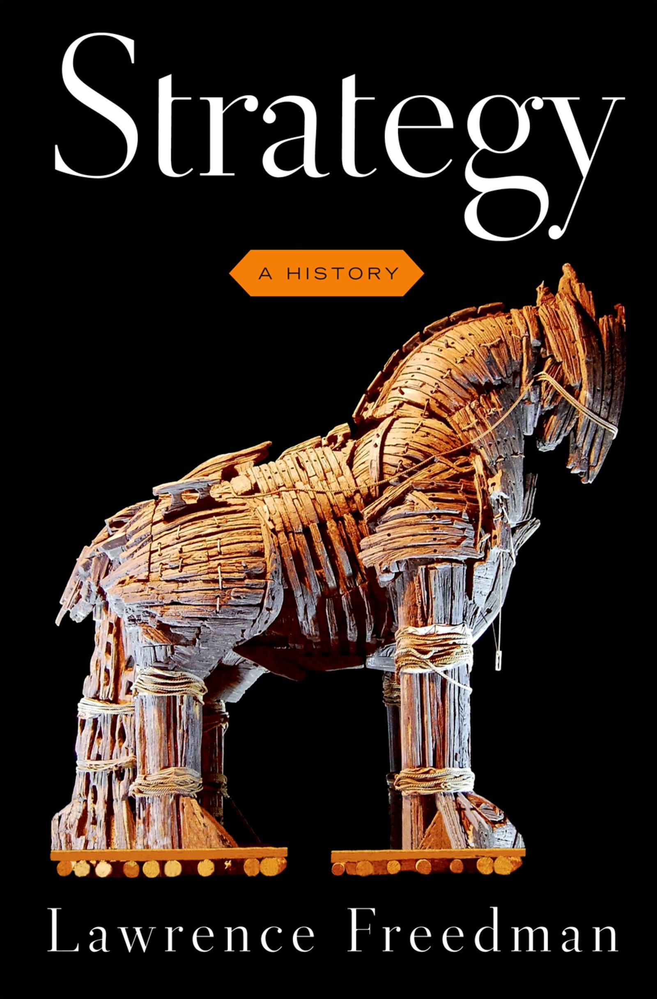

## Today's Agenda {background-image="Images/00-Leviathan_Cover_55.png" .center}

```{r}
library(tidyverse)
library(readxl)
library(kableExtra)
```

<br>

::: {.r-fit-text}

**I. Introducing the Challenge**

- Defining and Exploring "Strategy"
:::

<br>

::: r-stack
Justin Leinaweaver (Fall 2025)
:::

::: notes
Prep for Class

1. Bring to class:

    - 1 deck of cards

    - Post-it notes

2. Decide on bonus points for each game

    - Survive or die survival pool (1 point per card)

    - Ultimatum game (?)

    - Dictator game (?)

3. Check Canvas submissions

<br>

**SLIDE**: Recap last class

:::


## {background-image="Images/00-Leviathan_Cover_55.png" .center}

::: {.r-fit-text}
**"Political Violence"**
:::

::: notes

Last class we set up our semester by talking big picture-wise about politics and violence.

### What were your takeaways about this concept that is central to our work this semester?

<br>

### Remind me, what is the key assumption I want us to use when building models of political violence this semester?
- (**SLIDE**)

:::


## {background-image="Images/01_1-Jan6th_Protest4.png" .center}

<br>

<br>

<br>

<br>

<br>

<br>

<br>

<br>

<br>

::: {.r-fit-text}
**Violence is a political strategy by rational, goal-seeking actors**
:::

::: notes

**Ok, refresh my memory, why is this a useful assumption?**

<br>

**And why is this a problematic assumption?**

<br>

**Any questions on what we covered last class?**

<br>

**SLIDE**: Today's concept

:::


## {background-image="Images/00-Leviathan_Cover_55.png" .center}

::: {.r-fit-text}
**"Strategy"**
:::

::: notes

Today I want us to explore another baseline concept in our fundamental assumption: Strategy

<br>

This is a word that gets thrown around a lot, but often not very precisely

- What does it mean to be "strategic"?

- Is rationality a precondition for strategy?

- How does behaving strategically differ from behaving tactically?

<br>

**SLIDE**: Let's attack this concept by playing a game most of you played with me already in International Relations.

:::


## Game: Survive or Die! {background-image="Images/background-red.png" .center}

:::: {.r-fit-text}

::: {.incremental}
+ Your playing card represents your life

+ Any living player may challenge you to a duel (no refusals)

+ Winner of RPS takes your card (you're dead)

+ End of Game: Each card you have is worth 1 bonus point

+ **The Catch: Survival requires 2 cards**

:::

::::

::: notes

*Make sure everybody has one playing card*

**SLIDE** x 5 for the rules (last rule is "the catch")

<br>

**Any questions on the game?**

- For tracking the state of the game I will ask the living to remain standing and the dead to sit back down

<br>

Everybody stand up and let's go!

- Ok, back to your seats.

<br>

**SLIDE**: Reflections on the game
    
:::


## Reflections on the Game {background-image="Images/background-red.png" .center}

<br>

### 1) What was your goal for the game and how did you try to achieve it?

- The goal

- The plan of attack

::: notes

Time to gather some data.

- Everybody take two minutes on your own to reflect on the game and to answer this question

- Make sure you can state your goal and plan of attack clearly and concisely

<br>

**SLIDE**: One more question

:::


## Reflections on the Game {background-image="Images/background-red.png" .center}

<br>

### 2) What was the goal of your classmates in this game and how did they try to achieve them?

- The goal(s)

- The plan(s) of attack 

::: notes

Now do it again but focused on your perception of your classmates

- Take some notes, make your ideas concrete by writing them down.

- What specific goals did you see being pursued?

- What specific tactics did you observe others use?

<br>

**SLIDE**: Reflections

:::


## Reflections on the Game {background-image="Images/background-red.png" .center}

<br>

### 1) What was your goal for the game and how did you try to achieve it?

<br>

### 2) What was the goal of your classmates in this game and how did they try to achieve them?

::: notes

We'll get to the content of your analyses in a second, but first let's talk about your experience of answering these two questions.

<br>

**Which question was easier to answer? Why?**

- **Was it easier for you to analyze your personal approach or to describe what you saw in your classmates? Why?**

<br>

**How similar are your answers to the two questions?**

- **Should the answers to both questions be similar? Why or why not?**

<br>

*ON BOARD*: Let's gather some results!

1. Column 1: Personal goals

2. Column 2: Plan of attack

3. Column 3: Classmate goals

4. Column 4: Classmate tactics

<br>

Ok, reflect on these lists for me AND remember the definitions of strategy you submitted to Canvas today:

- **Who in class was being strategic and who was not? Why?**

- *FORCE THIS DISCUSSION: Draw out different definitions from the class*

<br>

**SLIDE**: Let's talk about how Freedman defines the key concept

:::


## Strategy (Freedman 2013) {background-image="Images/background-red.png" .center}

- "...attempts to think about actions in advance, in light of our goals and our capacities" (p.x).

- Identifying objectives and the resources and methods available to meet them (p.xi).

- "It's about getting more out of a situation than the starting balance of power would suggest. It's the art of creating power" (p.xii).

::: notes

Throughout his book, Freedman argues that "strategy" is "ubiquitous" (found everywhere) and has MANY definitions

<br>

Big Idea: Strategy is "much more than a plan? (p.xi)

- A plan: a sequence of moves from one place to another

- A strategy assumes others exist to frustrate your plans. It must be fluid and flexible, rooted to where you actually are.

<br>

**If this is our definition, was everybody strategic in our Survive or Die game? Why or why not?**

<br>

Now the question becomes, how do we do this?

- How do we actually get "more out of a situation than the starting balance of power would suggest"?

<br>

**SLIDE**: To the history!

<br>

**Reading Notes: Chapter 1**

The roots of strategy can be seen in human evolution  

- e.g. deception, coalition formation, the instrumental use of violence

Review of research on chimpanzees shows complex “political” behavior  

- The “roots of politics are older than humanity”  
- Coalition building with payments (food, grooming, mating), and attempts to make up after conflicts  
- “strategic intelligence” evolves “through interactions in a complex social environment”

Shifting back to early humans both ecological and social factors make strategy and politics necessities of survival.  

- Trying to climb a tall tree and sleep safely up there takes planning  
- Living in larger social groups requires empathy, understanding of each others needs, a recognition of established hierarchies, etc.

Strategies of Violence  

- Contrasts ants (genocidal lunatics) with chimpanzees and their much more careful, strategic use of violence  
- Chimpanzee conflicts primarily over resources but groups very careful before engaging in conflict  
- Colonies had very different resource endowments and these power imbalances would lead to conflict  
- Fundamental lesson of strategy: Smart planning could overcome sheer strength


:::


## {background-image="Images/background-red.png" .center}

{style="display: block; margin: 0 auto"}

::: {.r-fit-text}
"Strategy" as taught by the stories we tell...

- The "Hebrew Bible" (Ch2)

- The "great texts of the classical Greeks" (Ch3)
:::

::: notes

Freedman starts his book with an analysis of these two sources which he describes as the "prehistory" of strategy in the Western cultural tradition (preface xvi).

- Freedman wants us to know that these stories were designed to help people better understand and analyze strategies

<br>

*Split class into small groups (3 each)*

- *Assign half the groups to the Bible and half to the Greeks*

- Go sit with your group!

<br>

**SLIDE**: The task

:::


## {background-image="Images/background-red.png" .center}

{style="display: block; margin: 0 auto"}

<br>

### What are the key lessons of your chapter for how to be a "good" strategist?

::: notes

GROUPS: Focus on your chapter and make us a list

- Based on your "story", what are the key lessons for how to be a "good" strategist?

- Go!

- *ON BOARD: "The Bible"; "The Greeks"

<br>

Ok, groups combine by chapter, and get your list on the board!

- *PUSH the Bible group to go beyond the stated "best advice" of obeying god. The chapter is REALLY also about how the old testament god is the strategic actor! How does that actor behave strategically? Hardening Pharaoh's heart to allow the display of full powers. Send a message to the world.*
- *David and Goliath is speed, surprise, accuracy; Cunning is necessary for underdogs to succeed; Strategic coercion not just coercion on its own e.g. thinking carefully about the costs of compliance and only applying pressure to exceed that amount*

<br>

*PRESENT and DISCUSS each*

<br>

**SLIDE**: Apply to our game

<br>

**Reading Notes: Chapter 2**

“Best” strategic advice in the Bible: Trust god and obey his laws  

- However, seems that God granted man the power of choice and with it, frequently illustrated in its stories, came deception 
- Much of the Bible is made up of stories of God testing mankind by manipulating our choices  
- Adam and Eve placed in the Garden of Eden with the Tree of Knowledge. Why? To test them! Serpent as subtle and crafty strategist manipulating Eve.

The Ten Plagues as Strategic Coercion  

- Coercive strategy: Using threats to persuade your target to yield  
- Aim is to raise the costs of not complying until they exceed the costs of losing what was currently held  
- Early threats by Moses against Pharaoh were not deemed credible  
- Key to the story is a “turning of the screw” effect or “graduated escalation”  
- Why didn’t Pharaoh concede earlier? 1. Threats that are suspected to be bluffs will frequently be ignored, 2. Moses kept increasing his demands (let the men go pray, let everyone go pray, let everyone bring their stuff and animals), 3. BUT ALSO god hardened Pharaoh’s heart SO THAT HE could demonstrate his power more fully to Egypt!  
- That last point has apparently caused consternation among biblical scholars because it flies in the face of free will which is central to the “choice” god is supposedly giving us to choose a better life

A Coercive Reputation  

- The Israelite march to the promised land offered many additional examples of God’s superior power being leveraged against their enemies and primarily in ways designed to demonstrate God’s power

David and Goliath  

- David’s success depended on speed, surprise and accuracy  
- HOWEVER, it equally depended on David racing up to the fallen Goliath and cutting off his head thus preventing the battle from continuing AND on the Philistines accepting the outcome!

Freedman’s point here is that deception is a strong theme in the Bible  

- Cunning was vital for an underdog to succeed

**Reading Notes: Chapter 3**

Odysseus  

- “metis” as strategic intelligence has no direct English translation: to consider, meditate, to plan BUT also to “contrive” or think ahead and anticipate others BUT ALSO deception and trickery  
- Odysseus was a master strategist but also suffered the liars paradox, after a while no one believed him even when telling the truth  
- The Trojan Horse was his idea!

Achilles  

- Contrasted with Odysseus, Achilles represents “bie” brute strength  
- Achilles’ heel: Even the strongest have points of weakness that can be used to bring them down  
- Warnings in the Iliad about: the danger of over-reaching, of using force without intelligent restraint, brute force is not enough

The Method in Metis  

- For Odysseus the ends justified the means  
- Odysseus described as having practical intelligence: he was able to consider “intended actions in the light of anticipated consequences” (28).  
- Sounds like he utilized backwards induction  
- Odysseus understood how others viewed the world and this allowed him to manipulate their thought processes  
- Key is to always try to locate your current actions as part of a longer-term plan

Thucydides  

- Empiricist who tried to write as accurate a history of the Peloponnesian war as possible. Focused on leaders and strategies, not gods and caprice  
- “His narrative illuminated some of the central themes of all strategy: the limits imposed by the circumstances of the time, the importance of coalitions as a source of strength but also instability, the challenge of coping with internal opponents and external pressures simultaneously, the difficulties of strategies that are defensive and patient in the face of demands for quick and decisive offensives, the impact of the unexpected, and--perhaps most importantly--the role of language as a strategic instrument” (30).  
- Thucydides work is much more nuanced than those who simply ascribe him to the Realist paradigm  
- Freedman really goes long in this section…  
- Interesting note from Pericles debate about possible war with Sparta: “If you yield to them you will immediately be required to make another concession which will be greater, since you will have made the first concession out of fear” (33).

Language and Trickery 

- Lots of discussion/historical reference on the power of argument

Plato’s Strategic Coup  

- A striking critique of Sophists, those willing to sell their rhetorical skills to whomever would pay them. These villains lacked any pursuit of truth and instead would shill for any side  
- Freedman argues this critique is rather unfounded (Sophists not really a coherent group and Socrates, Plato’s teacher, shared many of their qualities.

:::


## Game: Survive or Die! {background-image="Images/background-red.png" .center}

:::: {.r-fit-text}

+ Your playing card represents your life

+ Any living player may challenge you to a duel (no refusals)

+ Winner of RPS takes your card (you're dead)

+ End of Game: Each card you have is worth 1 bonus point

+ **The Catch: Survival requires 2 cards**

::::

::: notes

Ok, we've defined our terms and explored historical antecedents for ideas on how to do it well.

- Let's now apply all of this to our game

<br>

**HOW MIGHT we approach this game in order get "more out of [the] situation than the starting balance of power would suggest"?**

- **In other words, how could you implement these ideas in our game?**

- *FORCE THIS DISCUSSION*

<br>

If being strategic requires planning, goal-seeking and adapting to the other players in any game then we need to discuss rationality.

- I now need everybody to pair off.

- *You assign randomly*

<br>

Let's form two lines with pairs facing each other.

- **SLIDE**: The ultimatum game

:::


## {background-image="Images/01-2-tug_of_war_money.jpg"}

::: {.r-fit-text}
**The Ultimatum Game**
:::

::: notes

Ok, line on my left is player 1.

- P1's take a post-it note and make sure you have something to write with.

<br>

The game is simple: Each pair needs to split five bonus points between you

1. P1 chooses how to divide the points
    - You may choose any division you want but only whole numbers
    - e.g. offer them all 5 or down to nothing, it's up to you!
    - NO PRE-GAME NEGOTIATIONS! No talking!

2. P1 writes down the offer and give paper to P2

3. P2 has a decision to make
    - Accept the offer and the game ends, OR
    - Refuse the offer and BOTH SIDES GET NOTHING

<br>
    
**Is everybody clear on the game?**

- Everybody play the game. Go!

<br>

Ok, what happened with each pair?

- *ON BOARD* (2 columns): Offered, Accepted?

:::


## {background-image="Images/01-2-tug_of_war_money.jpg"}

::: {.r-fit-text}
**The Ultimatum Game**
:::

::: notes

Alright, everybody sit down.

- Again, before we talk specifics about this play of the game my interest is on broad strategy in broad strokes!

<br>

### What does it take to play this game "strategically"?

### - Are we only talking about P1 or can P2 be strategic as well? Why or why not?

<br>

### Why didn't all P1's offer only 1 point? 

### - Shouldn't a "rational" player prefer one bonus point to none?

<br>

### What's the lowest you would accept as P2? Why?

<br>

**SLIDE**: Preferences are complicated and likely context dependent!

:::


## {background-image="Images/01-2-multiple_identities.png" .center}

::: notes

Our job as social scientists is to explain the world as it is, not as we wish it was. 

- This means dealing with actors on their own terms, not ours.

- Lots of people have motivations and goals very different from our own.

<br>

Importantly we have to note that

1. your preference orderings are tied to your identity, AND

2. You have multiple identities!

<br>

Right now, I'm your professor and I want only the best for you.

- If one of my sons walk in and need something, I'm a dad first and you can all go rot. 

<br>

**Make sense?**

:::


## {background-image="Images/01_1-Jan6th_Protest3.png" .center}

::: {.r-fit-text}
[**Violence is a political strategy by**]{style="color:darkred;"}

[**rational, goal-seeking actors**]{style="color:darkred;"}

:::

::: notes

Back to our foundational assumption.

- Hopefully you can see that recognizing that preferences depend on identity and that identity is fluid based on context makes the rationality assumption easier to accept

<br>

Actors have different identities activated by context

- Our assumption might be that your preferences are tied to the identity that is currently activated for you.

<br>

In other words, context matters but can be assumed to be fixed in a given moment.

:::


## Freedman (2013) on Strategy {background-image="Images/background-red.png" .center}

<br>

::: {.r-fit-text}

Strategy is [**fundamental**]{style="color:darkblue;"} to the social world

<br>

Politics in [**everything**]{style="color:darkblue;"}
:::

::: notes

Freedman's book tries to make clear to us that strategy is fundamental to the social world and that there is politics in everything.

- Fundamental features of strategy appear to have evolved and can be seen in chimpanzee behavior

    - e.g. deception, coalition formation, and the instrumental use of violence

- "Strategic intelligence" evolved through interactions in a complex social environment as much as from the demands of survival in a harsh physical environment (p5).

<br>

What are our big takeaways from today?

### 1. What does it mean to be a more strategic actor?

### 2. Are we more or less confident in our foundational assumption that political violence is a strategy?

<br>

(optional)

### Out of curiosity, what proportion of your decisions in your day-to-day life meet this definition of "strategic"? Why?

- Different proportions for different life contexts? Which aspects of your life are you most strategic in? Why?

- Why not be highly strategic in every decision-making situation?

<br>

### Any questions on this?

:::


## For Next Class {background-image="Images/00-Leviathan_Cover_55.png" .center}

<br>

::: {.r-fit-text}

**Find us a Recent Act of Political Violence**

1. APA formatted citation, and

2. Explain the case

:::

::: notes

Please don't overlap in cases!

- Find something specific e.g. an event that happened on a specific date hopefully with clearly defined actors involved.

<br>

**Questions on the assignment?**

<br>

Canvas Discussion: Find us a Recent Act of Political Violence

1. APA formatted citation to the article (no overlapping cases, first-come, first-served!)

2. Brief explanation of why you argue this is an example of political violence (2-3 sentences).


:::


