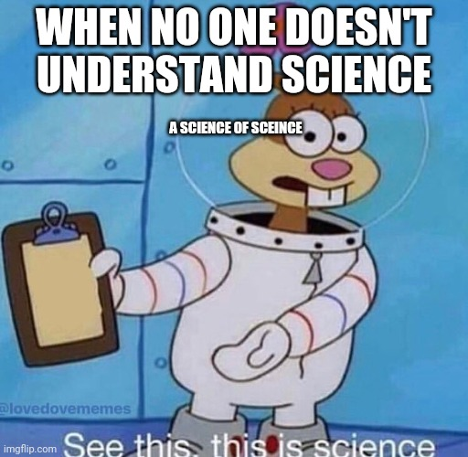

## Today's Agenda {background-image="Images/00-Leviathan_Cover_55.png" .center}

```{r}
library(tidyverse)
library(readxl)
library(kableExtra)
```

<br>

::: {.r-fit-text}

**Section 1: Introducing the Challenge**

- Using case studies to improve our definition of "political violence"

:::

<br>

::: r-stack
Justin Leinaweaver (Fall 2025)
:::

::: notes
Prep for Class

1. Review cases submitted on Canvas

2. Prep Google sheet and publish it on Canvas Module for this week

3. Open the Google sheet on laptop so you can add variables and clean up errors as they work

<br>

Welcome back everybody!

:::


## {background-image="Images/00-Leviathan_Cover_55.png" .center}

::: {.r-fit-text}
**Defining our Key Concepts**

- "Political Violence"

- "Strategy"
:::

::: notes

Last week we focused primarily on these two concepts.

- We did some readings, talked current events and ran a few simulations

- Let's refresh our memories

<br>

**How are we doing so far in defining "political violence"?**

- **Key takeaways so far?**

<br>

**What is the BIG assumption I am asking you to utilize this semester for studying political violence?**

- (Violence is a political strategy by rational, goal-seeking actors)

<br>

**What about strategy?**

- **What were your takeaways from the Freedman book chapters and the simulations we ran in class?**

<br>

**SLIDE**: Freedman takeaways

:::


## Freedman (2013) on Strategy {background-image="Images/background-red.png" .center}

<br>

::: {.r-fit-text}

Strategy is [**fundamental**]{style="color:darkblue;"} to the social world

<br>

Politics in [**everything**]{style="color:darkblue;"}
:::

::: notes

Freedman's big argument in his book is that strategy is fundamental to the social world

- That we can't understand any social relationship or dynamic (e.g. violence) without politics

<br>

Strategy is hard to define...

- "...attempts to think about actions in advance, in light of our goals and our capacities" (p.x).

- Identifying objectives and the resources and methods available to meet them (p.xi).

- "It's about getting more out of a situation than the starting balance of power would suggest. It's the art of creating power" (p.xii).

<br>

### Any questions on the material from last week?

:::


## {background-image="Images/02_1-protestor_gas.jpg"}

### [**How do we explore political violence "scientifically"?**]{style="color:red;"}

::: notes

This week I want us to root our exploration of political violence in the empirical world.

- And that means working scientifically with data!

<br>

Time for you to reach way back to your in intro classes and tell me:

### How do we study the social world in a "scientific" manner?

#### - What do we have to do?

:::


## {background-image="Images/background-red.png" .center}

:::: {.columns}

::: {.column width="50%"}

<br>

**Scientific Method**

- A method, not a subject

- Goal is inference

- Uncertain conclusions

- Procedures are public 

:::

::: {.column width="50%"}

:::

::::

::: notes

I don't mean to pretend this is a comprehensive definition of "science"

- Better to think of these as the hallmarks of "good" science.

<br>

**What does it mean to say that science is a "method" and not a "subject"?**

- "Science" is not a subject, it is a description for how we study any subject

<br>

**What does it mean to say that the goal of science is inference?**

- ("a conclusion reached on the basis of evidence and reasoning.")

- (Also refers to our effort to draw conclusions about the wider population based on analyzing a sample of it)

<br>

**Which conclusions are "uncertain"? All of them or just some of them?**

- (ALL OF THEM)

- ALL scientific knowledge is uncertain meaning it is measured with error and we spend most of our time trying to reduce the error

<br>

**Why must your "procedures" be "public"?**

- Tied to the above

- Your conclusions have error so much of the value comes from being completely transparent about what you did to reach them!

<br>

**Questions?**

<br>

**SLIDE**: Tying it all together!

:::


## {background-image="Images/02_1-protestor_gas.jpg"}

### [**How do we explore political violence "scientifically"?**]{style="color:red;"}

::: notes

So, our aim this semester is to generate "conclusions" about "political violence" using the principles of the scientific method.

- The hope is that we learn to better describe what "political violence" is AND to develop theories of why it happens.

<br>

**SLIDE**: That makes our method inference, and inference means we need data!

:::


## {background-image="Images/02_1-protestor_gas.jpg"}

### [**How do we explore political violence "scientifically"?**]{style="color:red;"}

<br>

<br>

<br>

<br>

<br>

<br>

```{r, fig.retina = 3, fig.align = 'center', fig.width = 8, fig.height=1, out.width='100%'}
d1a <- tibble(
  x = c(0),
  y = c(1),
  labels = c("Data")
)

ggplot(data = d1a, aes(x = x, y = y)) +
  geom_point(size = 8) +
  theme_void() +
  coord_cartesian(xlim = c(-4, 4)) +
  geom_label(aes(label = labels), size = 7)
  #annotate("segment", x = -2.3, xend = -1.2, y = 1, yend = 1, arrow = arrow()) +
  #annotate("segment", x = 1.2, xend = 2.5, y = 1, yend = 1, arrow = arrow())
```

::: notes

<br>

The good news is, everybody brought case study evidence to class today.

- So, now let's reach back into your research design coursework!

<br>

**Are the cases you brought to class "data"? Why or why not?**

- (Sure. Kind of!)

<br>

Empirical data is information acquired through observation.

- Each case you brought represents someone's observations about an event

- Each case likely includes many observations each of which tell us something different about the event you chose.

<br>

**Are these cases "good" data? Why or why not?**

- (Unfortunately, no...)

- A collection of anecdotes is not data

- Generating good data requires thinking carefully about case selection in order to avoid the many, many problems we reviewed in Political Inquiry and Data Analysis

<br>

Despite that, these anecdotes remain useful for helping us organize our prior understandings of political violence!

<br>

**So, what is our next step in converting those observations into data we can analyze?**

- (**SLIDE**: Measurement!)

:::


## {background-image="Images/02_1-protestor_gas.jpg"}

### [**How do we explore political violence "scientifically"?**]{style="color:red;"}

<br>

<br>

<br>

<br>

<br>

<br>

```{r, fig.retina = 3, fig.align = 'center', fig.width = 8, fig.height=1, out.width='100%'}
d1a <- tibble(
  x = c(0, 3),
  y = c(1, 1),
  labels = c("Measurement", "Data")
)

ggplot(data = d1a, aes(x = x, y = y)) +
  geom_point(size = 8) +
  theme_void() +
  coord_cartesian(xlim = c(-1, 4)) +
  geom_label(aes(label = labels), size = 7) +
  annotate("segment", x = 1, xend = 2.5, y = 1, yend = 1, arrow = arrow())
```

::: notes

In this case I am using "measurement" to represent the work we do:

- identifying the variables we are interested in, 

- operationalizing those variables, and then 

- producing values for each variable.

<br>

This is an important idea for us to never lose sight of.

- All "knowledge" depends on "data" and all "data" depends on "measurement"

<br>

THIS is why science requires us to be transparent in our methods

- Without understanding the measurement process the data is almost useless

<br>
    
THIS is why science forces us to acknowledge that all conclusions are uncertain

- Measurement is a human process of converting observations into data
- There is no "perfect" measurement because all measurement requires making choices.

<br>

So, even if your interest is simply in doing descriptive scientific analyses of political violence...

- e.g. How much political violence in State X?

- e.g. How much more violent is State X than State Y?

<br>

You HAVE to think critically about where your data comes from!

<br>

Learning to think about the world in terms of measurement and data is level 1 of science

- This is a SUPER important step for developing expertise in a subject

- Forcing yourself to apply this understanding to ALL areas of your life will do you immeasurable good!

<br>

**SLIDE**: But we are also interested in doing level 2 science in this class!

:::


## {background-image="Images/02_1-protestor_gas.jpg"}

### [**How do we explore political violence "scientifically"?**]{style="color:red;"}

<br>

<br>

<br>

<br>

<br>

<br>

```{r, fig.retina = 3, fig.align = 'center', fig.width = 8, fig.height=1, out.width='100%'}
d1a <- tibble(
  x = c(-3, 0, 3),
  y = c(1, 1, 1),
  labels = c("Nature", "Measurement", "Data")
)

ggplot(data = d1a, aes(x = x, y = y)) +
  geom_point(size = 8) +
  theme_void() +
  coord_cartesian(xlim = c(-4, 4)) +
  geom_label(aes(label = labels), size = 7) +
  annotate("segment", x = -2.3, xend = -1.2, y = 1, yend = 1, arrow = arrow()) +
  annotate("segment", x = 1.2, xend = 2.5, y = 1, yend = 1, arrow = arrow())
```

::: notes

Now, here's the deal.

- Descriptive scientific analyses are important and very useful, HOWEVER...

- Our second goal is to develop an understanding of WHY these things are happening.

<br>

"Nature" here represents the actual processes in the world that create the outcomes we are interested in.

- Includes all the complexity of the world that combines to result in something.

<br>

The ultimate goal of science is to develop models of these natural processes!

- Models are simplifications of reality designed to allow us to better understand the natural mechanisms that make the outcomes we are interested in.

- e.g. gravity, evolution, neorealism, etc

- All represent simple explanations for WHY things happen

<br>

Our work this semester is to develop our expertise in political violence

- This will mean recognizing that ALL our data looks the way it does because of:

1. some natural processes we don't understand, AND 

2. we observe the world using imperfect measurements

<br>

**Everybody with me on all this?**

- **Any questions or clarifications needed?**

<br>

Bottom line, thinking like a scientist means never being absolutely confident in your conclusions

- Being a scientist means knowing your conclusions depend on something that is unknowable being measured by something you know is imprecise!

<br>

**SLIDE**: Let's practice!

:::


## For Today {background-image="Images/00-Leviathan_Cover_55.png" .center}

<br>

::: {.r-fit-text}

**Find us a Recent Act of Political Violence**

1. APA formatted citation, and

2. Explain the case

:::

::: notes

This week we are going to explore, define and measure the central concept of our semester "political violence."

- We will do this by exploring both real-world case studies and the academic literature.

<br>

For today everyone should have brought a news article that describes a recent act of political violence.

### Does everyone have their article?

<br>

Based on the Canvas responses I can see that everyone has some grasp of their case.

- To begin converting these cases into data I want each of you to clarify the key observations in your case

<br>

Everybody open the Google Sheet in our Canvas Module for this week: "Wk02 - Case Studies"

- We'll work together to place our cases on the sheet

- To start, copy your APA citation to the sheet next to your name

<br>

Review all the citations.

### Are all of these APA?

- If not, fix 'em!

:::


## {background-image="Images/00-Leviathan_Cover_55.png" .center}

::: {.r-fit-text}

**Prepare the Case Studies for Analysis**

:::

<br>

### 1. What is the specific act in your case?

- Actor X did action Y to actor Z on this date…

::: notes

**YOU add next column: What is the specific "act"?**

<br>

Ok, first question: What is the specific act in your case that you have identified as "political violence"?

<br>

By "specific act" I mean that literally.

- The conflict in Sudan or the Cold War are the titles of books.

- Our focus is on a specific actor or group of actors making a specific decision, e.g. attacking a market on a specific date to achieve a specific aim.

- Actor X did action Y to Actor Z on this date... 

<br>

Feel free to discuss with the people around you!

- Bounce ideas off of each other and then fill in the spreadsheet

<br>

### YOU review all the submitted answers, do any need more detail?

:::


## {background-image="Images/00-Leviathan_Cover_55.png" .center}

::: {.r-fit-text}

**Prepare the Case Studies for Analysis**

:::

<br>

### 2. Why is this specific act an example of "politics"?

::: notes

**YOU add next column: Why "political"?**

<br>

Don't rush this answer, give it some thought.

- Think about all the elements of "politics" we've discussed in this class and others

- What was the actor trying to achieve in a strategic sense? 

- How did the event come out of community dynamics?

- What elements of distribution or rule-making were at stake?

<br>

Feel free to discuss with the people around you!

- Bounce ideas off of each other and then fill in the spreadsheet

<br>

### YOU review all the submitted answers, do any need more detail?

:::


## {background-image="Images/00-Leviathan_Cover_55.png" .center}

::: {.r-fit-text}

**Prepare the Case Studies for Analysis**

:::

<br>

### 3. Why is this specific act an example of "violence"?

::: notes

**YOU add next column: Why "violence"?**

<br>

Don't rush this answer either, give it some thought and discuss it.

- Think about the nature of violence as we've been discussing it and use this to explain why your case is a good example of it.

- Bounce ideas off of each other and then fill in the spreadsheet

<br>

### YOU review all the submitted answers, do any need more detail?

:::


## {background-image="Images/02_1-protestor_gas.jpg"}

### [**How do we explore political violence "scientifically"?**]{style="color:red;"}

<br>

<br>

<br>

<br>

<br>

<br>

```{r, fig.retina = 3, fig.align = 'center', fig.width = 8, fig.height=1, out.width='100%'}
d1a <- tibble(
  x = c(0, 3),
  y = c(1, 1),
  labels = c("Measurement", "Data")
)

ggplot(data = d1a, aes(x = x, y = y)) +
  geom_point(size = 8) +
  theme_void() +
  coord_cartesian(xlim = c(-1, 4)) +
  geom_label(aes(label = labels), size = 7) +
  annotate("segment", x = 1, xend = 2.5, y = 1, yend = 1, arrow = arrow())
```

::: notes

Ok, let's hear all the cases!

- Remember, these cases represent the sources we will be working with this week in trying to generate useful data about political violence.

<br>

This means it is super IMPORTANT we listen to each other carefully.

- Be an active listener e.g. does anything need clarification?

- Don't change your answers to numbers two and three! We need to hear diverse perspectives.

<br>

Also bear in mind, the goal here is not to define the concept, just to prepare the cases for analysis.

### Everybody ready?

Ok, go!

:::


## For Next Class {background-image="Images/00-Leviathan_Cover_55.png" .center}

<br>

::: {.r-fit-text}

1. Tilly, C. (2003). Varieties of Violence.

2. Submit a reflection on Canvas

:::

::: notes

Excellent work, keep these in mind and will pick up the exercise on Wednesday.

- Read the Tilly chapter on violence and see if that alters your thinking about the concepts we started working on today.

- Then answer the questions in the pre-class assignment on Canvas.

<br>

Canvas Assignment: Evaluating Tilly's (2003) Definition of "Collective Violence"

1. How does Tilly define "collective violence"? e.g. what are the key characteristics of of an event meeting this definition?

2. How does Tilly's concept and definition contrast with our work defining "political violence" in the last class?


:::

