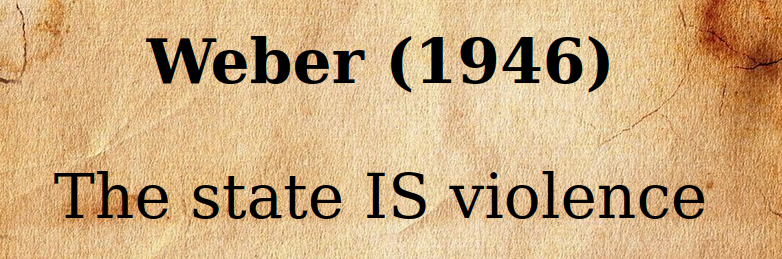

---
output:
  xaringan::moon_reader:
    css: ["default", "extra.css"]
    lib_dir: libs
    seal: false
    nature:
      highlightStyle: github
      highlightLines: true
      countIncrementalSlides: false
      ratio: '16:9'
---

```{r, echo = FALSE, warning = FALSE, message = FALSE}
##xaringan::inf_mr()
## For offline work: https://bookdown.org/yihui/rmarkdown/some-tips.html#working-offline
## Images not appearing? Put images folder inside the libs folder as that is the main data directory

library(tidyverse)
library(readxl)
library(stargazer)
##library(kableExtra)
##library(modelr)

knitr::opts_chunk$set(echo = FALSE,
                      eval = TRUE,
                      error = FALSE,
                      message = FALSE,
                      warning = FALSE,
                      comment = NA)
```

background-image: url('libs/Images/00-Leviathan_Cover_55.png')
background-size: 100%
background-position: center
class: middle

.size70[**Today's Agenda**]

<br>

.size50[

Explore Weber's (1946) argument about the state and violence

]

<br>

<br>

.center[.size40[
  Justin Leinaweaver (Fall 2023)
]]

???

### Prep for Class
1. ...

<br>


---

background-image: url('libs/Images/background-red.png')
background-size: 100%
background-position: center
class: middle, center

.size70[
**Semester Plan: Section 1**

Defining and Measuring the Outcome: Political Violence
]

???

The first four weeks of our class this semester has focused on clarifying what we're trying to understand: Political Violence

+ How is political violence represented in current events and the media?

+ How do we define the concept itself?

+ How do we then operationalize and measure that concept?


---

background-image: url('libs/Images/background-red.png')
background-size: 100%
background-position: center
class: middle, center

.size70[
**Semester Plan: Section 2**

State governments using violence against their citizens
]

???

Today marks our shift to the second section of the course which focuses on how and why state governments use violence against their citizens.

This week we're going to explore two theoretical perspectives that each try to help us answer this question.


---

background-image: url('libs/Images/background-red.png')
background-size: 100%
background-position: center
class: middle, center, inverse

.size60[**What explains the variation in how and why states use violence against their citizens?**]

<br>

.size50[
Weber (1946) "Politics as Vocation"
]

???

For today I had you read an excerpt from a speech / essay by German sociologist Max Weber on the state, politics and violence.

<br>

### Based on the reading, how do you think Max Weber would respond to this question? 

<br>

### What is the big conclusion of the small excerpt I assigned you to read today?


---

class: middle, slidered

.size50[**Weber (1946)**]

.size35[
"23. Today we do not take a stand on this question. I state only the purely conceptual aspect for our consideration: the modern state is a compulsory association which organizes domination. It has been successful in seeking to monopolize the legitimate use of physical force as a means of domination within a territory. To this end the state has combined the material means of organization in the hands of its leaders, and it has expropriated all autonomous functionaries of estates who formerly controlled these means in their own right. The state has taken their positions and now stands in the top place."
]

???

It's not always so clean, but let's assume for the moment section 23 is the conclusion.

### What does this say in English? Simplify this down for me.

(SLIDE)


---

background-image: url('libs/Images/background-desert_rock.jpg')
background-size: 100%
background-position: center
class: middle, center

.size80[**Weber (1946)**

The state IS violence
]

???

According to Weber, political violence is not just a tool used by political leaders in goal-seeking, it is how we define the "state" itself.

This is a HUGE conclusion and we need to unpack it in order to evaluate if it is convincing or not.

<br>

However, this speech by Weber isn't just an argument, it is a scientific model.

Quick aside back to your intro days!


---

background-image: url('libs/Images/05-1-maps.jpg')
background-size: 46%
background-position: center
class: middle, slidered

???

As you all know, maps are incredibly useful devices for finding things!

- Highway map to drive cross-country

- Weather map for planning your week

- Topographical map for going on a hike

- Bottom right is some kind of finder for an insane regional scavenger hunt maybe?

<br>

SLIDE: However, ...


---

background-image: url('libs/Images/05-1-maps.jpg')
background-size: 46%
background-position: right
class: middle, slidered

.pull-left[

<br>
<br>

.size40[**Maps are:**]

.size30[
+ Neither true nor false

+ Limited in their accuracy

+ Partial representations

+ Useful for only some uses

+ A reflection of the interests of the designer

]]

???

**Read slide and explain each**

<br>

The key is, none of these "problems" with a given map matter.

The highway map would be awful for planning a day hike, but you already know that.

- You don't say, the highway map makes a bad hiking tool therefore, the highway map is always bad!

Each map is purpose built and focuses only on a small set of important elements.

- If it tried to include everything it wouldn't be useful!

<br>

SLIDE: And...


---

class: middle, slidered

.pull-left[

<br>
<br>

.size40[**Scientific models are:**]

.size30[
+ Neither true nor false

+ Limited in their accuracy

+ Partial representations

+ Useful for only some uses

+ A reflection of the interests of the designer

]]

.pull-right[
<br>

<br>

<br>

<br>

```{r}

```
]

???

The key here is, scientific models are just like maps.

<br>

This speech by Weber represents our first model of state violence.

- It represents a map of the world designed to explain how and why the state would use violence against its own citizens.

- Like any map it includes some features of the world and excludes ALL the rest.

    - e.g. the actors, institutions and interactions in the system

### Does that idea make sense? Does it help to think about models as maps?

<br>

So, here's the deal: **ALL** maps and models are **WRONG**, but some of them are useful!

- Our job is to find the useful models and incorporate them into our understanding of the world.

- A useful model must be 1) logical, and 2) it must make accurate predictions about the world.

<br>

SLIDE: To determine either of those things we first need to identify the key elements in the model!


---

background-image: url('libs/Images/background-desert_rock.jpg')
background-size: 100%
background-position: center
class: middle

.center[.size60[**Weber (1946)**]]

.size60[
- Who are the key interests?

- What are the key institutions?

- What are the key interactions?
]

???

I want you to identify the assumptions in Weber's model of political violence.

- What are the key premises, assumptions or mechanisms underpinning this conclusion?

- In other words, if this is a map of state violence, what are its main elements?

<br>

Everybody take some time on your own to diagram this argument (5 minutes).

<br>

Four groups consolidate to one diagram between you and put on the board (10 minutes?).

<br>

Collect assumptions *ON BOARD* and discuss

#### Interests
- The leader who wants ??? (Control of society / obedient people)
- The people who want ??? (to not be victims? Safety and security?)

#### Institutions
- The state holds a monopoly on legitimate physical violence in a territory

#### Interactions (e.g. Why can't interests get what they want?)
- Forming political associations to "win" control of the state
- Bribing vassals to build coalitions
- Different associations fight/contest elections to control the state


<br>

#### NOTES 2019-09-09
- The state is the leader (or a political association supporting that leader)
- The state is "a human community that (successfully) claims the monopoly of the legitimate use of physical force within a given territory."
- Politics is the battle over or for the power needed to control that violence.
- Leader maintains control through...

Weber Model (2019-09-09)
- The "state" is controlled by a political association
- 
- "Power" is the ability to use violence legitimately
- Politics is the fight over "power"

-----
H1: Leader threatened? -> Violence more likely
H2: Political protest? -> 
H3: Mass public violates a rule (disobedience) -> 


---

background-image: url('libs/Images/05_1-kent_state_soldiers.jpg')
background-size: 85%
background-position: center
class: middle, center

???

Let's refocus the thrust of this argument towards answering our question.

### According to Weber's model, when and how should violence be likely in society?
(Anytime the state feels its hold on power being threatened?)

<br>

### Anybody recognize this photo?

(May 4, 1970: Kent State Shootings)

- Kent State students in Ohio holding protest against the Vietnam war (and bombings of Cambodia and presence of soldiers on campus)

- Twenty-eight National Guard soldiers fired approximately 67 rounds over a period of 13 seconds

- Killing four, wounding nine

<br>

### How does this photo and case add to our thinking about "threats to the state's power"?

+ (Even an incredibly innocuous threat can result in violence if it challenges the state in ways the state does not approve of.)

+ (Mass obedience required)


---

class: middle, slidered

.size60[.content-box-grey[**Weber (1946)**]]

.size45[
The Modern State:

+ A .textred[**compulsory**] association

+ Organizes .textred[**domination**] within a territory

+ .textred[**Monopolizes**] the .textred[**legitimate use of force**]

+ Mass .textred[**obedience**] required
]

???

So, Weber defines the modern state like this.

### Let's evaluate this argument as our model of state violence.

#### - What are its strengths and weaknesses?

*DISCUSS*

<br>

Weber is not just claiming that political violence is a tool of the state he is arguing violence is the state.

This is a huge conclusion and one that, if we accept it as our model of statehood and politics, would likely lead us to some deeply problematic and possibly revolutionary places.

### How would accepting this as your model of politics impact the way you behave in our society?

*Force this discussion*

<br>

### Could a model like this be a self-fulfilling prophecy?

#### - In other words, does operating like this force the state and our fellow citizens onto a more violent path?


---

background-image: url('libs/Images/02_1-politics_game_3.png')
background-size: 100%
background-position: center

???

### Ultimately, are we now convinced that our definitions of politics from week 1 are missing something important if they do not explicitly discuss the central role of violence in politics?

#### - Why or why not?

<br>

### Give it a shot, how could we redefine "politics" to include violence?