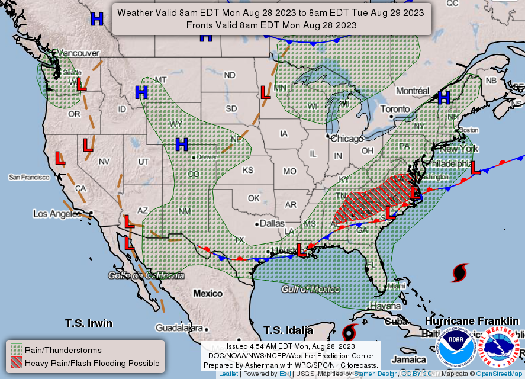
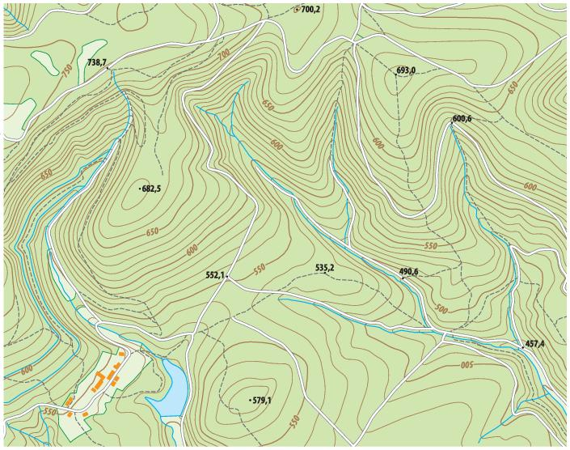
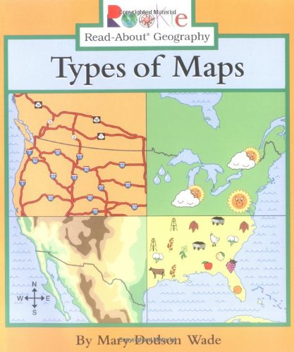
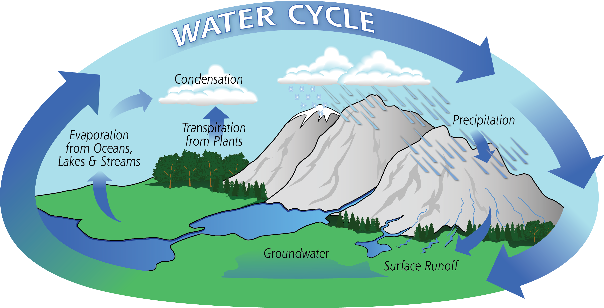
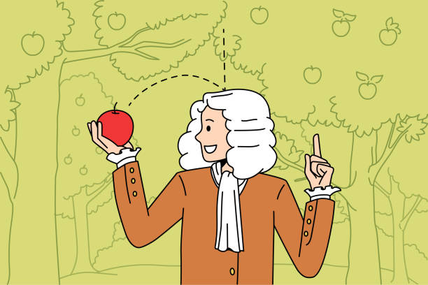
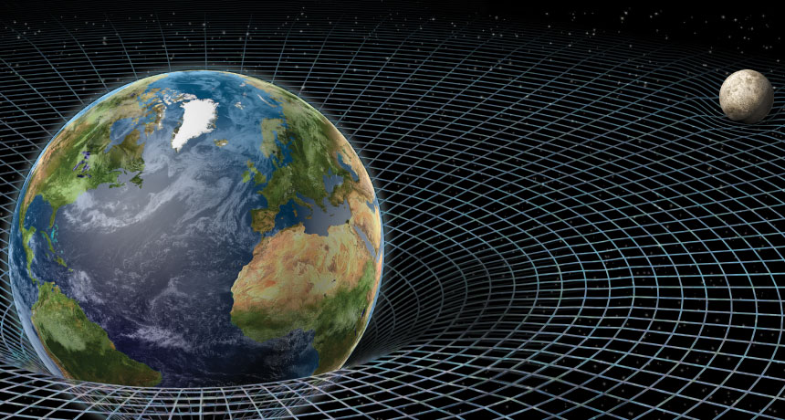
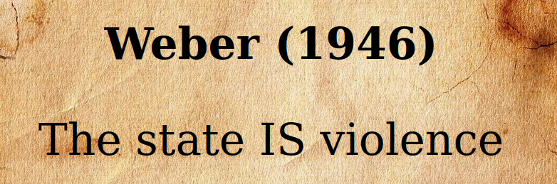
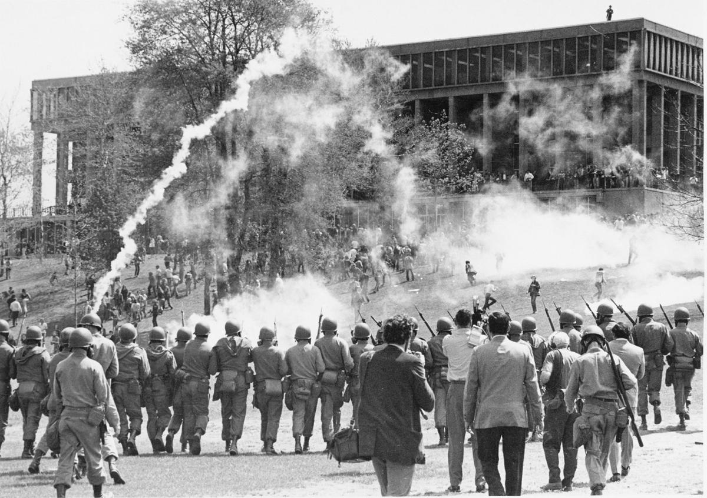

## Today's Agenda {background-image="Images/00-Leviathan_Cover_55.png" .center}

```{r}
library(tidyverse)
library(readxl)
library(kableExtra)
```

<br>

**II. How and why do governments use violence against the people inside their borders?**

- Analyzing Weber's (1946) Answer


<br>

::: r-stack
Justin Leinaweaver (Fall 2025)
:::

::: notes
Prep for Class

1. Review Canvas submissions

2. Bring markers x 4

<br>

Today we shift our focus to a big question in political violence research:

- How and why do governments use violence against the people inside their borders?

<br>

Over the next seven weeks we will work to answer this question using theory, case studies, data analysis and the academic literature.

- This week we set the table by considering two competing models for understanding states and domestic violence

<br>

For today I had you read an excerpt from a speech / essay by German sociologist Max Weber on the state, politics and violence.

- The speech was given in 1918 but this essay version was printed in 1946 with the essay title "Politics as Vocation"

<br>

### Per the reading, how does Weber answer this question?

### - Think big picture here and give me a Weber inspired bumper sticker answer!

- (**SLIDE**)

:::


## {background-image="Images/00-Leviathan_Cover_55.png" .center}

"Today we do not take a stand on this question. I state only the purely conceptual aspect for our consideration: the modern state is a compulsory association which organizes domination. It has been successful in seeking to monopolize the legitimate use of physical force as a means of domination within a territory. To this end the state has combined the material means of organization in the hands of its leaders, and it has expropriated all autonomous functionaries of estates who formerly controlled these means in their own right. The state has taken their positions and now stands in the top place" (Weber 1946, p5).

::: notes

It's not always so clean, but let's assume for the moment section 23 is the conclusion.

### What does this say in English? Simplify this down for me.

- (**SLIDE**)

:::


## Weber (1918/1946) {background-image="Images/background-desert_rock-Filtered50.png" .center}

<br>

::: {.r-fit-text}

The state is:

- a "compulsory association which organizes [**domination**]{style="color:red;"}"

- **aka** [**organized violence**]{style="color:red;"}

:::

::: notes

According to Weber, political violence is not just a tool used by political leaders in goal-seeking, it is how we define the "state" itself.

- This is a HUGE conclusion and we need to unpack it in order to evaluate if it is convincing or not.

<br>

However, this speech by Weber isn't just an argument, it is a scientific model.

- **SLIDE**: Quick aside back to your intro IR days!

:::


## {background-image="Images/00-Leviathan_Cover_55.png" .center}

{style="display: block; margin: 0 auto"}

::: notes

Here is a weather map.

### What is this map useful for accomplishing?

<br>

### And what is this map really not helpful for doing?

:::


## {background-image="Images/00-Leviathan_Cover_55.png" .center}

{style="display: block; margin: 0 auto"}

::: notes

Here is a topographic map.

### What is this map useful for accomplishing?

<br>

### And what is this map really not helpful for doing?

:::


## {background-image="Images/00-Leviathan_Cover_55.png" .center}

{style="display: block; margin: 0 auto"}

::: notes

As you all know, maps are incredibly useful devices for accomplishing specific tasks

- Highway map to drive cross-country

- Weather map for planning your day

- Topographical map for going on a hike

- Bottom right is some kind of finder for an insane regional scavenger hunt maybe?

<br>

**SLIDE**: However, ...

:::


## {background-image="Images/00-Leviathan_Cover_55.png" .center}

:::: {.columns}
::: {.column width="50%"}
**Maps are:**

+ Neither true nor false

+ Limited in their accuracy

+ Partial representations

+ Useful for only some uses

+ A reflection of the interests of the designer
:::

::: {.column width="50%"}
{style="display: block; margin: 0 auto"}
:::
::::

::: notes

*Read slide and explain each*

<br>

The key is, none of these "problems" with a given map matter to you.

<br>

The highway map would be awful for planning a day hike, but you already know that.

- You don't say, the highway map makes a bad hiking tool therefore, the highway map is always bad!

<br>

Each map is purpose built and focuses only on a small set of important elements.

- If it tried to include everything it wouldn't be useful!

<br>

**SLIDE**: And as we talked about in intro IR...

:::


## {background-image="Images/00-Leviathan_Cover_55.png" .center}

:::: {.columns}
::: {.column width="50%"}
**Scientific models are:**

+ Neither true nor false

+ Limited in their accuracy

+ Partial representations

+ Useful for only some uses

+ A reflection of the interests of the designer
:::

::: {.column width="50%"}
{style="display: block; margin: 0 auto"}
:::
::::

::: notes

The key here is that all scientific models are just like maps.

<br>

We've all be told about the water cycle since we were kids

- Water evaporates from the oceans which seeds the clouds which fall as rain which refills aquifers and ends up in the ocean...

- But you know intuitively that this doesn't apply to every single water molecule on the planet in precisely this order, right?

<br>

This model helps us think about the flow of water on our planet in a useful way despite not being "perfectly accurate."

<br>

**SLIDE**: Gravity example

:::


## {background-image="Images/00-Leviathan_Cover_55.png" .center}

:::: {.columns}
::: {.column width="50%"}
**Scientific models are:**

+ Neither true nor false

+ Limited in their accuracy

+ Partial representations

+ Useful for only some uses

+ A reflection of the interests of the designer
:::

::: {.column width="50%"}
{style="display: block; margin: 0 auto"}

{style="display: block; margin: 0 auto"}
:::
::::

::: notes

Gravity is a particularly interesting model example because it helps us think about the development of science over time

<br>

Isaac Newton did incredible work developing and refining a theory of gravity.

- Wildly oversimplified, Newton assumed gravity as a force instantaneously pulling on objects

- His theory could explain so much of what we saw in the world, but it did run into trouble explaining some cosmic phenomena

<br>

Einstein comes along with a new model of relativity that makes assumptions that explain BOTH what Newton observed AND what Newton failed to explain

- In a sense, Einstein's model helps us understand what Newton was finding as a subset of bigger dynamics happening

<br>

Then comes Stephen Hawking who tries to combine elements of Einstein's relativity with quantum mechanics and uses that to explain more of the universe!

<br>

Bottom line

1. ALL models are wrong, but some of them are useful

2. We use the scientific method to develop better models over time

<br>

**Questions on this?**

:::


## {background-image="Images/00-Leviathan_Cover_55.png" .center}

:::: {.columns}
::: {.column width="50%"}
**Scientific models are:**

+ Neither true nor false

+ Limited in their accuracy

+ Partial representations

+ Useful for only some uses

+ A reflection of the interests of the designer
:::

::: {.column width="50%"}
{style="display: block; margin: 0 auto"}
:::
::::

::: notes

This speech by Weber represents our first model of state violence.

<br>

It represents a map designed to explain how and why the state would use violence against the people living in its territory

- Like any map it includes some features of the world and excludes ALL the rest.

<br>

Our job is to evaluate the usefulness of this model

1. We must first check to see if it is **logical**, and

2. then if it makes **accurate predictions** about the world

<br>

Let's start by clarifying what the components of this model are

- **SLIDE**:  e.g. what's in this map?

:::


## {background-image="Images/00-Leviathan_Cover_55.png" .center}

::: {.r-fit-text}
**Frieden, Lake and Schultz (2016)**

- Interests

- Institutions

- Interactions
:::

::: notes

This semester we will continue to use the general three-part framework for analyzing models of politics that we used so much in intro IR

- Decomposes a model of political behavior into its interests, institutions and interactions

<br>

In short, we will use these three categories to help us clarify the components of a model 

- The interests are the actors whose behavior we are trying to explain and what they want

- The institutions are the rules that structure the behavior of those actors

- The interactions represent what happens when all these actors pursue their aims simultaneously

<br>

**Any questions on these elements?**

<br>

*Notes*

**interests**

- The actors central to the model's mechanisms AND what they want
- "…[The] preferences of actors over the possible outcomes that might result from their political choices" (FLS 2016, p45).

**Institutions**

- What are the important rules that structure the decision-making of the actors you are focusing on?
- "A set of rules, known and shared by the community, that structure political interactions in particular ways" (FLS 2016, p67).
- (he written, or unwritten, rules of the game the actors operate under

**Interactions**

- Why can't the actors get what they want? There are other actors on the game board pursuing their own interests and getting in the way!
- "The ways in which the choices of two or more actors combine to produce political outcomes" (FLS 2016, p51).
- How does the collision of the interests in a situation complicate things?
- How do my actions change your options?

:::


## {background-image="Images/background-desert_rock-Filtered50.png" .center}

::: {.r-fit-text}
**Weber (1918/1946)**

- Who are the interests?

- What are the institutions?

- What are the interactions?
:::

::: notes

For today I asked each of you to take a stab at diagramming Weber's model before class.

- I get that this reading is a speech and not an academic argument which makes this harder

- BUT, that's what we've got!

<br>

*Split class into small groups (4 groups: 5 per?)*

GROUPS, compare notes from the assignment and get your best version of the diagram on the board!

<br>

*PRESENT and DISCUSS each*

<br>

**SLIDE**: My version...

<br>

**My Developing Attempts**

**Interests**

- All Politicians (individuals engaged in politics) want power (the ability to dominate others)
    - Leader wants power to dominate so he'll be obeyed
    - "Professional politicians" of the occasional type want to influence power in the state
    - "Professional politicians" of the vocational type either live FOR politics (naked pursuit of power or to advance a cause)
    - "Professional politicians" of the vocational type either live OFF politics (strives to make politics a permanent source of income, p6)
    - The "personal executive staff" (administrative state) want power/reward
    
*Not sure the people (non-politicians) really show up here...*

**Institutions**

- The state .textred[**monopolizes**] the .textred[**legitimate use of force**]
- The state centralizes all of the components of domination under a single head (p5)
- Whoever controls "the state" defines what is legitimate violence in its own territory
- Whoever controls the state may expropriate the wealth from it for their own interests (p5)
- The administrative staff manages the state resources necessary for implementing violence in the state (the means: money, building, war material, vehicles, horses, or whatnot, p4)
- The leader's control of the "personal executive staff and the material implements of administration" are not assured

**Interactions**

- To maintain control leaders must ensure mass .textred[**obedience**] from the people and the administrative state
- Leaders may use combinations of fear and hope to promote obedience / structure the choices of the people (p2)
    - personal executive staff controlled through material reward and social honor
    - form political associations to control professional politicians
- Professional politicians use "politics" to enrich themselves but depends on type of politician (See interests at top, p5 onward)

Therefore, the state is a "compulsory association which organizes domination"

<br>

PRIOR CLASS NOTES 

2022-Spring

Interests
- The leader who wants ::: notes (Control of society / obedient people)
- The people who want ::: notes (to not be victims? Safety and security?)

Institutions
- The state holds a monopoly on legitimate physical violence in a territory

Interactions
- Forming political associations to "win" control of the state
- Bribing vassals to build coalitions
- Different associations fight/contest elections to control the state

2019-09-09

- The state is the leader (or a political association supporting that leader)
- The state is "a human community that (successfully) claims the monopoly of the legitimate use of physical force within a given territory."
- Politics is the battle over or for the power needed to control that violence.
- Leader maintains control through...

Weber Model (2019-09-09)

- The "state" is controlled by a political association
- "Power" is the ability to use violence legitimately
- Politics is the fight over "power"

H1: Leader threatened? -> Violence more likely
H2: Political protest? -> 
H3: Mass public violates a rule (disobedience) -> 

:::


## Weber's (1918/1946) Model {background-image="Images/background-desert_rock-Filtered50.png" .center}

**Interests**

- Politicians want to [**expropriate**]{style="color:red;"} value and increase their [**power**]{style="color:red;"}

**Institutions**

- The state [**monopolizes**]{style="color:red;"} the [**legitimate use of force**]{style="color:red;"}

**Interactions**

- To maintain control, leaders must ensure mass [**obedience**]{style="color:red;"} from the people and the administrative state

::: notes

I am not claiming this version is "correct"

- This simply represents my best effort to extract the big ideas from the speech as a model of violence

<br>

In terms of the interests, I'm not sure if one of these comes before the other.

- **Is your reading of the speech that politicians want power first assuming wealth will follow, wealth first as a means to hold power or some combination?**

<br>

The institutions here are fascinating and VERY dark

- Rule 1: The state centralizes all of the components of domination under a single head (p5)

- Rule 2: Whoever controls "the state" DEFINES what is legitimate violence in its own territory

- **These are terrifying assumptions, but do you think they accurately explain what we see in the world? Why or why not?**

<br>

**SLIDE**: Let's use an example to talk about the interactions

:::


## {background-image="Images/00-Leviathan_Cover_55.png" .center}

{style="display: block; margin: 0 auto"}

::: notes

**According to Weber's model, when and how should violence be likely in society?**

- (Anytime the state feels its hold on power being threatened?)

<br>

**Anybody recognize this photo?**

- (May 4, 1970: Kent State Shootings)

- Kent State students in Ohio holding protest against the Vietnam war (and bombings of Cambodia and presence of soldiers on campus)

- Twenty-eight National Guard soldiers fired approximately 67 rounds over a period of 13 seconds

- Killing four, wounding nine

<br>

**How does this photo and case add to our thinking about "threats to the state's power"?**

+ (Even an incredibly innocuous threat can result in violence if it challenges the state in ways the state does not approve of.)

+ (Mass obedience is absolutely required)

<br>

**SLIDE**: Back to the interactions

:::


## Weber's (1918/1946) Model {background-image="Images/background-desert_rock-Filtered50.png" .center}

**Interests**

- Politicians want to [**expropriate**]{style="color:red;"} value and increase their [**power**]{style="color:red;"}

**Institutions**

- The state [**monopolizes**]{style="color:red;"} the [**legitimate use of force**]{style="color:red;"}

**Interactions**

- To maintain control, leaders must ensure mass [**obedience**]{style="color:red;"} from the people and the administrative state

::: notes

So, Weber defines the modern state like this.

<br>

Let's evaluate this argument as our model of state violence.

- **What are the strengths and weaknesses of this model?**

- *DISCUSS*

<br>

Weber is not just claiming that political violence is a tool of the state he is arguing violence is the state.

- This is a huge conclusion

<br>

**How would adopting this as your model of politics impact the way you behave in our society?**

- *Force this discussion*

- If we accept this as our model of statehood and politics it suggests some deeply problematic and possibly revolutionary stakes are involved

<br>

**Could a model like this be a self-fulfilling prophecy?**

- **In other words, does operating like this force the state and our fellow citizens onto a more violent path?**

:::


## {background-image="Images/02_1-politics_game_3.png" .center}

::: notes

**Ultimately, are we now convinced that our definitions of politics from week 1 are missing something important if they do not explicitly discuss the central role of violence in politics?**

- **Why or why not?**

<br>

### Give it a shot, how could we redefine "politics" to include violence?

:::


## For Next Class {background-image="Images/00-Leviathan_Cover_55.png" .center}

<br>

Olson, Mancur. (1993). Dictatorship, Democracy, and Development. *The American Political Science Review*. 87(3): 567–76.

- Submit analysis to Canvas

::: notes

An alternative model explaining the state and violence!

<br>

### Questions?

:::
