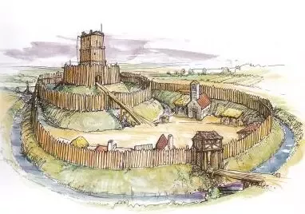

---
output:
  xaringan::moon_reader:
    css: ["default", "extra.css"]
    lib_dir: libs
    seal: false
    nature:
      highlightStyle: github
      highlightLines: true
      countIncrementalSlides: false
      ratio: '16:9'
---

```{r, echo = FALSE, warning = FALSE, message = FALSE}
##xaringan::inf_mr()
## For offline work: https://bookdown.org/yihui/rmarkdown/some-tips.html#working-offline
## Images not appearing? Put images folder inside the libs folder as that is the main data directory

library(tidyverse)
library(readxl)
##library(stargazer)
##library(kableExtra)
##library(modelr)

knitr::opts_chunk$set(echo = FALSE,
                      eval = TRUE,
                      error = FALSE,
                      message = FALSE,
                      warning = FALSE,
                      comment = NA)
```

background-image: url('libs/Images/00-Leviathan_Cover_55.png')
background-size: 100%
background-position: center
class: middle

.center[.size35[**II. How and why do governments use violence against the people inside their borders?**]]

<br>

.size50[

**Today's Agenda**

- Analyze Olson's (1993) Answer
]

<br>

.center[.size40[
  Justin Leinaweaver (Fall 2023)
]]

???

### Prep for Class
1. ...

<br>

Today we continue our discussion of the theoretical roots of violence and the state.

<br>

### How did German sociologist Max Weber answer this question?

### - What were the key parts of his model of political violence by states?

- (**SLIDE**)


---

background-image: url('libs/Images/background-desert_rock-Filtered50.png')
background-size: 100%
background-position: center
class: middle

.size50[.content-box-grey[**Weber's (1918/1946) Model**]]

.size45[
- Politicians want to .textred[**expropriate**] value and increase their .textred[**power**]

- The state .textred[**monopolizes**] the .textred[**legitimate use of force**]

- To maintain control, leaders must ensure mass .textred[**obedience**] from the people and the administrative state

Therefore, the state is a .textred[**compulsory**] association of organized .textred[**domination**]
]

???

According to Weber, the state IS violence

- Without violence there is no state

This means thinking of violence as a tool somewhat misses the point.

- Fish gotta swim, man's gotta breathe and states exist only so long as they control and use violence.

<br>

### In what specific ways is this a useful model of political violence? And in what specific ways does it make bad predictions?

<br>

The problem is that this model predicts violence (expropriation or physical harm) in basically every circumstance.

- While the model may be simple, intuitive and somewhat elegant, it's quite limited for explaining actual variation in the world.


---

background-image: url('libs/Images/background-red_flipped.png')
background-size: 100%
background-position: center
class: middle, center

.center[.size50[**II. How and why do governments use violence against the people inside their borders?**]]

<br>

.size50[
Olson, Mancur. (1993). Dictatorship, Democracy, and Development. *The American Political Science Review*. 87(3): 567–76.
]

???

The reading I gave you for today gives us an alternative model for thinking about politics, the state and violence.

- Contra Weber, the state is not, by definition, violence personified.

<br>

Olson wants us to see the leaders of states as actors pursuing goals who can use violence to achieve their aims.

- I feel strongly that this is an important evolution in explaining and understanding political violence by governments.


---

background-image: url('libs/Images/05_1-political_leaders.jpg')
background-size: 100%
background-position: center

???

Quick aside: I love this article.

- This was one of those readings I did as a grad student that helped me immeasurably in helping me learn to think like a social scientist.

- First, this was one of the first articles where I was really able to see the connection between theory and the world I live in.

- Second, it helped me understand how limited my view of countries as discrete "types" of regime was.
    - Thinking of countries as a dichotomous regime type (e.g. Democracy or dictatorship) hides more important variation than it reveals

<br>

Olson is challenging us to recognize that **ALL** governments aim to organize a functional society

- They simply choose different policies and institutions to do it.

<br>

### Ok, where does Olson start? 

#### - What is the key variation in the world he is trying to explain?

- (**SLIDE**)


---

```{r, fig.retina=3, fig.align='center', out.width='100%', fig.height=5, fig.width=8, cache=TRUE}
## At some point you need to update this, try v-dem polyarchy measure


## Scatterplot regime type and economic development
## Super blunt force test

## input data
d1 <- read_excel("../../Data/Polity/p5v2018.xls", guess_max = 10000, na = ".") |>
  filter(year == 2018) |>
  select(country, ccode, year, democ, autoc, polity2)

d2 <- read_excel("../../Data/WDI/WDI-GDP-2018_2021-11-30.xlsx", na = "NA")

# # Focus on V-Dem electoral democracy index (polyarchy); it is foundational to all five of their indicies
# d1 <- read_excel("../../Data/V-Dem/V-Dem-CY-Core_csv_v13/V_Dem_High_Level_Democracy_Indices.xlsx", na = "NA") |>
#   filter(year == 2021) |>
#   select(country_name:v2x_polyarchy)
# 
# d2 <- read_excel("../../Data/WDI/WDI-GDP-2021_2023-08-01.xlsx", na = "NA")

## Classify polity
d1a <- d1 |>
  mutate(
    polity_cat = cut(polity2, breaks = c(-10, -7, 7, 10), include.lowest = TRUE, labels = c("Autocracy", "Anocracy", "Democracy"))
  )

## Classify GDP pc in groups
groups1 <- as.numeric(quantile(d2$gdp_pc, na.rm = T, probs = c(0, .33, .66, 1)))
#quantile(d2$gdp_pc, na.rm = T, probs = c(0, .25, .50, .75, 1))

d2a <- d2 |>
  mutate(
    gdp_pc_cat = cut(gdp_pc, breaks = groups1, include.lowest = TRUE, labels = c("Poorest 33%", "Middle 33%", "Richest 33%"))
  )

## Identify matching fields
# countrycode::guess_field(d2a$code) # wb
# countrycode::guess_field(d1$ccode) # p4n

## Match and merge polity to WB data
d1a$wb_code <- countrycode::countrycode(d1$ccode, origin = "p4n", destination = "wb")

d <- right_join(d1a, d2a, by = c("wb_code" = "code"))

## Build a series of visualizations

# Map of GDP pc in 2018
# install libudunits2-dev and libgdal-dev in synaptic
library(sf)
library(rnaturalearth)
library(rnaturalearthdata)

## Use rnaturalearth to define world map data
worldmap <- ne_countries(scale = 'medium', type = 'map_units', returnclass = 'sf')

## Merge data to map
# countrycode::guess_field(d$wb_code) # wb 100% and iso3c 99%
# countrycode::guess_field(worldmap$adm0_a3) # wb 88%

d10 <- left_join(worldmap, d, by = c("adm0_a3" = "wb_code"))

## Make the map
d10 |>
  ggplot() +
  geom_sf(aes(fill = gdp_pc_cat)) +
  labs(fill = "", title = "GDP per capita (2018 USD)") +
  theme(legend.position = "bottom") +
  scale_fill_viridis_d(direction = -1, begin = .5)
```

???

Economic development

- In other words, why are some states richer than others?

<br>

Here we see a map of GDP per capita levels in 2018

- Data taken from the WB's WDI database

- GDP is a rough measure of the economic value of all the goods and services produced in a country.

- Investopedia: Gross domestic product (GDP) is the total monetary or market value of all the finished goods and services produced within a country’s borders in a specific time period.

<br>

### What do we learn from this map?

<br>

### Ok now, and most relevant for our work this week, what is the key predictor Olson is focusing on to explain these differences?

(**SLIDE**)


---

```{r, fig.retina=3, fig.align='center', out.width='100%', fig.height=5, fig.width=8, cache=TRUE}
# Map of polity2 in 2018
d10 |>
  ggplot() +
  geom_sf(aes(fill = polity_cat)) +
  labs(fill = "", title = "Polity Scores (2018)") +
  theme(legend.position = "bottom") +
  scale_fill_manual(values = c("red", "orange", "skyblue3"))
```

???

Regime type

Here we see a rough estimate of countries in 2018 by regime type using the Polity Project's data.

We'll explore this project, and these specific classifications, more next week.

<br>

### What do we learn from this map?

<br>

Let's combine these two pieces of data and see if that helps us understand the puzzle Olson (1993) is trying to explain.


---

```{r, fig.retina=3, out.width='95%', fig.asp=0.618, cache=TRUE}
# Scatter plot of both
p1 <- ggplot(data = d, aes(x = polity2, y = gdp_pc)) +
  scale_y_log10(breaks = c(1e3, 1e4, 1e5), labels = c("$1k", "$10k", "$100k")) +
  theme_bw() +
  labs(x = "Polity V Project", y = "GDP per capita (2018 USD)")

p1
```

???

Let's set up a scatter plot so we can see if any relationship appears evidence between development and regime type.


---

```{r, fig.retina=3, out.width='95%', fig.asp=0.618, cache=TRUE}
p1 + 
  annotate("rect", xmin=-10.1, xmax=-6, ymin=0, ymax=1.5e5, fill = "pink", alpha = .5) +
  annotate("rect", xmin=6, xmax=10.1, ymin=0, ymax=1.5e5, fill = "lightblue", alpha = .5) +
  geom_point() +
  annotate("text", x = -8, y = 250, label = "Autocracy", color = "red") +
  annotate("text", x = 8, y = 250, label = "Democracy", color = "blue")
```

???

### What do you see in these points?

#### - Any evident relationship between regime type and economic development?

(**SLIDE**)


---

```{r, fig.retina=3, out.width='95%', fig.asp=0.618, cache=TRUE}
p1 + 
  annotate("rect", xmin=-10.1, xmax=-6, ymin=0, ymax=1.5e5, fill = "pink", alpha = .5) +
  annotate("rect", xmin=6, xmax=10.1, ymin=0, ymax=1.5e5, fill = "lightblue", alpha = .5) +
  geom_point() +
  annotate("text", x = -8, y = 250, label = "Autocracy", color = "red") +
  annotate("text", x = 8, y = 250, label = "Democracy", color = "blue") +
  geom_smooth(data = subset(d, polity2 < 0), method = "lm", color = "red") +
  geom_smooth(data = subset(d, polity2 > 0), method = "lm", color = "blue")
```

???

It appears from this that the richest states in the world are either very democratic or very autocratic.

- It's the middle ground where the poorest countries seem to congregate.

<br>

This is the observation that helps to drive home Olson's theoretical argument AND what connects his paper to our questions about violence.

### Somebody take a stab, how does this plot connect olson's paper on economic development to our work on political violence?

(**SLIDE**)


---

background-image: url('libs/Images/05_2-soldier_flower_afghan_girl.webp')
background-size: 100%
background-position: center
class: top, center

.size45[.content-box-white[**The state can organize violence to productive ends**]]

???

Per Olson, the state has a monopoly on violence because we need it to.

- The state is an attempt to organize violence in productive ways!

- Violence is a political tool to build growth!


---

background-image: url('libs/Images/background-red_flipped.png')
background-size: 100%
background-position: center
class: middle

.size50[.center[**Olson (1993) "Dictatorship, Democracy, and Development"**]]

.size40[
1. The Intro
2. The First Blessing of the Invisible Hand
3. The Grasping Hand
4. The Reach of Dictatorships and Democracies Compared
5. Long Live the King
6. Democracy, Individual Rights and Economic Development
7. The Improbable Transition
]

???

Let's try to identify Olson's model of how and why governments use political violence internally

- And if, by the end, we feel better about human nature and society, all the better.

- Each section makes part of the argument, so let's unpack each one in an effort to diagram the overarching model

<br>

As we work through the paper, let's try to diagram Olson's argument in terms of the interests, institutions and interactions at play.


---

background-image: url('libs/Images/background-red_flipped.png')
background-size: 100%
background-position: center
class: middle

.size35[.center[.content-box-white[**The Introduction (Olson 1993, p567-568)**]]]

.size35[
**Interests**
- ?

**Institutions**
- ?

**Interactions**
- ?
]

???

Focus first on the introduction of the paper

- I think the ideas in the introduction are a direct response to Weber's model of state political violence.

<br>

Let's step through diagramming the introduction together.

<br>

Weber starts his model focused on leaders and politicians as grasping, power-hungry takers from society.

### Who does Olson focus on as the key interests in this section?
- (**SLIDE**)


---

background-image: url('libs/Images/background-red_flipped.png')
background-size: 100%
background-position: center
class: middle

.size35[.center[.content-box-white[**The Introduction (Olson 1993, p567-568)**]]]

.size35[
**Interests**
- Individuals want peaceful order and public goods

**Institutions**
- ?

**Interactions**
- ?
]

???

Olson appears to be beginning his argument about the state, violence, and economic development from the bottom-up.

- In a sense, the people are the foundation of the society.

<br>

### What are public goods? Examples?
- (Technically: Non-rival and non-excludable goods)
- Ex: Security (national defense), city lights, clean air, roads, etc.

<br>

### What are the operating institutions in the introduction section?
- (**SLIDE**)


---

background-image: url('libs/Images/background-red_flipped.png')
background-size: 100%
background-position: center
class: middle

.size35[.center[.content-box-white[**The Introduction (Olson 1993, p567-568)**]]]

.size35[
**Interests**
- Individuals want peaceful order and public goods

**Institutions**
- Anarchy

**Interactions**
- ?
]

???

Arguably, there aren't any.

- This section lays out the challenges that face a society of individuals living in the absence of an imposed structure.

<br>

### Ok then, why can't the individuals get what they want in this scenario (interactions)?

### - Per Weber, is it because we are hungry for power?
- (**SLIDE**)


---

background-image: url('libs/Images/background-red_flipped.png')
background-size: 100%
background-position: center
class: middle

.size35[.center[.content-box-white[**The Introduction (Olson 1993, p567-568)**]]]

.size35[
**Interests**
- Individuals want peaceful order and public goods

**Institutions**
- Anarchy

**Interactions**
- Group size matters for "success"
    - Small groups = voluntary agreements
    - Large groups = must be compelled to contribute
]

???

Remember that "success" here is defined by what the interests want
- e.g. providing peaceful order and public goods

<br>

Explain these interactions to me.

### Why can small groups use voluntary agreements to get what they want?
- (Small groups can provide peaceful order by voluntary agreement because )
1. each individual obtains a gain large enough to make providing the whole good worth it, 

2. threats of non-cooperation as punishment for bad actions effective.

<br>

### Why can't large groups use voluntary agreements to get what they want?
- In the absence of institutions violence is not because people are bad, it's because big groups are harder to manage!
    - Not about bad motives or a lack of trustworthiness

- Large groups cannot rely on voluntary action because the individual's benefit from maintaining the peace is tiny (total / population) but they bear the whole cost of their efforts to achieve it.

<br>

This represents the baseline problem faced by all societies according to Olson

- We don't have to make any assumptions about human nature to explain these problems

- Small societies can thrive without centralized domination, BUT large societies tend to under-provide public goods

- **SLIDE**: And how have communities solved this problem throughout history?

<br>

#### Reading Notes - INTRO
- Poor villager quote: "Monarchy is the best kind of government because the King is then owner of the country. Like the owner of a house, when the wiring is wrong, he fixes it" (26).
- "...no society can work satisfactorily if it does not have a peaceful order and usually other public goods as well (567)."
- "...the victims of violence and theft lose not only what is taken from them but also the incentive to produce any goods that would be taken by others" (567).
- Small groups can provide peaceful order by voluntary agreement because 1. each obtains a gain large enough to make providing the whole good worth it, 2. threats of non-cooperation as punishment for bad actions effective.
- Voluntary action insufficient in large groups because the individual's benefit from maintaining the peace is tiny (total / population) but they bear the whole cost of their efforts to achieve it.


---

background-image: url('libs/Images/background-red_flipped.png')
background-size: 100%
background-position: center
class: middle

.size35[.center[.content-box-white[**The First Blessing of the Invisible Hand (Olson 1993)**]]]

.size35[
**Interests**
- Individuals want peaceful order and public goods

**Institutions**
- Anarchy

**Interactions**
- Group size matters for "success"
    - Small groups = voluntary agreements
    - Large groups = must be compelled to contribute
]

???

### What from Section 2 gets added or changed in the model diagram?

- Talk in pairs for a sec and then get ready to report back!

<br>

**SLIDE**: Before the diagram, let's talk through the story in Section 2.


---

background-image: url('libs/Images/05_2-Mongols.jpg')
background-size: 100%
background-position: center

???

### According to Olson, why should I, the leader of a band of roving bandits prefer to give up my wandering days and instead take over your village as its king?
- (Profit-maximization!)

<br>

The rational, self-interested leader of a band of roving bandits is led, as though by an invisible hand, to settle down, wear a crown, and replace anarchy with government.

- It doesn't matter how bloodthirsty the bandit, profit is maximized by becoming its protector!

- If you maintain monopoly on theft in your domain and apply regular taxes that only claim part of villager income, the villagers keep their incentive to keep producing! 

- **A less than total claim on a growing economy makes you richer than taking so much it leaves no incentive for villagers to produce.**

<br>

### Ok, I get that the bandit king will protect me, but why should he provide me with public goods?

#### - In other words, I get that you won't steal everything, but why would you also work to provide me benefits?

- (**SLIDE**: Illustration)


---

background-image: url('libs/Images/03_2-Viking_Raid.jpg')
background-size: 100%
background-position: center
class: slidered

???

Imagine you are the bandit king

- Other roving bandits keep attacking your new kingdom stealing stuff, destroying resources and killing the people

- They are ruining your good thing!

--

```{r, echo = FALSE, fig.align = 'right', out.width = '45%'}

```

???

<br>

The decision to install a wall around your village is an easy one even if the initial cost is high.

- In short, you provide a very expensive public good BECAUSE your return on investment is massive

- No fear of constant death, more productive village!

<br>

### Make sense?


---

background-image: url('libs/Images/03_2-ancient_irrigation.jpg')
background-size: 100%
background-position: center
class: slidered

???

The decision to build extensive irrigation systems can also be seen through this lens as an easy choice, even for a totalitarian leader.

- Farm productivity explodes if irrigation not done by hand anymore.

- Again, the warlord reaps a huge benefit well beyond the large cost of the initial investment.

<br>

So, even totalitarian monsters have a strong incentive to provide public goods!


---

background-image: url('libs/Images/background-red_flipped.png')
background-size: 100%
background-position: center
class: middle

.size35[.center[.content-box-white[**The First Blessing of the Invisible Hand (Olson 1993)**]]]

.size35[
**Interests**
- Individuals want peaceful order and public goods

**Institutions**
- Anarchy

**Interactions**
- Group size matters for "success"
    - Small groups = voluntary agreements
    - Large groups = must be compelled to contribute
]

???

### Ok, so, what tweaks do we make to our diagram for this section?

- New Actor: Warlord wants profit-maximization
- Updated institutions: Anarchy replaced by rules of warlord
- Updated Interactions: Large group problems taken care of by warlord; guarantees safety, but compels contribution

<br>

(**SLIDE**: New diagram)


---

background-image: url('libs/Images/background-red_flipped.png')
background-size: 100%
background-position: center
class: middle

.size35[.center[.content-box-white[**The First Blessing of the Invisible Hand (Olson 1993)**]]]

.size35[
**Interests**
- Individuals -> peaceful order and public goods
- .textred[Warlord -> profit-maximization]

**Institutions**
- <s>Anarchy</s>.textred[Warlord's rules (obey and pay taxes)]

**Interactions**
- .textred[Warlord guarantees safety, but compels contributions (regardless of group size)]
]

???

### Ok, how's everybody doing? Making sense?

<br>

#### Reading Notes - THE FIRST BLESSING OF THE INVISIBLE HAND
- The puzzle: Why should warlords, who were stationary bandits continuously stealing from a given group of victims, be preferred, by those victims, to roving bandits who soon departed? Isn't the risk of occasional plunder preferable to continuous, illegitimate taxation?
- Logic of the stationary bandit: If you maintain monopoly on theft in your domain and apply regular taxes that only claim part of villager income, the villagers left with incentive to keep producing! A less than total claim on a growing economy makes you richer than taking so much it leaves no incentive for villagers to produce.
- "Thus we have "the first blessing of the invisible hand": the rational, self-interested leader of a band of roving bandits is led, as though by an invisible hand, to settle down, wear a crown, and replace anarchy with government. The gigantic increase in output that normally arises from the provision of a peaceful order and other public goods gives the stationary bandit a far larger take than he could obtain without providing government" (568).
- "Thus government for groups larger than tribes normally arises, not because of social contracts or voluntary transactions of any kind, but rather because of rational self-interest among those who can organize the greatest capacity for violence" (568).
- "The larger or more encompassing the stake an organization or individual has in a society, the greater the incentive the organization or individual has to take action to provide public goods for the society. If an autocrat received one-third of any increase in the income of his domain in increased tax collections, he would then get one-third of the benefits of the public goods he provided. He would then have an incentive to provide public goods up to the point where the national income rose by the reciprocal of one-third, or three, from his last unit of public good expenditure" (569).


---

background-image: url('libs/Images/background-red_flipped.png')
background-size: 100%
background-position: center
class: middle

.size35[.center[.content-box-white[**The Grasping Hand (Olson 1993)**]]]

.size35[
**Interests**
- Individuals -> peaceful order and public goods
- Warlord -> profit-maximization

**Institutions**
- Warlord's rules (obey and pay taxes)

**Interactions**
- Warlord guarantees safety, but compels contributions (regardless of group size)
]

???

### What from Section 3 gets added or changed in the model diagram?

- Talk in pairs for a sec and then get ready to report back!

<br>

**SLIDE**: Before the diagram, let's talk through the story in Section 3.


---

background-image: url('libs/Images/05_2-cows_water.png')
background-size: 100%
background-position: center


???

### Explain the cattle analogy to me and why this is a bad thing if you're one of the villagers.

- The stationary bandit should only invest in in public goods when the returns are MASSIVE

- Public goods that improve the lives of your people but without large economic returns will be ignored

- "Thus he is not like the wolf that preys on the elk, but more like the rancher who makes sure that his cattle are protected and given water" (569).

<br>

This device pictured on the slide makes it easy for the cows to get their own water, now they just have to learn to take turns.

- **BUT** I'm not paying for a second pump just to speed the process if the cows don't absolutely need it.

<br>

In the language of the article, Olson argues the dictator will set a revenue-maximizing tax rate.

### What does that mean in English?
- (He is going to take every spare coin you earn)
    - Anything that doesn't keep you productive goes in his pocket.

<br>

"Though the subjects of the autocrat are better off than they would be under anarchy, they must endure taxes or other impositions so high that, if they were increased further, income would fall by so much that even the autocrat, who absorbs only a portion of the fall in income in the form of lower tax collections, would be worse off" (570).


---

background-image: url('libs/Images/background-red_flipped.png')
background-size: 100%
background-position: center
class: middle

.size35[.center[.content-box-white[**The Grasping Hand (Olson 1993)**]]]

.size35[
**Interests**
- Individuals -> peaceful order and public goods
- Warlord -> profit-maximization

**Institutions**
- Warlord's rules (obey and pay taxes)

**Interactions**
- Warlord guarantees safety, but compels contributions (regardless of group size)
]

???

### Ok, what tweaks do we need to our diagram?


---

background-image: url('libs/Images/background-red_flipped.png')
background-size: 100%
background-position: center
class: middle

.size35[.center[.content-box-white[**The Grasping Hand (Olson 1993)**]]]

.size35[
**Interests**
- Individuals -> peaceful order and public goods
- Warlord -> profit-maximization

**Institutions**
- Warlord's rules (obey and pay taxes)

**Interactions**
- Warlord guarantees safety, but compels contributions .textred[and sets a revenue-maximizing tax rate]
]

???

### Make sense?

<br>

Here we see Olson start to draw out the distinction between the regime types.

- **SLIDE**: And in the next section this regime type analysis is made more explicit.

<br>

#### Reading Notes - THE GRASPING HAND
- All is not peachy keen, however: "In other words, the autocratic ruler has an incentive to extract the maximum possible surplus from the whole society and to use it for his own purposes" (569).
- "Thus he is not like the wolf that preys on the elk, but more like the rancher who makes sure that his cattle are protected and given water" (569).
- The rational self-interested autocrat chooses the revenue-maximizing tax rate" (570).
- "Though the subjects of the autocrat are better off than they would be under anarchy, they must endure taxes or other impositions so high that, if they were increased further, income would fall by so much that even the autocrat, who absorbs only a portion of the fall in income in the form of lower tax collections, would be worse off" (570).


---

```{r, fig.retina=3, out.width='95%', fig.asp=0.618, cache=TRUE}
p1 + 
  annotate("rect", xmin=-10.1, xmax=-6, ymin=0, ymax=1.5e5, fill = "pink", alpha = .5) +
  annotate("rect", xmin=6, xmax=10.1, ymin=0, ymax=1.5e5, fill = "lightblue", alpha = .5) +
  geom_point() +
  annotate("text", x = -8, y = 250, label = "Autocracy", color = "red") +
  annotate("text", x = 8, y = 250, label = "Democracy", color = "blue") +
  geom_smooth(data = subset(d, polity2 < 0), method = "lm", color = "red") +
  geom_smooth(data = subset(d, polity2 > 0), method = "lm", color = "blue")
```

???

Let's go back to our data.

### Now use the Olson model so far to help us interpret the story behind these data points?

<br>

Assuming all of these dots, as countries, represent large societies we should expect they each have trouble providing peace and public goods in anarchy.

- However, at each end of the spectrum, where government is most reified and operational, contributions are compelled and growth is more likely!

- In other words, "wealth" is highest at the ends because safety is being actively provided and contributions are being extracted.

<br>

**SLIDE**: Interestingly...


---

```{r, fig.retina=3, out.width='95%', fig.asp=0.618, cache=TRUE}
p1 + 
  annotate("rect", xmin=-10.1, xmax=-6, ymin=0, ymax=1.5e5, fill = "pink", alpha = .5) +
  annotate("rect", xmin=6, xmax=10.1, ymin=0, ymax=1.5e5, fill = "lightblue", alpha = .5) +
  geom_point() +
  annotate("text", x = -8, y = 250, label = "Autocracy", color = "red") +
  annotate("text", x = 8, y = 250, label = "Democracy", color = "blue") +
  annotate("segment", x = -10, xend = -6, y = mean(d$gdp_pc[d$polity_cat == "Autocracy"], na.rm = TRUE), yend = mean(d$gdp_pc[d$polity_cat == "Autocracy"], na.rm = TRUE), color = "red", size = 2.5) +
  annotate("text", x = -4.5, y = 17000, label = "$16.6k", size = 5, color = "red") +
  annotate("segment", x = 10, xend = 6, y = mean(d$gdp_pc[d$polity_cat == "Democracy"], na.rm = TRUE), yend = mean(d$gdp_pc[d$polity_cat == "Democracy"], na.rm = TRUE), color = "blue", size = 2.5) +
  annotate("text", x = 4.5, y = 24000, label = "$24.0k", size = 5, color = "blue")
```

???

2) The absolute level of wealth appears higher for the democracies than for the autocracies!

Autocratic wealth is highest where control is most absolute, but wealth on the right side of the plot increases more quickly with each step towards more democracy! 

<br>

### How does Olson explain this discrepancy?

#### - Why do democracies grow better and faster according to the section on "the reach of dictatorships and democracies compared"?

<br>

Reducing tax rates at the very high end (where the stationary bandit places it) returns the benefits of economic growth to more people.

1) Government represents a majority (hopefully), so policies with wider benefits are valued (more public goods).

2) More benefit for working -> More working!

<br>


### Make sense?


---

background-image: url('libs/Images/05-2-gerrymandering.png')
background-size: 75%
background-position: center

???

### Just out of curiosity, according to Olson what happens when the government comes to represent a narrower and narrower set of interests?

#### - Say through gerrymandering, a denial of science and asymmetric polarization?

(Sh*t goes bad again)

- Only prefer targeted tax cuts (e.g. for the wealthy) and much less incentive to provide public goods.

<br>

### How freaking cool is this model?

Hot damn!


---

background-image: url('libs/Images/background-red_flipped.png')
background-size: 100%
background-position: center
class: middle

.size35[.center[.content-box-white[**The Reach of Dictatorships and Democracies Compared**]]]

.size35[
**Interests**
- Individuals -> peaceful order and public goods
- Warlord -> profit-maximization

**Institutions**
- Warlord's rules (obey and pay taxes)

**Interactions**
- Warlord guarantees safety, but compels contributions and sets a revenue-maximizing tax rate
]

???

Ok, next step in the argument.

### What needs to change here?


---

background-image: url('libs/Images/background-red_flipped.png')
background-size: 100%
background-position: center
class: middle

.size35[
**Interests**
- Individuals -> peaceful order and public goods
- <s>Warlord</s> .textred[Leader] -> profit-maximization

**Institutions**
- <s>Warlord's rules (obey and pay taxes)</s> .textred[Government sets tax rates and provides goods]

**Interactions**
- <s>Warlord</s> .textred[Dictators provide safety and some public goods but at very high costs (revenue-maximizing tax rate)]
- .textred[Democratic governments provide safety and more public goods at lower tax rates (depending on size of population represented)]
]

???

### Make sense?

<br>

#### Reading Notes - THE REACH OF DICTATORSHIPS AND DEMOCRACIES COMPARED
- Compares situation to a two party democracy.
- Incumbents like to run on a "you-never-had-it-so-good" record and this would be impossible if you claim all the net surplus from society.
- Only need to "buy" a majority, so the leader IS a majority.
- The majority has two paths to profit: 1. taxing society AND 2. growing the economy because it captures some proportion of that income as representing a sizable group of people in the economy.
- "But a majority at the revenue-maximizing tax rate is bound to increase its income from a reduction in tax rates: when the national income goes up, it not only, like the autocrat, collects taxes on a larger national income but also earns more income in the market. So the optimal tax rate for it is bound to be lower than the autocrat's" (570).
- HOWEVER, the narrower the interest you represent in society (e.g. small party in PR system) the less of the national income you capture in the economy and the more you will rely on targeted taxes. "Thus the more encompassing an interest-the larger the share of the national income it receives taking all sources together-the less the social losses from its redistributions to itself. Conversely, the narrower the interest, the less it will take account of the social costs of redistributions to itself" (571).


---

background-image: url('libs/Images/background-red_flipped.png')
background-size: 100%
background-position: center
class: middle

.size35[
**Interests**
- Individuals -> peaceful order and public goods
- Leader -> profit-maximization

**Institutions**
- Government sets tax rates and provides goods

**Interactions**
- Dictators provide safety and some public goods but at very high costs (revenue-maximizing tax rate)
- Democratic governments provide safety and more public goods at lower tax rates (depending on size of population represented)
]

???

The next two sections of the paper, **Long Live the King** and **Democracy, Individual Rights and Economic Development**, introduce the challenges of time for each regime type.

### What are the key elements dictators must provide to ensure sustained growth over time?

<br>

Dictators must assure citizens he:

1. Has a long time-horizon e.g. a promise citizens that they will be protected from theft now AND from him in the future (expropriation).

2. Will enforce contracts 

3. will ensure a stable currency

<br>

### And why is the list of things to provide longer for democracies?

#### - Shouldn't it be easier for democracies to foster growth?

- (**SLIDE**)


---

background-image: url('libs/Images/05_2-too_many_people.jpg')
background-size: 100%
background-position: center

???

No!

- Democracies must do all three AND provide some guarantee against the state, the most powerful actor in the system.

<br>

Remember the poor villager's quote:

- "Monarchy is the best kind of government because the King is then owner of the country. Like the owner of a house, when the wiring is wrong, he fixes it" (26).

- In a democracy everybody owns the house together, so nobody owns it...

- Free-riding is rampant


---

background-image: url('libs/Images/03_2-election-partisanship-fb.jpg')
background-size: 100%
background-position: center

???

In addition, some electoral rules in democracies incentivize polarization!

- The majority may prioritize protecting and providing benefits to only the groups they represent,

- Or they might decide to actively take away the stuff of the minority for their own gain.


---

background-image: url('libs/Images/background-red_flipped.png')
background-size: 100%
background-position: center
class: middle

.size35[
**Interests**
- Individuals -> peaceful order and public goods
- Leader -> profit-maximization

**Institutions**
- Government sets tax rates and provides goods

**Interactions**
- Dictators provide safety and some public goods but at very high costs (revenue-maximizing tax rate)
- Democratic governments provide safety and more public goods at lower tax rates (depending on size of population represented)
]

???

### Final tweaks to the model?


---

background-image: url('libs/Images/background-red_flipped.png')
background-size: 100%
background-position: center
class: middle

.size35[
**Interests**
- Individuals -> peaceful order and public goods
- Leader -> profit-maximization

**Institutions**
- Government sets tax rates and provides goods

**Interactions**
- Dictators provide public goods at very high costs .textred[if time horizons are long]
- Democratic governments provide public goods at lower cost .textred[so long as they represent more of the population]
]

???

### Make sense?


<br>

#### Reading Notes - LONG LIVE THE KING
- Maximizing economic growth requires assuring citizens the autocrat:
1. Has a long time-horizon e.g. a promise citizens that they will be protected from theft now AND from him in the future (expropriation).
2. Will enforce contracts
3. will ensure a stable currency
- However, these promises lack credibility and an autocrat fearing for the future may not intend to maintain any of these things indefinitely.
- "Many autocrats, at least at times, have had short time horizons: the examples of confiscations, repudiated loans, debased coinages, and inflated currencies perpetrated by monarchs and dictators over the course of history are almost beyond counting" (571).
- Therefore, societies better off if dictator is concerned about his dynasty. "If the king anticipates and values dynastic succession, that further lengthens the planning horizon and is good for his subjects" (571).

#### Reading Notes - DEMOCRACY, INDIVIDUAL RIGHTS AND ECONOMIC DEVELOPMENT
- Maximizing economic growth requires all the things previously stated and some guarantee against the state, the most powerful actor in the system
- "An economy will be able to reap all potential gains from investment and from long-term transactions only if it has a government that is believed to be both strong enough to last and inhibited from violating individual rights to property and rights to contract enforcement (572).
- "Interestingly, the conditions that are needed to have the individual rights needed for maximum economic development are exactly the same conditions that are needed to have a lasting democracy" (572).
- Even though democratic leaders can have short time horizons, successions are predictable and managed by rule of law. Democracy may be inefficient, but their citizens do make long-term future plans assuming the system will continue as-is.
- The argument that capital should flow from the unstable to stable democracies.


#### Reading Notes - THE IMPROBABLE TRANSITION
- What special circumstances explain democracy rising out of autocracy?
- Richer countries more likely to be democracies and democracies usually win against non-democracies, so change can be imposed.
- "So the theory here predicts that democracy would be most likely to emerge spontaneously when the' individual or individuals or group leaders who orchestrated the overthrow of an autocracy could not establish another autocracy, much as they would gain from doing so" (573).
- Why not form replace the big state with many small autocracies? 1. Groups could be scrambled together, no clearly defined and separate regions. 2. each may believe such a small unit would not be viable for long.
- Just leaves power sharing
- Democracy arising in 1689 England, glorious revolution: "None of the victorious leaders, groups, or tendencies was then strong enough to impose its will upon all of the others or to create a new autocracy. None had any incentive to give William and Mary the power to establish one either. The best option available to each of the leaders and groups with power was to agree upon the ascendancy of a Parliament that included them all and to take out some insurance against the power of the others through an independent judiciary and a Bill of Rights" (574).

#### Reading Notes - THE DIFFERENT SOURCES OF PROGRESS IN AUTOCRACIES AND DEMOCRACIES
- wrap-up


---

background-image: url('libs/Images/background-red_flipped.png')
background-size: 100%
background-position: center
class: middle, center

.center[.size50[**II. How and why do governments use violence against the people inside their borders?**]]

<br>

.size50[
Olson, Mancur. (1993). Dictatorship, Democracy, and Development. *The American Political Science Review*. 87(3): 567–76.
]

???

### Alright, tie this all up for me.
#### - How does Olson (1993) answer the question we started with?

<br>

1. The state uses violence to ensure a productive society.

2. Different kinds of state will use that violence in different ways and for different aims.

<br>

Bottom line, the existence of state violence doesn't mean the state or the people are bad.

- We have to examine how the violence is used and for what aims in order to understand it.

- "An economy will be able to reap all potential gains from investment and from long-term transactions only if it has a government that is believed to be both strong enough to last and inhibited from violating individual rights to property and rights to contract enforcement (572).

<br>

There's so much more to explore in this paper but there's no way we haven't run out of time!


---

background-image: url('libs/Images/background-blue_triangles2.png')
background-size: 100%
background-position: center
class: middle

.size50[**For Next Class**]

<br>

```{r, echo = FALSE, fig.align = 'center', out.width = '100%'}
knitr::include_graphics("libs/Images/03_2-Assign_for_Monday.png")
```

???

Find us two real world examples of state governments using violence against the people inside their territory (the more recent the better). 
- Find one example from a country you consider to be more "democratic" and one from a country you consider to be more "autocratic."

- Your examples should be specific events (e.g. action X on date Y) rather than broad generalizations (country X harms group Y).


For each case, submit an APA citation and brief explanation of what you selected and why. 

-  No overlap in events!


