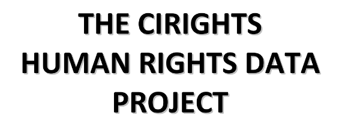

---
output:
  xaringan::moon_reader:
    css: ["default", "extra.css"]
    lib_dir: libs
    seal: false
    nature:
      highlightStyle: github
      highlightLines: true
      countIncrementalSlides: false
      ratio: '16:9'
---

```{r, echo = FALSE, warning = FALSE, message = FALSE}
##xaringan::inf_mr()
## For offline work: https://bookdown.org/yihui/rmarkdown/some-tips.html#working-offline
## Images not appearing? Put images folder inside the libs folder as that is the main data directory

library(tidyverse)
library(readxl)
library(stargazer)
##library(kableExtra)
##library(modelr)

knitr::opts_chunk$set(echo = FALSE,
                      eval = TRUE,
                      error = FALSE,
                      message = FALSE,
                      warning = FALSE,
                      comment = NA)
```

class: slideblue

.size70[**Today's Agenda**]

<br>

.size60[
.center[
Evaluate the CIRIGHTS Data project
]]

<br>

.center[.size40[
  Justin Leinaweaver (Spring 2022)
]]

???

### Prep for Class
1. Prep email with link to country sign-up page on Google sheets
    - https://docs.google.com/document/d/1pjG57sxC7I7x8uvLlkBBoOvKs26-VT9eOqbrfFZPeYA/edit?usp=sharing

2. Post assignment description on Moodle

<br>

Today we wrap up our week exploring the current projects that seek to measure political violence around the world and across time.

### What were our big takeaways from Wednesday's examination of the Political Terror Scale?


---
background-image: url('libs/Images/background-green_blue_swirl_side.jpg')
background-size: 100%
background-position: center
class: middle, center

.size60[.center[**For Today**]]

.size50[
**Explore the data and codebook for the [CIRIGHTS Data project](https://www.dropbox.com/sh/t8utmzsvde8m63q/AAAs1_WIJTqXurAE5nvEKWE5a?dl=0).**

Make sure you understand the observations and variables enough to play with them in class.
]

???

### Everybody ready for today's work?

#### - Assignment complete?

<br>

Organize yourselves into **NEW** groups of 3-4, circle your chairs

+ Take a few minutes to make sure everyone in your group is clear on the observations and variables in the data project (use the codebook as needed)


---

background-image: url('libs/Images/background-slate.jpg')
background-size: 100%
background-position: center
class: middle, center, inverse

```{r, fig.align='center', out.width='65%'}

```

<br>

.size60[What does the CIRIGHTS project add to our PTS work from Wednesday?]

???

Groups: Take a few minutes to do this together and then we'll report back.

<br>

### Ok, report back.

(More separate measures of human rights!)


---

background-image: url('libs/Images/background-slate.jpg')
background-size: 100%
background-position: center
class: middle, inverse

```{r, fig.align='center', out.width='65%'}

```

<br>

.size55[.center[Does the CIRIGHTS "Coding Protocol" generate valid and reliable measures of political violence? (p8)]]

???

Groups: Take a few minutes to do this together and then we'll report back.

<br>

### Ok, report back.
#### - What are the strengths and weaknesses?


---

background-image: url('libs/Images/background-slate.jpg')
background-size: 100%
background-position: center
class: middle, inverse

```{r, fig.align='center', out.width='65%'}

```

.size50[.center[Audit the CIRIGHTS scores for the three countries you analyzed on Monday.]

- Disappearance, Extrajudicial Killing, Political Imprisonment and Torture
]

???

Audit time! Go back to the reports and see if you would have coded them the same way. 

### Findings? Takeaways?

#### - What do we learn about these variables? 

#### - What do we learn about these coding rules?

#### - Which variables seem the easiest to code / we have the most confidence in?

#### - Which the least?

<br>

### Notes

+ disap: Disappearance. A score of 0 indicates that disappearances have occurred frequently in a given year; a score of 1 indicates that disappearances occasionally occurred; and a score of 2 indicates that disappearances did not occur in a given year.

+ kill: Extrajudicial Killing. A score of 0 indicates that extrajudicial killings were practiced frequently in a given year; a score of 1 indicates that extrajudicial killings were practiced occasionally; and a score of 2 indicates that such killings did not occur in a given year.

+ polpris: Political Imprisonment. A score of 0 indicates that there were many people imprisoned because of their religious, political, or other beliefs in a given year; a score of 1indicates that a few people were imprisoned; and a score of 2 indicates that no persons were imprisoned for any of the above reasons in a given year.

+ tort: Torture. A score of 0 indicates that torture was practiced frequently in a given year; a score of 1 indicates that torture was practiced occasionally; and a score of 2 indicates that torture did not occur in a given year.


---

background-image: url('libs/Images/background-green_blue_swirl_side.jpg')
background-size: 100%
background-position: center
class: middle

.size65[**Analysis Time!**]

.size45[
Focus on 1981 (the oldest year coded), what are the most and least common forms of political violence measured in the world?

- Disappearance
- Extrajudicial Killing
- Political Imprisonment
- Torture
]

???

Groups, take a few minutes to work on this question and report back.

<br>

### Ok, what did you find?

*Remember, bigger numbers are good*


---

class: bottom, center

```{r}
library(tidyverse)
d <- read_csv("../../Data/CIRIGHTS/CIRIGHTS_2021.01.21.csv")

d1981 <- d |>
  filter(year == 1981)

# d1981 |>
#   select(countryname, year, disap:tort)

x1 <- d1981 |>
  pivot_longer(cols = disap:tort, names_to = "Measure", values_to = "Values") |>
  group_by(Measure) |>
  summarize(
    N = n(),
    Mean = round(mean(Values, na.rm = T), 1),
    StdDev = round(sd(Values, na.rm = T), 2),
    Min = min(Values, na.rm = T),
    Max = max(Values, na.rm = T)
  ) |>
  arrange(Mean)

x1 |>
  kableExtra::kbl(align = c('l', rep('c', 5))) |>
  kableExtra::kable_styling(bootstrap_options = c("striped", "hover"), font_size = 35) |>
  kableExtra::column_spec(column = 1:6, width = "15em")
```

<br>

<br>

<br>

.size30[*Note: Higher numbers are better, e.g. evidence of less violence*]

???

### Takeaways from this?


---

class: middle, slideblue

```{r, fig.retina=3, fig.align='center', out.width='100%', fig.height=3.5, fig.width=6.5, eval=TRUE, cache=TRUE}
## Make a map of physint
library(sf)
library(rnaturalearth)
library(rnaturalearthdata)

## Use rnaturalearth to define world map data
worldmap <- ne_countries(scale = 'medium', type = 'map_units', returnclass = 'sf')

# countrycode::guess_field(worldmap$un_a3) #98.7% genc3n
# countrycode::guess_field(worldmap$adm0_a3) #98.7% iso3c
# countrycode::guess_field(worldmap$iso_n3) #98.3% genc3n, iso3n

# countrycode::guess_field(d1981$ccode)   # iso3n
# countrycode::guess_field(d1981$cow)   # cown
# countrycode::guess_field(d1981$unctry)
# countrycode::guess_field(d1981$unreg)

## Add codes
d1981$newcode <- countrycode::countrycode(sourcevar = d1981$cow, origin = "cown", destination = "iso3c")

## Merge data onto worldmap
d10 <- left_join(worldmap, d1981, by = c("adm0_a3" = "newcode"))

d10 |>
  mutate(
    physint_cat = factor(physint, levels = c("0", "1", "2", "3", "4", "5", "6", "7", "8"))
  ) |>
  ggplot() +
  geom_sf(aes(fill = physint_cat)) +
  labs(fill = "", title = "Physical Integrity Rights Index (1981)") +
  scale_fill_brewer(type = "seq", palette = 8, direction = -1)
```

???

### Takeaways from this?

<br>

physint: Physical Integrity Rights Index. It ranges from 0 (no government respect for these four rights) to 8 (full government respect for these four rights)


---

background-image: url('libs/Images/background-green_blue_swirl_side.jpg')
background-size: 100%
background-position: center
class: middle

.size70[.center[**Analysis Time!**]]

<br>

.size50[
Repeat your analysis focusing on 2017 (most recent year coded), what are the most and least common forms of political violence measured in the world? 

+ How have things changed over time?
]

???

Groups, take a few minutes to work on this question and report back.

*While they work, you do the same!*

<br>

### Ok, what did you find?


---

class: middle, center

.size30[**1981**]
```{r}
x1 |>
  kableExtra::kbl(align = c('l', rep('c', 5))) |>
  kableExtra::kable_styling(bootstrap_options = c("striped", "hover"), font_size = 30) |>
  kableExtra::column_spec(column = 1:6, width = "15em")
```

.size30[**2017**]
```{r}
d2017 <- d |>
  filter(year == 2017)

x2 <- d2017 |>
  pivot_longer(cols = disap:tort, names_to = "Measure", values_to = "Values") |>
  group_by(Measure) |>
  summarize(
    N = n(),
    Mean = round(mean(Values, na.rm = T), 1),
    StdDev = round(sd(Values, na.rm = T), 2),
    Min = min(Values, na.rm = T),
    Max = max(Values, na.rm = T)
  ) |>
  arrange(Mean)

x2 |>
  kableExtra::kbl(align = c('l', rep('c', 5))) |>
  kableExtra::kable_styling(bootstrap_options = c("striped", "hover"), font_size = 30) |>
  kableExtra::column_spec(column = 1:6, width = "15em")
```

<br>

<br>

<br>

.size30[*Note: Higher numbers are better, e.g. evidence of less violence*]

???


---

class: slideblue

```{r, fig.retina=3, fig.align='center', out.width='100%', fig.height=3.5, fig.width=6.5, eval=TRUE, cache=TRUE}
## Make a map of physint
## Use rnaturalearth to define world map data
worldmap <- ne_countries(scale = 'medium', type = 'map_units', returnclass = 'sf')

## Add codes
d2017$newcode <- countrycode::countrycode(sourcevar = d2017$cow, origin = "cown", destination = "iso3c")

## Merge data onto worldmap
d10 <- left_join(worldmap, d2017, by = c("adm0_a3" = "newcode"))

d10 |>
  mutate(
    physint_cat = factor(physint, levels = c("0", "1", "2", "3", "4", "5", "6", "7", "8"))
  ) |>
  ggplot() +
  geom_sf(aes(fill = physint_cat)) +
  labs(fill = "", title = "Physical Integrity Rights Index (2017)") +
  scale_fill_brewer(type = "seq", palette = 8, direction = -1)
```

???

physint: Physical Integrity Rights Index. It ranges from 0 (no government respect for these four rights) to 8 (full government respect for these four rights)

<br>

### What do we see from this?

+ More coverage of the world
+ US dropping...


---

```{r, fig.retina=3, out.width='97%', fig.width=6, fig.align='center', fig.asp=0.618}
## You make a line plot of averages across time for each measure
d |>
  pivot_longer(cols = disap:tort, names_to = "Variables", values_to = "Values") |>
  group_by(year, Variables) |>
  summarize(
    Mean = mean(Values, na.rm = TRUE)
  ) |>
  ggplot(aes(x = year, y = Mean, color = Variables)) +
  geom_line(size = 1.2) +
  theme_bw() +
  labs(x = "", y = "Mean Values",
       title = "Track Political Violence Averages Across Time") +
  coord_cartesian(ylim = c(0, 2)) +
  scale_y_continuous(breaks = c(0,1,2))
```

???

Remember, lower values are bad!


---

background-image: url('libs/Images/background-green_blue_swirl_side.jpg')
background-size: 100%
background-position: center
class: middle

.size45[
Compare and contrast the 2017 CIRIGHTS codings with the 2017 PTS_S scores from the PTS project.

+ Are they consistent? 

+ Any big differences? 

+ Can we find state examples where the scores differ significantly across the two projects?
]

???

Groups, take a few minutes to work on this question and report back.

*While they work, you do the same!*

<br>

### Ok, what did you find?


---

class: middle, center

```{r}
## CIRIGHTS
cirights <- d2017 |>
  select(countryname:unctry, physint:tort)

## PTS
pts <- read_excel("../../Data/PTS/PTS-2021.xlsx", na = "NA") |>
  filter(Year == 2017)

## Merge the datasets
d100 <- inner_join(pts, cirights, by = c("COW_Code_N" = "cow")) |>
  select(Country, Year, COW_Code_N, PTS_A:PTS_S, physint:tort)

##
d100 |>
  filter(!is.na(PTS_S)) |>
  select(Country, PTS_S, physint:tort) |>
  DT::datatable(rownames = FALSE)

```


---

background-image: url('libs/Images/background-green_blue_swirl_side.jpg')
background-size: 100%
background-position: center
class: middle

.center[.size55[**Measuring Political Violence by Countries**]]

.size40[
Sources: 
- Amnesty International and the US State Department

Measures:
- The Political Terror Scale (PTS)
- The CIRIGHTS Data project
]


???

### Bottom line, how reliable and valid are the measures of state political violence represented by the research projects we've explored this week?

#### - Strengths of existing sources and measures?

#### - Weaknesses of existing sources and measures?


---

background-image: url('libs/Images/background-blue_cubes_v2.png')
background-size: 100%
background-position: center
class: middle, inverse

.size50[**Political Violence Case Study**]

.size35[(Due Feb 20)

Use all of the data sources from this week to write a report on **one country** that:]

???

You will each prepare a report focused on the experience of political violence in a single country.

You will draw on the reports from the State Department, Amnesty International and the measurements from PTS and CIRIGHTS.

--

.size35[
- **Summarizes AND analyzes** its recent history of political violence (e.g. over the last ten years), and 
]

--

.size35[
- **Makes an argument** about what the current PTS and CIRIGHTS codings should be based on the 2020 Country Reports on Human Rights Practices from the State Department
]

???

### Questions on the assignment?

<br>

I'll send out a sheet where you can claim a country in just a moment.

No overlap, first-come first-served.


