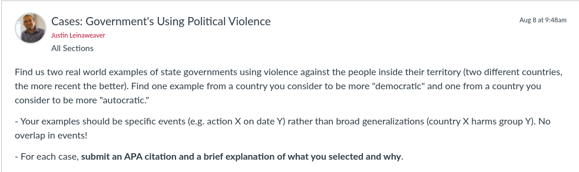

---
output:
  xaringan::moon_reader:
    css: ["default", "extra.css"]
    lib_dir: libs
    seal: false
    nature:
      highlightStyle: github
      highlightLines: true
      countIncrementalSlides: false
      ratio: '16:9'
---

```{r, echo = FALSE, warning = FALSE, message = FALSE}
##xaringan::inf_mr()
## For offline work: https://bookdown.org/yihui/rmarkdown/some-tips.html#working-offline
## Images not appearing? Put images folder inside the libs folder as that is the main data directory

library(tidyverse)
library(readxl)
library(stargazer)
##library(kableExtra)
##library(modelr)

knitr::opts_chunk$set(echo = FALSE,
                      eval = TRUE,
                      error = FALSE,
                      message = FALSE,
                      warning = FALSE,
                      comment = NA)
```

background-image: url('libs/Images/00-Leviathan_Cover_55.png')
background-size: 100%
background-position: center
class: middle

.center[.size35[**II. How and why do governments use violence against the people inside their borders?**]]

<br>

.size50[

**Today's Agenda**

- Analyzing case studies of political violence by state governments
]

<br>

.center[.size40[
  Justin Leinaweaver (Fall 2023)
]]

???

### Prep for Class
1. Review cases on Canvas

2. Be ready to save notes on board from class today!

<br>

Over the next two weeks we will dive deeply into the challenge of measuring political violence at the domestic level.

- This work is meant to broaden and deepen your engagement with political violence BEFORE we evaluate the academic literature

- That literature often tests its models on the data we will be exploring

- This work will also serve as the basis of the first two papers you will write for this class.


---

background-image: url('libs/Images/background-red.png')
background-size: 100%
background-position: center
class: middle, center, inverse

.size80[**Section 2**]

.size65[
**How and why do governments use violence against the people inside their borders?**
]


???

All of this work remains in service to answering the motivating question in Section 2 of our class.

<br>

### What was Weber's answer to this question?
- (The state is a "compulsory association which organizes domination")
    - e.g. The state IS violence
    
<br>

### And what were the key elements of Weber's model of political violence? e.g. the interests, institutions and interactions
- (**SLIDE**)


---

background-image: url('libs/Images/background-desert_rock-Filtered50.png')
background-size: 100%
background-position: center
class: middle

.size50[.content-box-grey[**Weber's (1918/1946) Model**]]

.size45[
- Politicians want to .textred[**expropriate**] value and increase their .textred[**power**]

- The state .textred[**monopolizes**] the .textred[**legitimate use of force**]

- To maintain control, leaders must ensure mass .textred[**obedience**] from the people and the administrative state

Therefore, the state is a .textred[**compulsory**] association of organized .textred[**domination**]
]

???

According to Weber, the state IS violence and that conclusion is based on a fairly simple three part model

1. Interests: THIS is a model focused on political leaders trying to extract value and power from the state.

2. Institutions: The rules are set by the state which can essentially justify any action by the leader

3. Interactions: The only obstacles to the leader's ability to get what he wants is ensuring the obedience of the people and the administrative state.

<br>

### Does this model have any problem with our class's fundamental assumption about political violence being a rational, strategic tool? Why or why not?


---

background-image: url('libs/Images/background-red.png')
background-size: 100%
background-position: center
class: middle, center, inverse

.size80[**Section 2**]

.size65[
**How and why do governments use violence against the people inside their borders?**
]


???

### What was Olson's (1993) answer to this question?
- (The state organizes violence to productive ends)
    
<br>

### And what were the key elements of Olson's model of political violence? e.g. the interests, institutions and interactions
- (**SLIDE**)


---

background-image: url('libs/Images/background-desert_rock-Filtered50.png')
background-size: 100%
background-position: center
class: middle

.size35[
**Interests**
- Individuals -> peaceful order and public goods
- Leader -> profit-maximization

**Institutions**
- Government sets tax rates and provides goods

**Interactions**
- Dictators provide some public goods at very high cost assuming long time horizons
- Democratic governments provide public goods at lower cost assuming broad representation
]

???

According to Olson's model, explaining the variation in safety and public goods in society requires thinking about:

1. Interests: The interplay between leaders who want to profit and the public who want peace and prosperity

2. Institutions: The rules are still set by the government

3. Interactions: 
    - Long-term profit is impossible if the people don't feel safe and provided for
    - But different types of government prioritize different kinds of policies
    
So, the state organizes violence to productive ends!

<br>

### Does this model have any problem with our class's fundamental assumption about political violence being a rational, strategic tool? Why or why not?

<br>

Some of what I hope you got from our work last week:

1. Scientific models are designed to help us explain and predict what happens in the real world

2. Scientific models are simplifications that allow us to focusin on specific causal mechanisms

3. Being this clear in our model building encourages growth of knowledge over time
    - Olson is 100% iterating and improving on Weber's model by making clear:
    - 1) how the people play a role in the system, and
    - 2) how different regime types react to those people differently
    
<br>

### Any questions on the models from last week?


---

background-image: url('libs/Images/background-blue_triangles2.png')
background-size: 100%
background-position: center
class: middle

.size60[.content-box-white[**For Today**]]

<br>

```{r, echo = FALSE, fig.align = 'center', out.width = '100%'}

```

???

### Has everybody submitted their TWO cases?

<br>

### Are all of the citations in APA format?

- *Do a quick check?*


---

background-image: url('libs/Images/04_1-voting.jpg')
background-size: 100%
background-position: center
class: top, left

.size55[.content-box-white[**The "More Democratic" Cases**]]

???

We'll kick things off by focusing on your democracy cases.

- Everybody take a few minutes to review ALL of the DEMOCRACY cases submitted on Canvas for today

- Reflect on the countries selected, the violence exhibited and the reasons provided.

<br>

Ok, help me to unpack these cases (e.g. prepare them for analysis)

- *ON BOARD* (split board in 1/2: Democ vs Autoc)

- *SAVE THESE NOTES!*

<br>

1. List of countries selected as "more democratic"?

2. What characterizes these states as "more democratic"?
    - Based on these selections, what are the qualities our class prioritized as important for democracy?
    
3. Who specifically was doing the violence?
    
4. What specific "types" of violence were done?

5. Who was targeted by these acts?

<br>

*Split class into groups of 3-4*

- Go sit with your group


---

background-image: url('libs/Images/04_1-voting_v2.png')
background-size: 100%
background-position: center
class: middle, inverse

.size65[.center[**When do we predict that democratic governments will use violence against the people in their territory?**]]

???

Groups take some time to reflect on all of this data in order to brainstorm a few explanatory mechanisms

- In other words, develop a few hypotheses based on these cases

<br>

PRESENT and DISCUSS

<br>

*SAVE THESE NOTES!*


---

background-image: url('libs/Images/06_2-autocrats_playbook.jpg')
background-size: 100%
background-position: center

???

Now we'll switch to the autocratic cases.

- Everybody take a few minutes to review ALL of the AUTOCRACY cases submitted on Canvas for today

- Reflect on the countries selected, the violence exhibited and the reasons provided.

<br>

Ok, help me to unpack these cases (e.g. prepare them for analysis)

- *ON BOARD* (split board in 1/2: Democ vs Autoc)

- *SAVE THESE NOTES!*

<br>

1. List of countries selected as "more autocratic"?

2. What characterizes these states as "more autocratic"?
    - Based on these selections, what are the qualities our class prioritized as important for autocracy?
    
3. Who specifically was doing the violence?
    
4. What specific "types" of violence were done?

5. Who was targeted by these acts?

<br>

*Form new groups!* **DO THIS!**

- Go sit with your NEW group


---

background-image: url('libs/Images/06_2-autocrats_playbook_v2.png')
background-size: 100%
background-position: center
class: middle, inverse

.size65[.center[**When do we predict that autocratic governments will use violence against the people in their territory?**]]

???

Groups take some time to reflect on all of this data in order to brainstorm a few explanatory mechanisms

- In other words, develop a few hypotheses based on these cases

<br>

PRESENT and DISCUSS

<br>

*SAVE THESE NOTES!*


---

background-image: url('libs/Images/background-red.png')
background-size: 100%
background-position: center
class: middle, inverse

.center[.size70[**Section 2**]]

.size55[
.center[**How and why do governments use violence against the people inside their borders?**]

- Q1) Is domestic government violence strategic or existential?
]

???

In a sense this is the Weber vs Olson debate but applied to the real world in policy terms.

- In other words, if state violence is existential that requires different policy mechanisms to reduce it than if it is strategic.

<br>

DISCUSS


---

background-image: url('libs/Images/background-red.png')
background-size: 100%
background-position: center
class: middle, inverse

.center[.size70[**Section 2**]]

.size55[
.center[**How and why do governments use violence against the people inside their borders?**]

- Q2) Do our models of domestic government violence need to be split by regime type?
]

???

Why or why not?

- Again, it depends, but on what factors?

<br>

DISCUSS


---

background-image: url('libs/Images/background-light_grey.jpg')
background-size: 100%
background-position: center
class: middle

.size50[**Sources of Political Violence Data**]

.size35[
- The US State Department's "Country Reports on Human Rights Practices"

- Amnesty International's "Annual Country Reports"

- The Political Terror Scale (PTS)

- The CIRIGHTS data project's "Physical Integrity Rights"

- Varieties of Democracy's (V-Dem) "Personal Integrity Rights"
]

???

Our work today represents an excellent warm-up, but isn't nearly sufficient to give us a good sense of what political violence by governments actually looks like in the world.

- *Save reasons "why" for next class*

<br>

Over the next two weeks we will examine these five sources of data on government political violence.

- Each is built on a much wider array of cases and expert evaluations.

- These also represent some of the most commonly utilized measures of domestic political violence in the academic literature

<br>

**SLIDE**: This work will lead directly to your first paper!


---

background-image: url('libs/Images/background-blue_triangles2.png')
background-size: 100%
background-position: center
class: middle

.size40[.content-box-white[**Paper 1**]]

.size35[
If someone came to you with the goal of better understanding the use of political violence by governments around the world, which of the data sources that we explored in class would you recommend and why? 

Your report should introduce each source to the reader with your analysis of its strengths and weaknesses. 

Ultimately, your central argument should be a clear recommendation of which source(s) they should focus on.
]

???

### Questions on the prompt?

- On Canvas now.


---

background-image: url('libs/Images/background-blue_triangles2.png')
background-size: 100%
background-position: center
class: middle

.size60[.content-box-white[**For Next Class**]]

<br>

```{r, echo = FALSE, fig.align = 'center', out.width = '100%'}
knitr::include_graphics("libs/Images/04_1-Assign_for_Wed.png")
```

???

Next class we focus on our first source

- This is an exercise some of you may have done for me in the past!

<br>

The readings are meant to help us build on the work we've done today AND to think critically about the validity and reliability of these reports as data.

- The syllabus also mentions an optional backgrounder on the reports from the Congressional Reporting Service (Weber 2023).

<br>

Your case analyses for next class:

- Ideally, you should keep working on the two countries you analyzed in class today!

- No overlap in country selections!

- Can't do the US

- Pick one "democracy" and one "dictatorship"

- Submit your analyses to Canvas discussion board

<br>

**If you decide to change countries from today make sure to register that change on our shared Google spreadsheet (in Canvas Modules)**

<br>

### Questions on the assignment?


