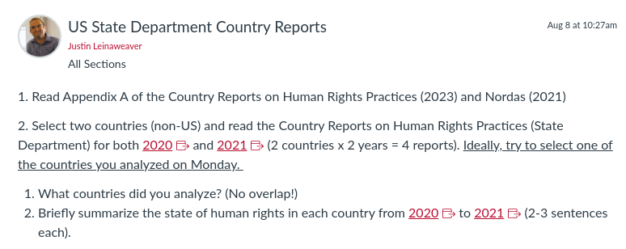
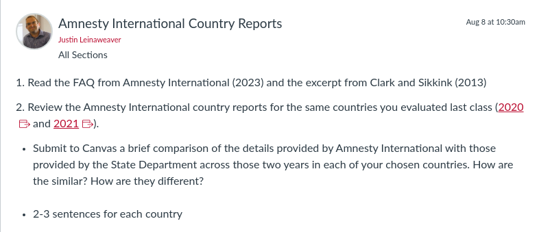

---
output:
  xaringan::moon_reader:
    css: ["default", "extra.css"]
    lib_dir: libs
    seal: false
    nature:
      highlightStyle: github
      highlightLines: true
      countIncrementalSlides: false
      ratio: '16:9'
---

```{r, echo = FALSE, warning = FALSE, message = FALSE}
##xaringan::inf_mr()
## For offline work: https://bookdown.org/yihui/rmarkdown/some-tips.html#working-offline
## Images not appearing? Put images folder inside the libs folder as that is the main data directory

library(tidyverse)
library(readxl)
library(stargazer)
##library(kableExtra)
##library(modelr)

knitr::opts_chunk$set(echo = FALSE,
                      eval = TRUE,
                      error = FALSE,
                      message = FALSE,
                      warning = FALSE,
                      comment = NA)
```

background-image: url('libs/Images/00-Leviathan_Cover_55.png')
background-size: 100%
background-position: center
class: middle

.center[.size35[**II. How and why do governments use violence against the people inside their borders?**]]

<br>

.size45[

**Today's Agenda**: Measuring "Political Violence"

- US State Department Country Reports on Human Rights Practices
]

<br>

.center[.size40[
  Justin Leinaweaver (Fall 2023)
]]

???

### Prep for Class
1. Check Canvas submissions

<br>

**SLIDE**: Today we continue our work on the first paper...


---

background-image: url('libs/Images/background-blue_triangles2.png')
background-size: 100%
background-position: center
class: middle

.size40[.content-box-white[**Paper 1**]]

.size35[
If someone came to you with the goal of better understanding the use of political violence by governments around the world, which of the data sources that we explored in class would you recommend and why? 

Your report should introduce each source to the reader with your analysis of its strengths and weaknesses. 

Ultimately, your central argument should be a clear recommendation of which source(s) they should focus on.
]

???

Just want to keep your eyes on the proverbial prize!

<br>

### Questions on the prompt?


---

background-image: url('libs/Images/background-light_grey.jpg')
background-size: 100%
background-position: center
class: middle

.size50[.content-box-purple[**Sources of Political Violence Data**]]

.size35[
- **The US State Department's "Country Reports on Human Rights Practices"**

- Amnesty International's "Annual Country Reports"

- The Political Terror Scale (PTS)

- The CIRIGHTS data project's "Physical Integrity Rights"

- Varieties of Democracy's (V-Dem) "Personal Integrity Rights"
]

???

You'll be evaluating five different sources of data on political violence within countries.

<br>

Today we'll focus on the widely read and debated reports from the US State Department.

- Many of the quantitative projects out there use the data in these reports to build their own measures.
    - For example, both PTS and CIRIGHTS use these reports

- This makes our work today particularly important for ensuring you can deeply analyze those projects!

<br>

**SLIDE**: Evaluating data means thinking carefully about the challenges in measuring the empirical world.


---

background-image: url('libs/Images/02_2-protestors_fire2.png')
background-size: 100%
background-position: center
class: middle

.size50[.content-box-white[**Measuring "Political Violence"**]]

.size45[
**1) Concept**

**2) Case Studies**

**3) Operationalization**

**4) Instrumentation**

**5) Measurement**
]

???

Two weeks ago we worked through a five step process for generating data about political violence.

### Refresh my memory! What did we do in each step and why was it an important part of the process?

<br>

### - Define operationalization
- ("...selecting observable phenomena to represent abstract concepts" (89).)

- ("To be useful...operational definitions must tell us precisely and explicitly what to do in order to determine what quantitative value should be associated with a variable in any given case (92).)

<br>

### - Define Instrumentation
- (Convert your operationalization (definition) into a series of steps you can use to measure the concept in question)

### - What does it mean to say an instrument produces "valid" data?
- ("...the extent to which our measures correspond to the concepts they are intended to reflect" (105).)

### - What does it mean to say an instrument produces "reliable" data?
- (How stable are the results of our instrument?)
- Would different coders produce the same result using your instrument to measure the same case?

<br>

### - Define Measurement
- (Applying the instrument to the cases to generate values/data/numbers)

<br>

**SLIDE**: Technically, we can generalize this process by focusing on three steps


---

background-image: url('libs/Images/background-light_grey.jpg')
background-size: 100%
background-position: center
class: middle

.size50[.content-box-white[**Measuring a Concept**]]

.pull-left[
.size45[

<br>

**1) Operationalization**

**2) Instrumentation**

**3) Measurement**
]]

.pull-right[
```{r, echo = FALSE, fig.align = 'center', out.width = '85%'}
knitr::include_graphics("libs/Images/02_3-reliable_valid.png")
```
]

???

This is essentially how any quantitative research project is designed, implemented and evaluated.

1. How did they operationalize the concept?
    - Is the definition precise and explicit?

2. What instrument(s) did they design?
    - Are they likely to produce valid and reliable data?

3. How was the instrument applied to the cases?

<br>

### Questions on this?

<br>

**SLIDE**: Let's apply it to our work from last class!


---

background-image: url('libs/Images/background-light_grey.jpg')
background-size: 100%
background-position: center
class: middle

.size50[.content-box-white[**"Domestic Political Violence by Governments"**]]

.pull-left[
.size45[

<br>

**1) Operationalization**

**2) Instrumentation**

**3) Measurement**
]]

.pull-right[
```{r, echo = FALSE, fig.align = 'center', out.width = '85%'}
knitr::include_graphics("libs/Images/02_3-reliable_valid.png")
```
]

???

Last class we analyzed the concept "Domestic Political Violence by Governments"

- You each provided us with cases that you argued represented real world examples of this concept in action

- I then walked you through measuring your cases using a series of instruments
    - What are the characteristics of each regime type?
    - "Who" did the act of violence?
    - "What" was the specific act of violence?
    - "Who" was targeted by the act?
    
- We then used the measures you produced to generate new theory
    - When do we think different kinds of government may be likely to use violence domestically?

<br>

### Is everybody clear on how our work Monday was a measurement exercise?

<br>

Now I'd like you to evaluate our work from Monday while referring to these key design elements

- **Work in pairs** and get ready to report back on how well you think we did each step and what that means for the validity and reliability of the data we produced.


---

background-image: url('libs/Images/background-light_grey.jpg')
background-size: 100%
background-position: center
class: middle

.size50[.content-box-white[**"Domestic Political Violence by Governments"**]]

.pull-left[
.size45[

<br>

**1) Operationalization**

**2) Instrumentation**

**3) Measurement**
]]

.pull-right[
```{r, echo = FALSE, fig.align = 'center', out.width = '85%'}
knitr::include_graphics("libs/Images/02_3-reliable_valid.png")
```
]

???

### What specific validity concerns do you have about the work we did last class?
- (Guidance for selecting cases was VERY under-baked, e.g. not precise or explicit)
    - What is a democracy? What is an autocracy? What is violence?
    
- (We did not clearly operationalize the concept)

- (The instruments were BLUNT at best, e.g. lacked nuance and explanation)

<br>

### What specific reliability concerns do you have about the work we did last class?
- (Our cases today reflect a fairly biased version of the world e.g. what gets media attention, how we search Google)

- (Only ONE violent act per country doesn't give us ANY kind of reliable sense of violence in that state)


---

background-image: url('libs/Images/background-blue_triangles2.png')
background-size: 100%
background-position: center
class: middle

.size60[.content-box-white[**For Today**]]

<br>

```{r, echo = FALSE, fig.align = 'center', out.width = '100%'}

```

???

### Everybody ready to go with these?

<br>

### In broad terms, what did you think of the form and format of the country reports?

#### - Easy to read?

<br>

Let's start our evaluation of the data with this:

### What is the key concept being measured in these reports?

- (**SLIDE**: Human Rights Practices)


---

background-image: url('libs/Images/background-light_grey.jpg')
background-size: 100%
background-position: center
class: middle

.center[.size50[.content-box-white[**"Human Rights Practices"**]]]

.pull-left[
.size45[

<br>

**1) Operationalization**

**2) Instrumentation**

**3) Measurement**
]]

.pull-right[
```{r, echo = FALSE, fig.align = 'center', out.width = '85%'}
knitr::include_graphics("libs/Images/02_3-reliable_valid.png")
```
]

???

*Split class into groups (4 groups of 5?)*

- Go sit with your groups

<br>

Groups, I want you to use the readings for today to evaluate the measurements produced in the State Department Reports

- e.g. Weber 2023, Appendix A (2023) and Nagel (2021)

<br>

The bottom line conclusion I'm interested in is, how "best" can we use this data to analyze political violence by governments around the world.

- **SLIDE**: To get there, let's start by focusing on validity and reliability


---

background-image: url('libs/Images/background-light_grey.jpg')
background-size: 100%
background-position: center
class: middle

.center[.size50[.content-box-white[**"Human Rights Practices"**]]]

.pull-left[
.size45[
**1) Operationalization**

**2) Instrumentation**

**3) Measurement**
]]

.pull-right[
```{r, echo = FALSE, fig.align = 'center', out.width = '70%'}
knitr::include_graphics("libs/Images/02_3-reliable_valid.png")
```
]

.center[.size45[.content-box-white[**Validity and Reliability: Strengths vs Weaknesses**]]]

???

Focus on HOW the measures are constructed using this process.

- Work directly on the board and keep track of the strengths and weaknesses you identify along the way

<br>

### Questions on the exercise?

- Get to it!

*Save notes from class*
- ?

<br>

#### Notes
Nagel's Argument
+ "But under the Trump administration, the quality of these reports dropped. Not only did Trump shorten them and reduce their coverage, but when compared to reports produced by previous administrations, they also referred less to women, reproduction, racism, sexual violence and abuse, LGBTQ rights, and refugees."
+ "This reduction in quality has had a devastating impact on human rights protection worldwide."


---

background-image: url('libs/Images/04_2-US_Dept_State.png')
background-size: 74%
background-position: center
class: slideblue

???

Ok, given all of these strengths and weaknesses, what are our takeaways?

### What is our best advice for using these reports to analyze political violence by governments around the world?

### - In other words, how do we access the signal in the State Department Reports while minimizing the noise?

<br>

Ok, now each of you take your own best advice.

### What are examples of conclusions in the reports you read for today that you believe are most likely valid and reliable? Why?

- Everybody give me one example from there country cases

<br>

### What are examples of conclusions you might consider lower validity or lower reliability? Why?

- Everybody give me one example from there country cases

<br>

### Can we see why, despite the concerns about the data, these reports are considered vitally important by groups around the world?

<br>

**SLIDE**: Let's wrap up today by evaluating the conclusions you drew out last class using case studies to your reading of the country reports. 


---

background-image: url('libs/Images/background-red.png')
background-size: 100%
background-position: center
class: middle, inverse

.center[.size70[**Section 2**]]

.size55[
.center[**How and why do governments use violence against the people inside their borders?**]

- Q1) Is domestic government violence strategic or existential?
]

???

### Do the country reports change your answer to this question? Why or why not?

- (Maybe strengthen the degree to which we argue it is strategic?)


---

background-image: url('libs/Images/background-red.png')
background-size: 100%
background-position: center
class: middle, inverse

.center[.size70[**Section 2**]]

.size55[
.center[**How and why do governments use violence against the people inside their borders?**]

- Q2) Do our models of domestic government violence need to be split by regime type?
]

???

### Do the country reports change your answer to this question? Why or why not?


---

background-image: url('libs/Images/background-red.png')
background-size: 100%
background-position: center
class: middle, inverse

.center[.size70[**Section 2**]]

.size55[
.center[**How and why do governments use violence against the people inside their borders?**]

- Q3) When do we predict that governments will use violence against the people in their territory?
]

???

### Do the country reports change your answer to this question? Why or why not?


---

background-image: url('libs/Images/background-blue_triangles2.png')
background-size: 100%
background-position: center
class: middle

.size60[.content-box-white[**For Next Class**]]

<br>

```{r, echo = FALSE, fig.align = 'center', out.width = '100%'}

```

???

Friday we shift to the country reports produced by Amnesty International!

- Stick with your chosen countries (same years) and now let's compare and contrast across these two sources.

<br>

### Questions on the assignment?


