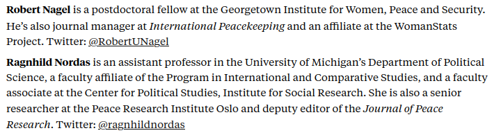

---
output:
  xaringan::moon_reader:
    css: ["default", "extra.css"]
    lib_dir: libs
    seal: false
    nature:
      highlightStyle: github
      highlightLines: true
      countIncrementalSlides: false
      ratio: '16:9'
---

```{r, echo = FALSE, warning = FALSE, message = FALSE}
##xaringan::inf_mr()
## For offline work: https://bookdown.org/yihui/rmarkdown/some-tips.html#working-offline
## Images not appearing? Put images folder inside the libs folder as that is the main data directory

library(tidyverse)
library(readxl)
library(stargazer)
##library(kableExtra)
##library(modelr)

knitr::opts_chunk$set(echo = FALSE,
                      eval = TRUE,
                      error = FALSE,
                      message = FALSE,
                      warning = FALSE,
                      comment = NA)
```

background-image: url('libs/Images/00-Leviathan_Cover_55.png')
background-size: 100%
background-position: center
class: middle

.size70[**Today's Agenda**]

<br>

.size45[
Measuring "Political Violence"

- US State Department Country Reports on Human Rights Practices
]

<br>

.center[.size40[
  Justin Leinaweaver (Fall 2023)
]]

???

### Prep for Class
1. ?

<br>


---

background-image: url('libs/Images/background-light_grey.jpg')
background-size: 100%
background-position: center
class: middle

.size45[**Paper 1**]

.size30[
If someone came to you with the goal of better understanding the use of political violence by governments around the world, which of the data sources that we explored in class would you recommend and why?

- **The US State Department's "Country Reports on Human Rights Practices"**

- Amnesty International's "Annual Country Reports"

- The Political Terror Scale (PTS)

- The CIRIGHTS data project's "Physical Integrity Rights"

- Varieties of Democracy's (V-Dem) "Personal Integrity Rights"
]

???

Your paper must make an affirmative argument for which sources to use and how best to use them. Any sources you choose to omit from your recommendation should be explained. 


<br>

Today we'll focus on the sources and then we'll shift to the projects themselves on Wednesday and Friday.

With that in mind, please bring a laptop to class Wed and Fri so we can explore the data in class using Excel.
- Let me know if you don't have a laptop you could bring to class.

<br>

In addition to all the important work we're doing to understand and measure political violence, it's also time to start working on your first assignment for this class.


---

background-image: url('libs/Images/02_2-protestors_fire2.png')
background-size: 100%
background-position: center
class: middle

.size50[**Measuring "Political Violence"**]

.size45[
**1) Concept**

**2) Operationalization**

**3) Instrumentation**

**4) Measurement**
]

???

Last week we worked to build conceptual definitions and measurements of political violence using news reports.

- I think that's a great way to begin as it helps us learn the process and build out our set of real-world examples.

<br>

Review each

<br>

Over the next two weeks we shift to evaluating the sources used by many academics working in this field.
- The PTS and CI RIGHTS projects both use the yearly reports from the US State Department and Amnesty International.


---

background-image: url('libs/Images/background-blue_triangles.jpg')
background-size: 100%
background-position: center
class: middle

.size60[**For Today**]

.size45[
1. Readings in syllabus: Weber (2023); Nagel & Nordas (2021)

2. Select two countries (non-US) and read the Country Reports on Human Rights Practices (State Department) for both 2020 and 2021 (2 countries x 2 years = 4 reports). 
]

???

No overlap in country selections!

Submit to Canvas a brief summary of the state of human rights across those two years in each of your chosen countries (2-3 sentences each).

NOTE for the class: Why 2020 and 2021 (not 2022)? Paper 1 is about evaluating the data sources of political violence while we learn about the concept. Those two years match up with the data projects we will explore next week.

### Everybody ready to go with these?

<br>

### In broad terms, what did you think of the form and format of the country reports?

#### - Did you prefer reading the AI reports or the State Department reports? Why?

#### - Which version was more informative? Why?

<br>

Talk to me about the countries you studied for a moment.

### What is something you learned about your countries that surprised you?

<br>

### Examples of any countries committing really egregious acts of violence? Against who?


---

background-image: url('libs/Images/02_3-reliable_valid.png')
background-size: 48%
background-position: center
class: middle, slideblue

???

Today our primary focus is on evaluating the sources and not the countries.
- As I mentioned, these reports represent the source for many of the academic research projects we will examine.

So, let's take this chance to evaluate the sources themselves.
- How valid and reliable are they as representations of state practice in terms of violent acts committed?


---

background-image: url('libs/Images/background-blue_triangles.jpg')
background-size: 100%
background-position: center
class: middle

.size60[**Reflections Warm-up**]

???

Before we analyze your findings I want each of you to take a moment to reflect on your work for today.

--

<br>

.size50[1) How consistent are these two sources on each country?]

???

## 1
How consistent are these two sources on each country? 
- e.g. Do they each paint the same picture?

--

<br>

.size50[2) Do the sources operationalize political violence the same way?]

???

## 2
Do the two sources appear to emphasize different kinds of political violence? 
- Are they focused on the same things? 
- How redundant are they? 

--

<br>

.size50[3) How independent are the two sources?]

???

## 3
What sense do you have that these are two independent sources rather than endogenous ones?
- Do you get the feeling they read and are influenced by each others' reports?


---

background-image: url('libs/Images/background-blue_triangles.jpg')
background-size: 100%
background-position: center
class: middle, center

.size65[**Small Groups Discussion**]

<br>

.size60[
What are the .textblue[**strengths**] and .textred[**weaknesses**] of relying on these sources as ways to measure and track political violence around the world?
]

???

Form small groups (3).

+ Share your answers to the three questions with each other, then 

+ prepare two lists we can put on the board in 10 minutes.

<br>

**Groups Report Back**, notes **ON BOARD** and **DISCUSS** each

- ?

<br>

In past semesters I would typically spend the whole class on exploring the country case reports.

However, the Trump administration really messed around with these things and we need to consider the implications of their actions.

Let's now shift to the Nagel and Nordas article in Foreign Policy.


---

background-image: url('libs/Images/03_1-Nagel_Headline.png')
background-size: 50%
background-position: top left
class: slideblue, bottom

```{r, echo = FALSE, fig.align = 'right', out.width = '85%'}

```

???

### What is the central argument in this piece?

+ ("But under the Trump administration, the quality of these reports dropped. Not only did Trump shorten them and reduce their coverage, but when compared to reports produced by previous administrations, they also referred less to women, reproduction, racism, sexual violence and abuse, LGBTQ rights, and refugees.")

+ ("This reduction in quality has had a devastating impact on human rights protection worldwide.")

<br>

### What are the key premises supporting this conclusion?

+ (?)

<br>

### Are you convinced by their argument? Why or why not?

+ (?)

<br>

### How does this argument impact our central job e.g. evaluating and tracking political violence around the world?

+ (?)


---

class: slideblue

.size70[**Today's Agenda**]

<br>

.size45[
.center[
Evaluate the reports from the US State Department and Amnesty International as sources of information on political violence around the world.
]]

<br>

.center[.size40[
  Justin Leinaweaver (Fall 2021)
]]

???

Bottom line q's

### What are the pros and cons of using these sources vs media reporting on current events?

<br>

### Best advice for how and when these measures can/should be used and when they are likely too problematic?


---

background-image: url('libs/Images/background-blue_triangles.jpg')
background-size: 100%
background-position: center

class: middle

.size60[**For Next Class**]

.size40[
1. Readings in syllabus: AI FAQ; Clark and Sikkink (2013)

2. Read the Amnesty International Reports for the same two countries you analyzed today (2020 and 2021 reports)
]

???

Amnesty International Reports (ASSIGNMENT same two countries for both years, Amnesty FAQ on the reports, Clark and Sikkink 2013 ONLY p545-548)

ASSIGNMENT: Review the AI country reports for the same countries you evaluated last class (2020 and 2021).

Submit to Canvas a brief comparison of the details provided by AI with those provided by the State Department across those two years in each of your chosen countries (2-3 sentences each). How are the similar? How are they different?


