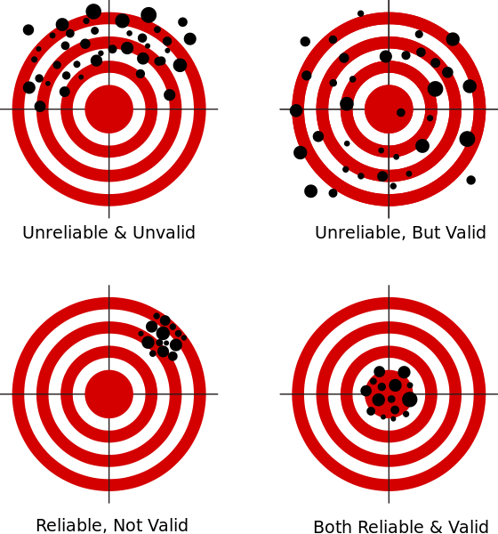
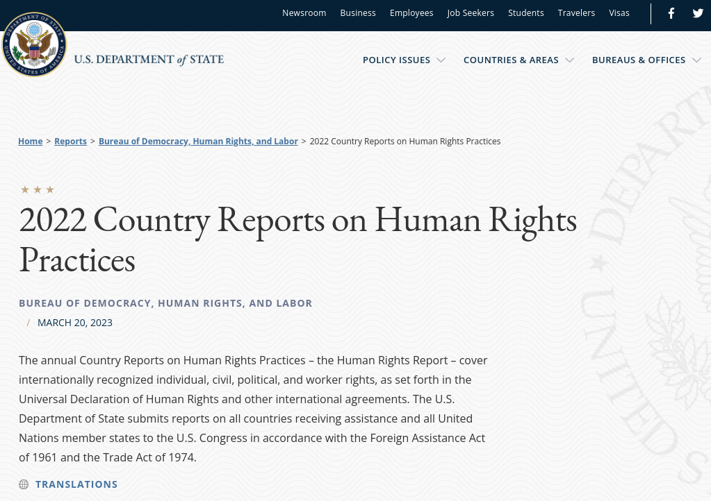

## Today's Agenda {background-image="Images/00-Leviathan_Cover_55.png" .center}

```{r}
library(tidyverse)
library(readxl)
library(kableExtra)
```

<br>

**II. How and why do governments use violence against the people inside their borders?**

::: {.r-fit-text}

- US State Department Country Reports on Human Rights Practices

:::

<br>

::: r-stack
Justin Leinaweaver (Fall 2025)
:::

::: notes
Prep for Class

1. Review Canvas submissions

2. Bring markers x 4

3. Save notes from class as they work (space below in qmd file if you want it)

<br>

*NOTE: Don't tip your hand by criticizing what we did last class. Evaluating our process Monday is their first job today*

<br>

Last class we collected and analyzed case studies of government political violence.

- We then used those cases to brainstorm models of political violence

<br>

As a refresher, we study the data projects because:

1. They are more comprehensive (e.g. they study the whole world across time),

2. They bring us to the cutting-edge of the research on political violence, and

3. **SLIDE**: They represent the material you need for the first two papers!

:::


## Paper 1 {background-image="Images/00-Leviathan_Cover_55.png" .center}

<br>

Which **SINGLE** data source would you recommend to someone interested in better understanding the use of political violence by governments around the world?

- Your thesis should be a clear recommendation for **ONE** of the sources and should be supported by **AT LEAST THREE distinct reasons** for your recommendation

- **A high quality recommendation** will also make clear **why** you are not recommending the other sources

::: notes

Just want to keep your eyes on the proverbial prize!

<br>

**Questions on the prompt?**

:::


## {background-image="Images/00-Leviathan_Cover_55.png" .center}

::: {.r-fit-text}
**Sources of Political Violence Data**
:::

- The US State Department's "Country Reports on Human Rights Practices"

- Amnesty International's "Annual Country Reports"

- The Political Terror Scale (PTS)

- The CIRIGHTS data project's "Physical Integrity Rights"

- Varieties of Democracy's (V-Dem) "Personal Integrity Rights"

::: notes

For Paper 1 you'll be choosing from these five different sources of data on political violence within countries.

<br>

Today we'll focus on the widely read and debated reports from the US State Department.

<br>

We start here because **MANY** of the projects out there use the data in these reports to build their own measures.

- For example, both PTS and CIRIGHTS use these reports

<br>

This means that critically analyzing PTS and CIRIGHTS depends on understanding the material they are working with from the State Department

<br>

**SLIDE**: As ever, our work as scientists is rooted in measurement!

:::


## Measuring "Political Violence" {background-image="Images/02_2-protestors_fire2.png" .center}

:::: {.columns}
::: {.column width="60%"}
::: {.r-fit-text}
**1) Concept**

**2) Case Studies**

**3) Operationalization**

**4) Instrumentation**

**5) Measurement**
:::
:::
::: {.column width="40%"}

:::
::::

::: notes

Two weeks ago we worked through a five step process for generating data about political violence.

**Refresh my memory! What did we do in each step and why was it an important part of the process?**

<br>

**Define the operationalization step?**

- ("...selecting observable phenomena to represent abstract concepts" (89).)

- ("To be useful...operational definitions must tell us precisely and explicitly what to do in order to determine what quantitative value should be associated with a variable in any given case (92).)

<br>

**Define the instrumentation step?**

- (Convert your operationalization (definition) into a series of steps you can use to measure the concept in question)

<br>

**What does it mean to say an instrument produces "valid" data?**

- ("...the extent to which our measures correspond to the concepts they are intended to reflect" (105).)

<br>

**What does it mean to say an instrument produces "reliable" data?**

- (How stable are the results of our instrument?)

- Would different coders produce the same result using your instrument to measure the same case?

<br>

**Define the measurement step?**

- (Applying the instrument to the cases to generate values/data/numbers)

<br>

**SLIDE**: While all of these elements are important when designing a new process, we typically focus on three steps when evaluating someone else's data

:::


## Measuring a Concept {background-image="Images/background-light_grey.jpg" .center}

:::: {.columns}
::: {.column width="50%"}

::: {.r-fit-text}
**1) Operationalization**

- Precise and explicit?

**2) Instrumentation**

- Valid and reliable?

**3) Measurement**
:::
:::

::: {.column width="5%"}

:::

::: {.column width="45%"}

:::
::::

::: notes

When evaluating an established research project, these are the three elements we focus on

<br>

1. How did they operationalize the concept?

    - Is the definition precise and explicit?

2. What instrument(s) did they design to measure the concept?

    - Are they likely to produce valid and reliable data?

3. How was the instrument applied to the cases?

<br>

**Questions on this?**

<br>

**SLIDE**: Let's apply it to our work from last class!

:::


## {background-image="Images/background-light_grey.jpg" .center .smaller}

::: {.r-fit-text}
**"Domestic Political Violence by Governments"**
:::

**1) Operationalization, 2) Instrumentation, 3) Measurement**

<br>

1. You gathered raw data (cases of violence by governments against their own people)

2. You coded that data using open-ended instruments

    - Characteristics of each regime type?
    - Who "did" the violence?
    - Who was targeted?
    - What type of violence?
    - What justification offered?
    
3. You used the data to generate models of government violence


::: notes

Last class we analyzed the concept "Domestic Political Violence by Governments"

- **Is everybody clear on how our work Monday was a measurement exercise?**

<br>

Now I'd like you to evaluate our work from Monday while referring to these key design elements

- **Work in pairs** and get ready to report back on how well you think we did each step and what that means for the validity and reliability of the data we produced.

<br>

**What specific validity concerns do you have about the work we did last class?**

- (Guidance for selecting cases was VERY under-baked, e.g. not precise or explicit)
    - What is a democracy? What is an autocracy? What is violence?
    
- (We did not clearly operationalize the concept)

- (The instruments were BLUNT at best, e.g. lacked nuance and explanation)

<br>

**What specific reliability concerns do you have about the work we did last class?**

- (Our cases today reflect a fairly biased version of the world e.g. what gets media attention, how we search Google)

- (Only ONE violent act per country doesn't give us ANY kind of reliable sense of violence in that state)

<br>

**SLIDE**: Clearly we need better data if we hope to identify and explain political violence, so let's find some!

:::


## For Today {background-image="Images/00-Leviathan_Cover_55.png" .center}

<br>

### Analyzing the US State Department Human Rights Reports

- Appendix A of the Country Reports on Human Rights Practices (2023)
- Nordas (2021)
- Smith (2025)
- Analyze two countries

::: notes

**Everybody ready to go with these?**

<br>

**In broad terms, what did you think of the form and format of the country reports?**

- **Easy to read?**

<br>

Let's start our evaluation of the data with this:

**What is the key concept being measured in these reports?**

- (Human Rights Practices)

<br>

**SLIDE**: Big picture goal for today

<br>

Canvas Discussion: Analyzing the US State Department Human Rights Reports

1. Read Appendix A of the Country Reports on Human Rights Practices (2023), Nordas (2021) and Smith (2025)

2. Select two countries (non-US) and read the Country Reports on Human Rights Practices (State Department) for both 2022 and 2023. (2 countries x 2 years = 4 reports). Ideally, try to select one of the countries you analyzed on Monday. 

    1. What countries did you analyze? (No overlap!)
    
    2. Briefly summarize the state of human rights in each country from 2022 to 2023 (2-3 sentences each).
:::


## {background-image="Images/background-light_grey.jpg" .center}

**Evaluating the usefulness of the US State Department Human Rights Reports for analyzing political violence by governments**

<br>

1. What research questions can we answer with this data?

2. What relevant research questions can we NOT answer with this data?

::: notes

Remember, ALL measurement containst uncertainty!

- All of it.

<br>

Our job is to evaluate this source of data so that we can figure out what it can and cannot be used for in the pursuit of scientific knowledge

- We will ALWAYS be able to make a big list of problems when evaluating a source of data

- The key to expertise is in knowing what you can do with data that accounts for its problems

<br>

**Big picture, does this make sense?**

<br>

*Split class into small groups (3-4 each)*

- Go sit with your group!

:::


## "Human Rights Practices" {background-image="Images/background-light_grey.jpg" .center}

:::: {.columns}
::: {.column width="50%"}

::: {.r-fit-text}
**1) Operationalization**

- Precise and explicit?

**2) Instrumentation**

- Valid and reliable?

**3) Measurement**
:::
:::

::: {.column width="5%"}

:::

::: {.column width="45%"}

:::
::::

::: notes

Groups, I want you to reflect on the readings for today, our work Monday and your work analyzing the reports in order to help us evaluate the validity and reliability of the US State Department Country Reports

<br>

**Questions on the exercise?**

- Our interest right now is in evaluating these reports as data, not necessarily to learn about the countries (yet)

- Get to it!

<br>

*PRESENT and DISCUSS each*

- *ON BOARD: Strengths vs Weaknesses*

<br>

Strengths:

- ?

Weaknesses:

- ?

<br>

*Notes: Nagel's Argument*

+ "But under the Trump administration, the quality of these reports dropped. Not only did Trump shorten them and reduce their coverage, but when compared to reports produced by previous administrations, they also referred less to women, reproduction, racism, sexual violence and abuse, LGBTQ rights, and refugees."
+ "This reduction in quality has had a devastating impact on human rights protection worldwide."

:::


## {background-image="Images/00-Leviathan_Cover_55.png" .center}

{style="display: block; margin: 0 auto"}

::: notes

Ok, given all of these strengths and weaknesses, what are our takeaways?

**What is our best advice for using these reports to analyze political violence by governments around the world?**

- **In other words, how do we access the signal in the State Department Reports while minimizing the noise?**

<br>

Ok, now each of you take your own best advice.

**What are examples of conclusions in the reports you read for today that you believe are most likely valid and reliable? Why?**

- **Everybody give me one example from their country cases**

<br>

**What are examples of conclusions you might consider lower validity or lower reliability? Why?**

- **Everybody give me one example from their country cases**

<br>

**Can we see why, despite the concerns about the data, these reports are considered vitally important by groups around the world?**

<br>

**SLIDE**: Let's wrap up today by evaluating the conclusions you drew out last class using case studies to your reading of the country reports. 

:::


## Section 2 {background-image="Images/00-Leviathan_Cover_55.png" .center}

<br>

### **How and why do governments use violence against the people inside their borders?**

- Q1) Is domestic government violence strategic or existential?

::: notes

**Do the country reports change your answer to this question? Why or why not?**

- (Maybe strengthen the degree to which we argue it is strategic?)

:::


## Section 2 {background-image="Images/00-Leviathan_Cover_55.png" .center}

<br>

### **How and why do governments use violence against the people inside their borders?**

- Q2) Do our models of domestic government violence need to be split by regime type?

::: notes

**Do the country reports change your answer to this question? Why or why not?**

:::


## Section 2 {background-image="Images/00-Leviathan_Cover_55.png" .center}

<br>

### **How and why do governments use violence against the people inside their borders?**

- Q3) When do we predict that governments will use violence against the people in their territory?

::: notes

**Do the country reports change your answer to this question? Why or why not?**

:::


## For Next Class {background-image="Images/00-Leviathan_Cover_55.png" .center}

<br>

### Analyzing the Amnesty International Reports


::: notes

Friday we shift to the country reports produced by Amnesty International!

- Stick with your chosen countries (same years) and now let's compare and contrast across these two sources.

<br>

**Questions on the assignment?**

:::


