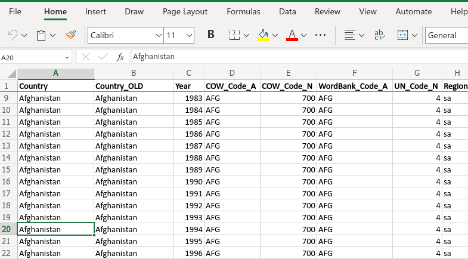
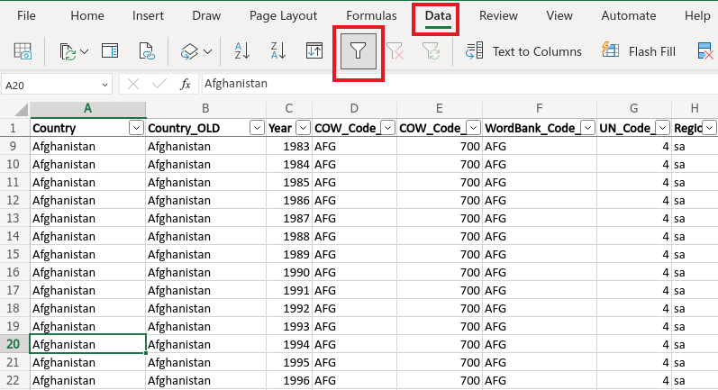
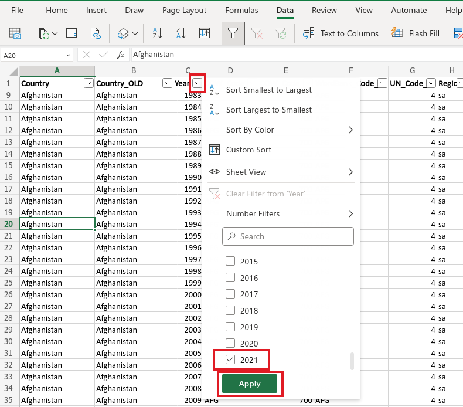

---
output:
  xaringan::moon_reader:
    css: ["default", "extra.css"]
    lib_dir: libs
    seal: false
    nature:
      highlightStyle: github
      highlightLines: true
      countIncrementalSlides: false
      ratio: '16:9'
---

```{r, echo = FALSE, warning = FALSE, message = FALSE}
##xaringan::inf_mr()
## For offline work: https://bookdown.org/yihui/rmarkdown/some-tips.html#working-offline
## Images not appearing? Put images folder inside the libs folder as that is the main data directory

library(tidyverse)
library(readxl)
library(kableExtra)
library(sf)
library(rnaturalearth)
library(rnaturalearthdata)

knitr::opts_chunk$set(echo = FALSE,
                      eval = TRUE,
                      error = FALSE,
                      message = FALSE,
                      warning = FALSE,
                      comment = NA)
```

background-image: url('libs/Images/00-Leviathan_Cover_55.png')
background-size: 100%
background-position: center
class: middle

.size70[**Today's Agenda**]

<br>

.size60[
.center[
Evaluate the Political Terror Scale (PTS) Project
]]

<br>

.center[.size40[
  Justin Leinaweaver (Fall 2023)
]]

???

### Prep for Class
1. ...

<br>


---

background-image: url('libs/Images/background-light_grey.jpg')
background-size: 100%
background-position: center
class: middle

.size45[**Paper 1**]

.size30[
If someone came to you with the goal of better understanding the use of political violence by governments around the world, which of the data sources that we explored in class would you recommend and why?

- The US State Department's "Country Reports on Human Rights Practices"

- **Amnesty International's "Annual Country Reports"**

- The Political Terror Scale (PTS)

- The CIRIGHTS data project's "Physical Integrity Rights"

- Varieties of Democracy's (V-Dem) "Personal Integrity Rights"
]

???

### Takeaways from last class?

Last week and this one we are exploring and analyzing the data and research projects that exist to track political violence by states across time.


---

background-image: url('libs/Images/02_2-protestors_fire2.png')
background-size: 100%
background-position: center
class: middle

.size50[**Measuring "Political Violence"**]

.size45[
**1) Concept**

**2) Operationalization**

**3) Instrumentation**

**4) Measurement**
]

???

Refresh week 2 material from Brians et al (2011): concept -> operationalization ("The process of selecting observable phenomena to represent abstract concepts") -> instrumentation (
...the specification of steps to take in making observations") -> measurement ("The application of an instrument to assign numerical values to cases")


---

background-image: url('libs/Images/background-light_grey.jpg')
background-size: 100%
background-position: center
class: middle

.pull-left[
<br>

```{r, out.width='95%'}
knitr::include_graphics('libs/Images/03-3-amnesty_international.jpg')
```
]

.pull-right[
```{r, out.width='95%'}
knitr::include_graphics('libs/Images/03-3-USDeptState.png')
```
]

.center[.size45[Evaluate: Operationalization, Instrumentation, and Measurement]]

???


On Monday we analyzed the "source" documents for many of the big research projects studying political violence.

### Key takeaways for you next week as you write your country reports?

1. Reports add useful context for the numbers, reference that context!

2. Reports cover more stuff than the coding projects, don't ignore those details!


<br>

On Monday we evaluated reports by the US State Department and Amnesty International.

### What are the takeaways from our work on Monday that will help you write an excellent report?

#### - What should we keep in mind when using these as our source docs for tracking political violence?


---

background-image: url('libs/Images/background-light_grey.jpg')
background-size: 100%
background-position: center
class: middle

.size60[.center[**For Today**]]

.size40[
**Explore the data and codebook for the [Political Terror Scale (PTS)](http://www.politicalterrorscale.org/Data/Download.html). Make sure you understand the observations and variables enough to play with them in class.**

*Recommended Links (in syllabus):*

1. [Sorting Rows in Excel](https://www.excel-easy.com/data-analysis/sort.html)
2. [Filtering Rows in Excel](https://www.excel-easy.com/data-analysis/filter.html)
3. [Pivot Tables in Excel](https://www.excel-easy.com/data-analysis/pivot-tables.html)
]

???

### Everybody ready for today's work?


---

background-image: url('libs/Images/background-light_grey.jpg')
background-size: 100%
background-position: center
class: middle

```{r, fig.align='center', out.width='85%'}
knitr::include_graphics('libs/Images/03-2-PTS_Logo.png')
```

.center[.size45[Evaluate: Operationalization, Instrumentation, and Measurement]]

???

Groups: Take a few minutes to do this together and then we'll report back.

<br>

### Ok, so, how do our definitions compare?

#### - What are the strengths and weaknesses of this definition for measuring and tracking "political violence" more broadly?

Compare and contrast the definition of "political terror" to our definitions of "political violence" from last week

<br>

#### Notes

- "We define political terror as violations of basic human rights to the physical integrity of the person by agents of the state within the territorial boundaries of the state in question. It is important to note that political terror as defined by the PTS is not synonymous with terrorism or the use of violence and intimidation in pursuit of political aims. The concept is also distinguishable from terrorism as a tactic or from criminal acts" (1).

- "Violations of physical integrity rights – also referred to as violations of personal integrity or security – constitute the scope of violence that is captured by the PTS" (1). "Not considered are corporal and capital punishment in the context of legal proceedings conforming to international standards" (2).
    - torture and cruel and unusual treatment and punishment;
    - beatings, excessive use of force, brutality;
    - rape and sexual violence;
    - killings and unlawful use of deadly force;
    - summary or extra-judicial executions;
    - political assassinations and murder;
    - political imprisonment, arbitrary arrest and detention;
    - incommunicado and clandestine imprisonment and detention;
    - forced disappearances;
    - kidnappings, forced relocations and removal;
    
- Agents: "Physical integrity rights violations are only captured if they are perpetrated, sanctioned, or ordered by agents of the state" (2).

- Motivations: "It is important to note that the PTS includes “non-politically motivated violations” of physical integrity rights by state agents" (2).


---

background-image: url('libs/Images/03_2-PTS_Levels.png')
background-size: 100%
background-position: center

instrumentation

???

### GROUPS: Is this a valid and reliable measure of "political violence" or "terror"?

#### - In other words, based on how they constructed these measures are we confident in saying that a move of one unit on the PTS scale translates to a substantial change in violence in that state-year?

#### - As part of this, make sure to discuss the data collection methodology. How did they gather the data? From where?


<br>

Ok, report back.

### Is this a valid measure? Why or why not?
#### - Impacted by sources and data collection?

<br>

### Is this a reliable measure? Why or why not?
#### - Impacted by sources and data collection?


---

background-image: url('libs/Images/03_2-PTS_Levels.png')
background-size: 75%
background-position: top center
class: bottom, center, slideblue

measurement

.size45[**Audit the scores for the three countries you studied on Monday (2021). Would you have coded these the same way as PTS?**]

???

Audit Time!

Each of you focus on the scores for the three countries you analyzed on Monday. 

Go back to the reports and see if you would have coded them the same way. 

<br>

### Ok, any big discrepancies from how you read the reports?

#### - Takeaways for us?


---

background-image: url('libs/Images/background-light_grey.jpg')
background-size: 100%
background-position: center
class: middle, center

.size70[
Is there any evidence of selection bias in the three PTS measures in 2021 (most recent year coded)? 
]

???

Let's dig into the data.

- REMEMBER, our key exercise here is to analyze the validity and reliability of the measures SO THAT later we can use them to analyze country behavior.

<br>

Use the autofilter to zoom in on 2021 only

Then scroll through and talk to me about the kinds of countries with missing data in the three measures.

<br>

### Any questions on sorting and filtering in Excel?

- (**SLIDE**: web excel examples)


---

background-image: url('libs/Images/background-light_grey.jpg')
background-size: 100%
background-position: center
class: middle

```{r, echo = FALSE, fig.align = 'center', out.width = '100%'}

```

???


---

background-image: url('libs/Images/background-light_grey.jpg')
background-size: 100%
background-position: center
class: middle

```{r, echo = FALSE, fig.align = 'center', out.width = '100%'}

```

???

Turn on autofilter


---

background-image: url('libs/Images/background-light_grey.jpg')
background-size: 100%
background-position: center
class: middle

```{r, echo = FALSE, fig.align = 'center', out.width = '64%'}

```

???

Use autofilter


---

background-image: url('libs/Images/background-light_grey.jpg')
background-size: 100%
background-position: center
class: middle, center

.size70[
Is there any evidence of selection bias in the three PTS measures in 2021 (most recent year coded)? 
]

???

### Does one measure cover more countries than the others?

- (**SLIDE**: Missing data stats)


---

background-image: url('libs/Images/background-light_grey.jpg')
background-size: 100%
background-position: center
class: middle, center

```{r, eval=TRUE}
## PTS_A: Amnesty International
## PTS_H: Human Rights Watch
## PTS_S: State Dept
d <- read_excel("../../Data/PTS/2023-05-PTS_2022/PTS-2022.xlsx", na = "NA")

d2021 <- d |>
  filter(Year == 2021)

#d2021 |> count(PTS_A, PTS_H, PTS_S) |> print(n=100)

# Descriptive Stats Table
x1 <- d2021 |> 
  pivot_longer(cols = PTS_A:PTS_S, names_to = "Source", values_to = "Value") |>
  group_by(Source) |>
  summarize(
    N = n(),
    NAs = sum(is.na(Value)),
    Prop = str_c(round(NAs/N, 2)*100, '%'),
    #Mean = round(mean(Value, na.rm = TRUE), 1),
    #StdDev = round(sd(Value, na.rm = TRUE), 1),
    #Min = round(min(Value, na.rm = TRUE), 0),
    #Max = round(max(Value, na.rm = TRUE), 0)
  ) 

x1 |>
  kableExtra::kbl(align = c('l', rep('c', 3)), col.names = c("Source", "N", "Missing", "Missing (%)")) |>
  kableExtra::kable_styling(bootstrap_options = c("striped", "hover"), font_size = 22) |>
  column_spec(column = 1:4, width = "12em")
```

```{r, fig.retina=3, fig.align='center', out.width='80%', fig.height=4.5, fig.width=9.5, eval=TRUE, cache=TRUE}
## Use rnaturalearth to define world map data
worldmap <- ne_countries(scale = 'medium', type = 'countries', returnclass = 'sf')

# d2021$COW_Code_A matches cowc 99.5%
# worldmap$adm0_a3 matches iso3c 95.9%

d2021$newcode1 <- countrycode::countrycode(d2021$COW_Code_A, origin = "cowc", destination = "iso3c")
worldmap$newcode1 <- countrycode::countrycode(worldmap$adm0_a3, origin = "iso3c", destination = "iso3c")

## Identify country identifiers
## Problem because most of the numeric codes are omitting FRA, UK and Portugal
# table(is.na(d2021$COW_Code_A)) # 11
# table(is.na(d2021$COW_Code_N)) # 11
# table(is.na(d2021$UN_Code_N)) # 16
# table(is.na(d2021$WordBank_Code_A)) # 12
# 
# table(is.na(worldmap$iso_n3)) # 26
# table(is.na(worldmap$un_a3)) # 36
# table(is.na(worldmap$adm0_a3)) #
# table(is.na(worldmap$gu_a3)) #
# table(is.na(worldmap$su_a3)) #
# table(is.na(worldmap$brk_a3)) #
# table(is.na(worldmap$wb_a3)) # 60
# 
# # d2021$WordBank_Code_A has "FRA"
# countrycode::guess_field(d2021$COW_Code_A) # 99.5% cowc
# countrycode::guess_field(d2021$COW_Code_N) # 99.5 cown
# countrycode::guess_field(d2021$UN_Code_N)
# countrycode::guess_field(d2021$WordBank_Code_A) # genc3c and iso3c 96.5%

#d2021_1$newcode2 <- countrycode::countrycode(d2020_1$COW_Code_A, origin = "cowc", destination = "genc3n")
#d2021_1$newcode2 <- countrycode::countrycode(d2020_1$UN_Code_N, origin = "iso3n", destination = "genc3n")

# missing data 
#countrycode::guess_field(worldmap$iso_n3) #98.3% genc3n
#countrycode::guess_field(worldmap$un_a3) #98.7% genc3n
#countrycode::guess_field(worldmap$wb_a3) # wb 97, iso3c, 96.6

# countrycode::guess_field(worldmap$adm0_a3) #95.8% iso3c
# countrycode::guess_field(worldmap$gu_a3) # 87% iso3c
# countrycode::guess_field(worldmap$su_a3) # 87% iso3c
# countrycode::guess_field(worldmap$brk_a3) # 85.6% iso3c


############################################################
### tldr d2021$WordBank_Code_A has a few codes different from what countrycode expects
# 1. DRC Congo, 2. South Sudan, 3. Western Sahara, 4. Romania

# guess field is missing DRC congo
# map is expecting an iso3c code of "COD" bot the current "ZAR"
# View(d2021)
# library(countrycode)
# codelist_panel |> filter(year == 2021) |> View()
# d2021$WordBank_Code_A[d2021$COW_Code_A == "DRC"] <- "COD"
# d2021$WordBank_Code_A[d2021$COW_Code_A == "SSD"] <- "SSD"
# #d2021$WordBank_Code_A[d2021$Country == "Western Sahara"] <- "?"
# d2021$WordBank_Code_A[d2021$COW_Code_A == "ROM"] <- "ROU"

## Make a map
d2021_1 <- d2021 |>
  group_by(newcode1, Country) |>
  summarize(
    miss_a = sum(is.na(PTS_A)),
    miss_h = sum(is.na(PTS_H)),
    miss_s = sum(is.na(PTS_S))
  ) |>
  mutate(
    missing = miss_a + miss_h+miss_s,
    Sources = 3 - missing
  ) |> 
  filter(!is.na(newcode1)) |>
  #filter(WordBank_Code_A != "YUG") |>
  mutate(
    Sources_cat = case_when(
      Sources == 3 ~ "3 Sources",
      Sources == 2 ~ "2 Sources",
      Sources == 1 ~ "1 Source",
      Sources == 0 ~ "No Data",
      is.na(Sources) ~ "No Data"
    )
  ) |>
  ungroup()

#d2021_1 |> count(Sources_cat)

## Merge data onto worldmap
d10 <- left_join(worldmap, d2021_1, by = "newcode1")

# Audit for missing data
# names(d10)
# tibble(d10) |> 
#   select(name, Sources_cat) |> 
#   filter(is.na(Sources_cat)) |> 
#   print(n=100)
# 
# d2021 |> select(Country, PTS_A:PTS_S) |> View()

d10$Sources_cat[d10$name == "S. Sudan"] <- "3 Sources"
d10$Sources_cat[d10$name == "W. Sahara"] <- "2 Sources"
d10$Sources_cat[d10$name == "Kosovo"] <- "3 Sources"
d10$Sources_cat[d10$name == "Serbia"] <- "3 Sources"
#d10$Sources_cat[d10$name == "Somaliland"] <- "NA"

# Output map
d10 |>
  ggplot() +
  geom_sf(aes(fill = Sources_cat)) +
  labs(fill = "", title = "PTS Missing Data") +
  theme(legend.position = "bottom") +
  #scale_fill_brewer(type = "seq", palette = 7)
  scale_fill_manual(values = c("wheat1", "cadetblue1", "dodgerblue1"))
```

???

### So, what selection bias concerns do you have?

<br>

### Any idea why HRW is missing so much data?

<br>

### To what extent are we limited in comparing across the three measures?
+ So many missing cases, but are they missing different states?


---

background-image: url('libs/Images/background-light_grey.jpg')
background-size: 100%
background-position: center
class: middle, center

.size70[
Do all three PTS measures produce the same country scores in 2021?  How similar are they?
]

???


Compare and contrast the scores for PTS_A, PTS_H and PTS_S for 2021 (most recent year coded)

- Evidence of conflicts in the codings?

*Groups work on slide question, you have a few results slides after this*


---

background-image: url('libs/Images/background-light_grey.jpg')
background-size: 100%
background-position: center
class: middle

```{r, eval=TRUE}
## Focus only on cases with data across all three measures
all3 <- d2021 |>
  select(Country, Year, PTS_A:PTS_S) |>
  na.omit() |>
  mutate(
    Matching = if_else(PTS_A == PTS_H & PTS_A == PTS_S, "Matches", "Doesn't Match")
  ) |>
  count(Matching) |>
  mutate(
    Cases = sum(n),
    Prop = n/Cases
  )

# Focus on AI and State only
main2 <- d2021 |>
  select(Country, Year, PTS_A, PTS_S) |>
  na.omit() |>
  mutate(
    Matching = if_else(PTS_A == PTS_S, "Matches", "Doesn't Match")
  ) |>
  count(Matching) |>
  mutate(
    Cases = sum(n),
    Prop = n/Cases
  )

# Avg differences AI vs State scores
main2_1 <- d2021 |>
  select(Country, Year, PTS_A, PTS_S) |>
  na.omit() |>
  mutate(
    Absolute_diff = abs(PTS_A - PTS_S),
    Diff = PTS_A - PTS_S
  )

props1 <- main2_1 |> count(Diff) |> mutate(Prop = n/sum(n))
```

.size45[.center[**How often do the scores match? (2021)**]]

.size30[
+ Matching across all three measures: `r all3$n[all3$Matching == "Matches"]`/`r all3$Cases[all3$Matching == "Matches"]` (`r str_c(round(all3$Prop[all3$Matching == "Matches"]*100, 0), '%')`)

+ Matching across AI and State only: `r main2$n[main2$Matching == "Matches"]`/`r main2$Cases[main2$Matching == "Matches"]` (`r str_c(round(main2$Prop[main2$Matching == "Matches"]*100, 0), '%')`)
]

```{r, fig.retina=3, fig.align='center', out.width='60%', fig.asp=0.618, eval=TRUE, cache=TRUE}
main2_1 |>
  ggplot(aes(x = Diff)) +
  geom_bar(width = .6) +
  geom_hline(yintercept = seq(25, 75, 25), color = "white") +
  theme_bw() +
  labs(x = "PTS_A - PTS_S", y = "", 
       title = "Most state scores match perfectly and almost all are +/- 1")
```

???

### Are these good or bad results in terms of matching percentages? Why?

<br>

### Is the +/-1 as a percentage a meaningful piece of analysis? 
#### - Given what the stages represent are we comfortable saying a difference of one on the scale isn't substantial?

<br>

### What are the different reasons a country might have different scores across the measures?

+ Different operationalizations of political violence by the three sources
+ Different validity and reliability of the sources
+ Problems with how the PTS team codes these variables (reliability)
+ ?

<br>

**SLIDE**: Let's check your intuitions!


---

background-image: url('libs/Images/background-light_grey.jpg')
background-size: 100%
background-position: center
class: middle

```{r, fig.retina=3, fig.align='center', out.width='100%', fig.height=4.5, fig.width=9.5, eval=TRUE, cache=TRUE}
## Make a map
## Three colors: missing, match, no match
d2021_1 <- d2021 |>
  filter(!is.na(newcode1)) |>
  group_by(newcode1, Country) |>
  summarize(
    Matching = if_else(PTS_A == PTS_S, 1, 0)
  ) |>
  ungroup()

d10 <- left_join(worldmap, d2021_1, by = "newcode1")

# # Audit for missing data
# names(d10)
# tibble(d10) |>
#   select(name, Matching) |>
#   filter(is.na(Matching)) |>
#   print(n=100)
# 
# d2021 |> select(Country, PTS_A, PTS_S) |> View()

d10$Matching[d10$name == "S. Sudan"] <- "1"
#d10$Matching[d10$name == "W. Sahara"] <- ""
d10$Matching[d10$name == "Kosovo"] <- "0"
d10$Matching[d10$name == "Serbia"] <- "1"
#d10$Matching[d10$name == "Somaliland"] <- ""

d10 |>
  mutate(
    Matching_cat = if_else(Matching == 1, "Matching", "Not Matching", missing = "Insufficient Data"),
    Matching_cat = factor(Matching_cat, levels = c("Matching", "Not Matching", "Insufficient Data"))
  ) |>
  #filter(!is.na(Matching_cat)) |>
  ggplot() +
  geom_sf(aes(fill = Matching_cat)) +
  labs(fill = "", title = "PTS_A vs PTS_S (2021)") +
  theme(legend.position = "bottom") +
  scale_fill_manual(values = c("gold1", "green4", "white"))
```

???

### First, would you audit this map for me? Any colors look wrongly placed?

<br>

### Second, do we see any evidence here of a problematic selection effect?
#### - Certain types of state more or less likely to be included?

<br>

### Bottom line, do you believe the PTS data for 2021 is sufficiently valid and relaible to use as an expert measure of political violence around the world? Why or why not?

#### - As a person writing an analysis of a country using this data, which of those reasons are good for you and which bad?


---

background-image: url('libs/Images/background-light_grey.jpg')
background-size: 100%
background-position: center
class: middle, center

.size70[
Any countries with a PTS_S score in 2021 that challenges your intuitions?
]

???

*Groups work on slide question, then report back*

SLIDE: Map of PTS_S for discussion


---


background-image: url('libs/Images/background-light_grey.jpg')
background-size: 100%
background-position: center
class: middle

```{r, fig.retina=3, fig.align='center', out.width='100%', fig.height=4.5, fig.width=9.5, eval=TRUE, cache=TRUE}
## Make a map
d2021_1 <- d2021 |>
  filter(!is.na(newcode1))

d10 <- left_join(worldmap, d2021_1, by = "newcode1")

# # Audit for missing data
# tibble(d10) |>
#   select(name, PTS_S) |>
#   filter(is.na(PTS_S)) |>
#   print(n=100)
# 
# d2021 |> select(Country, PTS_S) |> View()

d10$PTS_S[d10$name == "S. Sudan"] <- "5"
#d10$PTS_S[d10$name == "W. Sahara"] <- ""
d10$PTS_S[d10$name == "Kosovo"] <- "2"
d10$PTS_S[d10$name == "Serbia"] <- "2"
#d10$PTS_S[d10$name == "Somaliland"] <- ""

d10 |>
  mutate(
    pts_s_cat = factor(PTS_S, levels = c("1", "2", "3", "4", "5"))
  ) |>
  #filter(!is.na(pts_s_cat)) |>
  ggplot() +
  geom_sf(aes(fill = pts_s_cat)) +
  labs(fill = "", title = "PTS_S (2021)") +
  #theme(legend.position = "right") +
  scale_fill_manual(values = c("forestgreen", "darkolivegreen2", "lemonchiffon1", "sandybrown", "red3"))
```

???

I've tried to match the colors on their levels of PTS figure.

### Please audit the map for me again.

<br>

### Findings? Talk to me about the state of political violence in the world according to PTS.

<br>

### Any caveats on this based on our exploration of the methodology?


---

background-image: url('libs/Images/background-light_grey.jpg')
background-size: 100%
background-position: center
class: middle

.size55[
Focus on the scores for PTS_S in the years since 2001 and find us examples of countries that have:

  + Improved the most, and
  
  + Regressed the most across the years in the sample
]

???

*Groups work on slide question then report back*

- Sort by both country and year then scroll looking for big changes by country!

<br>

### Findings?


---

class: middle, center, slideblue

```{r, fig.retina=3, fig.align='center', out.width='100%', fig.height=4.5, fig.width=9.5, eval=TRUE, cache=TRUE}
# Quick stab focused just on changes between the min and max years in the question
# Map of the changes across the period
d11 <- d |>
  select(Country, WordBank_Code_A, Year, PTS_S) |>
  filter(Year %in% c(2001, 2021)) |>
  pivot_wider(names_from = Year, values_from = PTS_S) |>
  mutate(
    Change = `2021` - `2001`
  )

## Merge data onto worldmap
d10 <- left_join(worldmap, d11, by = c("adm0_a3" = "WordBank_Code_A"))

## Audit the missing data
# View(d11)
# tibble(d10) |>
#   select(name, Change) |>
#   filter(is.na(Change)) |>
#   print(n=100)

d10$Change[d10$name == "Dem. Rep. Congo"] <- "0"
d10$Change[d10$name == "Romania"] <- "0"

# d10$Change[d10$name == "W. Sahara"] <- ""
# d10$Change[d10$name == "Kosovo"] <- ""
# d10$Change[d10$name == "Serbia"] <- ""
# d10$Change[d10$name == "Somaliland"] <- ""


d10 |>
  mutate(
    Changes_cat = factor(Change, levels = c("-2", "-1", "0", "1", "2"))
  ) |>
  #filter(!is.na(pts_s_cat)) |>
  ggplot() +
  geom_sf(aes(fill = Changes_cat)) +
  labs(fill = "", title = "Changes in PTS_S (2001 to 2020)") +
  #theme(legend.position = "bottom") +
  scale_fill_manual(values = c("forestgreen", "darkolivegreen2", "lemonchiffon1", "sandybrown", "red3"))
```

???

### Bottom line, how useful is the PTS for helping us test theories of political violence? 

#### - What are its strengths and weaknesses?

#### - How do we best use it to analyze changes in the world?


---

background-image: url('libs/Images/background-light_grey.jpg')
background-size: 100%
background-position: center
class: middle

.size60[.center[**For Next Class**]]

.size50[
**Explore the data and codebook for the [CIRIGHTS Data project](https://www.dropbox.com/sh/t8utmzsvde8m63q/AAAs1_WIJTqXurAE5nvEKWE5a?dl=0).**

Make sure you understand the observations and variables enough to play with them in class.
]

???

For next class we repeat today's work on the PTS data project.

Get ready to work!


