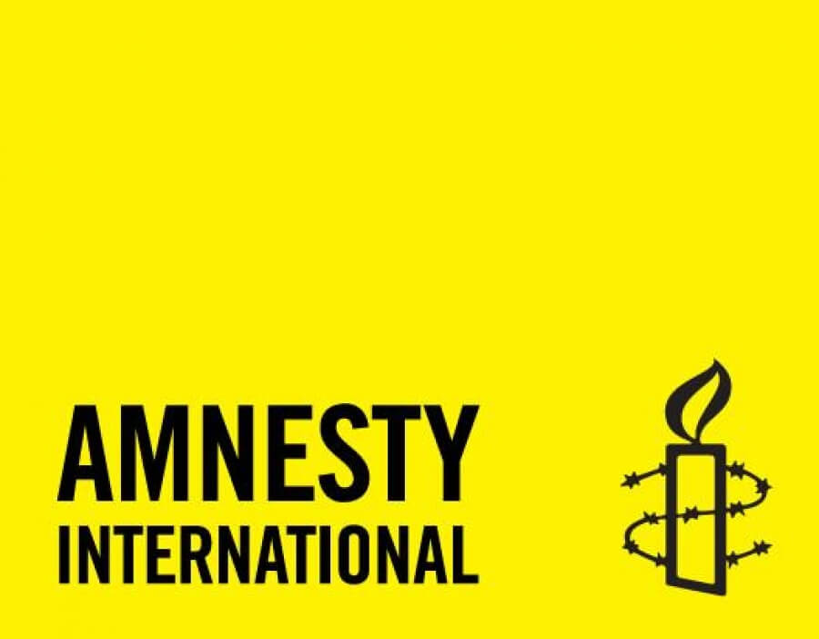
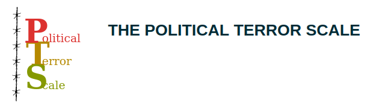

---
output:
  xaringan::moon_reader:
    css: ["default", "extra.css"]
    lib_dir: libs
    seal: false
    nature:
      highlightStyle: github
      highlightLines: true
      countIncrementalSlides: false
      ratio: '16:9'
---

```{r, echo = FALSE, warning = FALSE, message = FALSE}
##xaringan::inf_mr()
## For offline work: https://bookdown.org/yihui/rmarkdown/some-tips.html#working-offline
## Images not appearing? Put images folder inside the libs folder as that is the main data directory

library(tidyverse)
library(readxl)
library(kableExtra)
library(sf)
library(rnaturalearth)
library(rnaturalearthdata)

knitr::opts_chunk$set(echo = FALSE,
                      eval = TRUE,
                      error = FALSE,
                      message = FALSE,
                      warning = FALSE,
                      comment = NA)

## PTS_A: Amnesty International
## PTS_H: Human Rights Watch
## PTS_S: State Dept
d <- read_excel("../../Data/PTS/2023-05-PTS_2022/PTS-2022.xlsx", na = "NA")

d2021 <- d |>
  filter(Year == 2021)
```

background-image: url('libs/Images/00-Leviathan_Cover_55.png')
background-size: 100%
background-position: center
class: middle

.center[.size35[**II. How and why do governments use violence against the people inside their borders?**]]

<br>

.size45[

**Today's Agenda**: Measuring "Political Violence"

- The Political Terror Scale (PTS) Project
]

<br>

.center[.size40[
  Justin Leinaweaver (Fall 2023)
]]

???

### Prep for Class
1. You may want the PTS data on the classroom computer if class has questions

<br>

**SLIDE**: Today we continue our work on the first paper...


---

background-image: url('libs/Images/background-blue_triangles2.png')
background-size: 100%
background-position: center
class: middle

.size40[.content-box-white[**Paper 1**]]

.size35[
If someone came to you with the goal of better understanding the use of political violence by governments around the world, which of the data sources that we explored in class would you recommend and why? 

Your report should introduce each source to the reader with your analysis of its strengths and weaknesses. 

Ultimately, your central argument should be a clear recommendation of which source(s) they should focus on.
]

???

### Questions on the prompt?


---

background-image: url('libs/Images/background-light_grey.jpg')
background-size: 100%
background-position: center
class: middle, center

.size50[.content-box-white[**Measuring "Political Violence"**]]

.pull-left[
<br>

```{r}

```
]

.pull-right[
```{r}

```
]

???

Last week we focused on two sources of data on government's domestic uses of political violence.

- Let's briefly review that work to set us up for our analyses today!

<br>

### What is the concept each source is trying to measure? e.g. what specific flavor of political violence?
- (**SLIDE**: Human Rights Practices)


---

background-image: url('libs/Images/background-light_grey.jpg')
background-size: 100%
background-position: center
class: middle, center

.size40[.content-box-white[**Measuring "Human Rights Practices"**]]

.pull-left[
<br>

```{r, out.width='80%'}

```
]

.pull-right[
```{r, out.width='80%'}

```
]

.center[.size40[**Operationalization <html>&#8594;</html> Instrumentation <html>&#8594;</html> Measurement**]]

???

Alright, let's talk measurement.

### What does operationalization refer to?
- ("...selecting observable phenomena to represent abstract concepts" (89).)

### What are the similarities and differences in the way each source operationalizes "human rights practices"?
- (Clark and Sikkink (2013) make a nice point about AI focusing its approach an an "every life matters" perspective whereas the State Department takes a broader view)
- ...

<br>

### What does Instrumentation refer to?
- (Convert your operationalization (definition) into a series of steps you can use to measure the concept in question)

### What are the similarities and differences in the instruments each source uses for measuring "human rights practices"?
- (State Dept: Some defined by law, some based on the guidance provided by the the Bureau of Democracy, Human Rights, and Labor (DRL))
- (AI: ?)

<br>

### What does measurement refer to?
- (Applying the instrument to the cases to generate values/data/numbers)

### What are the similarities and differences in the measurement process each source uses for studying "human rights practices"?
- ? sources of data, who does the reporting ?

<br>

As Clark and Sikkink (2013) noted these sources are incredibly nuanced measurements of political violence that require careful thought by the analyst, YOU, in order to be used appropriately.


---

background-image: url('libs/Images/background-light_grey.jpg')
background-size: 100%
background-position: center
class: middle

.size50[.content-box-purple[**Sources of Political Violence Data**]]

.size35[
- The US State Department's "Country Reports on Human Rights Practices"

- Amnesty International's "Annual Country Reports"

- **The Political Terror Scale (PTS)**

- **The CIRIGHTS data project's "Physical Integrity Rights"**

- **Varieties of Democracy's (V-Dem) "Personal Integrity Rights"**
]

???

This week we shift our attention to three data projects that aim to produce quantitative measures of political violence by governments.

- Today PTS, Wed CIRIGHTS and Fri V-Dem

<br>

These measures are quantitative meaning they produce numeric measures of the "political violence" we are interested in.

- Numbers don't mean "better" than the text descriptions in the State Dept and AI reports, it's just a different way of describing variation in the world.


---

background-image: url('libs/Images/background-blue_triangles.jpg')
background-size: 100%
background-position: center
class: middle

.size60[.center[.content-box-white[**For Today**]]]

.size40[
**Explore the data and codebook for the [Political Terror Scale (PTS)](http://www.politicalterrorscale.org/Data/Download.html). Make sure you understand the observations and variables enough to play with them in class.**

*Recommended Links (in syllabus):*

1. [Sorting Rows in Excel](https://www.excel-easy.com/data-analysis/sort.html)
2. [Filtering Rows in Excel](https://www.excel-easy.com/data-analysis/filter.html)
]

???

### Everybody ready for today's work?

<br>

What does that mean?

1. Reviewed the codebook

2. Opened the data (Excel or R)

3. Identified variables in the spreadsheet and matched them to the codebook

4. Explored the data

<br>

Before we dive into the data we have to evaluate its validity and reliability.

### So, let's begin with, what is the central concept the PTS is trying to measure?
- (**SLIDE**)


---

background-image: url('libs/Images/background-light_grey.jpg')
background-size: 100%
background-position: center
class: middle


```{r, fig.align='center', out.width='100%'}

```

<br>

<br>

.size50[
.center[.content-box-white[**"Political Terror"**]]
]

???

### In broadest terms, how do the researchers define "political terror"?
- ("We define political terror as violations of basic human rights to the physical integrity of the person by agents of the state within the territorial boundaries of the state in question" p1.)

<br>

They then go on to break down each of the concepts in that definition.

- **SLIDE**: We'll hit those elements in a sec, but first...

<br>

#### Notes
- "We define political terror as violations of basic human rights to the physical integrity of the person by agents of the state within the territorial boundaries of the state in question. It is important to note that political terror as defined by the PTS is not synonymous with terrorism or the use of violence and intimidation in pursuit of political aims. The concept is also distinguishable from terrorism as a tactic or from criminal acts" (1).


---

background-image: url('libs/Images/background-light_grey.jpg')
background-size: 100%
background-position: center
class: middle

.center[.size55[.content-box-white[**"Political Violence"**]]]

.size35[
<br>
]

.center[.size45[**II. How and why do governments use violence against the people inside their borders?**]]

.size45[
1. **"Human Rights Practices" (State Dept and AI)**

2. **"Political Terror" (PTS)**
]

???

Remember, the overarching aim of our class is to describe and explain "political violence"

The aim of the second section of the class is focused on this big question about governments using violence within their borders

<br>

### First, are we comfortable classifying both of these measures as examples of "political violence"?

<br>

### Second, do these two measures cover different conceptual ground or are they essentially synonymous?


---

background-image: url('libs/Images/background-light_grey.jpg')
background-size: 100%
background-position: center
class: middle

.center[.size45[.content-box-white[**Measuring "Political Terror" (PTS)**]]]

<br>

.pull-left[
.center[.size40[
**Operationalization**

<html>&#8595;</html>

**Instrumentation**

<html>&#8595;</html>

**Measurement**
]]]

.pull-right[
```{r, echo = FALSE, fig.align = 'center', out.width = '85%'}
knitr::include_graphics("libs/Images/02_3-reliable_valid.png")
```
]

???

We need to evaluate the validity and reliability of the PTS measure of "political terror"

- *Split class in half*

- Group 1, your job will be to make a list of reasons on the board why the PTS measures are valid and reliable.

- Group 2, your job will be to make a list of reasons on the board why the PTS measures are NOT valid and reliable.

<br>

Groups, work directly on the board and focus on each of the three steps in the measurement process: operationalization, instrumentation and measurement

### Questions on the job?

- Go!

<br>

*ON BOARD*

Valid and Reliable
- ?

NOT
- ?

<br>

**SLIDE**: Instrumentation levels from codebook

<br>

#### Notes
- "We define political terror as violations of basic human rights to the physical integrity of the person by agents of the state within the territorial boundaries of the state in question. It is important to note that political terror as defined by the PTS is not synonymous with terrorism or the use of violence and intimidation in pursuit of political aims. The concept is also distinguishable from terrorism as a tactic or from criminal acts" (1).

- "Violations of physical integrity rights – also referred to as violations of personal integrity or security – constitute the scope of violence that is captured by the PTS" (1). "Not considered are corporal and capital punishment in the context of legal proceedings conforming to international standards" (2).
    - torture and cruel and unusual treatment and punishment;
    - beatings, excessive use of force, brutality;
    - rape and sexual violence;
    - killings and unlawful use of deadly force;
    - summary or extra-judicial executions;
    - political assassinations and murder;
    - political imprisonment, arbitrary arrest and detention;
    - incommunicado and clandestine imprisonment and detention;
    - forced disappearances;
    - kidnappings, forced relocations and removal;
    
- Agents: "Physical integrity rights violations are only captured if they are perpetrated, sanctioned, or ordered by agents of the state" (2).

- Motivations: "It is important to note that the PTS includes “non-politically motivated violations” of physical integrity rights by state agents" (2).


---

background-image: url('libs/Images/03_2-PTS_Levels.png')
background-size: 100%
background-position: center

???

Focusing on the instrument

### Is this instrument likely to produce valid measures of "political terror"? Why or why not?

### - Are we convinced that a move of one unit on the PTS scale translates to a substantial change in violence in that state-year? Why or why not?

<br>

### Is this instrument likely to produce reliable measures of "political terror"? Why or why not?

### - Are we convinced that different coders interpret the separation between the levels in the same way? Why or why not?


---

background-image: url('libs/Images/03_2-PTS_Levels.png')
background-size: 75%
background-position: top center
class: bottom, center, slideblue

.size45[**Audit the scores for the two country-years you studied last week. Would you have coded these the same way as PTS?**]

???

Audit Time!

Each of you focus on the scores for the two country-years you analyzed on Monday. 

### Would you have coded these country-years the same way? Why or why not?

<br>

### Any lessons for us from the audit process about the validity and reliability of the PTS?

<br>

### Open it up to the class: What did you find or notice when exploring the dataset?

### - Show us something cool!

- *Let them lead this and after a while feel free to segue to your slides*

<br>

**SLIDE**: Let's continue to audit the data


---

background-image: url('libs/Images/background-light_grey.jpg')
background-size: 100%
background-position: center
class: middle, center

.size70[
Is there any evidence of selection bias in 2021 (most recent year coded)? 

e.g. missing data problems in a certain kind of country
]

???

Let's examine the PTS data for evidence of selection bias

- e.g. "occurs when individuals or groups in a study differ systematically from the population of interest leading to a systematic error in an association or outcome."


---

background-image: url('libs/Images/background-light_grey.jpg')
background-size: 100%
background-position: center
class: middle, center

```{r, eval=TRUE}
#d2021 |> count(PTS_A, PTS_H, PTS_S) |> print(n=100)

# Descriptive Stats Table
x1 <- d2021 |> 
  pivot_longer(cols = c(PTS_A, PTS_S), names_to = "Source", values_to = "Value") |>
  group_by(Source) |>
  summarize(
    N = n(),
    NAs = sum(is.na(Value)),
    Prop = str_c(round(NAs/N, 2)*100, '%'),
    #Mean = round(mean(Value, na.rm = TRUE), 1),
    #StdDev = round(sd(Value, na.rm = TRUE), 1),
    #Min = round(min(Value, na.rm = TRUE), 0),
    #Max = round(max(Value, na.rm = TRUE), 0)
  ) 

x1 |>
  kableExtra::kbl(align = c('l', rep('c', 3)), col.names = c("Source", "N", "Missing", "Missing (%)")) |>
  kableExtra::kable_styling(bootstrap_options = c("striped", "hover"), font_size = 22) |>
  column_spec(column = 1:4, width = "12em")
```

```{r, fig.retina=3, fig.align='center', out.width='80%', fig.height=4.5, fig.width=9.5, eval=TRUE, cache=TRUE}
## Use rnaturalearth to define world map data
worldmap <- ne_countries(scale = 'medium', type = 'countries', returnclass = 'sf')

# d2021$COW_Code_A matches cowc 99.5%
# worldmap$adm0_a3 matches iso3c 95.9%

d2021$newcode1 <- countrycode::countrycode(d2021$COW_Code_A, origin = "cowc", destination = "iso3c")
worldmap$newcode1 <- countrycode::countrycode(worldmap$adm0_a3, origin = "iso3c", destination = "iso3c")

## Identify country identifiers
## Problem because most of the numeric codes are omitting FRA, UK and Portugal
# table(is.na(d2021$COW_Code_A)) # 11
# table(is.na(d2021$COW_Code_N)) # 11
# table(is.na(d2021$UN_Code_N)) # 16
# table(is.na(d2021$WordBank_Code_A)) # 12
# 
# table(is.na(worldmap$iso_n3)) # 26
# table(is.na(worldmap$un_a3)) # 36
# table(is.na(worldmap$adm0_a3)) #
# table(is.na(worldmap$gu_a3)) #
# table(is.na(worldmap$su_a3)) #
# table(is.na(worldmap$brk_a3)) #
# table(is.na(worldmap$wb_a3)) # 60
# 
# # d2021$WordBank_Code_A has "FRA"
# countrycode::guess_field(d2021$COW_Code_A) # 99.5% cowc
# countrycode::guess_field(d2021$COW_Code_N) # 99.5 cown
# countrycode::guess_field(d2021$UN_Code_N)
# countrycode::guess_field(d2021$WordBank_Code_A) # genc3c and iso3c 96.5%

#d2021_1$newcode2 <- countrycode::countrycode(d2020_1$COW_Code_A, origin = "cowc", destination = "genc3n")
#d2021_1$newcode2 <- countrycode::countrycode(d2020_1$UN_Code_N, origin = "iso3n", destination = "genc3n")

# missing data 
#countrycode::guess_field(worldmap$iso_n3) #98.3% genc3n
#countrycode::guess_field(worldmap$un_a3) #98.7% genc3n
#countrycode::guess_field(worldmap$wb_a3) # wb 97, iso3c, 96.6

# countrycode::guess_field(worldmap$adm0_a3) #95.8% iso3c
# countrycode::guess_field(worldmap$gu_a3) # 87% iso3c
# countrycode::guess_field(worldmap$su_a3) # 87% iso3c
# countrycode::guess_field(worldmap$brk_a3) # 85.6% iso3c


############################################################
### tldr d2021$WordBank_Code_A has a few codes different from what countrycode expects
# 1. DRC Congo, 2. South Sudan, 3. Western Sahara, 4. Romania

# guess field is missing DRC congo
# map is expecting an iso3c code of "COD" bot the current "ZAR"
# View(d2021)
# library(countrycode)
# codelist_panel |> filter(year == 2021) |> View()
# d2021$WordBank_Code_A[d2021$COW_Code_A == "DRC"] <- "COD"
# d2021$WordBank_Code_A[d2021$COW_Code_A == "SSD"] <- "SSD"
# #d2021$WordBank_Code_A[d2021$Country == "Western Sahara"] <- "?"
# d2021$WordBank_Code_A[d2021$COW_Code_A == "ROM"] <- "ROU"

## Make a map
d2021_1 <- d2021 |>
  group_by(newcode1, Country) |>
  summarize(
    miss_a = sum(is.na(PTS_A)),
    #miss_h = sum(is.na(PTS_H)),
    miss_s = sum(is.na(PTS_S))
  ) |>
  mutate(
    missing = miss_a + miss_s,
    Sources = 2 - missing
  ) |> 
  filter(!is.na(newcode1)) |> 
  #filter(WordBank_Code_A != "YUG") |>
  mutate(
    Sources_cat = case_when(
      #Sources == 3 ~ "3 Sources",
      Sources == 2 ~ "2 Sources",
      Sources == 1 ~ "1 Source",
      Sources == 0 ~ "No Data",
      is.na(Sources) ~ "No Data"
    )
  ) |>
  ungroup()

#d2021_1 |> count(Sources_cat)

## Merge data onto worldmap
d10 <- left_join(worldmap, d2021_1, by = "newcode1")

# Audit for missing data
# names(d10)
# tibble(d10) |> 
#   select(name, Sources_cat) |> 
#   filter(is.na(Sources_cat)) |> 
#   print(n=100)
# 
# d2021 |> select(Country, PTS_A:PTS_S) |> View()

d10$Sources_cat[d10$name == "S. Sudan"] <- "2 Sources"
d10$Sources_cat[d10$name == "W. Sahara"] <- "2 Sources"
d10$Sources_cat[d10$name == "Kosovo"] <- "2 Sources"
d10$Sources_cat[d10$name == "Serbia"] <- "2 Sources"
#d10$Sources_cat[d10$name == "Somaliland"] <- "NA"

# Output map
d10 |>
  ggplot() +
  geom_sf(aes(fill = Sources_cat)) +
  labs(fill = "", title = "PTS Missing Data") +
  theme(legend.position = "bottom") +
  #scale_fill_brewer(type = "seq", palette = 7)
  scale_fill_manual(values = c("wheat1", "dodgerblue1"))
```

???

### So, what selection bias concerns do you have?

- (In 2021: Appears like AI only missing data for super tiny states (e.g. island nations with small populations))


---

background-image: url('libs/Images/background-light_grey.jpg')
background-size: 100%
background-position: center
class: middle, center

.size70[
Do both PTS measures produce the same country scores in 2021?  

How similar are they?
]

???


Compare and contrast the scores for PTS_A and PTS_S for 2021 (most recent year coded)

- Evidence of conflicts in the codings?

*Groups work on slide question, you have a few results slides after this*


---

background-image: url('libs/Images/background-light_grey.jpg')
background-size: 100%
background-position: center
class: middle

```{r, eval=TRUE}
# Focus on AI and State only
main2 <- d2021 |>
  select(Country, Year, PTS_A, PTS_S) |>
  na.omit() |>
  mutate(
    Matching = if_else(PTS_A == PTS_S, "Matches", "Doesn't Match")
  ) |>
  count(Matching) |>
  mutate(
    Cases = sum(n),
    Prop = n/Cases
  )

# Avg differences AI vs State scores
main2_1 <- d2021 |>
  select(Country, Year, PTS_A, PTS_S) |>
  na.omit() |>
  mutate(
    Absolute_diff = abs(PTS_A - PTS_S),
    Diff = PTS_A - PTS_S
  )

props1 <- main2_1 |> count(Diff) |> mutate(Prop = n/sum(n))
```


```{r, fig.retina=3, fig.align='center', out.width='90%', fig.asp=0.618, fig.width = 8, eval=TRUE, cache=TRUE}
subcap1 <- str_c("Matching: ", main2$n[main2$Matching == "Matches"], "/", main2$Cases[main2$Matching == "Matches"], " = ", round(main2$Prop[main2$Matching == "Matches"]*100, 0), "%")

main2_1 |>
  ggplot(aes(x = Diff)) +
  geom_bar(width = .6) +
  geom_hline(yintercept = seq(25, 75, 25), color = "white") +
  theme_bw() +
  labs(x = "PTS_A - PTS_S", y = "", 
       title = "Comparing PTS Scores: State Dept vs AI",
       subtitle = subcap1)
```

???

### Are these good or bad results in terms of matching percentages? Why or why not?

### - In other words, given the levels of the instrument are we comfortable saying a difference of one on the scale is or isn't substantial?

<br>

### Based on our evaluations last week of the sources, what are the reasons a country might have different scores across the measures?

+ Different operationalizations of political violence by the three sources
+ Different validity and reliability of the sources
+ Problems with how the PTS team codes these variables (reliability)
+ ?

<br>

**SLIDE**: Let's check your intuitions!


---

background-image: url('libs/Images/background-light_grey.jpg')
background-size: 100%
background-position: center
class: middle

```{r, fig.retina=3, fig.align='center', out.width='100%', fig.height=4.5, fig.width=9.5, eval=TRUE, cache=TRUE}
## Make a map
## Three colors: missing, match, no match
d2021_1 <- d2021 |>
  filter(!is.na(newcode1)) |>
  group_by(newcode1, Country) |>
  summarize(
    Matching = if_else(PTS_A == PTS_S, 1, 0)
  ) |>
  ungroup()

d10 <- left_join(worldmap, d2021_1, by = "newcode1")

# # Audit for missing data
# names(d10)
# tibble(d10) |>
#   select(name, Matching) |>
#   filter(is.na(Matching)) |>
#   print(n=100)
# 
# d2021 |> select(Country, PTS_A, PTS_S) |> View()

d10$Matching[d10$name == "S. Sudan"] <- "1"
#d10$Matching[d10$name == "W. Sahara"] <- ""
d10$Matching[d10$name == "Kosovo"] <- "0"
d10$Matching[d10$name == "Serbia"] <- "1"
#d10$Matching[d10$name == "Somaliland"] <- ""

d10 |>
  mutate(
    Matching_cat = if_else(Matching == 1, "Matching", "Not Matching", missing = "Insufficient Data"),
    Matching_cat = factor(Matching_cat, levels = c("Matching", "Not Matching", "Insufficient Data"))
  ) |>
  #filter(!is.na(Matching_cat)) |>
  ggplot() +
  geom_sf(aes(fill = Matching_cat)) +
  labs(fill = "", title = "PTS_A vs PTS_S (2021)") +
  theme(legend.position = "bottom") +
  scale_fill_manual(values = c("gold1", "green4", "white"))
```

???

### First, would you audit this map for me? Any colors look wrongly placed?

<br>

### Second, does the visual approach highlight for us any other reasons the scores might differ vs match?

### - Political reasons? NGO capacity reasons?

<br>

### Which states have a difference in scores greater than 1? Any surprises there?

- (Honestly, I'm kind of surprised that the state dept hits these states harder than AI!)

```{r}
main2_1 |> filter(Diff == 2 | Diff == -2)
```

<br>

**SLIDE**: Let's dig into these differences some more.


---

background-image: url('libs/Images/background-light_grey.jpg')
background-size: 100%
background-position: center
class: middle

```{r, fig.retina=3, fig.align='center', out.width='61%', fig.asp=.45, fig.width = 9, cache=TRUE}
## Map of more negative scores
compare1 <- d2021 |>
  select(Country, Year, PTS_A, PTS_S, newcode1) |>
  na.omit() |>
  mutate(
    Absolute_diff = abs(PTS_A - PTS_S),
    Diff = PTS_A - PTS_S, 
    state_negative = if_else(PTS_S > PTS_A, "State Negative", NA_character_),
    ai_negative = if_else(PTS_A > PTS_S, "AI Negative", NA_character_)
  )

d12 <- left_join(worldmap, compare1, by = "newcode1")

d12 |>
  ggplot() +
  geom_sf(aes(fill = state_negative)) +
  labs(fill = "", title = "Cases where the US State Dept is more negative (2021)") +
  theme(legend.position = "right") +
  scale_fill_manual(values = c("indianred3"), na.value = "white")
```

```{r, fig.retina=3, fig.align='center', out.width='61%', fig.asp=.45, fig.width = 9, cache=TRUE}
d12 |>
  ggplot() +
  geom_sf(aes(fill = ai_negative)) +
  labs(fill = "", title = "Cases where Amnesty International is more negative (2021)") +
  theme(legend.position = "right") +
  scale_fill_manual(values = c("indianred3"), na.value = "white")

# # State listings
# # State Dept more negative
# main2_1 |>
#   filter(PTS_S > PTS_A) |> print(n=50)
# 
# # AI more negative
# main2_1 |>
#   filter(PTS_S < PTS_A)
```

???

### Any surprises on these maps?

<br>

### Are these differences  more likely to reflect true differences in the two reports OR in the (un?)reliability of the PTS instrument?


---

background-image: url('libs/Images/background-light_grey.jpg')
background-size: 100%
background-position: center
class: middle, center

.size70[
Any countries with a PTS_S score in 2021 that challenges your intuitions?
]

???

*Groups work on slide question, then report back*

SLIDE: Map of PTS_S for discussion


---


background-image: url('libs/Images/background-light_grey.jpg')
background-size: 100%
background-position: center
class: middle

```{r, fig.retina=3, fig.align='center', out.width='100%', fig.height=4.5, fig.width=9.5, eval=TRUE, cache=TRUE}
## Make a map
d2021_1 <- d2021 |>
  filter(!is.na(newcode1))

d10 <- left_join(worldmap, d2021_1, by = "newcode1")

# # Audit for missing data
# tibble(d10) |>
#   select(name, PTS_S) |>
#   filter(is.na(PTS_S)) |>
#   print(n=100)
# 
# d2021 |> select(Country, PTS_S) |> View()

d10$PTS_S[d10$name == "S. Sudan"] <- "5"
#d10$PTS_S[d10$name == "W. Sahara"] <- ""
d10$PTS_S[d10$name == "Kosovo"] <- "2"
d10$PTS_S[d10$name == "Serbia"] <- "2"
#d10$PTS_S[d10$name == "Somaliland"] <- ""

d10 |>
  mutate(
    pts_s_cat = factor(PTS_S, levels = c("1", "2", "3", "4", "5"))
  ) |>
  #filter(!is.na(pts_s_cat)) |>
  ggplot() +
  geom_sf(aes(fill = pts_s_cat)) +
  labs(fill = "", title = "PTS_S (2021)") +
  #theme(legend.position = "right") +
  scale_fill_manual(values = c("forestgreen", "darkolivegreen2", "lemonchiffon1", "sandybrown", "red3"))
```

???

I've tried to match the colors on their levels of PTS figure.

### Please audit the map for me again.

<br>

### Findings? Talk to me about the state of political violence in the world according to PTS.

<br>

### Any caveats on this based on our exploration of the methodology?


---

background-image: url('libs/Images/background-light_grey.jpg')
background-size: 100%
background-position: center
class: middle

.size55[
Focus on the scores for PTS_S in the years since 2001 and find us examples of countries that have:

  + Improved the most, and
  
  + Regressed the most across the years in the sample
]

???

*Groups work on slide question then report back*

- Sort by both country and year then scroll looking for big changes by country!

<br>

### Findings?


---

class: middle, center, slideblue

```{r, fig.retina=3, fig.align='center', out.width='100%', fig.height=4.5, fig.width=9.5, eval=TRUE, cache=TRUE}
# Quick stab focused just on changes between the min and max years in the question
# Map of the changes across the period
d11 <- d |>
  select(Country, WordBank_Code_A, Year, PTS_S) |>
  filter(Year %in% c(2001, 2021)) |>
  pivot_wider(names_from = Year, values_from = PTS_S) |>
  mutate(
    Change = `2021` - `2001`
  )

## Merge data onto worldmap
d10 <- left_join(worldmap, d11, by = c("adm0_a3" = "WordBank_Code_A"))

## Audit the missing data
# View(d11)
# tibble(d10) |>
#   select(name, Change) |>
#   filter(is.na(Change)) |>
#   print(n=100)

d10$Change[d10$name == "Dem. Rep. Congo"] <- "0"
d10$Change[d10$name == "Romania"] <- "0"

# d10$Change[d10$name == "W. Sahara"] <- ""
# d10$Change[d10$name == "Kosovo"] <- ""
# d10$Change[d10$name == "Serbia"] <- ""
# d10$Change[d10$name == "Somaliland"] <- ""


d10 |>
  mutate(
    Changes_cat = factor(Change, levels = c("-2", "-1", "0", "1", "2"))
  ) |>
  #filter(!is.na(pts_s_cat)) |>
  ggplot() +
  geom_sf(aes(fill = Changes_cat)) +
  labs(fill = "", title = "Changes in PTS_S (2001 to 2020)") +
  #theme(legend.position = "bottom") +
  scale_fill_manual(values = c("forestgreen", "darkolivegreen2", "lemonchiffon1", "sandybrown", "red3"))
```

???

### Bottom line, how useful is the PTS for helping us test theories of political violence? 

#### - What are its strengths and weaknesses?

#### - How do we best use it to analyze changes in the world?


---

background-image: url('libs/Images/background-light_grey.jpg')
background-size: 100%
background-position: center
class: middle

.size60[.center[.content-box-white[**For Next Class**]]]

.size50[
**Explore the data and codebook for the [CIRIGHTS Data project](https://www.dropbox.com/sh/t8utmzsvde8m63q/AAAs1_WIJTqXurAE5nvEKWE5a?dl=0).**

Make sure you understand the observations and variables enough to play with them in class.
]

???

For next class we repeat today's work on the PTS data project.

Get ready to work!


