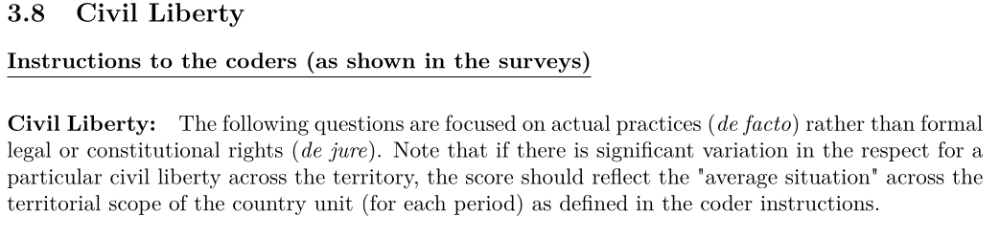

---
output:
  xaringan::moon_reader:
    css: ["default", "extra.css"]
    lib_dir: libs
    seal: false
    nature:
      highlightStyle: github
      highlightLines: true
      countIncrementalSlides: false
      ratio: '16:9'
---

```{r, echo = FALSE, warning = FALSE, message = FALSE}
library(tidyverse)
library(readxl)
library(stargazer)
library(kableExtra)
library(sf)
library(rnaturalearth)
library(rnaturalearthdata)
library(countrycode)

knitr::opts_chunk$set(echo = FALSE,
                      eval = TRUE,
                      error = FALSE,
                      message = FALSE,
                      warning = FALSE,
                      comment = NA)

d <- read_excel("../../Data/V-Dem/V-Dem-CY-Core_csv_v13/V_Dem_Personal_Integrity_Rights-1789-2022.xlsx", na = "NA")
```

background-image: url('libs/Images/00-Leviathan_Cover_55.png')
background-size: 100%
background-position: center
class: middle

.size70[**Today's Agenda**]

<br>

.size60[
.center[
Evaluate the V-Dem Varieties of Democracy Data project on "Personal Integrity Rights" 
]]

<br>

.center[.size40[
  Justin Leinaweaver (Fall 2023)
]]

???

### Prep for Class
1. ?


---

background-image: url('libs/Images/background-light_grey.jpg')
background-size: 100%
background-position: center
class: middle

.size45[**Paper 1**]

.size30[
If someone came to you with the goal of better understanding the use of political violence by governments around the world, which of the data sources that we explored in class would you recommend and why?

- The US State Department's "Country Reports on Human Rights Practices"

- **Amnesty International's "Annual Country Reports"**

- The Political Terror Scale (PTS)

- The CIRIGHTS data project's "Physical Integrity Rights"

- Varieties of Democracy's (V-Dem) "Personal Integrity Rights"
]

???

Last week and this one we are exploring and analyzing the data and research projects that exist to track political violence by states across time.


---

background-image: url('libs/Images/02_2-protestors_fire2.png')
background-size: 100%
background-position: center
class: middle

.size50[**Measuring "Political Violence"**]

.size45[
**1) Concept**

**2) Operationalization**

**3) Instrumentation**

**4) Measurement**
]

???

Refresh week 2 material from Brians et al (2011): concept -> operationalization ("The process of selecting observable phenomena to represent abstract concepts") -> instrumentation (
...the specification of steps to take in making observations") -> measurement ("The application of an instrument to assign numerical values to cases")


---

background-image: url('libs/Images/background-light_grey.jpg')
background-size: 100%
background-position: center
class: middle

.pull-left[

<br>

<br>

<br>

```{r, fig.align='center', out.width='100%'}
knitr::include_graphics('libs/Images/03_3-CIRIGHTS_Title.png')
```
]

.pull-right[
.size40[.center[The Physical Integrity Rights Index]

- Disappearance

- Extrajudicial Killing

- Political Imprisonment

- Torture
]
]

.center[.size40[Evaluate: Operationalization, Instrumentation, and Measurement]]

???

Refresher on our work from last class analyzing CIRIGHTS.

### Strengths and weaknesses of using the CIRIGHTS data to measure political violence around the world?

### Key takeaways for you next week as you write your country reports?

#### - How do the CIRIGHTS scores supplement your reading/analysis of the source docs?

#### - Any cautions you will want to include, e.g. caveats for helping the reader interpret the CIRIGHTS scores?


---

background-image: url('libs/Images/background-light_grey.jpg')
background-size: 100%
background-position: center
class: middle, center

.size45[.center[.content-box-white[**The V-Dem Varieties of Democracy**]]]

<br>

```{r, fig.align='center', out.width='85%'}

```

<br>

.size40[**Personal Integrity Rights**: Freedom from torture, Freedom from political killings, Freedom from forced labor (men/women)]

???

### Everybody ready for today's work?


---

background-image: url('libs/Images/background-light_grey.jpg')
background-size: 100%
background-position: center
class: middle

```{r, fig.align='center', out.width='35%'}

```

.size40[**Personal Integrity Rights**
- Freedom from Torture
- Freedom from Political Killings
- Freedom from Forced Labor (men)
- Freedom from Forced Labor (women)
]

.center[.size45[Evaluate: Operationalization, Instrumentation, and Measurement]]

???

The V Dem project...

For our purposes we'll focus primarily on the elements in the Personal Integrity Rights Index.

- Note how each country-year includes model generated ordinal score, 70% coverage (low to high) and the number of coders involved

<br>

Split class into groups (one group per category), build strengths and weaknesses lists on the board analyzing the codebook across these three categories: operationalization, instrumentation, measurement


### Groups: Take a few minutes to review the "Coding Protocol" on p8 in order to evaluate the validity and reliability of these measures.

<br>

Ok, report back.

### Any concerns with validity?

### Any concerns with reliability?


---

background-image: url('libs/Images/background-light_grey.jpg')
background-size: 100%
background-position: center
class: middle

```{r, fig.align='center', out.width='35%'}

```

.size40[**Personal Integrity Rights**
- Freedom from Torture
- Freedom from Political Killings
- Freedom from Forced Labor (men)
- Freedom from Forced Labor (women)
]

.center[.size45[Audit the Data (2021)]]

???

Let's now audit the data.

Everybody focus on the two countries you analyzed on Monday. 

- Consider the number of coders assigned to your country-year and the range of codings provided


### Would you have coded these the same way? Why or why not?

<br>

### Findings? Takeaways?

#### - Which variables seem the easiest to code / we have the most confidence in?

#### - Which the least?

<br>

### Notes
- ?


---

background-image: url('libs/Images/background-light_grey.jpg')
background-size: 100%
background-position: center
class: middle, center

.size70[
Is there any evidence of selection bias in the V-Dem "Personal Integrity Rights" measures in 2022 (most recent year coded)? 
]

???

Use the autofilter to zoom in on 2022 only

Then scroll through and talk to me about the kinds of countries with missing data in the three measures.


---

class: slideblue, middle, full

```{r, fig.retina=3, fig.align='center', out.width='95%', fig.height=6, fig.width=10, cache=FALSE}
## Make a map
## Use rnaturalearth to define world map data
worldmap <- ne_countries(scale = 'medium', type = 'countries', returnclass = 'sf')

# Subset data
d2022 <- d |>
  filter(year == 2022)

# Identify merging country label
# guess_field(d2022$country_name) # vdem.name 98.9%
# guess_field(d2022$country_text_id) # wb 98%, iso3c 97.8%
# guess_field(d2022$COWcode) # cown 100%
# guess_field(worldmap$adm0_a3) #95.8% iso3c

d2022$newcode1 <- countrycode(d2022$COWcode, origin = "cown", destination = "iso3c")

# Summarize data
d22_NA <- d2022 |>
  select(newcode1, country_name, v2cltort_ord, v2clkill_ord, v2clslavem_ord, v2clslavef_ord) |>
  mutate(
    Missing = if_else(is.na(v2cltort_ord) | is.na(v2clkill_ord) | is.na(v2clslavem_ord) | is.na(v2clslavef_ord), 1, 0)
  )

# Merge data
d10 <- left_join(worldmap, d22_NA, by = c("adm0_a3" = "newcode1"))

# Audit missing data
# d22_NA |>
#   select(country_name, v2cltort_ord, v2clkill_ord, v2clslavem_ord, v2clslavef_ord, Missing) |>
#   View()
# 
# tibble(d10) |>
#   select(name, Missing) |>
#   filter(is.na(Missing)) |>
#   print(n = 100)
# 
# tibble(d10) |> count(Missing)

d10$Missing[d10$name == "Kosovo"] <- 0
d10$Missing[d10$name == "S. Sudan"] <- 0
d10$Missing[d10$name == "Serbia"] <- 0

d10 |>
  mutate(
    Missing = if_else(is.na(Missing), "Missing Data", "Data Collected")
  ) |>
  ggplot() +
  geom_sf(aes(fill = factor(Missing))) +
  labs(fill = "", title = "V-Dem Missing Data (2022)") +
  theme(legend.position = "bottom") +
  scale_fill_brewer(type = "div", palette = 2, direction = -1)
```

???


---

background-image: url('libs/Images/background-light_grey.jpg')
background-size: 100%
background-position: center
class: middle, center

.size70[
How much do the measures overlap in 2022? 

Do we need all four sub-measures to accurately reflect government violence against individuals? 
]

???


---

class: middle, slideblue

.center[.size55[.content-box-white[**Correlations Across the Measures**]]]

<br>

```{r, fig.align='center'}
d2022 |>
  select(v2cltort_ord, v2clkill_ord, v2clslavem_ord, v2clslavef_ord) |>
  cor() |>
  kbl(digits = 2, align = c(rep('c', 5))) |>
  column_spec(column = 1:5, width = "5em") |>
  kable_styling(font_size = 32)
```

???

Measure of linear association

- Torture and killing correlate VERY highly

- Forced labor for men and women also correlate very highly


---

background-image: url('libs/Images/background-light_grey.jpg')
background-size: 100%
background-position: center
class: middle, center

.size70[
What are the most common scores across the four sub-measures?
]

???


---

class: full, slideblue

```{r, fig.align='center', fig.retina=3, fig.asp=0.618, out.width='98%', fig.width=8, cache=TRUE}
d2022 |>
  select(v2cltort_ord, v2clkill_ord, v2clslavem_ord, v2clslavef_ord) |>
  pivot_longer(cols = v2cltort_ord:v2clslavef_ord, names_to = "Measure", values_to = "Values") |>
  group_by(Measure) |>
  count(Values) |>
  mutate(
    Values = case_when(
      Values == 0 ~ "Score 0",
      Values == 1 ~ "Score 1",
      Values == 2 ~ "Score 2",
      Values == 3 ~ "Score 3",
      Values == 4 ~ "Score 4"
    )
  ) |>
  ggplot(aes(x = Measure, y = n, fill = Values)) +
  geom_col(position = "dodge", color = "grey", width = .6) +
  theme_bw() +
  #scale_fill_manual(values = c("red", "orange", "green3"))
  scale_fill_brewer(type = "div", palette = 5) +
  scale_x_discrete(limits = c("v2cltort_ord", "v2clkill_ord", "v2clslavem_ord", "v2clslavef_ord"), labels = c("Torture", "Killings", "Forced Labor (M)", "Forced Labor (W)")) +
  labs(x = "", y = "Count", fill = "",
       title = "Personal Integrity Rights",
       caption = "Source: V-Dem 2022")
```

???

```{r}
d2022 |>
  select(v2cltort_ord, v2clkill_ord, v2clslavem_ord, v2clslavef_ord) |>
  pivot_longer(cols = v2cltort_ord:v2clslavef_ord, names_to = "Measure", values_to = "Values") |>
  group_by(Measure) |>
  count(Values) |>
  pivot_wider(names_from = Values, values_from = n, names_prefix = "Score ") |>
  kbl(align = 'c') |>
  column_spec(column = 1:4, width = "3em")
```


---

background-image: url('libs/Images/background-light_grey.jpg')
background-size: 100%
background-position: center
class: middle, center

.size70[
Have the utilization rates for the types of violations varied across time?
]

???


---

class: middle, full

```{r, fig.retina=3, out.width='97%', fig.width=7.5, fig.align='center', fig.asp=0.618}
## You make a line plot of averages across time for each measure
d |>
  select(country_name, country_text_id, year, "Torture" = v2cltort_ord, "Killings" = v2clkill_ord, "Forced_male" = v2clslavem_ord, "Forced_fem" = v2clslavef_ord) |>
  filter(year >= 1980) |>
  pivot_longer(cols = Torture:Forced_fem, names_to = "Variables", values_to = "Values") |>
  group_by(year, Variables) |>
  summarize(
    Mean = mean(Values, na.rm = TRUE)
  ) |>
  ungroup() |>
  ggplot(aes(x = year, y = Mean, color = Variables)) +
  geom_line(size = 1.2) +
  theme_bw() +
  labs(x = "", y = "Mean Values",
       title = "Tracking Personal Integrity Rights Averages Across Time",
       caption = "Source: V-Dem",
       color = "") +
  coord_cartesian(ylim = c(0,4), xlim = c(1980, 2022)) +
  scale_y_continuous(breaks = 0:4, labels = 0:4)  +
  theme(legend.position = "bottom") +
  #guides(color = "none") +
  scale_color_brewer(type = "qual", palette = 2)

## Box plots across time
d |>
  filter(year >= 1980) |>
  ggplot(aes(x = factor(year), y = v2cltort_ord)) +
  geom_boxplot()
```

???


---

background-image: url('libs/Images/background-light_grey.jpg')
background-size: 100%
background-position: center
class: middle, center

.size70[
Any countries with a current torture score ('v2cltort_ord') that challenges your intuitions? 
]

???

Given the high correlation between torture and killing this should represent both fairly well.


---

class: slideblue, middle, full

```{r, fig.retina=3, fig.align='center', out.width='95%', fig.height=6, fig.width=10, cache=FALSE}
## Make a map

d2022$newcode1 <- countrycode(d2022$COWcode, origin = "cown", destination = "iso3c")

# # Summarize data
# d22_NA <- d2022 |>
#   select(newcode1, country_name, v2cltort_ord, v2clkill_ord, v2clslavem_ord, v2clslavef_ord) |>
#   mutate(
#     Missing = if_else(is.na(v2cltort_ord) | is.na(v2clkill_ord) | is.na(v2clslavem_ord) | is.na(v2clslavef_ord), 1, 0)
#   )

# Merge data
d11 <- left_join(worldmap, d2022, by = c("adm0_a3" = "newcode1"))

# Audit missing data
# d2022 |>
#   select(country_name, v2cltort_ord) |>
#   View()
# 
# tibble(d11) |>
#   select(name, v2cltort_ord) |>
#   filter(is.na(v2cltort_ord)) |>
#   print(n = 100)

d11$v2cltort_ord[d11$name == "Kosovo"] <- 3
d11$v2cltort_ord[d11$name == "S. Sudan"] <- 1
d11$v2cltort_ord[d11$name == "Serbia"] <- 3

d11 |>
  ggplot() +
  geom_sf(aes(fill = factor(v2cltort_ord))) +
  labs(fill = "", title = "Freedom from Torture (V-Dem 2022)") +
  theme(legend.position = "right") +
  scale_fill_brewer(type = "div", palette = 5, na.value="darkgrey")
```

???


---

background-image: url('libs/Images/background-light_grey.jpg')
background-size: 100%
background-position: center
class: middle, center

.size70[
Any countries with a current Freedom from Forced Labor (women) score ('v2clslavef_ord') that challenges your intuitions? 
]

???

Given the high correlation between the male and female scores this should represent both fairly well.


---

class: slideblue, middle, full

```{r, fig.retina=3, fig.align='center', out.width='95%', fig.height=6, fig.width=10, cache=FALSE}
## Make a map

# Audit missing data
# d2022 |>
#   select(country_name, v2clslavef_ord) |>
#   View()
# 
# tibble(d11) |>
#   select(name, v2clslavef_ord) |>
#   filter(is.na(v2clslavef_ord)) |>
#   print(n = 100)

d11$v2clslavef_ord[d11$name == "Kosovo"] <- 3
d11$v2clslavef_ord[d11$name == "S. Sudan"] <- 1
d11$v2clslavef_ord[d11$name == "Serbia"] <- 3

d11 |>
  ggplot() +
  geom_sf(aes(fill = factor(v2clslavef_ord))) +
  labs(fill = "", title = "Freedom from Forced Labor (women) (V-Dem 2022)") +
  theme(legend.position = "right") +
  scale_fill_brewer(type = "div", palette = 5, na.value="darkgrey")
```

???


---

background-image: url('libs/Images/background-light_grey.jpg')
background-size: 100%
background-position: center
class: middle

.size55[
Focus on the years since 2001 and find us examples of countries that have:

  + Improved the most, and
  
  + Regressed the most across the years in the sample
]

???


---

class: slideblue, middle, full

```{r, fig.retina=3, fig.align='center', out.width='95%', fig.height=6, fig.width=10, cache=FALSE}
## Make a map

# Summarize data
d_diffs <- d |>
  filter(year %in% c(2001, 2022)) |>
  select(country_name, COWcode, year, v2cltort_ord) |>
  pivot_wider(names_from = year, values_from = v2cltort_ord, names_prefix = "torture_") |>
  mutate(
    Difference = torture_2022 - torture_2001
  )

d_diffs$newcode1 <- countrycode(d_diffs$COWcode, origin = "cown", destination = "iso3c")

# Merge data
d12 <- left_join(worldmap, d_diffs, by = c("adm0_a3" = "newcode1"))

# Audit missing data
# d_diffs |>
#   select(country_name, Difference) |>
#   View()
# 
# tibble(d12) |>
#   select(name, Difference) |>
#   filter(is.na(Difference)) |>
#   print(n = 100)

d12$Difference[d12$name == "Kosovo"] <- 0
#d12$Difference[d12$name == "S. Sudan"] <- xxx
d12$Difference[d12$name == "Serbia"] <- -1

d12 |>
  ggplot() +
  geom_sf(aes(fill = factor(Difference))) +
  labs(fill = "", title = "Changes in Freedom from Torture (V-Dem 2001 to 2022)") +
  theme(legend.position = "right") +
  scale_fill_brewer(type = "div", palette = 5, na.value="darkgrey")
```

???


---

class: slideblue, middle, full

```{r, fig.retina=3, fig.align='center', out.width='95%', fig.height=6, fig.width=10, cache=FALSE}
## Make a map

# Summarize data
d_diffs2 <- d |>
  filter(year %in% c(2001, 2022)) |>
  select(country_name, COWcode, year, v2clslavef_ord) |>
  pivot_wider(names_from = year, values_from = v2clslavef_ord, names_prefix = "forced_") |>
  mutate(
    Difference = forced_2022 - forced_2001
  )

d_diffs2$newcode1 <- countrycode(d_diffs2$COWcode, origin = "cown", destination = "iso3c")

# Merge data
d13 <- left_join(worldmap, d_diffs2, by = c("adm0_a3" = "newcode1"))

# Audit missing data
# d_diffs2 |>
#   select(country_name, Difference) |>
#   View()
# 
# tibble(d13) |>
#   select(name, Difference) |>
#   filter(is.na(Difference)) |>
#   print(n = 100)

d13$Difference[d13$name == "Kosovo"] <- 0
#d13$Difference[d13$name == "S. Sudan"] <- xxx
d13$Difference[d13$name == "Serbia"] <- -1

d13 |>
  ggplot() +
  geom_sf(aes(fill = factor(Difference))) +
  labs(fill = "", title = "Changes in Freedom from Forced Labor (women) (V-Dem 2001 to 2022)") +
  theme(legend.position = "right") +
  scale_fill_brewer(type = "div", palette = 5, na.value="darkgrey")
```

???


---

background-image: url('libs/Images/background-light_grey.jpg')
background-size: 100%
background-position: center
class: middle

.center[.size55[**Measuring Political Violence by Countries**]]

.size40[
Sources: 
- Amnesty International and the US State Department

Measures:
- The Political Terror Scale (PTS)
- The CIRIGHTS Data project
- The V-Dem Data project
]


???

### Bottom line, how reliable and valid are the measures of state political violence represented by the research projects we've explored this week?

#### - Strengths of existing sources and measures?

#### - Weaknesses of existing sources and measures?

<br>

NEXT CLASS: Get to work on the first paper.

- Compare and contrast across all sources!


