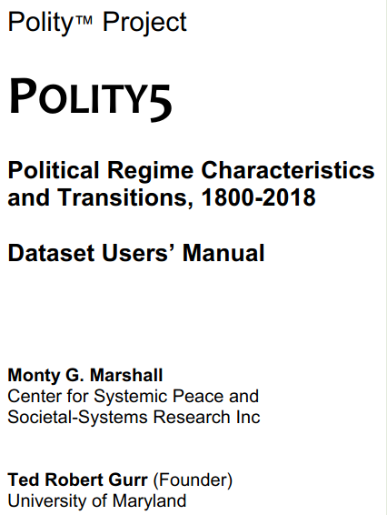
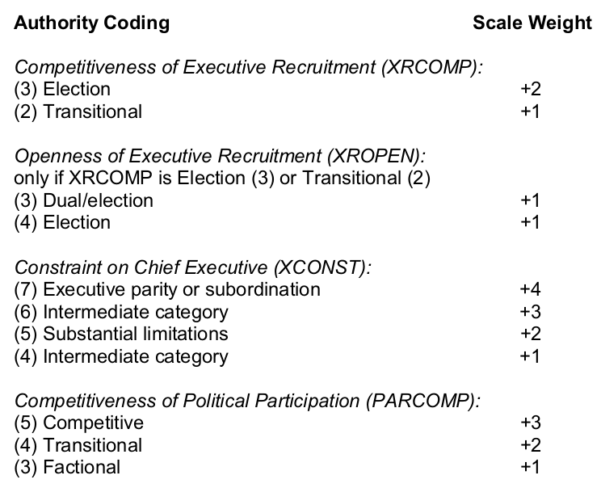
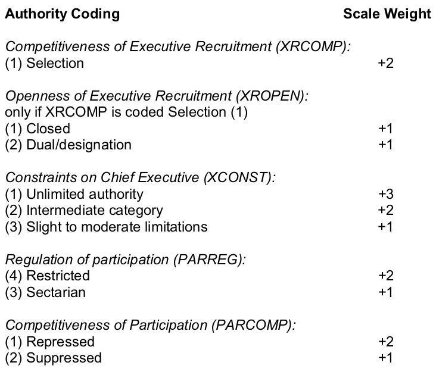

---
output:
  xaringan::moon_reader:
    css: ["default", "extra.css"]
    lib_dir: libs
    seal: false
    nature:
      highlightStyle: github
      highlightLines: true
      countIncrementalSlides: false
      ratio: '16:9'
---

```{r, echo = FALSE, warning = FALSE, message = FALSE}
##xaringan::inf_mr()
## For offline work: https://bookdown.org/yihui/rmarkdown/some-tips.html#working-offline
## Images not appearing? Put images folder inside the libs folder as that is the main data directory

library(tidyverse)
library(readxl)
library(stargazer)
##library(kableExtra)
##library(modelr)

knitr::opts_chunk$set(echo = FALSE,
                      eval = TRUE,
                      error = FALSE,
                      message = FALSE,
                      warning = FALSE,
                      comment = NA)
```

class: slideblue

.size70[**Today's Agenda**]

<br>

.size50[.center[
Explore the Polity5 Project

*Political Regime Characteristics and Transitions, 1800-2018*
]]

<br>

.center[.size40[
  Justin Leinaweaver (Spring 2022)
]]

???

### Prep for Class
1. ...

<br>

Get organized as you come in!

Make sure you have the data and codebook open and are ready to work with them.


---

background-image: url('libs/Images/background-red.png')
background-size: 100%
background-position: center
class: middle, center, inverse

.size60[**What explains the variation in how and why states use violence against their citizens?**]

<br>

.size45[
The state IS violence (Weber)

vs

We NEED the state to use violence (Olson)

]

???

In this secton of the course we've begun building out the tools we need to answer this question.

Last week we examined two theoretical frameworks that each aimed to help us understand the relationship between "the state" and "violence."

WHAT STUCK WITH YOU FROM LAST WEEK?

- ANYTHING USEFUL?

<br>

Clearly our investigation of violence by states will require us to spend some time digging into the institutions that make up states.


---

background-image: url('libs/Images/06_1-polity5.png')
background-size: 40%
background-position: center
class: slideblue

???

Let's start big picture. 

The polity variable is probably the most used measure of regime type in the academic literature.

+ By the end of today you'll have a better sense of what that means for our understanding of state behavior.

<br>

OK, PER PAGE 1 OF THE CODEBOOK, WHAT IS A 'POLITY' ACCORDING TO THIS PROJECT AND WHY DO THEY PREFER THAT CONCEPT TO 'THE STATE'?

(SLIDE)


---

class: middle, slideblue

# What is a polity?
.size35[
+ All 'Polities' (or governments) are examples of 'authority patterns'.

+ 'Authority patterns' are "a set of asymmetric relations among hierarchically ordered members of a social unit that involves the  direction of the unit.'

+ 'Direction of the unit' involves defining its goals, regulating the conduct of its members and allocating / coordinating the roles within it.
]

???

CAN ANYBODY TRANSLATE THIS INTO ENGLISH FOR US?

(This sounds a lot like a super fancy way of explaining what a government does.)

- Hierarchy: It is above the people
- Asymmetric relations: It has powers over you that you don't have over it
- Defines goals, makes rules and appoints officers

<br>

SO, WHY DON'T THEY JUST REFER TO THEIR PROJECT AS ANALYZING STATES?

- ISN'T EACH ROW OF THEIR DATA NAMED FOR A COUNTRY ANYWAY?

(1. It avoids the problem of having to settle disputes over recognized vs unrecognized states.)

(2. It makes coding easier in cases with disputed authority/fragmentation. Focus on a specific pattern of authority)


*Notes*

+ Areas within a state's "territorial space may be removed and secured from central state control by organized rebel and/or foreign forces or through the benign or malignant neglect of central authorities.

+ These separate areas may be  effectively  administered  by  traditional,  separatist,  or  revolutionary  authorities  and,  thus, constitute separate polities that operate outside the legally recognized polity of the state (non-state or  anti-state  actors).


---

class: slideblue

.pull-left[
```{r, out.width='90%', fig.align='center'}

```
]


.pull-right[

<br>

<br>

<br>

.size40[
**Key Concepts** (p14-16)

+ "Institutionalized Democracy"

+ "Institutionalized Autocracy"
]]

???

Ok, hopefully this will all get clearer as we dig into the regime type classifications.

The first paragraph under each subsection (democracy and autocracy) defines the two regime types.

Everybody read these so we can discuss them.

Don't worry about the component measures yet. 

WHAT ARE THE PROS AND CONS OF DEFINING DEMOCRACY AND DICTATORSHIP THESE WAYS?

- ANYTHING IMPORTANT YOU WOULD ARGUE IS MISSING? 

<br>

(e.g. civil liberties? Or does the guarantee of meaningful participation include these things automatically)


---

class: middle, slideblue

.pull-left[
.size70[.center[**Democ**]]

<br>

```{r, out.width='100%', fig.align='center'}

```
]

.pull-right[
.size70[.center[**Autoc**]]

<br>

```{r, out.width='100%', fig.align='center'}

```
]

???

Now let's talk about the component measures (p20-29).

These two sets of coding rules represent the operationalizations for each concept.

In Pairs: Everybody take a few minutes to evaluate these.

HOW CONFIDENT ARE YOU THAT THESE INDICES WILL PRODUCE VALID AND RELIABLE MEASURES OF EACH REGIME TYPE?

- WHICH COMPONENTS DO YOU BELIEVE WILL BE EASIEST TO CODE?

- WHICH THE HARDEST? WHY?


---

background-image: url('libs/Images/06_1-polity_formula.png')
background-size: 100%
background-position: center

???

As I noted before, the polity score (polity2 specifically) is probably the most used measure of regime type in the academic literature.

It is calculated by subtracting the Autoc score from the Democ score for each state in each year.

<br>

Before we dig into the data, one important note to discuss.

EVERYBODY READ THE ENTRY ON P16-17 '2.4 POLITY' AND EXPLAIN TO ME THEIR HUGE AND FREQUENTLY OVERLOOKED NOTE OF CAUTION.

(Autocracy and democracy are NOT the opposite ends of some linear dimension, they cover overlapping institutional designs especially in the middle of the polity2 scale) 

"Note: The POLITY score was added to the Polity IV data series in **recognition of its common usage by users in quantitative research** and in the overriding interest of maintaining uniformity among users in this application. The simple combination of the original DEMOC and AUTOC index values in a unitary POLITY scale, in many ways, **runs contrary to the original theory** stated by Eckstein and Gurr in Patterns of Authority (1975) and, so, should be treated and interpreted with due caution Its primary utility is in investigative research which should be augmented by more detailed analysis. **The original theory posits that autocratic and democratic authority are distinct patterns of authority, elements of which may co-exist in any particular regime context**. The inclusion of this variable in the data series should not be seen as an acceptance of the counter-proposal that autocracy and democracy are alternatives or opposites in a unified authority spectrum, even though elements of this perspective may be implied in the original theory. The POLITY variable provides a convenient avenue for examining general regime effects in analyses but **researchers should note that the middle of the implied POLITY “spectrum” is somewhat muddled in terms of the original theory, masking various combinations of DEMOC and AUTOC scores with the same POLITY score**. Investigations involving hypotheses of varying effects of democracy and/or autocracy should employ the original Polity scheme and test DEMOC and AUTOC separately."

<br>

Alright, let's examine the US experience with these measures and see what we can learn.

Everybody filter the data to focus on the US scores.


---

```{r, fig.retina=3, fig.align='center', out.width='97%', fig.asp=0.618, fig.width=6}
##input the data
d <- readxl::read_excel("Data/p5v2018.xls", na = ".")

## Focus on US
d_usa <- d |> 
  filter(scode == "USA", year > 1788) |>
  select(country, year, democ, autoc, polity2, xrcomp, xropen, xconst, parcomp, parreg)

## Visualize polity
ggplot(d_usa, aes(x = year, y = polity2)) +
  geom_line() +
  theme_bw() +
  labs(x = "", y = "Polity Scores", title = "The United States") +
  scale_x_continuous(breaks = seq(1780, 2020, 20)) +
  scale_y_continuous(breaks = 0:10) +
  geom_hline(yintercept = 7, linetype = "dashed", color = "red")
```

???

Talk to me about our Polity score across time.

I would note that many researchers treat polity scores of 7 or greater as democracies.

SO, AT WHAT POINTS WERE WE NOT A DEMOCRACY?

+ (pre 1825)
+ (1860s)
+ (2020)

<br>

WHEN DID WOMEN GET THE VOTE? (1921)

- WHY DOESN'T THAT APPEAR TO INFLUENCE THE US AS A DEMOCRACY ACCORDING TO POLITY?

<br>

WHEN DID THE RIGHT TO VOTE GET ENFORCED ACROSS THE COUNTRY FOR AFRICAN AMERICANS? (1964 civil rights act)

- WHY DOESN'T THAT HURT OUR DEMOCRACY SCORE?


---

```{r, fig.retina=3, fig.align='center', out.width='100%', fig.asp=.618, fig.width=6}
## Visualize autoc and democ
d_usa |>
  select(year, democ, autoc) |>
  pivot_longer(cols = democ:autoc, names_to = "Component", values_to = "Values") |>
  mutate(
    Values = if_else(Values %in% c(-77, -88), NA_real_, Values),
    Component = if_else(Component == "autoc", "Autocracy", "Democracy")
  ) |>
  ggplot(aes(x = year, y = Values, color = Component)) +
  geom_line(size = 1.15) +
  coord_cartesian(ylim = c(0, 10)) +
  theme_bw() +
  labs(x = "", y = "", title = "The United States") +
  scale_x_continuous(breaks = seq(1780, 2020, 20)) +
  scale_y_continuous(breaks = 0:10) +
  scale_color_manual(values = c("red", "blue")) +
  guides(color = "none") +
  annotate("text", x = 1997, y = 1, label = "Autocracy", color = "red") +
  annotate("text", x = 1997, y = 7, label = "Democcracy", color = "blue")
```

???

Ok, let's go deeper one level.

WHAT DO WE LEARN ABOUT THE US EXPERIENCE FROM THE DEMOC AND AUTOC INDICES SEPARATELY PLOTTED?

<br>

WHAT DO WE LEARN ABOUT THE USEFULNESS OF THE SEPARATE MEASURES AS OPPOSED TO THE COMBINED POLITY SCORE?


---

```{r, fig.retina=3, fig.align='center', out.width='100%', fig.asp=.618, fig.width=6}
## Visualize the components
d_usa |>
  select(year, xrcomp:parreg) |>
  pivot_longer(cols = xrcomp:parreg, names_to = "Component", values_to = "Values") |>
  mutate(
    Values = if_else(Values %in% c(-77, -88), NA_real_, Values)
  ) |>
  ggplot(aes(x = year, y = Values)) +
  geom_line() +
  facet_wrap(~ Component) +
  theme_bw() +
  labs(x = "", y = "", title = "The United States") +
  scale_y_continuous(breaks = 0:7)
```

???

SO, WHAT SPECIFIC THINGS HAVE CHANGED IN THE US EXPERIENCE OVER TIME?

(It appears that parcomp and parreg hold the bulk of the changes, BUT xconst is killing us since Trump's election.)

<br>

Let's now help the Polity researchers out! 

PAIRS: I want you to code the US for 2021 for all five component measures.

<br>

*Report back and discuss*


---

class: middle, slideblue

.size60[.center[**Predict the Future!**]]

<br>

.size50[
Project the US scores for ten years from now (2031)

+ xrcomp, xropen, xconst, parcomp and parreg

]

???

Let's extend our analyses into the future!

Small groups: I want you to code the US for ten years from now (2031) for all of the component measures

WHERE DO YOU BELIEVE WE'LL BE AND WHY?

*Report back and discuss*


---

class: middle, center, slideblue

.size60[**For Wednesday**]

.size50[
Bring to class a real-world case that provides an example of an autocratic state (dictatorship) government using violence against its own citizens (cannot be one of the cases from last week).
]

???

Let the polity scores guide you in choosing case studies this week. 

For Wednesday use the autoc index and Friday the democ


