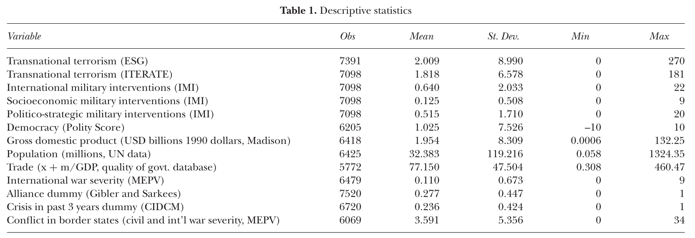

---
output:
  xaringan::moon_reader:
    css: ["default", "extra.css"]
    lib_dir: libs
    seal: false
    nature:
      highlightStyle: github
      highlightLines: true
      countIncrementalSlides: false
      ratio: '16:9'
---

```{r, echo = FALSE, warning = FALSE, message = FALSE}
library(tidyverse)
library(readxl)
library(stargazer)
library(kableExtra)
##library(modelr)

knitr::opts_chunk$set(echo = FALSE,
                      eval = TRUE,
                      error = FALSE,
                      message = FALSE,
                      warning = FALSE,
                      comment = NA)

# Combined data
d <- read_excel("../../Data/Combined_PTS_CIRIGHTS_VDem-2011-2020.xlsx", na = "NA")
```

background-image: url('libs/Images/00-Leviathan_Cover_55.png')
background-size: 100%
background-position: center
class: middle

.size70[**Today's Agenda**]

<br>

.size60[
Let's Use All this Data!

- Getting to Work on Paper 2
]

<br>

.center[.size40[
  Justin Leinaweaver (Fall 2023)
]]

???

### Prep for Class
1. You may want the combined dataset on the classroom PC


---

background-image: url('libs/Images/background-blue_triangles2.png')
background-size: 100%
background-position: center
class: middle

.size40[.content-box-white[**Paper 1**]]

.size35[
If someone came to you with the goal of better understanding the use of political violence by governments around the world, which of the data sources that we explored in class would you recommend and why? 

Your report should introduce each source to the reader with your analysis of its strengths and weaknesses. 

Ultimately, your central argument should be a clear recommendation of which source(s) they should focus on.
]

???

Last two weeks we have been exploring and analyzing the data and research projects that exist to track political violence by governments

<br>

We've been thorough and I'll bet you now have a strong sense of this data's strengths and weaknesses.

<br>

**SLIDE**: In paper 2 you will have the opportunity to use your newfound expertise to analyze the world!


---

background-image: url('libs/Images/background-blue_triangles2.png')
background-size: 100%
background-position: center
class: middle

.size50[.content-box-white[**Paper 2**]]

<br>

.size40[
Write a report on the **two countries** you have been studying that analyzes their recent experience of political violence
]

???


---

background-image: url('libs/Images/background-blue_triangles2.png')
background-size: 100%
background-position: center
class: middle

.size50[.content-box-white[**Paper 2**]]

<br>

.size40[
Write a report on the **two countries** you have been studying that analyzes their recent experience of political violence

- **Section 1**: **Summarize AND analyze** the last eight years of political violence in your chosen countries (2015-2022) using **ALL FIVE of the data sources** reviewed in your first paper
]

???

Remember:

- All the sources means State Dept, AI, PTS, CIRIGHTS and V-Dem!

- You must provide context for your claims. Use those primary source documents!


---

background-image: url('libs/Images/background-blue_triangles2.png')
background-size: 100%
background-position: center
class: middle

.size45[.content-box-white[**Paper 2**]]

.size35[
Write a report on the **two countries** you have been studying that analyzes their recent experience of political violence

- **Section 1**: **Summarize AND analyze** the last eight years of political violence in your chosen countries (2015-2022) using **ALL FIVE of the data sources** reviewed in your first paper

- **Section 2**: Make an argument about what the **2022 PTS and CIRIGHTS codings** should be for your chosen countries based on the Country Reports on Human Rights Practices from the State Department and the AI country reports.
]

???

### Questions on the assignment?

<br>


---

background-image: url('libs/Images/background-slate_v2.png')
background-size: 100%
background-position: center
class: middle

.size50[.content-box-white[**Collect and Organize your Data**]

1. Create new spreadsheet

2. Filter each dataset (PTS, CIRIGHTS, V-Dem) to your two countries

3. Copy relevant rows to new spreadsheet

4. Merge rows to ensure country-year observations
]

???

Your first step is typically referred to as "Data Cleaning"

- Before you start analyzing you need to have your data organized

- Build a new spreadsheet that collects only the data relevant to your project

- e.g. all years and relevant variables for only your two countries

<br>

### Any questions on this process?

- Get to it!

- Once you finish your new dataset ask around and see who else could use some help!


---

background-image: url('libs/Images/background-slate_v2.png')
background-size: 100%
background-position: center
class: middle

.size55[.content-box-white[**Basic Data Analysis**]

1. Tables 

2. Bar Plots

3. Line Plots

4. Scatter Plots
]

???

We covered all of these tools in extensive detail in Data Analysis, but let's do a quick refresher


---

background-image: url('libs/Images/background-slate_v2.png')
background-size: 100%
background-position: center
class: middle

.size50[.content-box-white[**1. Tables**]]

<br>

```{r, echo = FALSE, fig.align = 'center', out.width = '100%'}

```

???

The most common use of tables in the academic literature is to give the reader a sense of the shape of the data (since they wont have access to it)

<br>

Typical summary or descriptive statistics table includes:

- Number of observations (N)

- Mean and Standard Deviation

- Range: Minimum and Maximum

<br>

This selection of statistics instantly tells you

- How much missing data in each variable, 

- How wide each distribution is, and
    - The range

- The shape of each distribution
    - Std Dev: platykurtic vs leptokurtic

<br>

### Why might you consider including a summary statistics table in your second paper?

- (**SLIDE**)


---

background-image: url('libs/Images/background-slate_v2.png')
background-size: 100%
background-position: center
class: middle

.size50[.content-box-white[**1. Tables**]]

<br>

```{r}
d_afg <- d |>
  filter(Country == "Afghanistan")

tibble(
  Physint_sum = c("All Obs", "Afghanistan"),
  N = c(nrow(d), nrow(d_afg)),
  Mean = c(mean(d$physint_sum, na.rm = TRUE), mean(d_afg$physint_sum, na.rm = TRUE)),
  Std_Dev = c(sd(d$physint_sum, na.rm = TRUE), sd(d_afg$physint_sum, na.rm = TRUE)),
  Min = c(min(d$physint_sum, na.rm = TRUE), min(d_afg$physint_sum, na.rm = TRUE)),
  Max = c(max(d$physint_sum, na.rm = TRUE), max(d_afg$physint_sum, na.rm = TRUE))
) |>
  kbl(digits = 1, align = c('l', rep('c', 5))) |>
  kable_styling(bootstrap_options = c("striped", "hover", "condensed", "responsive"), font_size = 40) |>
  column_spec(1:6, width = '8em')
```

???

Here I'm showing you the summary stats for all countries scores in physint_sum and comparing it to the average scores for Afghanistan.

### What does this comparison help us to see about Afghanistan?

<br>

(The summary stats on ALL of the data gives the reader the context for interpreting your country's average scores)

- e.g. Where does your country fit in the world's scores?

<br>

### Questions on using Tables in data analysis?


---

background-image: url('libs/Images/background-slate_v2.png')
background-size: 100%
background-position: center
class: middle

.size50[.content-box-white[**2. Bar Plots**]]

.pull-left[

<br>

```{r}
# Count of PTS_S
d2 <- d |>
  filter(Country == "Afghanistan", Year < 2016) |>
  mutate(
    PTS_S2 = case_when(
      PTS_S == 1 ~ "Level 1",
      PTS_S == 2 ~ "Level 2",
      PTS_S == 3 ~ "Level 3",
      PTS_S == 4 ~ "Level 4",
      PTS_S == 5 ~ "Level 5"
    ),
    PTS_S2 = factor(PTS_S2, levels = c("Level 1", "Level 2", "Level 3", "Level 4", "Level 5"))
  )

d2 |> 
  count(PTS_S2, .drop = FALSE) |>
  rename("PTS (State Dept)" = PTS_S2, "Count" = n) |>
  kbl(align = c('l', 'c')) |>
  kable_styling(bootstrap_options = c("striped", "hover", "condensed", "responsive"), font_size = 40) |>
  column_spec(1, width = '12em') |>
  column_spec(2, width = '4em')
```
]

.pull-right[
```{r, fig.retina=3, fig.asp=0.9, fig.align='center', out.width = '100%', fig.width=5.5}
## bar plot PTS_S
d |>
  filter(Country == "Afghanistan", Year < 2016) |>
  mutate(
    PTS_S2 = case_when(
      PTS_S == 1 ~ "Level 1",
      PTS_S == 2 ~ "Level 2",
      PTS_S == 3 ~ "Level 3",
      PTS_S == 4 ~ "Level 4",
      PTS_S == 5 ~ "Level 5"
    ),
    PTS_S2 = factor(PTS_S2, levels = c("Level 1", "Level 2", "Level 3", "Level 4", "Level 5"))
  ) |> 
  ggplot(aes(x = PTS_S2)) +
  geom_bar(fill = "gold2", width = .7) +
  ggthemes::theme_clean() +
  labs(x = "", y = "Physical Integrity Rights Index",
       title = "Physical Integrity Rights in Afghanistan (2011-2015)") +
  scale_x_discrete(limits = c("Level 1", "Level 2", "Level 3", "Level 4", "Level 5")) +
  scale_y_continuous(breaks = seq(0, 5, 1))
```
]

???

When summarizing a categorical variable you are limited basically to counting its level.

- These counts can then be presented as either a table or bar plot

<br>

While the PTS scores are presented as numbers in the spreadsheet, each actually represents a distinct category of "political terror"

- It is risky to assume the differences between each category is the same (e.g. moving from level 1 to level 2 may not be as "big" as a move from level 4 to level 5).

<br>

Here I hope you see that a bar plot is much more useful visualization tool than the table.

<br>

### Any obvious conclusions about Afghanistan over this period according to this analysis?


---

background-image: url('libs/Images/background-slate_v2.png')
background-size: 100%
background-position: center
class: middle

.size50[.content-box-white[**3. Line Plots**]]

```{r, fig.retina=3, fig.asp=0.618, fig.align='center', out.width = '80%', fig.width=7}
## line plot physint across time
d |>
  filter(Country == "Afghanistan", Year < 2016) |>
  ggplot(aes(x = Year, y = physint_sum)) +
  geom_line(color = "blue", size = 1.3) +
  ggthemes::theme_clean() +
  labs(x = "", y = "Physical Integrity Rights Index",
       title = "Physical Integrity Rights in Afghanistan (2011-2015)") +
  scale_y_continuous(limits = c(0,8)) +
  scale_x_continuous(breaks = seq(2011, 2015, 1))
```

???

Line plots are a a useful technique for visualizing a single variable across time.

- Preferable if the data is numeric, but not totally  misleading if applied to categories like physint_sum.

- In Excel highlight the column and insert a line-plot chart

<br>

### Any obvious conclusions from this viz?


---

background-image: url('libs/Images/background-slate_v2.png')
background-size: 100%
background-position: center
class: middle

.size50[.content-box-white[**4. Scatter Plots**]]

```{r, fig.retina=3, fig.asp=0.9, fig.align='center', out.width = '55%', fig.width=6}
## scatter plot 
d |>
  ggplot(aes(x = physint_sum, y = PTS_S)) +
  geom_jitter() +
  ggthemes::theme_clean() +
  labs(x = "Physical Integrity Rights Index", y = "Political Terror Scale (State Dept)", title = "PTS and V-Dem Broadly Agree with Each Other (2011 - 2022)")
```

???

The last comonly used tool is a scatter plot and is useful for visualizing the relationship between two numeric variables.

- Each point on a scatter plot corresponds to a single observation in the dataset (country-year has this score on each variable)

- Note: I added "jitter" to the points to deal with overplotting

<br>

### Questions on this?


---

background-image: url('libs/Images/background-slate_v2.png')
background-size: 100%
background-position: center
class: middle

.size40[.center[.content-box-white[**Week 9 (Oct 16th)**]]

.center[**Prepare at least three conclusions about each country's experience of political violence (with visualizations)**]

1. Tables 

2. Bar Plots

3. Line Plots

4. Scatter Plots
]

???

Be ready to present and get feedback on your proposed conclusions for the second paper.

### Questions on the assignment?


---

background-image: url('libs/Images/background-blue_triangles.jpg')
background-size: 100%
background-position: center

class: middle

.size55[.content-box-white[**For Paper 2**]]
.size50[
- Week 9 (Oct 16th): Have your data visualizations completed and ready to present
]

<br>

.size55[.content-box-white[**For Next Class**]]
.size50[
- Davenport and Armstrong (2004)
]

???