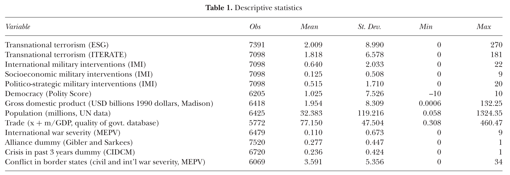

## Today's Agenda {background-image="Images/00-Leviathan_Cover_55.png" .center}

```{r}
library(tidyverse)
library(readxl)
library(kableExtra)

# Combined data
d <- read_excel("../../Data/Combined_PTS_CIRIGHTS_VDem-2011-2024.xlsx", na = "NA")
```

<br>

**II. How and why do governments use violence against the people inside their borders?**

- Connecting the dots from Paper 1 to Paper 2

<br>

::: r-stack
Justin Leinaweaver (Fall 2025)
:::

::: notes
Prep for Class

1. Post combined dataset on Canvas

2. Set up Google sheet to claim countries
    
    - Log into Canvas on laptop so you can publish when we get to it

3. Bring combined dataset to class for classroom PC OR run slides off laptop

<br>

Last two weeks we have been exploring the data and research projects that measure political violence by governments

<br>

My hope is that at this point you have a much deeper appreciation for:

1. The complexity involved in studying political violence by governments, and

2. The strengths and weaknesses for the main data projects that exist to study it.

<br>

**SLIDE**: Paper 1 is due today

:::


## Paper 1 {background-image="Images/00-Leviathan_Cover_55.png" .center}

<br>

Which **SINGLE** data source would you recommend to someone interested in better understanding the use of political violence by governments around the world?

- Your thesis should be a clear recommendation for **ONE** of the sources and should be supported by **AT LEAST THREE distinct reasons** for your recommendation

- **A high quality recommendation** will also make clear **why** you are not recommending the other sources

::: notes

**Any final questions on the first paper?**

<br>

Our work in today is to set the table for Paper 2

- These paper assignments are designed to scaffold on each other

- You take what you learn from the first one and use that to do the second!

- It's the way most big accomplishments are completed

<br>

**SLIDE**: In paper 2 we shift from evaluating the data to evaluating the world!

:::


## {background-image="Images/00-Leviathan_Cover_55.png" .center}

::: {.r-fit-text}
**Paper 2: Political Violence Country Briefings**
:::

<br>

Select one country and analyze its government's use of political violence

- Must cover the most recently available **five years** of data

- Must reference **ALL FIVE** of the data sources

- Argument must include **three** distinct premises

- Two pages (**max**)

::: {.fragment}
- Do it 2x (2 countries x 2 pages = 4 pages)
:::

::: notes

Your second assignment is to prepare a briefing report

- e.g. you are a data analyst at a think tank, an NGO, an international organization or working in a government department

- Your boss, the policy principal, asks you for an analysis of the recent use of political violence by a specific government in the world

- Your job is to clearly and concisely give them your analysis in no more than two pages

- Your argument must have a thesis that is supported and explained by three distinct premises

<br>

The good news is, thanks to Paper 1 you are already well on your way to developing your expertise in the evidence!

- NOW your job is to use that evidence to make a clear and concise argument.

<br>

More details are on Canvas, but...

- **Any questions on the big picture of the assignment?**

<br>

**REVEAL**: One more hiccup

- You have to do it twice.

- Your boss needs the information for a big international negotiation!

<br>

**SLIDE**: No stalling, let's dive in

<br>

*The Prompt*

Paper 2: Political Violence Country Briefings

Select two countries (no overlapping cases in class) and analyze their government's recent use of political violence using the data sources we explored in class. For EACH country you must produce a separate TWO PAGE country briefing report that makes a clear argument supported by three distinct premises (2 countries x 2 pages = 4 pages total). 

Other Requirements:

- By "recent" I mean the most recent five years of available data
- You must include information from all five data sources we analyzed in class
- No duplication of cases in class (first-come, first-served)
- Must be submitted as a pdf document

:::


## {background-image="Images/00-Leviathan_Cover_55.png" .center}

::: {.r-fit-text}
**Paper 2: Political Violence Country Briefings**
:::

<br>

**First Steps**

1. Combined_PTS_CIRIGHTS_VDem-2011-2024.xlsx

2. Pick your countries (claim on Google Sheet)

3. Audit the data

::: notes

*Publish Google Sheet on Modules*

<br>

To make this easier for you I have posted a dataset on Canvas that merges all the sources together

- Everybody grab the data and open it up

<br>

First job is to claim countries

- Place your selections on the Google Sheet I just published on Canvas

<br>

NEXT, I need EVERYONE to audit the dataset for their two countries

- Did my merge code pull together the right results for your countries?

- Check a few of the observations for your countries in the separate datasheets we examined last week

<br>

**SLIDE**: Quick refreshed on what to do with this data

:::


## {background-image="Images/00-Leviathan_Cover_55.png" .center}

::: {.r-fit-text}
**Basic Data Analyses**

(e.g. ways to summarize and present data)

1. Tables 

2. Bar Plots

3. Line Plots

4. Scatter Plots

:::
::: notes

We covered all of these tools in extensive detail in Data Analysis, but let's do a quick refresher

:::


## 1. Tables {background-image="Images/00-Leviathan_Cover_55.png" .center}

{style="display: block; margin: 0 auto"}

::: notes

The most common use of tables in the academic literature is to give the reader a sense of the shape of the data (since they wont have access to it)

<br>

Typical summary or descriptive statistics table includes:

- Number of observations (N)

- Mean and Standard Deviation

- Range: Minimum and Maximum

<br>

This selection of statistics instantly tells you

- How much missing data in each variable, 

- How wide each distribution is, and
    - The range

- The shape of each distribution
    - Std Dev: platykurtic vs leptokurtic

<br>

### Why might you consider including a summary statistics table in your second paper?

- (**SLIDE**)

:::


## 1. Tables {background-image="Images/00-Leviathan_Cover_55.png" .center}

<br>

```{r}
d_afg <- d |>
  filter(Country == "Afghanistan")

tibble(
  Physint_sum = c("All Obs", "Afghanistan"),
  N = c(nrow(d), nrow(d_afg)),
  Mean = c(mean(d$`Physical Integrity Rights Index`, na.rm = TRUE), mean(d_afg$`Physical Integrity Rights Index`, na.rm = TRUE)),
  Std_Dev = c(sd(d$`Physical Integrity Rights Index`, na.rm = TRUE), sd(d_afg$`Physical Integrity Rights Index`, na.rm = TRUE)),
  Min = c(min(d$`Physical Integrity Rights Index`, na.rm = TRUE), min(d_afg$`Physical Integrity Rights Index`, na.rm = TRUE)),
  Max = c(max(d$`Physical Integrity Rights Index`, na.rm = TRUE), max(d_afg$`Physical Integrity Rights Index`, na.rm = TRUE))
) |>
  kbl(digits = 1, align = c('l', rep('c', 5))) |>
  kable_styling(bootstrap_options = c("striped", "hover", "condensed", "responsive"), font_size = 40) |>
  column_spec(1:6, width = '8em')
```

::: notes

Here I'm showing you the summary stats for all countries scores in `Physical Integrity Rights Index` and comparing it to the average scores for Afghanistan.

### What does this comparison help us to see about Afghanistan?

<br>

(The summary stats on ALL of the data gives the reader the context for interpreting your country's average scores)

- e.g. Where does your country fit in the world's scores?

<br>

### Questions on using Tables in data analysis?

:::


## 2. Bar Plots {background-image="Images/00-Leviathan_Cover_55.png" .center}

:::: {.columns}
::: {.column width="50%"}
```{r}
# Count of PTS_S
d2 <- d |>
  filter(Country == "Afghanistan", Year < 2016) |>
  mutate(
    PTS_S2 = case_when(
      PTS_S == 1 ~ "Level 1",
      PTS_S == 2 ~ "Level 2",
      PTS_S == 3 ~ "Level 3",
      PTS_S == 4 ~ "Level 4",
      PTS_S == 5 ~ "Level 5"
    ),
    PTS_S2 = factor(PTS_S2, levels = c("Level 1", "Level 2", "Level 3", "Level 4", "Level 5"))
  )

d2 |> 
  count(PTS_S2, .drop = FALSE) |>
  rename("PTS (State Dept)" = PTS_S2, "Count" = n) |>
  kbl(align = c('l', 'c')) |>
  kable_styling(bootstrap_options = c("striped", "hover", "condensed", "responsive"), font_size = 40) |>
  column_spec(1, width = '12em') |>
  column_spec(2, width = '4em')
```
:::

::: {.column width="50%"}
```{r, fig.retina=3, fig.asp=0.9, fig.align='center', out.width = '100%', fig.width=5.5}
## bar plot PTS_S
d |>
  filter(Country == "Afghanistan", Year < 2016) |>
  mutate(
    PTS_S2 = case_when(
      PTS_S == 1 ~ "Level 1",
      PTS_S == 2 ~ "Level 2",
      PTS_S == 3 ~ "Level 3",
      PTS_S == 4 ~ "Level 4",
      PTS_S == 5 ~ "Level 5"
    ),
    PTS_S2 = factor(PTS_S2, levels = c("Level 1", "Level 2", "Level 3", "Level 4", "Level 5"))
  ) |> 
  ggplot(aes(x = PTS_S2)) +
  geom_bar(fill = "gold2", width = .7) +
  ggthemes::theme_clean() +
  labs(x = "", y = "Physical Integrity Rights Index",
       title = "Physical Integrity Rights in Afghanistan (2011-2015)") +
  scale_x_discrete(limits = c("Level 1", "Level 2", "Level 3", "Level 4", "Level 5")) +
  scale_y_continuous(breaks = seq(0, 5, 1))
```
:::
::::

::: notes

When summarizing a categorical variable you are limited basically to counting its level.

- These counts can then be presented as either a table or bar plot

<br>

While the PTS scores are presented as numbers in the spreadsheet, each actually represents a distinct category of "political terror"

- It is risky to assume the differences between each category is the same (e.g. moving from level 1 to level 2 may not be as "big" as a move from level 4 to level 5).

<br>

Here I hope you see that a bar plot is much more useful visualization tool than the table.

<br>

### Any obvious conclusions about Afghanistan over this period according to this analysis?


:::


## 3. Line Plots {background-image="Images/00-Leviathan_Cover_55.png" .center}

```{r, fig.retina=3, fig.asp=0.618, fig.align='center', out.width = '80%', fig.width=7}
## line plot physint across time
d |>
  filter(Country == "Afghanistan", Year < 2016) |>
  ggplot(aes(x = Year, y = `Physical Integrity Rights Index`)) +
  geom_line(color = "blue", linewidth = 1.3) +
  ggthemes::theme_clean() +
  labs(x = "", y = "Physical Integrity Rights Index",
       title = "Physical Integrity Rights in Afghanistan (2011-2015)") +
  scale_y_continuous(limits = c(0,8)) +
  scale_x_continuous(breaks = seq(2011, 2015, 1))
```

::: notes

Line plots are a a useful technique for visualizing a single variable across time.

- Preferable if the data is numeric, but not totally  misleading if applied to categories like `Physical Integrity Rights Index`.

- In Excel highlight the column and insert a line-plot chart

<br>

### Any obvious conclusions from this viz?

:::


## 4. Scatter Plots {background-image="Images/00-Leviathan_Cover_55.png" .center}

```{r, fig.retina=3, fig.asp=0.9, fig.align='center', out.width = '55%', fig.width=6}
## scatter plot 
d |>
  ggplot(aes(x = `Physical Integrity Rights Index`, y = PTS_S)) +
  geom_jitter() +
  ggthemes::theme_clean() +
  labs(x = "Physical Integrity Rights Index", y = "Political Terror Scale (State Dept)", title = "PTS and V-Dem Broadly Agree with Each Other (2011 - 2024)")
```

::: notes

The last comonly used tool is a scatter plot and is useful for visualizing the relationship between two numeric variables.

- Each point on a scatter plot corresponds to a single observation in the dataset (country-year has this score on each variable)

- Note: I added "jitter" to the points to deal with overplotting

<br>

### Questions on this?

:::


## {background-image="Images/00-Leviathan_Cover_55.png" .center}

::: {.r-fit-text}
**Paper 2: Political Violence Country Briefings**
:::

<br>

Select TWO countries and analyze their government's use of political violence

- Must cover the most recently available **five years** of data

- Must reference **ALL FIVE** of the data sources

- Argument must include **three** distinct premises

- Two pages (**max**) per country

::: notes

Ok, so that's your next target.

- These two briefings will be due at the end of Week 9 (Oct 17th)

<br>

**Questions on what we discussed today or the assignment prompt?**

<br>

My plan to keep you moving forward:

- Each country briefing is an argument supported by three premises

- Each premise must be supported by evidence from the data

- **SLIDE**: So...

:::


## Monday, Oct 13th (Week 9) {background-image="Images/00-Leviathan_Cover_55.png" .center}

<br>

Submit an outline of each country briefing report

- One sentence thesis statement

- Each premise gets a one sentence explanation and a draft version of the data summary you intend to use to support it (e.g. a table or a visualization)

::: notes

We will work on these briefings in class during Week 9

- Your task for the first class of that week is to submit an outline of each briefing

- This gives you over two weeks to get organized for the reports

<br>

My advice, don't stall on this!

- Start making stuff and show it to me as you go

- I'm happy to provide feedback as you work

<br>

In class we'll review them all and give each other feedback

- **Questions on the assignment?**

<br>

Canvas Assignment (open the window for this from 2 weeks ago): Outlining your Country Briefings

Submit an outline for each of your two country briefings (e.g. two outlines).

- Each outline must begin with a one sentence thesis statement.
- Each premise (of the three) gets a complete sentence explaining it and a draft version of the data summary you intend to use to support it (e.g. a table or a visualization) 

:::


## For Next Class {background-image="Images/00-Leviathan_Cover_55.png" .center}

<br>

Davenport and Armstrong (2004) Democracy and the Violation of Human Rights: A Statistical Analysis from 1976 to 1996

- Read p538-543, then skim the analyses and conclusion

- Submit analysis on Canvas

::: notes

Next week we explore some of the academic literature on why democracies use political violence

- This will be your chance to see how experts in the field use the data we've been exploring to analyze the world

- Useful to see new models AND ideas for your country briefings!

<br>

**Questions on anything from today?**

<br>

Canvas Assignment: Analyzing the Davenport and Armstrong (2004) Argument

The article proposes three competing models to describe the relationship between democracy and human rights violations

1. In purely theoretical terms, meaning you should ignore the data analysis in the paper for this qustion, which model do you find the MOST convincing? Why? (3+ sentences)
2. In purely theoretical terms, which model do you find the LEAST convincing? Why? (3+ sentences)


:::