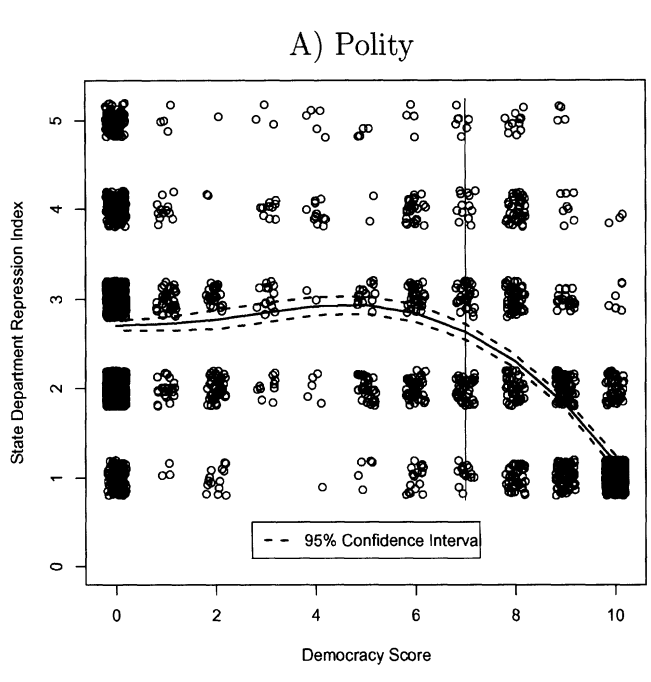

---
output:
  xaringan::moon_reader:
    css: ["default", "extra.css"]
    lib_dir: libs
    seal: false
    nature:
      highlightStyle: github
      highlightLines: true
      countIncrementalSlides: false
      ratio: '16:9'
---

```{r, echo = FALSE, warning = FALSE, message = FALSE}
##xaringan::inf_mr()
## For offline work: https://bookdown.org/yihui/rmarkdown/some-tips.html#working-offline
## Images not appearing? Put images folder inside the libs folder as that is the main data directory

library(tidyverse)
##library(readxl)
##library(stargazer)
##library(kableExtra)
##library(modelr)

knitr::opts_chunk$set(echo = FALSE,
                      eval = TRUE,
                      error = FALSE,
                      message = FALSE,
                      warning = FALSE,
                      comment = NA)
```

background-image: url('libs/Images/00-Leviathan_Cover_55.png')
background-size: 100%
background-position: center
class: middle

.center[.size35[**II. How and why do governments use violence against the people inside their borders?**]]

<br>

.size45[

**Today's Agenda**: Theories of "Political Violence"

- Davenport & Armstrong (2004) "Democracy and the Violation of Human Rights: A Statistical Analysis from 1976 to 1996"
]

<br>

.center[.size40[
  Justin Leinaweaver (Fall 2023)
]]

???

### Prep for Class
1. ,,,

<br>

Remember, our big goal for this section of the class is to answer this question.

- How and why do governments use violence against the people inside their borders?

<br>

For the next two weeks we shift our attempts to answer this question from evaluating data to evaluating models

- e.g. theoretical explanations for the violence we seen states using

<br>

This week we will focus on models of violence by "democratic" states

- Next week we will shift our focus to violence by "autocratic" states


---

background-image: url('libs/Images/07_1-Castle_Neuschwanstein.jpg')
background-size: 100%
background-position: center
class: bottom, center

.size40[.content-box-white[How do D&A (2004) frame their research project?]]

???

Let's start by talking about the framing of the article.

<br>

### Has anybody come across the framing concept before in other classes? What does framing in those contexts refer to?

(In political communications and psychology framing often refers to a way of presenting an issue to elicit a desired response)

+ No one drills for oil, they explore!

+ No one identifies as wanting to kill babies, they are pro-choice

+ No one identifies as being anti-woman, they are pro-life

<br>

### Make sense?

<br>

Framing is also a useful way to think about a research contribution.

- Every research paper represents a set of conclusions about the world.

- e.g. Here's what we know now that we didn't before.

<br>

In other words, here's my castle, isn't it stunning?

- This is what the title, the abstract, the introduction and the conclusion of a research paper are trying to sell you.


---

background-image: url('libs/Images/07_1-house_framing.jpg')
background-size: 100%
background-position: center
class: middle, center, inverse

???

The rest of the paper presents a careful discussion of how you built your castle.

- Every choice you make along the way has a MASSIVE impact on the end product.

- What makes our work "science" is that we are completely transparent about all of these choices.

### Still with me?

<br>

### What are the kinds of choices in any research article that relate to the most basic framing of the project?

1. (What is the question and how is it worded? By asking the question in this way, whose interests are you prioritizing? Who might you be leaving out?)

2. (How are you defining the big concepts?)

3. (What literature are you connected to? Which disciplines are you focusing on?)

<br>

### Does this make sense?

- The framing of the article represents HUGE choices made by the researchers before we get to any of what we might consider the analyses to be.

<br>

*SPLIT class into 3 GROUPS*

- Go sit with your group!


---

background-image: url('libs/Images/background-red_flipped.png')
background-size: 100%
background-position: center
class: middle, inverse

.size45[
.center[**Davenport & Armstrong (2004) "Democracy and the Violation of Human Rights: A Statistical Analysis from 1976 to 1996"**]]

.size45[
**Evaluate the Framing**

1. Research question

2. Key concepts

3. Connections to the literature
]

???

Let's start by exploring the framing of the article.

- GROUPS, take a few minutes and get ready to share your thoughts about the framing of this research paper

- Think BIG PICTURE, e.g. how the researchers set up their project

<br>

REPORT BACK and DISCUSS

<br>

#### Notes
- Research Q: "What is the influence, if any, of democracy on repression?" 539


---

background-image: url('libs/Images/background-red_flipped.png')
background-size: 100%
background-position: center
class: middle, inverse

.size45[
.center[**Davenport & Armstrong (2004) "Democracy and the Violation of Human Rights: A Statistical Analysis from 1976 to 1996"**]]

.size45[
**Evaluate the Models**

1. All Steps Lead to Peace (p540)

2. Some Steps are Better than Others (p541)

3. Steps of Distinction (p542)
]

???

Our next task is to dig into the models of political violence explored in this paper.

<br>

This paper proposes, and then tests, three conceivable models of political violence in a democracy (p538-543).

- Assign each GROUP to one MODEL

<br>

GROUPS, I want you to diagram the interests, institutions and interactions in your model ON THE BOARD

- Go!

<br>

**SLIDE**: Before we present your diagrams I want you to add one more thing.


---

background-image: url('libs/Images/background-red_flipped.png')
background-size: 100%
background-position: center

```{r, fig.retina=3, fig.align='center', fig.asp=0.7, fig.width=4.5, out.width='85%', cache=TRUE}
# Set up plot (empty)
tibble(
  x = 1:21,
  y = 21:1
) |>
  ggplot(aes(x = x, y = y)) +
  theme_classic() +
  labs(x = "Level of Democracy", y = "Willingness to Use Violence") +
  scale_x_continuous(breaks = NULL)  +
  scale_y_continuous(breaks = NULL)
```

???

I want each group to visualize the predictions of their model.

- The Outcome: Government willingness to use violence

- The Predictor: level of democratization

<br>

Here we see an empty plot

- y-axis: willingness to use violence

- x-axis: level of democratization

- Remember we always put the outcome of interest on the y-axis.

<br>

Based on your model, draw us a line that represents the model's prediction for violence as we increase the level of democracy in a country.

### Questions on this?

- Go!

<br>

PRESENT and DISCUSS each

- **SLIDE** x 3: My version of each


---

background-image: url('libs/Images/background-red_flipped.png')
background-size: 100%
background-position: center

.size40[.content-box-white[**All Steps Lead to Peace**]]

.pull-left[

<br>

```{r, fig.retina=3, fig.align='center', fig.asp=.9, fig.width=4.5, out.width='100%', cache=TRUE}
# All Steps Lead to Peace (p540)
tibble(
  x = 1:21,
  y = 21:1
) |>
  ggplot(aes(x = x, y = y)) +
  geom_line(linewidth = 1.3) +
  theme_classic() +
  labs(x = "Level of Democracy", y = "Willingness to Use Violence") +
  ggtitle("All Steps Lead to Peace (p540)") +
  scale_x_continuous(breaks = NULL)  +
  scale_y_continuous(breaks = NULL)
```
]

.pull-right[
.size25[
**Interests**
- Citizens want "good" leaders
- Leaders want political survival

**Institutions**
- Democratic regimes include more checks and balances on the leader

**Interactions**

More democracy = 
- Easier to remove "bad" leaders
- Other branches block "bad" behavior
- Stronger norms of non-violent leadership
]]

???

I'm thinking of "good" leadership here as a broad concept
- Respect for rights, public goods provision, non-violence

<br>

Bottom line
1. Democratization increases checks and balances on the leader

2. Those checks and balances make repression expensive, inappropriate and unnecessary


<br>

<br>

#### Notes from class: 2/28/22
Interests
- Citizens want rights (rights lead to growth?)
- Leaders want political survival

Institutions
- Regime type matters (rules of operation)
- Democracies include greater checks and balances than dictatorships

Interactions
- As countries get more democratic (more rights) the costs of repression increase 


---

background-image: url('libs/Images/background-red_flipped.png')
background-size: 100%
background-position: center

.size40[.content-box-white[**Some Steps are Better Than Others**]]

.pull-left[

<br>

```{r, fig.retina=3, fig.align='center', fig.asp=.9, fig.width=4.5, out.width='100%', cache=TRUE}
# Some Steps are Better Than Others
tibble(
  x = -10:10,
  y = -2*x^2 + 10
  ) |>
  ggplot(aes(x = x, y = y)) +
  geom_line(linewidth = 1.3) +
  theme_classic() +
  labs(x = "Level of Democracy", y = "Willingness to Use Violence",
       title = "Some Steps are Better Than Others",
       subtitle = "More Murder in the Middle (MMM)") +
  scale_x_continuous(breaks = NULL)  +
  scale_y_continuous(breaks = NULL)
```
]

.pull-right[
.size25[
**Interests**
- Citizens want "good" leaders
- Leaders want political survival

**Institutions**
- Regime coherence structures domestic behavior

**Interactions**
- "Open" regimes can punish "bad" leadership (less repression)
- "Closed" regimes bargain for power (less repression)
- "Mixed" regimes have higher uncertainty (more repression)
]]

???

Regimes can be classified in three levels in terms of coherence:
- Fully open or fully closed regimes are coherent meaning the leader knows what the repercussions for their actions will be

1. "Open" regimes: Vote is allowed and legislature can overrule the executive
    - Fully open: Authorities know they can't "generally" apply repression without consequence

2. "Closed" regimes: No vote, legislature cannot interfere
    - Fully closed: Authorities typically want to avoid repression bc lack of repression is often the bargain being made for maintaining total power (harm the people and they will rethink this deal that trades rights for other "goods" e.g. growth, safety, etc.)

3. Incoherent systems: e.g. elections are allowed but legislature cannot overrule the executive 
    - Where violence happens
    - Voting allowed but no chance to overrule citizens have no real idea of how they can influence government and leaders have much space to use repression to maintain control and with few serious costs

<br>

<br>

#### Notes from class: 2/28/22

Interests
- Citizens want rights (rights lead to growth?)
- Leaders want political survival

Institutions
- Regime type matters...
    - Focuses on two mechanisms: 1) Voting, and 2) Ability of legislature to constrain or overrule executive
    - Full democracies (Fully open) and full dictatorships (fully closed) see little incentive for violence
    - Fully Open systems: Vote is allowed and legislature can overrule the executive
    - Fully closed: No vote, legislature cannot interfere

Interactions
- The muddled middle (incoherent systems with some of each) is where violence happens
    - Voting allowed but no chance to overrule citizens have no real idea of how they can influence government and leaders have much space to use repression to maintain control and with few serious costs


---

background-image: url('libs/Images/background-red_flipped.png')
background-size: 100%
background-position: center

.size40[.content-box-white[**Steps of Distinction**]]

.pull-left[

<br>

```{r, fig.retina=3, fig.align='center', fig.asp=.9, fig.width=4.5, out.width='100%', cache=TRUE}
# Steps of Distinction (p542)
tibble(
  x = 1:21,
  y = c(rep(7,16), rep(0, 5))
  ) |>
  ggplot(aes(x = x, y = y)) +
  geom_line(linewidth = 1.3) +
  theme_classic() +
  labs(x = "Level of Democracy", y = "Willingness to Use Violence",
       title = "Steps of Distinction") +
  scale_x_continuous(breaks = NULL)  +
  scale_y_continuous(breaks = NULL)
```
]

.pull-right[
.size25[
**Interests**
- Citizens want "good" leaders
- Leaders want political survival

**Institutions**
- Domestic institutions structure behavior
- Domestic norms structure behavior

**Interactions**
- Reducing the incentive to repress requires a combination of fully operational and autonomous institutional and behavioral mechanisms

]]

???

The incentive to use repression depends on both institutional and behavioral factors 

- Only when a sufficient number of the mechanisms are fully operational and autonomous is the leader's incentive to repress reduced/eliminated

- Institutional: 
    - Elections, 
    - Legalized peaceful party opposition,
    - checks and balances, 

- Behavioral: 
    - "costs of coercion rise ... whenever elites and the general population of a country develop a sense of nationahood that includes the opposition; a distaste for violence; or, a commitment to a liberal ideology" (Dahl 1966).

<br>

<br>

#### Notes from class: 2/28/22
Interests
- Citizens want rights (rights lead to growth?)
- Leaders want political survival

Institutions
- Regime type matters...
- Democracy requires many separate checks and balances be enshrined and respected

Interactions
- Only when a sufficient number of the mechanisms are fully operational and autonomous is the leader's incentive to repress reduced/eliminated


---

background-image: url('libs/Images/background-red_flipped.png')
background-size: 100%
background-position: center

.pull-left[
```{r, fig.retina=3, fig.align='center', fig.asp=0.618, out.width='95%', fig.width=4}
# All Steps Lead to Peace (p540)
tibble(
  x = 1:21,
  y = 21:1
) |>
  ggplot(aes(x = x, y = y)) +
  geom_line(linewidth = 1.3) +
  theme_classic() +
  labs(x = "Level of Democracy", y = "Willingness to Use Violence") +
  ggtitle("All Steps Lead to Peace (p540)") +
  scale_x_continuous(breaks = NULL)  +
  scale_y_continuous(breaks = NULL)
```
]

.pull-right[
```{r, fig.retina=3, fig.align='center', fig.asp=0.618, out.width='95%', fig.width=4}
# Some Steps are Better Than Others
tibble(
  x = -10:10,
  y = -2*x^2 + 10
  ) |>
  ggplot(aes(x = x, y = y)) +
  geom_line(linewidth = 1.3) +
  theme_classic() +
  labs(x = "Level of Democracy", y = "Willingness to Use Violence",
       title = "Some Steps are Better Than Others",
       subtitle = "More Murder in the Middle (MMM)") +
  scale_x_continuous(breaks = NULL)  +
  scale_y_continuous(breaks = NULL)
```
]

```{r, fig.retina=3, fig.align='center', fig.asp=0.618, out.width='48%', fig.width=4}
# Steps of Distinction (p542)
tibble(
  x = 1:21,
  y = c(rep(7,16), rep(0, 5))
  ) |>
  ggplot(aes(x = x, y = y)) +
  geom_line(linewidth = 1.3) +
  theme_classic() +
  labs(x = "Level of Democracy", y = "Willingness to Use Violence",
       title = "Steps of Distinction") +
  scale_x_continuous(breaks = NULL)  +
  scale_y_continuous(breaks = NULL)
```

???

Consider all three models now.

### Where would Weber (1946) come down on these? Does one of these reflect his view of state violence?

<br>

### How about Olson (1993)? Is one of these closer to "the state uses violence in productive ways" argument?

<br>

Let's now talk about the real-world implications of these competing models.

*Super fun conversation last time*

### What does each model tell us about the ability to use regime change as a foreign policy tool to establish democracies and reduce political violence?

+ (Model 1 implies a roller-coaster effect possible. Push them down the slope and it may be self-reinforcing)

+ (Model 2 implies meaningful democratization takes pushing them past the inflection point in the middle of the inverted curve; hard to do but still possible?)

+ (Model 3 implies it may be impossible; depending on what is involved in the critical inflection point) 

<br>

**SLIDE**: Let's end today by discussing what they found in their analyses.


---

background-image: url('libs/Images/background-red_flipped.png')
background-size: 100%
background-position: center
class: middle, inverse

.size45[
.center[**Davenport & Armstrong (2004) "Democracy and the Violation of Human Rights: A Statistical Analysis from 1976 to 1996"**]]

.size45[
**Evaluate the Measurements**

- **Outcome**: State Repressive Activity (p544-545)

- **Predictor**: Political Democracy (p545-546)
]

???

GROUPS, take a moment and get ready to discuss if you are convinced that these are VALID and RELIABLE measures.

- DISCUSS

<br>

### And which of the three models is best supported by their analyses?

- (**SLIDE**)


---

background-image: url('libs/Images/background-red_flipped.png')
background-size: 100%
background-position: center

```{r, fig.retina=3, fig.align='center', out.width='55%'}

```

???

Figure 1 is a nice visual representation of their findings.

### So, which model is this?

- (**SLIDE**)


---

background-image: url('libs/Images/background-red_flipped.png')
background-size: 100%
background-position: center
class: middle

.pull-left[
```{r, fig.retina=3, fig.align='center', out.width='100%'}

```
]

.pull-right[

<br>

<br>

```{r, fig.retina=3, fig.align='center', fig.asp=0.8, out.width='98%', fig.width=4}
# Steps of Distinction (p542)
tibble(
  x = 1:21,
  y = c(rep(7,16), rep(0, 5))
  ) |>
  ggplot(aes(x = x, y = y)) +
  geom_line(linewidth = 1.3) +
  theme_classic() +
  labs(x = "Level of Democracy", y = "Willingness to Use Violence",
       title = "Steps of Distinction") +
  scale_x_continuous(breaks = NULL)  +
  scale_y_continuous(breaks = NULL)
```
]

???

Ok, where do we end up?

### Are we convinced this model, the steps of distinction, is the most useful way to think about government violence? Why or why not?

<br>

### What does this model tell us about promoting democracy as a strategy for reducing political violence around the world?


---

background-image: url('libs/Images/background-blue_triangles.jpg')
background-size: 100%
background-position: center
class: middle

.size60[.content-box-white[**For Next Class**]]

.size45[
1. Excerpts from: Bueno de Mesquita, Cherif, Downs & Smith (2005). Thinking Inside the Box: A Closer Look at Democracy and Human Rights.

2. Review the Component Variable instruments in the Polity IV codebook (p20-27)
]

???


