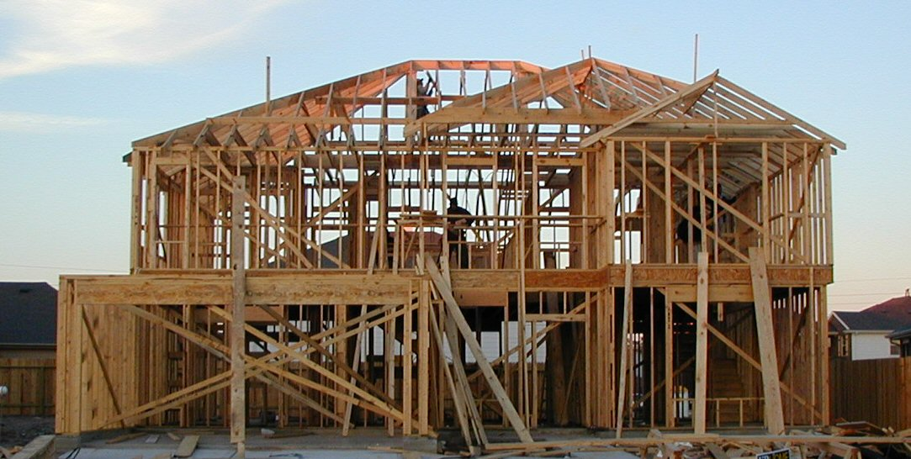
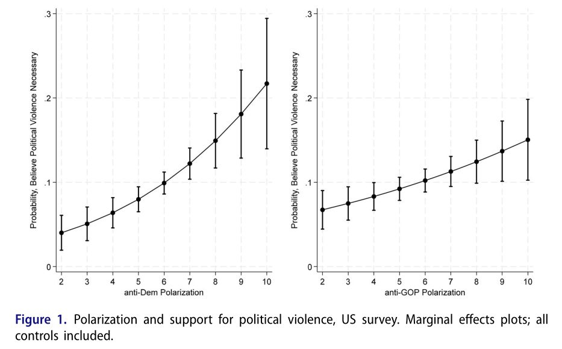
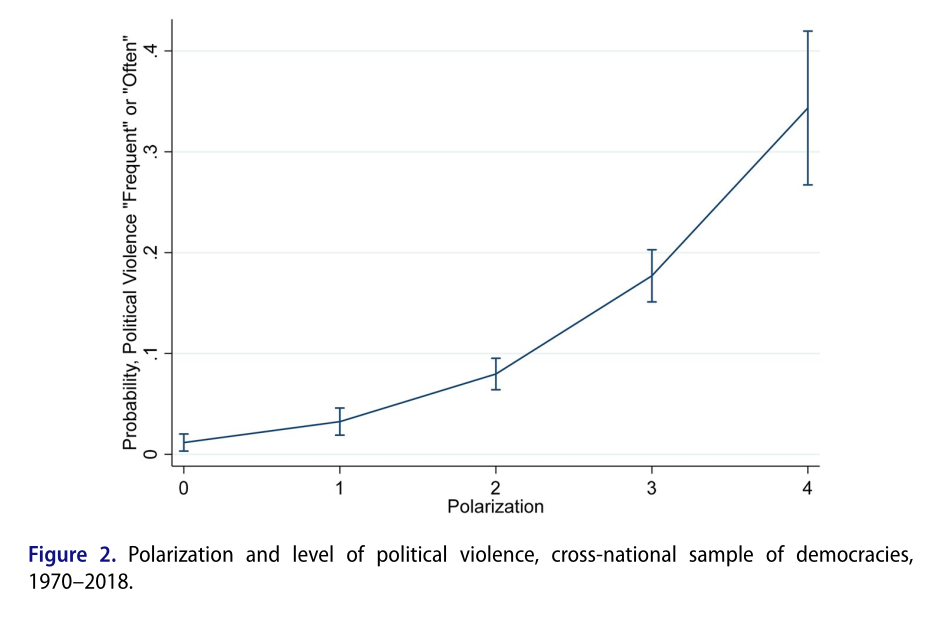

## Today's Agenda {background-image="Images/00-Leviathan_Cover_55.png" .center}

```{r}
library(tidyverse)
library(readxl)
library(kableExtra)
```

<br>

**II. How and why do governments use violence against the people inside their borders?**

<br>

Theories of "Political Violence"

- Piazza (2023) "Political Polarization and Political Violence"

<br>

::: r-stack
Justin Leinaweaver (Fall 2025)
:::

::: notes
Prep for Class

1. Review Canvas submissions

2. Open RStudio and save the class notes

<br>

Remember, our big goal for this section of the class is to answer this question.

- How and why do governments use violence against the people inside their borders?

<br>

This week we've begun exploring models of of violence by "democratic" states

- **SLIDE**: Davenport and Armstrong

:::


## {background-image="Images/00-Leviathan_Cover_55.png" .center}

### Davenport, C., & Armstrong, D. A. (2004). Democracy and the Violation of Human Rights: A Statistical Analysis from 1976 to 1996. American Journal of Political Science, 48(3), 538–554.

::: notes

Ok, quick refresher on our work from last class!

<br>

**What is the research question in this paper?**

- ("What is the influence, if any, of democracy on repression?" 539)

<br>

**What are the three mechanisms linking democracy and repression that these authors propose?**

1. All Steps Lead to Peace (p540)

2. Some Steps are Better than Others (p541)

3. Steps of Distinction (p542)

<br>

**And which one of these is most consistent with the data?**

- (**SLIDE**)

:::


## Davenport & Armstrong (2004) {background-image="Images/00-Leviathan_Cover_55.png" .center}

:::: {.columns}
::: {.column width="50%"}

:::

::: {.column width="50%"}

<br>

```{r, fig.retina=3, fig.align='center', fig.asp=0.8, out.width='98%', fig.width=4}
# Steps of Distinction (p542)
tibble(
  x = 1:21,
  y = c(rep(7,16), rep(0, 5))
  ) |>
  ggplot(aes(x = x, y = y)) +
  geom_line(linewidth = 1.3) +
  theme_classic() +
  labs(x = "Level of Democracy", y = "Willingness to Use Violence",
       title = "Steps of Distinction") +
  scale_x_continuous(labels = NULL)  +
  scale_y_continuous(labels = NULL)
```
:::
::::

::: notes

Let's talk for a second about the pros and cons of adopting THIS as your model of political violence in democracies.

<br>

**What does this model suggest are the best ways to limit violence by the government in a democracy?**

<br>

**What does this model suggest are bad or ineffective ways to limit violence by the government in a democracy?**

<br>

**What does this model suggest will be the result of efforts to promote democracy in less democractic countries around the world?**

<br>

**Bottom line, are you convinced this is the most useful way to explain government violence by democracies? Why or why not?**

<br>

*SPLIT class into 3 GROUPS*

- Go sit with your group!

<br>

**SLIDE**: Today we examine a different set of mechanisms in a democracy that may be relevant for understanding political violence.

:::


## {background-image="Images/00-Leviathan_Cover_55.png" .center}

::: {.r-fit-text}
**How does Piazza (2023) frame his research project?**
:::



::: notes

**Remind me, what does it mean to ask about the "framing" of a research paper?**

<br>

Every research paper represents a set of conclusions about the world.

- e.g. Here's what we know now that we didn't before.

<br>

Every choice you make along the way has a MASSIVE impact on the end product.

- What makes our work "science" is that we are completely transparent about all of these choices.

<br>

**SLIDE**: Let's talk framing of the Piazza paper

:::


## Piazza (2023) {background-image="Images/00-Leviathan_Cover_55.png" .center}

<br>

::: {.r-fit-text}
**Evaluate the Framing**

1. Research question

2. Key concepts

3. Connections to the literature
:::

::: notes

Let's start by exploring the framing of the article.

- GROUPS, take a few minutes and get ready to share your thoughts about the framing of this research paper

- Think BIG PICTURE, e.g. how the researchers set up their project

<br>

*REPORT BACK and DISCUSS*

<br>

**What is the research question?**

- (Is political violence and support for political violence more prevalent in democratic societies with high levels of affective polarization?)

**Per the authors, why is this an important question?**

- Per V-dem "the intensity level of political polarization increased by 26.2% within democracies across the world from 2000 to 2018."
    
- Both "support for political violence" and "actual" political violence are also on the rise in democracies

<br>

**What are the key concepts in the question?**

- (democracy, political violence and affective polarization)

**How are each defined?**

- (democracy: ?)
- (political violence: ?)
- (affective polarization: ?)

<br>

**What is the state of the literature they are responding to?**

- **In other words, what did we know about this topic thanks to the established research?**

- **What holes in our knowledge are they trying to fill?**

<br>

**SLIDE**: The model

:::


## Piazza (2023) {background-image="Images/00-Leviathan_Cover_55.png" .center}

<br>

::: {.r-fit-text}
**Evaluate the Model: Polarization and Political Violence**

<br>

Three sets of interactions:

1. Polarization and Dehumanization (p482)

2. Moral Polarization (p486)

3. Polarization and Group Mobilization (p489)
:::

::: notes

Our next task is to dig into the model of political violence presented and analyzed in this paper.

- My read of the paper is that it focuses on one model in terms of interests and institutions, but with three sets of interactions at play

<br>

Just like last class, our job is twofold:

1. Explain how the mechanism of political violence works, and 

2. To evaluate the model

<br>

Let's all start by focusing on the same task

- GROUPS, take a few minutes to identify the interests and institutions in this model

- You need to consider the arguments across all three sets of interactions to find them all!

- Go!

<br>

**Groups, what are the interests and institutions in your read of Piazza's model?**

- *Go group by group and put ON BOARD*

<br>
    
**SLIDE**: My version and discussion

:::


## Piazza (2023) {background-image="Images/00-Leviathan_Cover_55.png" .center}

**Interests**

- Individuals &#8594; good things for their in-group

- Partisan elites &#8594; political survival / power

**Institutions**

- "instinctual sympathies toward other people and normative inhibitions against harming others" (p484)


::: notes

**DISCUSS: What do you think of the model so far?**

<br>

I really like how simply this model begins

- I don't find any of these basic assumptions deeply problematic or likely to force us to a violent outcome

- Makes the overall argument scarier to me if it predicts that anyone meeting these near universal criteria can be poisoned by polarization!

<br>

**SLIDE**: Back to the interactions

:::


## Piazza (2023) {background-image="Images/00-Leviathan_Cover_55.png" .center .smaller}

**Interests**

- Individuals &#8594; good things for their in-group
- Partisan elites &#8594; political survival / power

**Institutions**

- "instinctual sympathies toward other people and normative inhibitions against harming others" (p484)

**Interactions**

1. Polarization and Dehumanization (p482)
2. Moral Polarization (p486)
3. Polarization and Group Mobilization (p489)

::: notes

I'm now going to assign each group a different set of the interactions and I want you to diagram your version of the rest of the model AND be ready to evaluate it for us

- *Assign groups to interactions*

- Work directly on the board and get ready to report back!

<br>

**SLIDE**: Polarization and Dehumanization (p482)

:::


## {background-image="Images/00-Leviathan_Cover_55.png" .center .smaller}

**Piazza (2023): Polarization and Dehumanization**

**Interests**

- Individuals &#8594; good things for their in-group
- Partisan elites &#8594; political survival / power

**Institutions**

- "instinctual sympathies toward other people and normative inhibitions against harming others" (p484)

**Interactions**

::: {.fragment}
- &#8593; partisan polarization &#8594; demonization / dehumanization / "othering" of rival partisans

- Partisan elite rhetoric may reinforce or worsen this dehumanization

- Dehumanization fosters moral disengagement from members of opposing groups

- Moral disengagement makes it more acceptable to target those members with discriminatory practices and violence

:::

::: notes

*PRESENT and DISCUSS*

<br>

**REVEAL**: My version

<br>

Group 1, lead us through your evaluation of this version of the model

- *DISCUSS*

<br>

**Did the Brazilian case study help to illustrate the model? Why or why not?**

<br>

**SLIDE**: Interaction 2 on Moral Polarization

:::


## {background-image="Images/00-Leviathan_Cover_55.png" .center .smaller}

**Piazza (2023): Moral Polarization**

**Interests**

- Individuals &#8594; good things for their in-group
- Partisan elites &#8594; political survival / power

**Institutions**

- "instinctual sympathies toward other people and normative inhibitions against harming others" (p484)

**Interactions**

::: {.fragment}
- &#8593; partisan polarization &#8594; "moralized" or "zero-sum" political framings

- &#8593; moral polarization &#8594; partisans accept (or demand) violence against the out-group members who are viewed with "anger, blame and disgust"

:::

::: notes

*PRESENT and DISCUSS*

<br>

**REVEAL**: My version

- "moralized" framings = opposing this policy makes you a bad person

- "zero-sum" political framings = supporting policy X is an attack on me personally

- No defense for opposing the moral position, right?

<br>

Group 2, lead us through your evaluation of this version of the model

- *DISCUSS*

<br>

**Did the Turkish case study help to illustrate the model? Why or why not?**

<br>

**SLIDE**: Interaction 3 on Polarization and Group Mobilization

:::


## {background-image="Images/00-Leviathan_Cover_55.png" .center .smaller}

**Piazza (2023): Polarization and Group Mobilization**

**Interests**

- Individuals &#8594; good things for their in-group
- Partisan elites &#8594; political survival / power

**Institutions**

- "instinctual sympathies toward other people and normative inhibitions against harming others" (p484)

**Interactions**

::: {.fragment}

- &#8593; "social identity-based" sorting &#8594; political polarization

- &#8593; political polarization (+ elite rhetoric) &#8594; supporters overcome collective action problems

- &#8593; political polarization (+ elite rhetoric) &#8594; supporters willing to intimidate opposing partisans

:::

::: notes

*PRESENT and DISCUSS*

<br>

**REVEAL**: My version

- "social identity-based" sorting e.g. race, religion, education, urban vs rural

<br>

Group 3, lead us through your evaluation of this version of the model

- *DISCUSS*

<br>

**Did the Bangladeshi case study help to illustrate the model? Why or why not?**

<br>

**SLIDE**: Put it all together

:::


## Piazza (2023) {background-image="Images/00-Leviathan_Cover_55.png" .center .smaller}

**Interests**

- Individuals &#8594; good things for their in-group
- Partisan elites &#8594; political survival / power

**Institutions**

- "instinctual sympathies toward other people and normative inhibitions against harming others" (p484)

**Interactions**

1. Polarization and Dehumanization (p482)
2. Moral Polarization (p486)
3. Polarization and Group Mobilization (p489)

::: notes

**Ok, where do we end up with these?**

- **Are these distinct and separate models or are they all one model?**

<br>

**Do these models speak to the debate between Weber and Olson about the nature of the state and violence?**

- e.g. the state is violence vs the state uses violence?

<br>

**What do we see from applying these models to the United States today?**

- **Any specific concerns?**

<br>

**SLIDE**: Let's take all this theory material into the empirical world

:::


## Piazza (2023) {background-image="Images/00-Leviathan_Cover_55.png" .center}

<br>

::: {.r-fit-text}
**Evaluate the Analyses: US Survey**

- Main Discussion (p492)

- Online Appendix
:::

::: notes

On Canvas I have uploaded the supplementary material to this article

- On pages 4 and 5 the appendix includes the survey questions used in the US survey!

<br>

GROUPS, let's first evaluate the US survey analyses in the paper

- Focus on both the survey questions Piazza used and his description of how he executed it in the main text

- Get ready to report back the strengths and weaknesses of this data collection effort

- In other words, do you think his data is valid and reliable? Why or why not?

<br>

*ON BOARD: Strengths vs Weaknesses*

- *DISCUSS*

<br>

**SLIDE**: Figure 1 p497

- Table 1 p496

:::


## Piazza (2023) {background-image="Images/00-Leviathan_Cover_55.png" .center}

{style="display: block; margin: 0 auto"}

::: notes

Here we see the marginal effects from the regression analyses he performed.

- **What do we learn from these? (p495-497)**

<br>

- The slope is positive and significant for both Republicans and Democrats. 

- At low levels of polarization, Dems have a slightly higher tolerance for political violence than republican respondents (Rep 4-6.4 vs Dem 6.7-8.3)

- HOWEVER, at the high end of polarization Republicans show a MUCH larger tolerance for political violence (Rep 14.9-21.7 vs Dem 12.4-15)

<br>

My sense is that these are too high for both sides across the board to sustain a functional democracy!

<br>

**SLIDE**: The cross-national survey

:::


## Piazza (2023) {background-image="Images/00-Leviathan_Cover_55.png" .center}

<br>

::: {.r-fit-text}
**Evaluate the Analyses: Cross-National Time-Series Data**

- Main Discussion (p498)

- Online Appendix
:::

::: notes

GROUPS, let's now evaluate the Cross-National Time-Series data of democracies around the world

- Get ready to report back your analyses

- **Was this a useful, valid and reliable exercise or not?**

<br>

*ON BOARD: Strengths vs Weaknesses*

- *DISCUSS*

<br>

**SLIDE**: Figure 2

:::


## Piazza (2023) {background-image="Images/00-Leviathan_Cover_55.png" .center}

{style="display: block; margin: 0 auto"}

::: notes

Here we see the marginal effects from the regression analyses he performed.

- **What do we learn from these? (p500-501)**

<br>

- a clear positive slope in the relationship between political polarization and occurrence of political violence in democracies.

- Democracies that are not polarized (0) have a 1.5% probability of frequent political violence

- Democracies that are “mainly not” polarized (polarization level = 1) have a 4.9%

- Democracies that are “somewhat” polarized (polarization level = 2) have a 12%

- Democracies that are “noticeably” polarized (polarization level = 3) "double"

- Democracies that are “to a large extent” polarized (polarization level = 4) have a 42.9%

<br>

**SLIDE**: Takeaways

:::


## Piazza (2023) {background-image="Images/00-Leviathan_Cover_55.png" .center}

:::: {.columns}
::: {.column width="50%"}
{style="display: block; margin: 0 auto"}
:::

::: {.column width="50%"}
{style="display: block; margin: 0 auto"}
:::
::::

::: notes

Ok, where do we end up?

**Are we convinced by these models and these analyses? Why or why not?**

<br>

**What does this model tell us about promoting democracy as a strategy for reducing political violence around the world?**

<br>

**Do these results conflict with the findings of the article last class by Davenport and Armstrong? Why or why not?**

:::


## For Next Class {background-image="Images/00-Leviathan_Cover_55.png" .center}

<br>

**Case Studies of Groups Reducing Political Violence in Democracies**

::: notes

Time to put our theories of democratic government political violence to the test

- Go find us cases of success stories from around the world

- Places where an individual, group, country or group of countries took a specific action to stop a democracy from engaging in political violence

- Be ready to evaluate these in terms of our models from this week!

<br>

**Questions on the assignment?**

<br>

Canvas Assignment: Case Studies of Groups Reducing Political Violence in Democracies

Submit to Canvas a recent example of an individual, group, country or group of countries taking a specific action to stop a democracy from engaging in political violence. 

1. APA citation to the case
2. Who specifically acted in this case?
3. What specifically did they do? (e.g. actions taken, policies adopted, etc)
4. Why do you believe it was effective? 
5. What lessons can we take from this case for preventing political violence in America today?


:::

