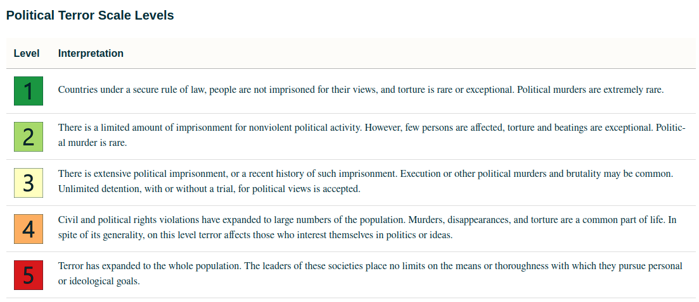
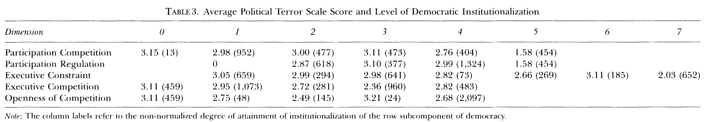
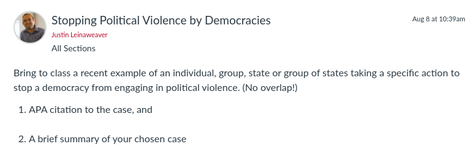

---
output:
  xaringan::moon_reader:
    css: ["default", "extra.css"]
    lib_dir: libs
    seal: false
    nature:
      highlightStyle: github
      highlightLines: true
      countIncrementalSlides: false
      ratio: '16:9'
---

```{r, echo = FALSE, warning = FALSE, message = FALSE}
##xaringan::inf_mr()
## For offline work: https://bookdown.org/yihui/rmarkdown/some-tips.html#working-offline
## Images not appearing? Put images folder inside the libs folder as that is the main data directory

library(tidyverse)
##library(readxl)
##library(stargazer)
##library(kableExtra)
##library(modelr)

knitr::opts_chunk$set(echo = FALSE,
                      eval = TRUE,
                      error = FALSE,
                      message = FALSE,
                      warning = FALSE,
                      comment = NA)
```

background-image: url('libs/Images/00-Leviathan_Cover_55.png')
background-size: 100%
background-position: center
class: middle

.center[.size35[**II. How and why do governments use violence against the people inside their borders?**]]

<br>

.size45[

**Today's Agenda**: Theories of "Political Violence"

- Bueno de Mesquita, Cherif, Downs & Smith (2005) "Thinking Inside the Box: A Closer Look at Democracy and Human Rights"
]

<br>

.center[.size40[
  Justin Leinaweaver (Fall 2023)
]]

???

### Prep for Class
1. Open the Polity codebook and the article

<br>

Last class we evaluated Davenport and Armstrong's (2004) research article that explored the relationship between regime type and political violence.

### What model did they identify as the most useful for explaining how and why democracies might use violence?

- (**SLIDE**)


---

background-image: url('libs/Images/07_2-Peaceful_Protest.jpg')
background-size: 100%
background-position: center
class: bottom, center

.size35[.content-box-white[**Davenport & Armstrong (2004): Democracy & Political Violence**]]

???

### What are your takeaways from exploring Davenport & Armstrong's (2004) research paper?

<br>

### - How does the "Steps of Distinction" model help us understand a government's behavior?

- Interests: 
    - Citizens want "good" leaders
    - Leaders want political survival

- Institutions:
    - Domestic institutions structure behavior
    - Domestic norms structure behavior

- Interactions: 
    - Reducing the incentive to repress requires a combination of fully operational and autonomous institutional and behavioral mechanisms

<br>

### - What were the key findings of the paper? Did the analysis support the model or not?

- (**SLIDE**)


---

background-image: url('libs/Images/background-red_flipped.png')
background-size: 100%
background-position: center

.size40[.content-box-white[**Steps of Distinction**]]

.pull-left[

```{r, fig.retina=3, fig.align='center', out.width='90%'}
knitr::include_graphics('libs/Images/07_1-Davenport_Fig1.png')
```
]

.pull-right[
.size25[
**Interests**
- Citizens want "good" leaders
- Leaders want political survival

**Institutions**
- Domestic institutions structure behavior
- Domestic norms structure behavior

**Interactions**
- Reducing the incentive to repress requires a combination of fully operational and autonomous institutional and behavioral mechanisms

]]

???

### How confident are you in the conclusions? (e.g. logical model, valid and reliable data, plausible analyses?)

<br>

And that takes us to our research paper for today!

- *Split class into five groups*

- Go sit with your group!


---

background-image: url('libs/Images/background-red_flipped.png')
background-size: 100%
background-position: center
class: middle, inverse

.size45[
.center[**Bueno de Mesquita, Cherif, Downs & Smith (2005) "Thinking Inside the Box: A Closer Look at Democracy and Human Rights"**]]

.size45[
**Evaluate the Framing**

1. Research question

2. Key concepts

3. Connections to the literature
]

???

Let's start by exploring the framing of the article.

- GROUPS, take a few minutes and get ready to share your thoughts about the framing of this research paper

- Think BIG PICTURE, e.g. how the researchers set up their project

<br>

REPORT BACK and DISCUSS

<br>

### How does this article connect to the Davenport and Armstrong article from Monday?

- (Picks up where they left off and digs into the components of democracy)

- "The central focus of our study is to ascertain what, if any, specific aspects of democracy are necessary or sufficient to achieve improved quality of life in terms of diminishing, or even eliminating, human rights violations" (440).

<br>

### Why do we need this new article? what does it help us to achieve in the real-world?

- (Limiting violence against citizens is an important goal but "spreading democracy" is REALLY, REALLY hard to do.)

- (Policy-makers and reformers need better, real-world guidance)
    
- This paper helps us identify which specific reforms should be prioritized if what we care about is reducing human rights violations.

<br>

### And what is the over-arching argument made in this paper?

#### - In broad strokes, do these authors believe we should focus on the components of democracy or democracy as an index?

- (Not all dimensions of democracy contribute equally to reductions in human rights abuses BUT all appears somewhat relevant albeit at varying degrees.)


---

background-image: url('libs/Images/background-red_flipped.png')
background-size: 100%
background-position: center
class: middle, inverse

.size30[
.center[**Bueno de Mesquita, Cherif, Downs & Smith (2005) "Thinking Inside the Box: A Closer Look at Democracy and Human Rights"**]]

.size40[
**The Proposed Mechanisms**

1. Executive Constraint (XCONST)

2. Executive Competition (XRCOMP)

3. Participation Competition (PARCOMP)

4. Regulation of Participation (PARREG)

5. Openness of Recruitment (XROPEN)
]

???

*Assign mechanisms to the groups*

<br>

I'd like us to evaluate the mechanisms but, frankly, the article doesn't really connect these variables to political violence in a clear way.

- In other words, this is actually a list of variables, not theoretical mechanisms.

<br>

So, we're going to do it for them!

<br>

### Does everybody have their variable / mechanism written down?


---

background-image: url('libs/Images/background-red_flipped.png')
background-size: 100%
background-position: center
class: middle, inverse

.size40[
.center[**Bueno de Mesquita, Cherif, Downs & Smith (2005) "Thinking Inside the Box: A Closer Look at Democracy and Human Rights"**]]

<br>

.size40[
**Step 1: Describe the Variables as Models**

1. What is your variable trying to measure?

2. What mechanism connects this variable to political violence?
]

???

I'd like each group to present us two things:

<br>

First, as simply as possible, explain what this variable is trying to measure

- In other words, what is the operationalization for this variable?

<br>

Second, tell us a theoretical story that makes this variable a mechanism

- In other words, why should we believe that an increase in this variable will lead to a reduction in the use of political violence.

<br>

Don't dig into the data side of this yet.

- We'll evaluate the validity and reliability of these measures in a moment.

- FIRST, we need to clarify the actual story they're trying to test.

<br>

### Questions?

- Go!

<br>

PRESENT and DISCUSS each


---

background-image: url('libs/Images/background-red_flipped.png')
background-size: 100%
background-position: center
class: middle, inverse

.size40[
.center[**Bueno de Mesquita, Cherif, Downs & Smith (2005) "Thinking Inside the Box: A Closer Look at Democracy and Human Rights"**]]

<br>

.size40[
**Step 2: Evaluate the Validity and Reliability of the Variable**

- What are its strengths and weaknesses?
]

???

In this step we now evaluate our confidence in the variables as data.

- In the last step you clarified the story, but now we need to evaluate our uncertainty around the measures themselves.

<br>

### Questions?

- Go!

<br>

PRESENT and DISCUSS each


---

background-image: url('libs/Images/background-red_flipped.png')
background-size: 100%
background-position: center
class: middle, inverse

.size30[
.center[**Bueno de Mesquita, Cherif, Downs & Smith (2005) "Thinking Inside the Box: A Closer Look at Democracy and Human Rights"**]]

.size40[
**The Proposed Mechanisms**

1. Executive Constraint (XCONST)

2. Executive Competition (XRCOMP)

3. Participation Competition (PARCOMP)

4. Regulation of Participation (PARREG)

5. Openness of Recruitment (XROPEN)
]

???

Before we move to the findings for each measure, we need to answer an important question.

### Are these five fundamentally different arguments or do they all basically use different words to say the same thing?

#### - In other words, have you each built an argument that "democracy" decreases violence or that one specific part of the thing we call democracy decreases violence?

- DISCUSS


---

background-image: url('libs/Images/07_2-Table1_deMesquita.png')
background-size: 95%
background-position: center

???

Answering this question is why the authors give us Table 1.

### Can anybody help us make sense of what this table is showing?

<br>

The question is, do these five things measure fundamentally different ideas or not?

- Do we simply find that states with high scores on one of these have high scores on all of them?

- If so, we can use the democ index and be done with it.

- If not, then there is value to studying them separately.


---

background-image: url('libs/Images/07_2-Table1_deMesquita2.png')
background-size: 95%
background-position: center

???

Let's focus on just the first two columns.

Don't worry about the technical definition of what this is.

- ...the "Components" are the pseudo-r^2 from running an ordered logit regression of the variable in this row on the other four variables.

<br>

The idea here is very similar to looking at correlations.

### Can anybody tell us what a correlation is?

(SLIDE)


---

background-image: url('libs/Images/background-blue_triangles.jpg')
background-size: 100%
background-position: center
class: middle

.size40[.center[**Correlation: The Degree of Linear Association**]]

<br>

```{r, fig.retina=3, fig.align = 'center', out.width = '100%', fig.height=3.5, fig.width = 9, cache=TRUE}
## Show correlations
cor_examples <- function(sd) {
    tibble(
    x = rnorm(50, mean = 8, sd = 2),
    y = x + rnorm(50, 0, sd),
    Group = str_c("Correlation: ", round(cor(x, y), 2))
    )
}

## Positive linear
set.seed(54)
rbind(cor_examples(1),
      cor_examples(3),
      cor_examples(18)) |>
ggplot(aes(x = x, y = y)) +
    geom_point() +
    geom_smooth(method = "lm", se = FALSE) +
    theme_bw() +
  labs(x = "", y = "") +
    facet_wrap(~Group, scales = "free")


```

???

**The "Fabulous" Advantages of correlation (Wheelan)**

<br>

A measure of linear association

- How well do two variables vary together in a linear fashion?

- Always between -1 and 1

- No units attached

<br>

As you can see from the examples here, the closer to 1, the closer the dots are to the line.

- As x increases so does y (but not causal!)

### Make sense?


---

background-image: url('libs/Images/background-blue_triangles.jpg')
background-size: 100%
background-position: center
class: middle

.size40[.center[**Correlation: The Degree of Linear Association**]]

<br>

```{r, fig.retina=3, fig.align = 'center', out.width = '100%', fig.height=3.5, fig.width = 9, cache=TRUE}
## Show correlations
cor_examples <- function(sd) {
    tibble(
    x = rnorm(50, mean = 8, sd = 2),
    y = -x - rnorm(50, 0, sd),
    Group = str_c("Correlation: ", round(cor(x, y), 2))
    )
}

## Positive linear
set.seed(54)
rbind(cor_examples(.9),
      cor_examples(2.05),
      cor_examples(7)) |>
ggplot(aes(x = x, y = y)) +
    geom_point() +
    geom_smooth(method = "lm", se = FALSE) +
    theme_bw() +
  labs(x = "", y = "") +
    facet_wrap(~Group, scales = "free")
```

???

This also works for negative associations too!

- Negative correlations with a slope tilting down to the right.

<br>

As you can see from the examples here, the closer to -1, the closer the dots are to the line.

- As x increases, y decreases (but not causal!)

### Questions on these examples?


---

background-image: url('libs/Images/07_2-Table1_deMesquita2.png')
background-size: 95%
background-position: center

???

This R^2 approach is different from a correlation in that it lets us compare each polity component against all the others combined.

- Results from 0 to 1

- Doesn't matter if the association is positive or negative, all association increases the score.

<br>

Values closer to '1' mean that you can explain much of the variation in that one variable using the others.

- In other words, it captures something already represented in the other variables.

<br>

Values close to '0' mean you cannot explain the variable in the row using the other variables.

- In other words, it captures something different in the world than the others.

### Does that make sense?


---

background-image: url('libs/Images/07_2-Table1_deMesquita2.png')
background-size: 95%
background-position: center

???

### So, what do these component scores tell us about the separate measures of democracy created by Polity?

- (Regulation of participation, participation competition and executive constraint capture very different things from the others.)

- (Openness of recruitment overlaps a bit with the others)

- (Executive competition overlaps even more.)

<br>

### Do those results make sense?

#### - For example, states with high levels of executive competition are also likely to score better on the other measures?

The authors indicate these results are sufficiently low enough to merit testing each indicator separately.


---

background-image: url('libs/Images/background-red_flipped.png')
background-size: 100%
background-position: center
class: middle, center, inverse

.size70[**Analyze the Findings**]

.size60[
How big is the effect of this measure on the likelihood of governments to use political violence against their citizens?
]

???

Groups, get ready to tell us how large the effect of your mechanism is on political violence.

- Look through the article's analyses for mentions of your component.

- What is its effect on political violence?

<br>

*PRESENT and DISCUSS each*

(SLIDE: Table 3 marginal effects)


---

background-image: url('libs/Images/background-red_flipped.png')
background-size: 100%
background-position: center

```{r, echo = FALSE, fig.align = 'center', out.width = '75%'}

```

<br>

```{r, echo = FALSE, fig.align = 'center', out.width = '100%'}

```

???

*Results summarized in Table 2, Figure 1 and Table 3*

This table shows the average PTS score for states at each level of each mechanism.

<br>

### GROUPS, focus on your mechanism (row) and tell us, what happens to the PTS score as you increase your component of democratization?

<br>

Findings to Highlight:

1. Party competition is most important in reducing human rights violations.
    - HOWEVER, can't just do that, true party competition depends on other necessary institutions being in place first.

2. Elections are not a good place to begin state-building.

3. Strong threshold effect, democracy doesn't effectively prevent human rights abuses until very high polity score attained.

<br>

### Based on your work on this paper, what specific recommendations could we make to policy-makers who are interested in reducing the likelihood of governments using political violence against their citizens?

<br>

### Are there any policies that aim to promote democratization but that according to this research might actually increase the use of violence by governments?


---

background-image: url('libs/Images/background-blue_triangles.jpg')
background-size: 100%
background-position: center
class: middle

.size60[.content-box-white[**For Next Class**]]

<br>

```{r, echo = FALSE, fig.align = 'center', out.width = '100%'}

```

???

I'd like to use our class on Friday to begin collecting case studies of strategies we could consider for reducing political violence.

<br>

### Questions on the assignment?


