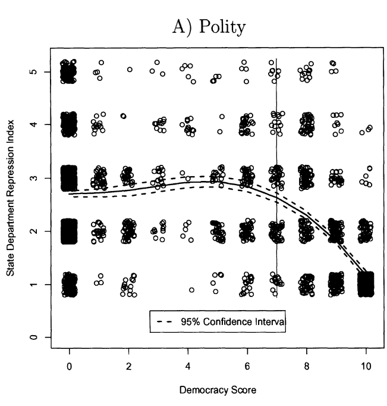

## Today's Agenda {background-image="Images/00-Leviathan_Cover_55.png" .center}

```{r}
library(tidyverse)
library(readxl)
library(kableExtra)
```

<br>

**II. How and why do governments use violence against the people inside their borders?**

<br>

Theories of "Political Violence"

- Strategies to prevent "political violence" by democratic governments

<br>

::: r-stack
Justin Leinaweaver (Fall 2025)
:::

::: notes
Prep for Class

1. Review submissions on Canvas

2. Prep Google spreadsheet for unpacking cases (make sure it is visible on the Modules page)

<br>

Our overarching goal for this section of the class is to answer this question.

- How and why do governments use violence against the people inside their borders?

<br>

My hope is that all of the work we have done thus far has given you the tools you need to explain government violence as a strategy.

<br>

Our next aim is to use all of this material (cases, data, theories) to develop real-world strategies for preventing political violence by governments.

:::


## For Today {background-image="Images/00-Leviathan_Cover_55.png" .center}

<br>

**Case Studies of Groups Reducing Political Violence in Democracies**

::: notes

**Everybody ready to go with this?**

<br>

I'd like to unpack your cases in the same way we have done for other case studies in previous weeks.

- Everybody open the Google Sheet linked through our Canvas Modules for today

- Start by copying your citation and brief case description from the discussion board onto the spreadsheet.

<br>

**SLIDE**: As before, I'll give you short instruments and you'll measure your cases
:::


##  {background-image="Images/00-Leviathan_Cover_55.png" .center}

::: {.r-fit-text}

**Unpacking the Cases: The Inciting Incident**

1. Who committed the violent act?

2. Who did they target?

3. What did they do?

4. Why is this "political violence"?

:::

::: notes

*Add Columns: Perpetrator, Violence Target, Violence Act, Violence Reason*

<br>

Let's start by focusing on the inciting incident

- e.g. what political violence was being done that needed intervention?

<br>

Fill in these details for your case on the spreadsheet.

- Keep your answers concise BUT be specific!

- I know that feels like contradictory instructions but that's the challenge of measuring a case

:::


## {background-image="Images/00-Leviathan_Cover_55.png" .center}

::: {.r-fit-text}

**Unpacking the Cases: The Intervention**

1. Who intervened?

2. Who did they target?

3. What did they do?

4. How successful were they?

:::

::: notes

*Add Columns: Intervener, Intervention Target, Intervention Action, Intervention Success*

Let's now shift to the intervention

- e.g. The response to the violent act

<br>

Fill in these details for your case on the spreadsheet.

- Keep your answers concise BUT be specific!

<br>

*Split class into GROUPS*

- Go sit with your group!

:::


## {background-image="Images/07_3-Minneapolis_Protest.jpg"}

[**What are the key elements of a successful intervention to change the use of political violence by democractic governments?**]{style="color:white;"}

::: notes

GROUPS: Let's build a list of lessons from our work today on the board

- **What are the key elements of a successful intervention to change the use of political violence by democractic governments?**

- *ON BOARD*

<br>

*PRESENT and DISCUSS each*

<br>

**SLIDE**: Theories from the week

:::


## Davenport & Armstrong (2004) {background-image="Images/00-Leviathan_Cover_55.png" .center}

:::: {.columns}
::: {.column width="50%"}

:::

::: {.column width="50%"}

<br>

```{r, fig.retina=3, fig.align='center', fig.asp=0.8, out.width='98%', fig.width=4}
# Steps of Distinction (p542)
tibble(
  x = 1:21,
  y = c(rep(7,16), rep(0, 5))
  ) |>
  ggplot(aes(x = x, y = y)) +
  geom_line(linewidth = 1.3) +
  theme_classic() +
  labs(x = "Level of Democracy", y = "Willingness to Use Violence",
       title = "Steps of Distinction") +
  scale_x_continuous(labels = NULL)  +
  scale_y_continuous(labels = NULL)
```
:::
::::

::: notes

The Davenport and Armstrong (2004) proposes specific causal mechanisms that explain when and why a democratic government might use political violence.

- **Are our lessons of successfully counter-acting government violence consistent with the model proposed and tested by Davenport and Armstrong (2004)? Why or why not?**

- *DISCUSS*

<br>

**SLIDE**: And Piazza's arguments

:::


## Piazza (2023) {background-image="Images/00-Leviathan_Cover_55.png" .center .smaller}

**Interests**

- Individuals &#8594; good things for their in-group
- Partisan elites &#8594; political survival / power

**Institutions**

- "instinctual sympathies toward other people and normative inhibitions against harming others" (p484)

**Interactions**

1. Polarization and Dehumanization (p482)
2. Moral Polarization (p486)
3. Polarization and Group Mobilization (p489)

::: notes

Piazza (2023) focuses on the role of polarization in igniting political violence in democracies.

- **Are our lessons of successfully counter-acting government violence consistent with Piazza's model? Why or why not?**

- *DISCUSS*

<br>

**SLIDE**: Detour back to the second paper

:::


## {background-image="Images/00-Leviathan_Cover_55.png" .center}

::: {.r-fit-text}
**Paper 2: Political Violence Country Briefings**
:::

<br>

Select TWO countries and analyze their government's use of political violence

- Must cover the most recently available **five years** of data

- Must reference **ALL FIVE** of the data sources

- Argument must include **three** distinct premises

- Two pages (**max**) per country

::: notes

Don't forget this assignment is ongoing and will be due at the end of Week 9

- **Questions on the prompt?**

<br>

And don't forget your rough draft of the analysis is due at the start of Week 9

- We'll review your big picture conclusions and visualizations in class on the Monday of that week

<br>

**SLIDE**: Next week we shift to the literature on political violence by dictatorships

:::


## {background-image="Images/00-Leviathan_Cover_55.png" .center}

::: {.r-fit-text}
**For Next Class **

<br>

1. Read the Escriba-Folch (2013), and

2. Submit your diagram and analysis to Canvas
:::

::: notes

**Questions on the assignment?**

<br>

Canvas Assignment: Analyzing the Escriba-Folch (2013) Argument

Diagram the theoretical model proposed in this paper. Who are the key interests? What are the key institutions? And what are the primary interactions?


:::