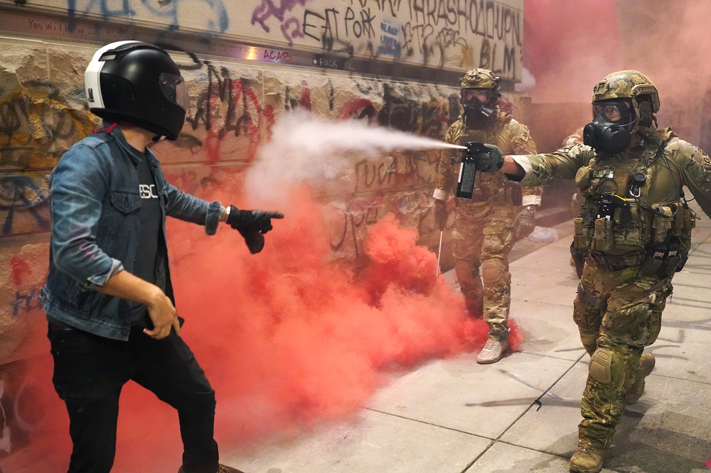
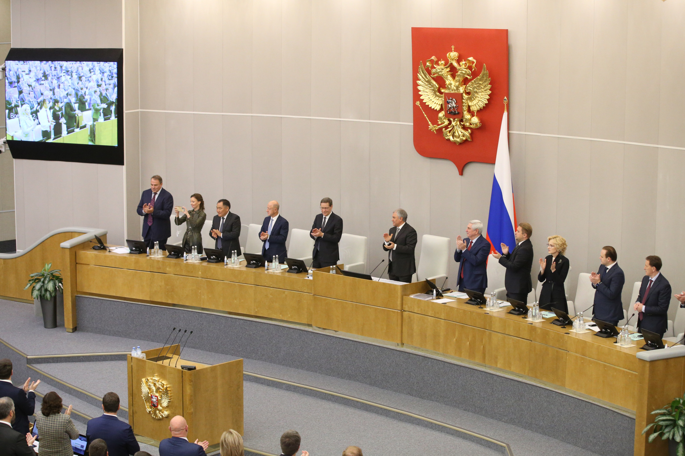

## Today's Agenda {background-image="Images/00-Leviathan_Cover_55.png" .center}

```{r}
library(tidyverse)
library(readxl)
library(kableExtra)
```

<br>

**II. How and why do governments use violence against the people inside their borders?**

<br>

Theories of "Political Violence"

- Strategies to prevent "political violence" by autocratic governments

<br>

::: r-stack
Justin Leinaweaver (Fall 2025)
:::

::: notes
Prep for Class

1. Review submissions on Canvas

2. Have the class circle up, seminar style!

<br>

**ANNOUNCE**: Pizza and politics is this Friday

<br>

Our overarching goal for this section of the class is to answer this question.

- How and why do governments use violence against the people inside their borders?

<br>

We do this both to better understand why it is happening but also to help us figure out how to stop it!

- Today we repeat our exercise from last Friday when we focused on stopping democracies from using violence but today its the dictatorship cases

<br>

**SLIDE**: The prompt

:::


## {background-image="Images/00-Leviathan_Cover_55.png" .center}

Submit to Canvas a recent example of an individual, group, country or group of countries taking a specific action to stop an autocracy from engaging in political violence. 

1. APA citation to the case
2. Who specifically acted in this case?
3. What specifically did they do? (e.g. actions taken, policies adopted, etc)
4. Why do you believe it was effective? 
5. What lessons can we take from this case for preventing political violence in dictatorships around the world?

::: notes

For today you each submitted a case in response to this prompt.

- **Everybody ready to go with this?**

<br>

Let's go around the room to hear each of your cases

- Introduce it to us as a response to the prompts

- Go!

<br>

*Split class into small groups around the circle*

- **SLIDE**: Groups prompt

:::


## {background-image="Images/08_2-Argentina_protest.webp" .center}

<br>

<br>

<br>

<br>

<br>

<br>

<br>

[**What are the key elements of a successful intervention to change the use of political violence by autocratic governments?**]{style="color:white;"}

::: notes

GROUPS: Let's build a list of lessons from our work today on the board

- **What are the key elements of a successful intervention to change the use of political violence by autocractic governments?**

- *ON BOARD*

<br>

*PRESENT and DISCUSS each*

<br>

**SLIDE**: Theories from the week

:::


## {background-image="Images/00-Leviathan_Cover_55.png" .center}

::: {.r-fit-text}
[**Escribà-Folch (2013): Dictatorships and Political Violence**]{style="color:darkred;"}
:::

{style="display: block; margin: 0 auto"}

::: notes

The Escribà-Folch (2013) proposes specific causal mechanisms that explain when and why an autocratic government might use political violence.

- **Are our lessons of successfully counter-acting government violence consistent with the model proposed and tested in that paper? Why or why not?**

- *DISCUSS*

<br>

**SLIDE**: And Frantz's arguments

<br>

*Escriba Folch Model*

- Interests: Dictators -> political survival

- Institutions: Dictator may choose from two types of repression: 1) restrictions on civil rights, and/or 2) violation of physical rights

- Interactions: 
    - Violent repression directly targets and removes a threat to power (but may decrease legitimacy, increase resentment and lead to military defections)
    - Restricting rights attempts to prevent coordination and collective action (but only works on the public and not the elites)
    - Dictators should match their type of repression to the type of threat

:::


## {background-image="Images/00-Leviathan_Cover_55.png" .center}

::: {.r-fit-text}
[**Frantz and Kendall-Taylor (2014): A Dictator’s Toolkit**]{style="color:darkred;"}
:::

{style="display: block; margin: 0 auto"}

::: notes

The Frantz and Kendall-Taylor (2014) proposes specific causal mechanisms that explain when and why an autocratic government might use political violence.

- *Photo is from the Russian Duma*

- **Are our lessons of successfully counter-acting government violence consistent with the model proposed and tested in that paper? Why or why not?**

- *DISCUSS*

<br>

**Frantz and Kendall-Taylor (2014): The Model**

**Interests**

- Dictators -> political survival

**Institutions**

- Dictators are free to choose different types of repression (violence, limiting rights) AND to create new institutions (legislatures and parties)

**Interactions**

- Repression is costly (to implement and in its effects) and it's cheaper to target a few with violence vs all with loss of rights
- If opposition is "diffuse" or "difficult to identify" use co-optation to identify the "problematic individuals" (and target with violence as needed)

:::


## {background-image="Images/00-Leviathan_Cover_55.png" .center}

::: {.r-fit-text}
**Paper 2: Political Violence Country Briefings**
:::

<br>

Select TWO countries and analyze their government's use of political violence

- Must cover the most recently available **five years** of data

- Must reference **ALL FIVE** of the data sources

- Argument must include **three** distinct premises

- Two pages (**max**) per country

::: notes

Don't forget this assignment is ongoing and will be due at the end of next Week

- **Questions on the prompt?**

<br>

**SLIDE**: Next week working on the paper

:::


## Monday, Oct 13th (Week 9) {background-image="Images/00-Leviathan_Cover_55.png" .center}

<br>

Submit an outline of each country briefing report

- One sentence thesis statement

- Each premise gets a one sentence explanation and a draft version of the data summary you intend to use to support it (e.g. a table or a visualization)

::: notes

Submit your work to Canvas before class Oct 16th

- Submit and briefly explain each of the conclusions you have reached about your two countries (= six visualizations and a brief description of each).

<br>

### Questions on the assignment?

:::