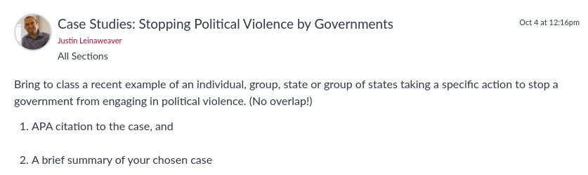

---
output:
  xaringan::moon_reader:
    css: ["default", "extra.css"]
    lib_dir: libs
    seal: false
    nature:
      highlightStyle: github
      highlightLines: true
      countIncrementalSlides: false
      ratio: '16:9'
---

```{r, echo = FALSE, warning = FALSE, message = FALSE}
##xaringan::inf_mr()
## For offline work: https://bookdown.org/yihui/rmarkdown/some-tips.html#working-offline
## Images not appearing? Put images folder inside the libs folder as that is the main data directory

library(tidyverse)
##library(readxl)
##library(stargazer)
##library(kableExtra)
##library(modelr)

knitr::opts_chunk$set(echo = FALSE,
                      eval = TRUE,
                      error = FALSE,
                      message = FALSE,
                      warning = FALSE,
                      comment = NA)
```

background-image: url('libs/Images/00-Leviathan_Cover_55.png')
background-size: 100%
background-position: center
class: middle

.center[.size35[**II. How and why do governments use violence against the people inside their borders?**]]

<br>

.size45[

**Today's Agenda**

- Strategies to Prevent "Political Violence" by Governments
]

<br>

.center[.size40[
  Justin Leinaweaver (Fall 2023)
]]

???

### Prep for Class
1. Review cases on Canvas

2. Prep Google spreadsheet for unpacking cases (make sure it is visible on the Modules page)

<br>

Our overarching goal for this section of the class is to answer this question.

- How and why do governments use violence against the people inside their borders?

<br>

My hope is that all of the work we have done thus far has given you the tools you need to explain government violence as a strategy.

<br>

Our next aim is to use all of this material (cases, data, theories) to develop real-world strategies for preventing political violence by governments.


---

background-image: url('libs/Images/background-blue_triangles.jpg')
background-size: 100%
background-position: center
class: middle

.size60[.content-box-white[**For Today**]]

<br>

```{r, echo = FALSE, fig.align = 'center', out.width = '100%'}

```

???

### Everybody ready to go with this?

<br>

I'd like to unpack your cases in the same way we have done for other case studies in previous weeks.

- Everybody open the Google Sheet linked through our Canvas Modules for today

- Start by copying your citation and brief case description from the discussion board onto the spreadsheet.

<br>

**SLIDE**: As before, I'll give you short instruments and you'll measure your cases


---

background-image: url('libs/Images/background-red_flipped.png')
background-size: 100%
background-position: center
class: middle

.size45[
.center[.content-box-white[**Unpacking the Cases**]]

**The Inciting Incident**

1. Who committed the violent act?

2. Who did they target?

3. What did they do?

4. Why is this "political violence"?
]

???

*Add Columns*

Let's start by focusing on the inciting incident

- e.g. what political violence was being done that needed intervention?

<br>

Fill in these details for your case on the spreadsheet.

- Keep your answers concise BUT be specific!

- I know that feels like contradictory instructions but that's the challenge of measuring a case


---

background-image: url('libs/Images/background-red_flipped.png')
background-size: 100%
background-position: center
class: middle

.size45[
.center[.content-box-white[**Unpacking the Cases**]]

**The Intervention**

1. Who intervened?

2. Who did they target?

3. What did they do?

4. How successful were they?
]

???

*Add Columns*

Let's now shift to the intervention

- e.g. The response to the violent act

<br>

Fill in these details for your case on the spreadsheet.

- Keep your answers concise BUT be specific!

<br>

*Split class into GROUPS*

- Go sit with your group!


---

background-image: url('libs/Images/07_3-Minneapolis_Protest.jpg')
background-size: 100%
background-position: center
class: bottom, center

.textwhite[.size45[**What are the key elements of a successful intervention to change the use of political violence by governments?**]]

???

GROUPS: Use the data to brainstorm / derive lessons we can take away for how best to design interventions meant to reduce political violence by democracies

- Get ready to pitch us your hypotheses!

<br>

PRESENT and DISCUSS each


---

background-image: url('libs/Images/background-blue_triangles2.png')
background-size: 100%
background-position: center
class: middle

.size45[.content-box-purple[**Paper 2**]]

.size35[
Write a report on the **two countries** you have been studying that analyzes their recent experience of political violence

- **Section 1**: **Summarize AND analyze** the last eight years of political violence in your chosen countries (2015-2022) using **ALL FIVE of the data sources** reviewed in your first paper

- **Section 2**: Make an argument about what the **2022 PTS and CIRIGHTS codings** should be for your chosen countries based on the Country Reports on Human Rights Practices from the State Department and the AI country reports.
]

???

Next week we work on Paper 2.

### Questions on the prompt?

<br>

**SLIDE**: Assignment for Monday


---

background-image: url('libs/Images/background-blue_triangles2.png')
background-size: 100%
background-position: center
class: middle

.size40[.center[.content-box-purple[**Due Week 9 (Oct 16th)**]]

.center[**Prepare at least three conclusions about each country's experience of political violence (with visualizations)**]

1. Tables 

2. Bar Plots

3. Line Plots
]

???

Submit your work to Canvas before class Oct 16th

- Submit and briefly explain each of the conclusions you have reached about your two countries (= six visualizations and a brief description of each).

<br>

### Questions on the assignment?


