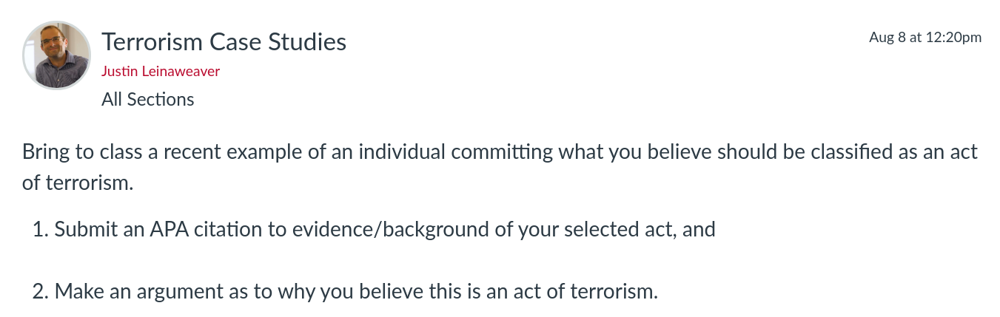

---
output:
  xaringan::moon_reader:
    css: ["default", "extra.css"]
    lib_dir: libs
    seal: false
    nature:
      highlightStyle: github
      highlightLines: true
      countIncrementalSlides: false
      ratio: '16:9'
---

```{r, echo = FALSE, warning = FALSE, message = FALSE}
##xaringan::inf_mr()
## For offline work: https://bookdown.org/yihui/rmarkdown/some-tips.html#working-offline
## Images not appearing? Put images folder inside the libs folder as that is the main data directory

library(tidyverse)
##library(readxl)
##library(stargazer)
##library(kableExtra)
##library(modelr)

knitr::opts_chunk$set(echo = FALSE,
                      eval = TRUE,
                      error = FALSE,
                      message = FALSE,
                      warning = FALSE,
                      comment = NA)
```

background-image: url('libs/Images/00-Leviathan_Cover_55.png')
background-size: 100%
background-position: center
class: middle

.center[.size40[**III. How and why do non-state actors use political violence?**]]

<br>

.size50[

**Today's Agenda**

- Defining Terrorism: Case Studies
]

<br>

.center[.size40[
  Justin Leinaweaver (Fall 2023)
]]

???

### Prep for Class
1. Review submitted cases on Canvas

2. Prep a Google sheet for unpacking cases and publish on Modules
    - [LINK](https://docs.google.com/spreadsheets/d/1R63XZ-m1qwXVNRYofDbYQFoqHMANvO5upJXD4RSLZrM/edit?usp=sharing)
    
3. Save notes from today for next class (e.g. end of class operationalization elements need to go into slides for next class)

<br>

Today we kick off the third section of our class.

<br>

What explains the variation in how and why non-state actors use political violence?

- Specifically, we'll focus on terrorism.


---

background-image: url('libs/Images/background-blue_triangles2.png')
background-size: 100%
background-position: center
class: middle, center

.size65[.content-box-purple[**For Today**]]

<br>

```{r, echo = FALSE, fig.align = 'center', out.width = '100%'}

```

???

### Everybody ready for our work today?

<br>

### All citations in APA format?


---

background-image: url('libs/Images/10_1-Terrorism_Background_filter75.png')
background-size: 100%
background-position: center
class: middle, inverse

.size50[.textwhite[**"Terrorism"**]]

.size45[
**1) Concept**

**2) Case studies**

**3) Operationalization**

**4) Instrumentation**

**5) Measurement**
]

???

For this week we attack "terrorism" using the steps we worked through in Week 2 (and since).

<br>

Our prompt for today focused on the concept of "terrorism"

- Each of you has brought in a case that you argue represents this concept

- Today we review, compare and contrast your cases to unpack our assumptions about the concept AND broaden our familiarity with the real-world debates about it

- Ultimately our goal today is to operationalize the concept

<br>

### Refresh my memory, what does it mean to operationalize a concept and how do I know if my operationalization is useful?

- (Operationalization is "...selecting observable phenomena to represent abstract concepts" (89).)

- ("To be useful...operational definitions must tell us **precisely and explicitly** what to do in order to determine what quantitative value should be associated with a variable in any given case (92).)

<br>

As we did in Week 7 I'd like us to begin by unpacking your cases.

- **SLIDE**: Everybody open up the link to the Google Sheet on Modules: Wk10 - Unpacking the Cases: Terrorism

<br>

#### Notes
- Brians, Craig Leonard, Lars Willnat, Jarol B. Manheim, and Richard C. Rich. 2011. “From Abstract to Concrete: Operationalization and Measurement.” In Empirical Political Analysis, Boston, MA: Longman, (ONLY p88-110)


---

background-image: url('libs/Images/background-red_flipped.png')
background-size: 100%
background-position: center
class: middle

.size40[
.center[.content-box-white[**Unpacking the Cases: Terrorism**]]

1. Who did it?

2. Who (or what) was the target?

3. What was the specific act?

4. What was the stated rationale for the act?

5. What was the immediate result?

6. Any other important context for your case?
]

???

### Any questions on these prompts?

<br>

That last one gives you space for any other important details that explain why you chose this case that isn't captured in these other questions.

<br>

Go!

<br>

*Split class into small groups (4?)*

GROUPS, compare and contrast all of the cases in order to construct a definition of terrorism

- In a sense, ask yourself what is common or most important to the cases unpacked by our class and use that to build a definition.

<br>

### Questions?

- Let's go! Get those definitions up on the board!

<br>

PRESENT and DISCUSS each

<br>

#### Class Notes

*2019 class*

Common Chars
- one-sided violence
- Important purpose more important than survival
- Cause fear
- Political
- Non-state actor
- Intend to maximize casualties
- Strategic
- Claimed by or affiliated with known terror group
- Motivated to target a specific group (religion/race/ethnicity)

Groupings
- Domestic vs international
- Specific goal vs spur of the moment
- Unaffiliated vs affiliated with group
- Violence vs threat

Key Questions
- Fear as the goal?
- Action done by state, non-state or both?
- Targets politically motivated or other aims included (e.g. profit?)
- Proximity to the violent act (do the bombing vs send someone to do it vs funding groups who act in ways you like?)

*2015 class*
- Civilians or not?
- attacking people not related to the policy you object to
- Terror / fear important
- Connections to other terror actions
- Attacks on freedom of expression (e.g. specific policy)
- Ideological objectives too
- In response to the actions of a government actor
- Attack on a building, no deaths, symbolic violence
- Acts meant to intimidate, may or may not be related to a specific policy change
- Revenge against government overreach
- Direct opposition to a government
- Providing support to a violent group as terrorism
- Groups vs individuals
- To make a statement
- To deliver harm to a government
- Done by a "terror group"
- Targeting a government vs targeting military
- nature of the group, non-state
- Targeting government, act of protest
- Kidnapping as form of violence, targeting civilians, spreading fear 


---

background-image: url('libs/Images/10-1-terrorism_word_cloud.jpg')
background-size: 100%
background-position: center
class: middle

???

Alright, let's combine our efforts.

- Can we operationalize terrorism based on our work today?

- *ON BOARD*


---

background-image: url('libs/Images/background-blue_triangles.jpg')
background-size: 100%
background-position: center

class: middle

.size55[.content-box-white[**For Next Class**]]

<br>

.size45[
1. Tilly (2004). Terror, Terrorism, Terrorists. *Sociological Theory*

2. Schmid (2023). Defining Terrorism. *International Centre for Counter-Terrorism*.
]

???

Next class I've assigned you two academic attempts to define terrorism.

- Let's read those and see how they compare with our work!

