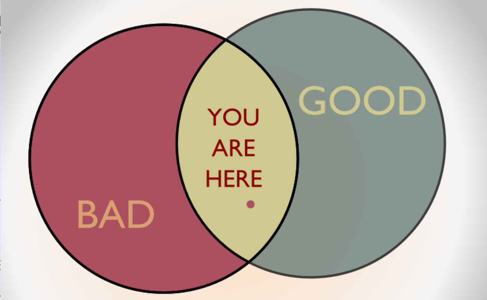

---
output:
  xaringan::moon_reader:
    css: ["default", "extra.css"]
    lib_dir: libs
    seal: false
    nature:
      highlightStyle: github
      highlightLines: true
      countIncrementalSlides: false
      ratio: '16:9'
---

```{r, echo = FALSE, warning = FALSE, message = FALSE}
##xaringan::inf_mr()
## For offline work: https://bookdown.org/yihui/rmarkdown/some-tips.html#working-offline
## Images not appearing? Put images folder inside the libs folder as that is the main data directory

library(tidyverse)
##library(readxl)
##library(stargazer)
##library(kableExtra)
##library(modelr)

knitr::opts_chunk$set(echo = FALSE,
                      eval = TRUE,
                      error = FALSE,
                      message = FALSE,
                      warning = FALSE,
                      comment = NA)
```

class: slideblue

.size70[**Today's Agenda**]

<br>

.size50[.center[
Jaggar (2005): Can terrorism ever be morally permissible?
]]

<br>

<br>

.center[.size40[
  Justin Leinaweaver (Spring 2022)
]]

???

### Prep for Class
1. Translate in class work defining terrorism onto the slide for today (slide 3?)

<br>

Today I want to wrap up our exploration of the terrorism concept by drawing in questions of perspective and morality.


---

background-image: url('libs/Images/background-blue_triangles2.png')
background-size: 100%
background-position: center
class: middle

.size55[.center[**Terrorism**]]

.size45[
1. **Define the Concept**
    - What does terrorism mean in the abstract?

2. **Operationalize the Concept**
    - What "observable phenomena" should represent it?
]

???

First, let's start with what we've done so far.

### How have we been defining terrorism?

#### - What obervable phenomena can we tie to it?

*ON BOARD*


---

background-image: url('libs/Images/background-blue_triangles2.png')
background-size: 100%
background-position: center
class: middle

.size55[.center[**The Concept of Terrorism (Tilly 2004)**]]

<br>

.size45[
1. Terror as a strategy 

2. Multiple uses of terror 

3. Terror and other forms of struggle 

4. Terror and specialists in coercion
]

???

### Does Tilly's (2004) guiding points help us with this?

#### - Pros and cons of this list?


---

background-image: url('libs/Images/background-blue_triangles2.png')
background-size: 100%
background-position: center
class: middle

.size60[.center[**Terrorism Defined?**]]

<br>

.size45[
+ Non-state actor using violence/harmful acts to send a signal to the target / recruit allies / dissuade 3rd parties

+ Intimidation strategy using violence against people or property and connected to a political struggle
]

???

### What do we think?

#### - Have we addressed tilly's concerns about adopting unhelpful generalizations?

<br>

Let's build up to the Jagger article for today by examining four more complicating perspectives on terrorism.


---

background-image: url('libs/Images/10_3-terrorist_or_freedom_fighter.png')
background-size: 85%
background-position: center

???

Perspectives on Terrorism 1: "One person’s terrorist is another person’s freedom fighter"

### What does this mean?

### How does this help us think about terrorism? 

### How does our definition deal with this?

<br>

Perspective 1: Can we ever separate the subjective element outside of defining terrorism?

No one thinks of themselves as the bad guy.

- Important for understanding strategies chosen by these actors.

- Some lines likely exist they will not cross, some justification absolutely exists for their behavior.


---

background-image: url('libs/Images/background-blue_triangles2.png')
background-size: 100%
background-position: center
class: middle

.size45[
"Now suppose there is a desperate bandit lurking in the fields and one thousand men set out in pursuit of him. The reason all look for him as they would a wolf is that each one fears that he will arise and harm him. This is the reason one man willing to throw away his life is enough to terrorize a thousand."

— Chinese military philosopher Wu Ch’i
]

???

Perspective 2

### What does this mean?

### How does this help us think about terrorism? 

### How does our definition deal with this?

<br>

(Even weak groups can achieve terrifying ends if they are sufficiently committed to their cause.)

- Small groups with "correct timing, surgical precision and an unambiguous purpose" can represent "an invaluable weapon of war" (Martin 2016 p33).

- Does this pre-suppose that terrorism is a strategy only of the weak?

<br>

Perspective 2: Can we ever separate the subjective element outside of defining terrorism? Of course we can. It's context based, not subjective.

- Any non-state actor choosing to use or threaten violence against civilians to achieve aims outside the norms and rules by which our society has decided to organize itself is a terrorist. 
- Yes this means our definition must adjust to whatever the local conditions are in a state and yes that means people living under brutal regimes are bound by the rules of those regimes, but acting outside those rules in ways that harm non-combatants is terrorism.


---

background-image: url('libs/Images/10_3-Goldwater_quote.png')
background-size: 100%
background-position: center

???

Quote from Sen. Barry Goldwater during his run for the presidency in 1964: Extremism in defense of liberty is no vice.

### What does this mean?

### How does this help us think about terrorism? 

### How does our definition deal with this?

<br>

(Swap out "liberty" for any other cause and one can understand the kind of single-minded devotion that leads to terrorist actions.)

- Frames the cause in terms of good vs evil.

<br>

Perspective 3: Goldwater quote to muddy the waters again and connect to US policy discourse. 

- This sentiment pervades many modern debates in the US and has been used to justify some truly messed up acts.


---

background-image: url('libs/Images/10_3-life_magazine_quote.png')
background-size: 100%
background-position: center

???

Destroy the town to save it.

- A notorious quote from a US Army officer explaining why a Vietnamese town overrun by Viet Cong soldiers had been destroyed by aerial bombing.

I am NOT asserting this is or isn't terrorism.

- Just interested in the perspective on a controversial act of violence.

<br>

### What does this mean?

### How does this help us think about terrorism? 

### How does our definition deal with this?

<br>

(Symbolic argument: There is nothing worse than being occupied by the enemy so bombing the town prevented that outcome.)

- The "village" can be replaced by any symbolic value.

Terrorists often use this kind of logic to justify imposing hardships on even their own supporters.

<br>

Perspective 4: History is written by the powerful. States can convey legitimacy on horrible acts (or at least can try to...)


---

background-image: url('libs/Images/background-blue_triangles2.png')
background-size: 100%
background-position: center
class: middle

.size35[
"Terrorism is the use of extreme threats or violence designed to intimidate or subjugate governments, groups, or individuals. It is a tactic of coercion intended to promote further ends that in themselves may be good, bad or indifferent. Terrorism may be practiced by governments or international bodies or forces, sub-state groups or even individuals. Its threats or violence are aimed directly or immediately at the bodies or belongings of innocent civilians but these are typically terrorists’ secondary targets; the primary targets of terrorists are the governments, groups or individuals that they wish to intimidate" (Jaggar 2005, 209).
]

???

Today we add Alison Jaggar's definition and moral discussion of terrorism.

### Compare and contrast this definition with our case studies and Tilly's four steps. Is it really that substantiveley different?

- threats or actual violence?
- does "subjugation" add anything new?
- "good, bad or indifferent" vs Tilly's connection to political struggle

<br>

### What specific advantages does Jaggar argue this definition provides?

1. Terrorism Is Not a Specific Type of Conflict; Instead It Is a Tactic That May Be Employed in Various Types of Conflict and in Combination with Other Strategies of Making Claims

2. Terrorism Should Not Be Equated with Any Particular Method of Intimidation. Terrorists Use a Variety of Methods, All of Which May Also Be Used in Contexts That Are Not Terrorist

3. This Account Facilitates Moral Assessment

<br>

### What are the two reasons Jaggar argues that this definition makes clear terrorism is morally repugnant?

(p212: terrorism is bad)

1. First, terrorism is morally repugnant because terrorists engage in coercion and intimidation, which are regarded ordinarily as morally wrong.

2. Second, terrorism is morally repugnant because terrorists harm or threaten those who have not harmed them and do not threaten them, people who can in no way be said to deserve the harm.


---

class: middle, slideblue

.size50[.center[**Jaggar’s (2005): A Moral Terrorism?**]]

.pull-left[
.size30[
1. Just cause 

2. Competent authority 

3. Right intention 

4. Proportionality 

5. Last resort 

6. Reasonable hope of success 

7. Aim of peace
]]

.pull-right[

<br>

```{r, echo = FALSE, fig.align = 'center', out.width = '100%'}

```
]

???

Despite this, Jaggar proposes a set of seven criteria that, when combined, may describe acts that are morally acceptable.

### Explain each to me

<br>

Let's evaluate the list

#### - Are all seven mutually exclusive criteria?

#### - Any problematic / vague inclusions?

<br>

Take a minute, evaluate your case study from monday using this list.

#### - Does anybody have a case that hits many of these elements?

#### - Who hits the most?

#### - Who hits the fewest?

#### - To what degree is classifying your case with this list a valid and reliable exercise? Why or why not?

<br>

### Overall, does this describe an act of morally justified terrorism? Why or why not?

<br>

### Can any act of terrorism be morally justified? Why or why not?
