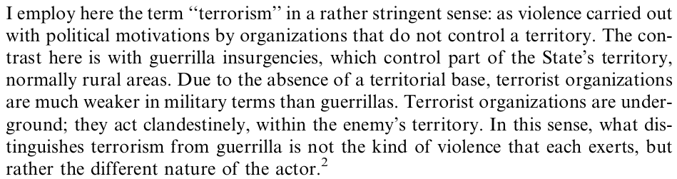

---
output:
  xaringan::moon_reader:
    css: ["default", "extra.css"]
    lib_dir: libs
    seal: false
    nature:
      highlightStyle: github
      highlightLines: true
      countIncrementalSlides: false
      ratio: '16:9'
---

```{r, echo = FALSE, warning = FALSE, message = FALSE}
##xaringan::inf_mr()
## For offline work: https://bookdown.org/yihui/rmarkdown/some-tips.html#working-offline
## Images not appearing? Put images folder inside the libs folder as that is the main data directory

library(tidyverse)
##library(readxl)
##library(stargazer)
##library(kableExtra)
##library(modelr)

knitr::opts_chunk$set(echo = FALSE,
                      eval = TRUE,
                      error = FALSE,
                      message = FALSE,
                      warning = FALSE,
                      comment = NA)
```

class: slideblue

.size70[**Today's Agenda**]

<br>

.size55[.center[
Explore Sanchez-Cuenca's (2007) arguments concerning nationalist terrorism
]]

<br>

<br>

.center[.size40[
  Justin Leinaweaver (Spring 2022)
]]

???

### Prep for Class
1. ...

<br>

Today's Agenda: Explore Sanchez-Cuenca's (2007) arguments concerning nationalist terrorism.

- Is it a fundamentally different form of terrorism?

- Do we need special strategies to counter it?

<br>

Last week we started our exploration of terrorism with an attempt to define the concept itself and to explore its normative or moral underpinnings.


---

background-image: url('libs/Images/background-red.png')
background-size: 100%
background-position: center
class: middle, inverse

.size50[.center[**What explains the variation in how and why non-state actors use violence against states and people?**]]

<br>

.size35[
1. What does terrorism mean in the abstract?

2. What "observable phenomena" should represent it?

3. Can it ever be morally permissible?
]

???

WHAT DID WE CONCLUDE?

-  A GOOD DEFINITION MUST ACCOUNT FOR WHAT ELEMENTS?

- IS TERRORISM A SINGLE STRATEGY?

- CAN TERRORISM EVER BE MORAL?


---

background-image: url('libs/Images/background-red.png')
background-size: 100%
background-position: center
class: middle, inverse

.size60[.center[**A non-state actor using violence outside societal norms against people or property, meant to intimidate and connected to a political struggle**]]

???

IS OUR DEFINITION GETTING BETTER?

<br>

This week I want us to explore the types of terrorism that are discussed in the world.

Most people seem to assume that types of terror group matter for understanding the actions of those groups.

I want us to explore some of these "types" while challenging this assumption.

Specifically we'll ask, **is it really the case that nationalist terrorism is fundamentally different from religious terror?**

And, if so, **do they require different policy solutions?**


---

background-image: url('libs/Images/background-red.png')
background-size: 100%
background-position: center
class: middle, center, inverse

.size60[**What explains the variation in how and why non-state actors use violence against states and people?**]

<br>

<br>

.size45[**Q1. How does the framing of this project help us answer our question?**]

???

RESEARCH QUESTION?
("What makes nationalist terrorism different from revolutionary, fascist, or religious terrorism is the territorial claim.")

PUZZLES?

CONCEPTS DEFINED?


---

background-image: url('libs/Images/background-red.png')
background-size: 100%
background-position: center
class: middle, center, inverse

.size55[**Q1. How does the framing of this project help us answer our question?**]

<br>

```{r, echo = FALSE, fig.align = 'center', out.width = '100%'}

```


???

HOW DOES THE DEFINITION OF TERRORISM APPLIED HERE COMPARE AND CONTRAST TO OUR WORK ON THE CONCEPT LAST WEEK?

<br>

IS SETTING TERRORIST AS DIFFERENT FROM GUERILLA A USEFUL DISTINCTION FOR ANSWERING OUR BIG QUESTION? WHY OR WHY NOT?


---

background-image: url('libs/Images/background-red.png')
background-size: 100%
background-position: center
class: middle, center, inverse

.size60[**What explains the variation in how and why non-state actors use violence against states and people?**]

<br>

<br>

.size45[**Q2. The Model**]

.size45[**Q3. The Analyses**]

???

I want to combine our analyses of these two elements.

Ok, everybody turn to the conclusion section (p302)

AFTER ALL THE THEORY AND DATA ANALYZED, WHAT ARE THE MAIN CONCLUSIONS OF THE PAPER?

(Nationalist terrorism is different because its central aim is territorial, its main strategy is attrition and its goal is for the state to surrender control of that territory.)

<br>

AS A CONTRAST, WHAT DOES THE AUTHOR ARGUE IS THE PURPOSE OF REVOLUTIONARY TERRORISM?

(Mobilization)

- "Violence is considered a means to induce people to join the revolutionary movement (violence as "propaganda by the deed" or "armed propaganda")" (291).

<br>

Let's now evaluate the strength of those conclusions by building our two lists of analyses.

*ON BOARD: Strengths vs Weaknesses*

By strength let's say we mean that it adds more signal than noise.

By weakness let's say adds more noise than signal.

Help me make two lists, elements of the research that increase our confidence in this conclusion and elements that decrease it.

(SLIDE: 1. Case selection)


---

background-image: url('libs/Images/12_1-case_selection.png')
background-size: 100%
background-position: center

???

Let's start with the case selection (290-294).

1. ARE THESE COMPARABLE CASES? WHY OR WHY NOT?

- KEY SIMILARITIES?

- POSSIBLY PROBLEMATIC DIFFERENCES?

<br>

(SLIDE: Table 1 - comparative data)

(SLIDE: Table 2 - targets chosen)

(SLIDE: Figure 1 - fatalities)


---

background-image: url('libs/Images/12_1-table1.png')
background-size: 100%
background-position: center

???

(SLIDE: Table 1 - comparative data)


---

background-image: url('libs/Images/12_1-table1_2.png')
background-size: 100%
background-position: center

???

(SLIDE: Table 2 - targets chosen)


---

background-image: url('libs/Images/12_1-fig1.png')
background-size: 100%
background-position: center

???

(SLIDE: Figure 1 - fatalities)

<br>

SO, GIVEN ALL OF THIS ARE WE COMFORTABLE GENERALIZING FROM THESE TWO CASES?

- DO THE ANALYSES OF THESE SPEAK TO NATIONALIST TERRORISM FOUND ELSEWHERE IN THE WORLD? WHY OR WHY NOT?

<br>

SO, BOTTOM LINE, IS CASE SELECTION A STRENGTH OR A WEAKNESS FOR THE PAPER?


---

class: middle, slideblue, center

.size60[**Sanchez-Cuenca (2007)**]

.size50[**Strengths and Weaknesses**]

<br>

<br>

.size60[The "War of Attrition" Strategy]

.size50[p294 - 296]

???

Let's now evaluate the "war of attrition" as a strategy (p294-296).

IS THIS A CLEAR AND USEFUL CONCEPT FOR THIS ANALYSIS?

- DEFINITION OF "ATTRITION" (P294-5 IN MILITARY CONTEXT)

- WHAT IS THE INTUITION BEING DEVELOPED HERE?

<br>

SO, IS IT A STRENGTH OR WEAKNESS OF THE PAPER?

<br>

On pages 294-296 Sanchez-Cuenca appears to generate a series of hypotheses.

Everybody take a look at these pages and tell me what you can extract.


---

class: middle, slideblue

.size60[.center[**Sanchez-Cuenca (2007)**]]

.size50[.center[**Strengths and Weaknesses**]]

<br>

.size50[The "War of Attrition" Strategy]

.size35[
+ Early period, more killings for lack of intelligence

+ More attacks, more intelligence developed

+ More intelligence, more killings prevented

+ Rate of arrests > Rate of new recruits, killings decrease
]

???

ARE WE CLEAR ON THESE?

DO THEY MAKE SENSE AS A MODEL OF POLITICS? WHY OR WHY NOT?

SO, IS THE MODEL A STRENGTH OR WEAKNESS OF THE PAPER?


---

class: middle, slideblue

.size60[.center[**Sanchez-Cuenca (2007)**]]

.size50[.center[**Strengths and Weaknesses**]]

<br>

<br>

.size60[.center[The Analyses]]

.size50[.center[(p298-ish)]]

???

HOW CONVINCED ARE YOU BY THE ANALYSES IN THE PAPER?

- DATA SOURCES AS STRENGTH OR WEAKNESS? (p298)

- OPERATIONALIZATIONS AND MEASUREMENT AS STRENGTH OR WEAKNESS??

- PROBLEMS WITH DEVELOPING THEORY AND TESTING THEORY ON THE SAME CASES OVER THE SAME PERIOD?

- THE FINDINGS THEMSELVES (p298)

Opposite findings across the two groups are confusing...

(SLIDE: Table 3 VAR models, time-series regressions)


---

background-image: url('libs/Images/12_1-Table3.png')
background-size: 53%
background-position: center


---

background-image: url('libs/Images/background-red.png')
background-size: 100%
background-position: center
class: middle, inverse

.size55[.center[**What explains the variation in how and why non-state actors use violence against states and people?**]]

<br>

.size45[
+ Is nationalist terrorism fundamentally different from other types?

+ Do we need special strategies to counter it?
]

???

So, bottom line for us.

ARE WE CONVINCED THAT NATIONALIST TERRORISM IS FUNDAMENTALLY DISTINCT FROM OTHER TYPES OF TERRORISM OR ACTS OF POLITICAL VIOLENCE?

- WHY OR WHY NOT?

<br>

DOES NATIONALIST TERRORISM REQUIRE DIFFERENT POLICY APPROACHES TO ADDRESS IT?

- WHY OR WHY NOT?


