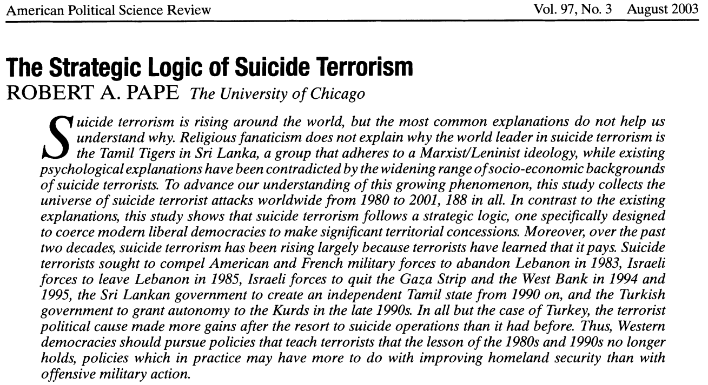
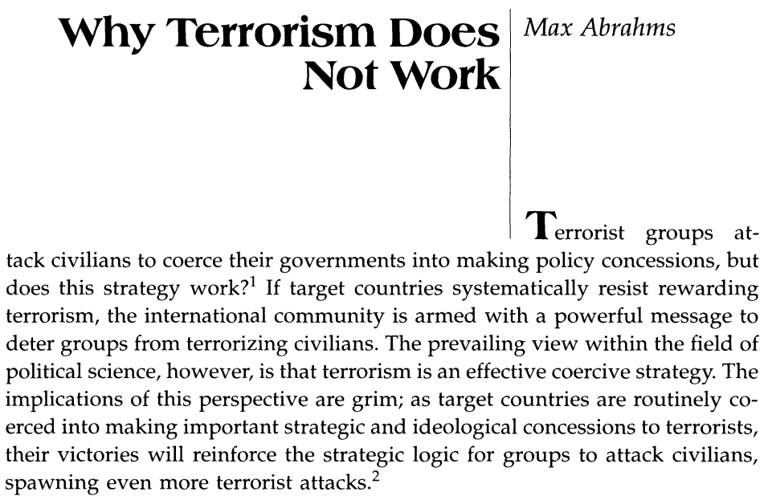

---
output:
  xaringan::moon_reader:
    css: ["default", "extra.css"]
    lib_dir: libs
    seal: false
    nature:
      highlightStyle: github
      highlightLines: true
      countIncrementalSlides: false
      ratio: '16:9'
---

```{r, echo = FALSE, warning = FALSE, message = FALSE}
##xaringan::inf_mr()
## For offline work: https://bookdown.org/yihui/rmarkdown/some-tips.html#working-offline
## Images not appearing? Put images folder inside the libs folder as that is the main data directory

library(tidyverse)
##library(readxl)
##library(stargazer)
##library(kableExtra)
##library(modelr)

knitr::opts_chunk$set(echo = FALSE,
                      eval = TRUE,
                      error = FALSE,
                      message = FALSE,
                      warning = FALSE,
                      comment = NA)
```

background-image: url('libs/Images/00-Leviathan_Cover_55.png')
background-size: 100%
background-position: center
class: middle

.center[.size40[**III. How and why do non-state actors use political violence?**]]

<br>

.size50[

**Today's Agenda**

- Can "terrorism" ever "succeed"?
]

<br>

.center[.size40[
  Justin Leinaweaver (Fall 2023)
]]

???

### Prep for Class
1. Review submitted cases on Canvas

2. Prep (and publish on Canvas) the Google Sheet for unpacking the cases
    - https://docs.google.com/spreadsheets/d/1vNlcBY2pBTato7NPai09BsJpB9s4kfHk4zYoBOdqGNs/edit?usp=sharing

<br>

**SLIDE**: We're tackling a big question this week


---

background-image: url('libs/Images/background-red_flipped.png')
background-size: 100%
background-position: center
class: middle

.center[.size50[.content-box-white[**Can "terrorism" ever "succeed"?**]]]

<br>

.pull-left[
```{r, echo = FALSE, fig.align = 'center', out.width = '100%'}

```
]

.pull-right[
```{r, echo = FALSE, fig.align = 'center', out.width = '100%'}

```
]

???

The debate about whether terrorism can be effective as a political strategy is far from settled in the literature.

<br>

This week I want us to examine recent case studies and two of the most cited articles in this debate

- Robert Pape's (2003) article has well above 2,400 citations

- Abrahms (2006) response to Pape is compelling and worth considering

<br>

### What does this question assume is true about terrorism?

### - In other words, what are the assumptions implicit in this framing of the question?

- (**SLIDE**)


---

background-image: url('libs/Images/background-red_flipped.png')
background-size: 100%
background-position: center
class: middle

.size50[.center[.content-box-white[**Can "terrorism" ever "succeed"?**]]]

<br>

.size50[
1. "Terrorists" have "goals" (e.g. are strategic, rational actors)

2. We can evaluate their "acts" in terms of those "goals" (e.g. was it a success or failure?) ]

???

There are a couple of key assumptions I'm making here that we are going to adopt for today

1. I am assuming that "terrorists" are strategic, instrumentally rational actors (e.g they have goals), AND

2. That we can identify and evaluate their actions in terms of those goals (e.g. "success" vs "failure")

<br>

### Do we have any concerns with these assumptions as jumping off points for our work? Why or why not?


---

background-image: url('libs/Images/background-red_flipped.png')
background-size: 100%
background-position: center
class: middle

.size60[.center[.content-box-white[**For Today**]]]

<br>

```{r, echo = FALSE, fig.align = 'center', out.width = '100%'}
knitr::include_graphics("libs/Images/11_3-Assignment.png")
```

???

Before we dig into the academic literature I want us to take a shot at answering the question using real-world case studies.

<br>

### Everybody ready to go on this?

<br>

Let's unpack these cases as we have done previously in class.

- Link on Canvas Modules to a Google Sheet (Week 12)

- Everybody unpack their case using that sheet
    1. APA Citation
    2. Who is the "terrorist"?	
    3. What was their "goal"?	
    4. What was the specific act?	
    5. Why was this "successful"?	
    6. Other notes?
    
<br>

*Split into small groups (3-4)*
    
    
    
---

background-image: url('libs/Images/background-red_flipped.png')
background-size: 100%
background-position: center
class: middle

.size60[.center[.content-box-white[**Can "terrorism" ever "succeed"?**]]]

<br>

.size60[
1. Review the cases for clarity, and

2. Rank the cases from "most" to "least" successful]

???

Groups, take a few minutes to review all the cases

- Use this as a chance to request clarification from the submitter if anything doesn't make sense
    
- IMPORTANT: The ranking exercise requires some careful thought about your criteria for success

- Be ready to present your ranking and explain how you approached it

<br>

### Questions?

- Go!

<br>

Groups report back your rankings and explain your logic.

- For ease, give us your 2-3 "most successful" cases and your 2-3 "least successful" cases

<br>

*ON BOARD: Criteria for success?*


---

background-image: url('libs/Images/background-red.png')
background-size: 100%
background-position: center
class: middle, inverse, textwhite

.size55[.center[**Under what conditions are terrorists more or less likely to succeed in their aims?**]

1. Conditions raising P(Success)?

2. Conditions lowering P(Success)?
]

???

Let's now use your work to generate some testable hypotheses.

- Groups, take some time to build two lists

- What are the conditions that raise or lower the probability of a successful terror attack?

- This can be characteristics of the terrorist, the group, the ideology, the goals, the methods, anything.

<br>

### Questions on what I'm asking for?

- Go!

<br>

Let's report back!

- *ON BOARD* Two Lists


---

background-image: url('libs/Images/13-1-belfast_mural.png')
background-size: 100%
background-position: center
class: top, right

.size45[.content-box-red[**The Strategic Logic of Suicide Terrorism**]]

.size45[.content-box-red[**Pape (2003)**]]

???

For next class!


