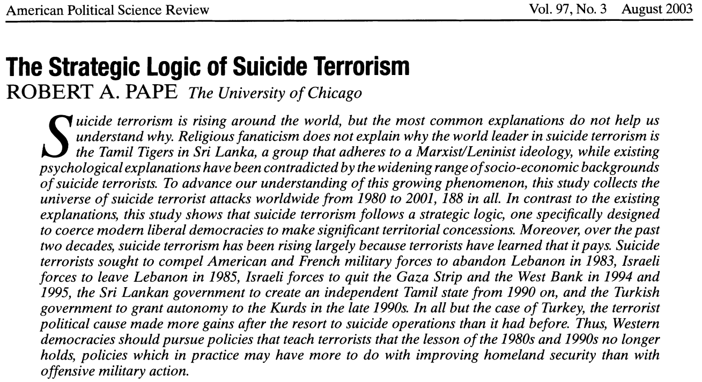
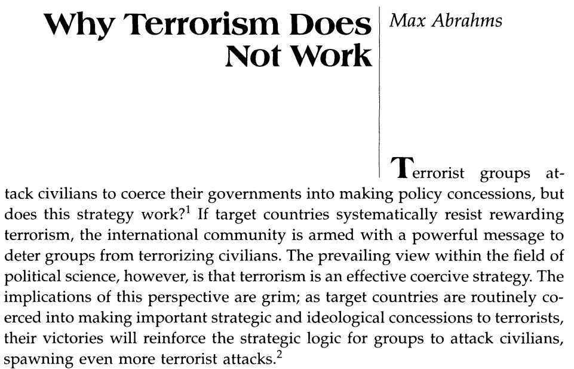

## Today's Agenda {background-image="Images/00-Leviathan_Cover_55.png" .center}

```{r}
library(tidyverse)
library(readxl)
library(kableExtra)

# Data for today
d <- read_excel("../../Data/EDTG/EDTG_Data.xls", guess_max = 10000)
```

<br>

**III. How and why do non-state actors use political violence?**

<br>

- Can "terrorism" ever "succeed"?

<br>

::: r-stack
Justin Leinaweaver (Fall 2025)
:::

::: notes
Prep for Class

1. Review submissions on Canvas

2. Prep (and publish on Canvas) the Google Sheet for unpacking the cases

3. Markers x 5

<br>

**SLIDE**: We're tackling a big question this week

:::


## Can "terrorism" ever "succeed"? {background-image="Images/00-Leviathan_Cover_55.png" .center}

:::: {.columns}
::: {.column width="50%"}
{style="display: block; margin: 0 auto"}
:::

::: {.column width="50%"}
{style="display: block; margin: 0 auto"}
:::
::::

::: notes

The debate about whether terrorism can be effective as a political strategy is far from settled in the literature.

<br>

This week I want us to examine recent case studies and two of the most cited articles in this debate

- Robert Pape's (2003) article has well above 2,400 citations

- Abrahms (2006) response to Pape is compelling and worth considering

<br>

### What does this question assume is true about terrorism?

### - In other words, what are the assumptions implicit in this framing of the question?

- (**SLIDE**)

:::


## Can "terrorism" ever "succeed"? {background-image="Images/00-Leviathan_Cover_55.png" .center}

<br>

1. "Terrorists" have "goals" (e.g. are strategic, rational actors)

2. We can evaluate their "acts" in terms of those "goals" (e.g. was it a success or failure?)

::: notes

There are a couple of key assumptions I'm making here that we are going to adopt for today

1. I am assuming that "terrorists" are strategic, instrumentally rational actors (e.g they have goals), AND

2. That we can identify and evaluate their actions in terms of those goals (e.g. "success" vs "failure")

<br>

### Do we have any concerns with these assumptions as jumping off points for our work? Why or why not?

:::


## For Today {background-image="Images/00-Leviathan_Cover_55.png" .center}

<br>

::: {.r-fit-text}

Can terrorism be an effective strategy?

- Go find us cases!

:::

::: notes

Before we dig into the academic literature I want us to take a shot at answering the question using real-world case studies.

<br>

**Everybody ready to go on this?**

<br>

Let's unpack these cases as we have done previously in class.

- Link on Canvas Modules to a Google Sheet (Week 12)

- Everybody unpack their case using that sheet
    1. APA Citation
    2. Who is the "terrorist"?	
    3. What was their "goal"?	
    4. What was the specific act?	
    5. Why was this "successful"?	
    6. Other notes?
    
<br>

*Let's split the class into four groups (for board space)*

- Go sit with your group

:::


## {background-image="Images/00-Leviathan_Cover_55.png" .center}

::: {.r-fit-text}

**Can "terrorism" ever "succeed"?**

1. Review the cases for clarity

::: {.fragment}

2. Make three lists on the board:
    
    i. The "most successful" cases
    
    ii. The "somewhat successful" cases 
    
    iii. The "least successful" cases
:::
:::
::: notes

Groups, take a few minutes to review all the cases

- Use this as a chance to request clarification from the submitter if anything doesn't make sense

<br>

**REVEAL**: Your first big job is to classify the cases into three groups

- My intention for this exercise is to use these cases to help us generate new theories of terrorism, not develop a measurement of success

- Some of these "success" cases will seem super clear to you and others less so

- At this point I just want you to trust your gut as you review the cases

<br>

**Questions on the task?**

- Go!

<br>

**SLIDE**: Ok, groups, next job.

:::


## Theories of Successful Terrorism {background-image="Images/00-Leviathan_Cover_55.png" .center}

<br>

::: {.r-fit-text}

**What are the criteria that explain your lists?**

1. What explains the "most successful" classification?

2. What explains the "least successful" classification?

:::

::: notes

NOW I want you to analyze your classifications

- Help us unpack your work

- What are the elements of these acts of terrorism that pushed you to call them "most" or "least" successful?

- Two new lists on the board!

<br>

**Questions?**

- Go!

<br>

**SLIDE**: Groups report back

:::


## Theories of Successful Terrorism {background-image="Images/00-Leviathan_Cover_55.png" .center}

<br>

**Under what conditions are terrorists more or less likely to succeed in their aims?**

1. Conditions raising P(Success)?

2. Conditions lowering P(Success)?

::: notes

Groups report back your work and walk us through your theory of when terrorism can be successful

- *PRESENT and DISCUSS proposals*

<br>

**After all this work, where do you end up on our big question?**

- **Can terrorism ever be effective? Why or why not?**

<br>

**SLIDE**: Next class

:::


## {background-image="Images/13-1-belfast_mural.png"}

[**The Strategic Logic of Suicide Terrorism (Pape 2003)**]{style="color:red;"}

- [Submit analysis to Canvas]{style="color:red;"}

::: notes

For next class!

<br>

Canvas Assignment: Analyzing the Pape (2003) Argument

Diagram the theoretical model proposed in this paper. Who are the key interests? What are the key institutions? And what are the primary interactions?


:::


