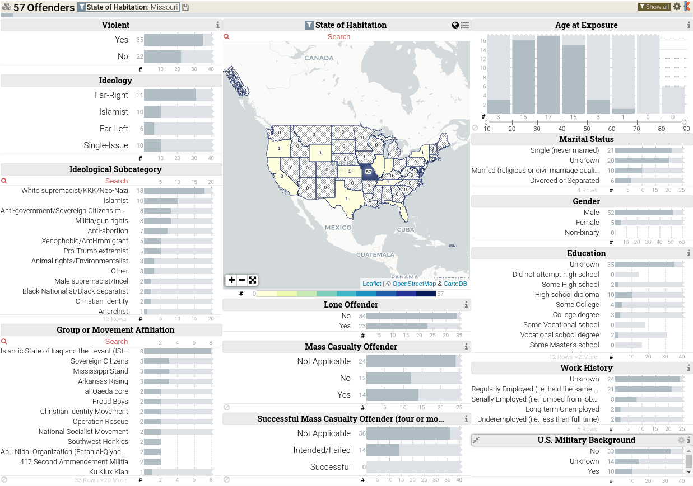

---
output:
  xaringan::moon_reader:
    css: ["default", "extra.css"]
    lib_dir: libs
    seal: false
    nature:
      highlightStyle: github
      highlightLines: true
      countIncrementalSlides: false
      ratio: '16:9'
---

```{r, echo = FALSE, warning = FALSE, message = FALSE}
library(tidyverse)
library(readxl)
library(stargazer)
library(kableExtra)
library(sf)
library(rnaturalearth)
library(rnaturalearthdata)
library(countrycode)

knitr::opts_chunk$set(echo = FALSE,
                      eval = TRUE,
                      error = FALSE,
                      message = FALSE,
                      warning = FALSE,
                      comment = NA)

d <- read_excel("../../Data/PIRUS/PIRUS_March2023/PIRUS_V4.xlsx", guess_max = 10000)
```

background-image: url('libs/Images/00-Leviathan_Cover_55.png')
background-size: 100%
background-position: center
class: middle

.size70[**Today's Agenda**]

<br>

.size60[
.center[
Evaluate the Profiles of Individual Radicalization in the United States (PIRUS) Data project
]]

<br>

.center[.size40[
  Justin Leinaweaver (Fall 2023)
]]

???

### Prep for Class
1. ?

<br>

PIRUS Data project

- [Main website](https://www.start.umd.edu/data-tools/profiles-individual-radicalization-united-states-pirus)

- [Search and Visualization tool](https://www.start.umd.edu/profiles-individual-radicalization-united-states-pirus-keshif)

---

background-image: url('libs/Images/background-green_blue_swirl_side.jpg')
background-size: 100%
background-position: center
class: middle, center

.size60[**For Today**]

<br>

.size50[

]

???


---

background-image: url('libs/Images/02_2-protestors_fire2.png')
background-size: 100%
background-position: center
class: middle

.size50[**Measuring "Political Violence"**]

.size45[
**1) Concept**

**2) Operationalization**

**3) Instrumentation**

**4) Measurement**
]

???

Refresh week 2 material from Brians et al (2011): concept -> operationalization ("The process of selecting observable phenomena to represent abstract concepts") -> instrumentation (
...the specification of steps to take in making observations") -> measurement ("The application of an instrument to assign numerical values to cases")


---

background-image: url('libs/Images/background-light_grey.jpg')
background-size: 100%
background-position: center
class: middle

.size35[.center[.content-box-white[**Profiles of Individual Radicalization in the United States (PIRUS)**]]]

.pull-left[

<br>

```{r, fig.align='center', out.width='100%'}

```
]

.pull-right[
.size40[
<br>

<br>

**Inclusion Criteria**

- p6-10
]]

???

PIRUS focus is on a specific set of non-state actors who are caught actively pursuing certain ends.


Take some time to review the inclusion criteria

- diagram and evaluate each of the criteria

- pros and cons?

Keys to consider:
- why only cases radicalized in the US?
- Why only these ideologies?
- Why must the views be "espoused"?


<br>

What does all of this mean for the comprehensiveness of the dataset?


Codebook suggests this is a "selection" of groups? What criteria? What may be missing?

- "PIRUS includes a sample of individuals espousing Islamist, far right, far left, or single-issue ideologies who have radicalized within the United States to the point of committing ideologically motivated illegal violent or non-violent acts, joining a designated terrorist organization, or associating with an extremist organization whose leader(s) has/have been indicted of an ideologically motivated violent offense" (p6).

Inclusion Criteria (p8-9)

Summary: In order to be eligible for inclusion, each individual must meet one of the following five criteria:
1. the individual was arrested;
2. the individual was indicted of a crime;
3. the individual was killed as a result of his or her ideological activities;
4. the individual is/was a member of a designated terrorist organization; or
5. the individual was associated with an extremist organization whose leader(s) or founder(s) has/have been indicted of an ideologically motivated violent offense.

In addition, each individual MUST:
1. have been radicalized in the United States,
2. have espoused or currently espouse ideological motives, and
3. show evidence that his or her behaviors are/were linked to the ideological motives he or she espoused/espouses.


---

background-image: url('libs/Images/background-light_grey.jpg')
background-size: 100%
background-position: center
class: middle

.size35[.center[.content-box-white[**Profiles of Individual Radicalization in the United States (PIRUS)**]]]

.pull-left[

<br>

```{r, fig.align='center', out.width='100%'}

```
]

.pull-right[
.size30[
**Groups of Variables**
- Plot and Consequences

- Group Nature

- Radicalization

- Demographics

- Socioeconomic Status

- Personal
]]

???

Now shift focus to the observations in the dataset.

- Assuming these are the "right" cases to focus on, any concerns about the validity and reliability of the operationalization, instrumentation, measurement of these variables?

<br>

Split class into groups (one group per category), build strengths and weaknesses lists on the board analyzing the codebook across these three categories: operationalization, instrumentation, measurement

<br>

Ok, report back.

### Any concerns with validity?

### Any concerns with reliability?


---

class: slideblue, middle, full

```{r, fig.retina=3, fig.align='center', out.width='95%', fig.height=6, fig.width=10, cache=FALSE}
## Make a map
library(spData)

# Summarize data
d_sum <- d |>
  count(Loc_Habitation_State1, name = "Count") |>
  filter(Loc_Habitation_State1 != "-99")

# Merge data
d10 <- left_join(us_states, d_sum, by = c("NAME" = "Loc_Habitation_State1"))

#summary(d_sum$Count)

d10 |>
  mutate(
    Count_cat = case_when(
      Count <= 25 ~ "0 - 25",
      Count <= 50 ~ "26 - 50",
      Count <= 75 ~ "51 - 75",
      Count <= 100 ~ "76 - 100",
      Count <= 200 ~ "101 - 200",
      Count > 200 ~ "200+"
    ),
    Count_cat = factor(Count_cat, levels = c("0 - 25", "26 - 50", "51 - 75", "76 - 100", "101 - 200", "200+"))
  ) |>
  ggplot() +
  geom_sf(aes(fill = Count_cat)) +
  labs(fill = "", title = "Count of Extremist Group Locations") +
  #theme(legend.position = "bottom") +
  scale_fill_brewer(type = "seq", palette = 8)
```

???

Main search page puts a version of this map on the center of the page.

### What do we learn from this?

<br>

**SLIDE**: This map makes the mistake that SO MANY US politics maps make by confusing population with the variable we are interested in.


---

class: slideblue, middle, full

```{r, fig.retina=3, fig.align='center', out.width='53%', fig.height=4, fig.width=8, cache=FALSE}
# Map 1
d10 |>
  mutate(
    Count_cat = case_when(
      Count <= 25 ~ "0 - 25",
      Count <= 50 ~ "26 - 50",
      Count <= 75 ~ "51 - 75",
      Count <= 100 ~ "76 - 100",
      Count <= 200 ~ "101 - 200",
      Count > 200 ~ "200+"
    ),
    Count_cat = factor(Count_cat, levels = c("0 - 25", "26 - 50", "51 - 75", "76 - 100", "101 - 200", "200+"))
  ) |>
  ggplot() +
  geom_sf(aes(fill = Count_cat)) +
  labs(fill = "", title = "Count of Extremist Group Locations") +
  #theme(legend.position = "bottom") +
  scale_fill_brewer(type = "seq", palette = 8)
```

```{r, fig.retina=3, fig.align='center', out.width='53%', fig.height=4, fig.width=8, cache=FALSE}
## Map 2
d10 |>
  mutate(
    scaled_per_million = Count / (total_pop_15 / 1e6),
    scaled_cat = case_when(
      scaled_per_million <= 5 ~ "0 - 5",
      scaled_per_million <= 10 ~ "6 - 10",
      scaled_per_million <= 15 ~ "11 - 15",
      scaled_per_million <= 20 ~ "16 - 20",
      scaled_per_million > 20 ~ "20+"
    ),
    scaled_cat = factor(scaled_cat, levels = c("0 - 5", "6 - 10", "11 - 15", "16 - 20", "20+"))
  ) |>
  ggplot() +
  geom_sf(aes(fill = scaled_cat)) +
  labs(fill = "", title = "Count of Extremist Group Locations (per million population)") +
  #theme(legend.position = "bottom") +
  scale_fill_brewer(type = "seq", palette = 8)
```

???

### What do we learn from the map that controls for population?

<br>

As ever, don't confuse geography for population!

**SLIDE**: Let's continue this exercise (counts) but broken down by the main variable in this project, ideology.


---

background-image: url('libs/Images/background-light_grey.jpg')
background-size: 100%
background-position: center
class: middle, center

.size70[
Is there a regional component to the distribution of groups by the four ideologies tracked in this project?
]

???


---

class: slideblue, middle, full

.pull-left[
```{r, fig.retina=3, fig.align='center', out.width='92%', fig.height=4, fig.width=8, cache=FALSE}
# 4 maps: count of groups by ideology scaled by population

# Islamist
d |>
  count(Radicalization_Islamist, Loc_Habitation_State1, name = "Count") |>
  filter(Loc_Habitation_State1 != "-99") |>
  filter(Radicalization_Islamist == 1) %>%
  left_join(us_states, ., , by = c("NAME" = "Loc_Habitation_State1")) |>
  mutate(
    scaled_per_million = Count / (total_pop_15 / 1e6),
    scaled_cat = case_when(
      scaled_per_million <= 5 ~ "0 - 5",
      scaled_per_million <= 10 ~ "6 - 10",
      scaled_per_million > 10 ~ "10+"
    ),
    scaled_cat = factor(scaled_cat, levels = c("0 - 5", "6 - 10", "10+"))
  ) |>
  ggplot() +
  geom_sf(aes(fill = scaled_cat)) +
  scale_fill_manual(values = c("mistyrose", "lightsalmon1", "red2"), drop = FALSE) +
  labs(fill = "", title = "US Based Islamic Radicals (per million population)")
```

```{r, fig.retina=3, fig.align='center', out.width='92%', fig.height=4, fig.width=8, cache=FALSE}
# Far Left
d |>
  count(Radicalization_Far_Left, Loc_Habitation_State1, name = "Count") |>
  filter(Loc_Habitation_State1 != "-99") |>
  filter(Radicalization_Far_Left == 1) %>%
  left_join(us_states, ., , by = c("NAME" = "Loc_Habitation_State1")) |>
  mutate(
    scaled_per_million = Count / (total_pop_15 / 1e6),
    scaled_cat = case_when(
      scaled_per_million <= 5 ~ "0 - 5",
      scaled_per_million <= 10 ~ "6 - 10",
      scaled_per_million > 10 ~ "10+"
    ),
    scaled_cat = factor(scaled_cat, levels = c("0 - 5", "6 - 10", "10+"))
  ) |>
  ggplot() +
  geom_sf(aes(fill = scaled_cat)) +
  scale_fill_manual(values = c("mistyrose", "lightsalmon1", "red2"), drop = FALSE) +
  labs(fill = "", title = "US Based Far Left Radicals (per million population)")
```
]

.pull-right[
```{r, fig.retina=3, fig.align='center', out.width='92%', fig.height=4, fig.width=8, cache=FALSE}
# Far Right
d |>
  count(Radicalization_Far_Right, Loc_Habitation_State1, name = "Count") |>
  filter(Loc_Habitation_State1 != "-99") |>
  filter(Radicalization_Far_Right == 1) %>%
  left_join(us_states, ., , by = c("NAME" = "Loc_Habitation_State1")) |>
  mutate(
    scaled_per_million = Count / (total_pop_15 / 1e6),
    scaled_cat = case_when(
      scaled_per_million <= 5 ~ "0 - 5",
      scaled_per_million <= 10 ~ "6 - 10",
      scaled_per_million > 10 ~ "10+"
    ),
    scaled_cat = factor(scaled_cat, levels = c("0 - 5", "6 - 10", "10+"))
  ) |>
  ggplot() +
  geom_sf(aes(fill = scaled_cat)) +
  scale_fill_manual(values = c("mistyrose", "lightsalmon1", "red2"), drop = FALSE) +
  labs(fill = "", title = "US Based Far Right Radicals (per million population)")
```

```{r, fig.retina=3, fig.align='center', out.width='92%', fig.height=4, fig.width=8, cache=FALSE}
# Single Issue
d |>
  count(Radicalization_Single_Issue, Loc_Habitation_State1, name = "Count") |>
  filter(Loc_Habitation_State1 != "-99") |>
  filter(Radicalization_Single_Issue == 1) %>%
  left_join(us_states, ., , by = c("NAME" = "Loc_Habitation_State1")) |>
  mutate(
    scaled_per_million = Count / (total_pop_15 / 1e6),
    scaled_cat = case_when(
      scaled_per_million <= 5 ~ "0 - 5",
      scaled_per_million <= 10 ~ "6 - 10",
      scaled_per_million > 10 ~ "10+"
    ),
    scaled_cat = factor(scaled_cat, levels = c("0 - 5", "6 - 10", "10+"))
  ) |>
  ggplot() +
  geom_sf(aes(fill = scaled_cat)) +
  scale_fill_manual(values = c("mistyrose", "lightsalmon1", "red2"), drop = FALSE) +
  labs(fill = "", title = "US Based Single Issue Radicals (per million population)")
```
]

???


---

background-image: url('libs/Images/background-light_grey.jpg')
background-size: 100%
background-position: center
class: middle, center

.size70[
What do we learn about the groups active in Missouri?
]

???

Click on Missouri (or filter observations to MO) and tell me about the characteristics of these groups.


---

class: middle, full, slideblue

```{r, fig.align='center', out.width='78%'}

```


---

background-image: url('libs/Images/background-light_grey.jpg')
background-size: 100%
background-position: center
class: middle

.size50[
.center[Compare and contrast observations by 'Residency_Status']

- Do extremists differ in levels of violence pursued?
    - 'Violent'
    
    - 'Primary_Event_Mass_Casualty_Incident'
]

???


---

class: middle, slideblue

.pull-left[
```{r, fig.retina=3, fig.asp=0.618, fig.align='center', out.width='100%', fig.width = 6.5}
# Acts by citizens vs non-citizens? Which more violent?
d2 <- d |> 
  mutate(
    residency = case_when(
      Residency_Status == 1 ~ "Born Citizen",
      Residency_Status == 2 ~ "Naturalized Citizen",
      Residency_Status == 3 ~ "Legal Perm Resident",
      Residency_Status == 4 ~ "Temporary",
      Residency_Status == 5 ~ "Undocumented",
      TRUE ~ NA_character_
    )
  )

# Violent Act
# Table
d2 |>
  group_by(residency) |>
  count(Violent) |>
  filter(!is.na(residency)) |>
  pivot_wider(names_from = Violent, values_from = n) |>
  rename("Residency" = residency, "Not" = `0`, "Violent Act" = `1`) |>
  kbl(align = 'c') |>
  kable_styling(bootstrap_options = c("striped", "hover", "condensed"), font_size = 24)

# Bar plot
d2 |>
  group_by(residency) |>
  count(Violent) |>
  filter(!is.na(residency)) |>
  mutate(
    Violent = if_else(Violent == 1, "Violent Act", "Not")
  ) |>
  ggplot(aes(x = residency, y = n, fill = Violent)) +
  geom_col(position = "fill", width = .7) +
  geom_hline(yintercept = .5, color = "red") +
  labs(x = "", y = "Proportion of Observations", fill = "") +
  scale_y_continuous(labels = scales::percent_format()) +
  scale_fill_brewer(type = "qual", palette = 7) +
  guides(fill = "none") +
  theme_bw() +
  annotate("text", x = 1, y = c(.25, .8), label = c("Violent\nActs", "Not"), size = 5)
```
]

.pull-right[
```{r, fig.retina=3, fig.asp=0.618, fig.align='center', out.width='100%', fig.width = 6.5}
# Aimed for mass causalty? four or more people being killed or injured
d2 |>
  group_by(residency) |>
  count(Primary_Event_Mass_Casualty_Incident) |>
  filter(!is.na(residency)) |>
  pivot_wider(names_from = Primary_Event_Mass_Casualty_Incident, values_from = n) |>
  select(-`-88`, -`NA`) |>
  rename("Residency" = residency, "Not" = `0`, "Mass Casualty" = `1`) |>
  kbl(align = 'c') |>
  kable_styling(bootstrap_options = c("striped", "hover", "condensed"), font_size = 24)

d2 |>
  group_by(residency) |>
  count(Primary_Event_Mass_Casualty_Incident) |>
  filter(!is.na(residency)) |>
  filter(Primary_Event_Mass_Casualty_Incident %in% c(0,1)) |>
  mutate(
    Primary_Event_Mass_Casualty_Incident = if_else(Primary_Event_Mass_Casualty_Incident == 1, "Aims for Mass Casualty", "Not")
  ) |>
  ggplot(aes(x = residency, y = n, fill = Primary_Event_Mass_Casualty_Incident)) +
  geom_col(position = "fill", width = .7) +
  geom_hline(yintercept = .5, color = "red") +
  labs(x = "", y = "Proportion of Observations", fill = "") +
  scale_y_continuous(labels = scales::percent_format()) +
  scale_fill_brewer(type = "qual", palette = 7) +
  guides(fill = "none") +
  theme_bw() +
  annotate("text", x = 1, y = c(.25, .8), label = c("Not", "Aim:\nMass\nCasualty"), size = 5)
```
]

???


---

background-image: url('libs/Images/background-light_grey.jpg')
background-size: 100%
background-position: center
class: middle, center

.size70[
How common is the internet or social media related to radicalization of individuals in the US?

- Internet_Radicalization
- Media_Radicalization
- Social_Media
- Social_Media_Frequency
]

???


---

class: middle, slideblue

```{r, fig.retina=3, fig.asp=0.618, fig.align='center', out.width='100%', fig.width = 6.5}
# internet and social media
d |> count(Internet_Radicalization)
d |> count(Media_Radicalization)
d |> count(Social_Media)
d |> count(Social_Media_Frequency)
```

???


---

background-image: url('libs/Images/background-light_grey.jpg')
background-size: 100%
background-position: center
class: middle, center

.size70[
Do individuals that pursue violent acts have different demographics or socioeconomic statuses from those that do not?

- Broad_Ethnicity
- Gender
- Education
- Employment_Status
]

???


---

class: middle, slideblue

```{r, fig.retina=3, fig.asp=0.618, fig.align='center', out.width='100%', fig.width = 6.5}
# internet and social media
d |> count(Violent, Broad_Ethnicity)
d |> count(Violent, Gender)
d |> count(Violent, Education)
d |> count(Violent, Employment_Status)
```

???


---

background-image: url('libs/Images/background-light_grey.jpg')
background-size: 100%
background-position: center
class: middle

.size60[.center[**For Next Class**]]

.size50[
...
]

???

