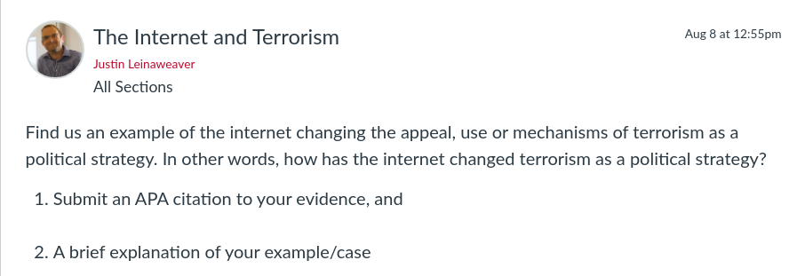

---
output:
  xaringan::moon_reader:
    css: ["default", "extra.css"]
    lib_dir: libs
    seal: false
    nature:
      highlightStyle: github
      highlightLines: true
      countIncrementalSlides: false
      ratio: '16:9'
---

```{r, echo = FALSE, warning = FALSE, message = FALSE}
##xaringan::inf_mr()
## For offline work: https://bookdown.org/yihui/rmarkdown/some-tips.html#working-offline
## Images not appearing? Put images folder inside the libs folder as that is the main data directory

library(tidyverse)
##library(readxl)
##library(stargazer)
##library(kableExtra)
##library(modelr)

knitr::opts_chunk$set(echo = FALSE,
                      eval = TRUE,
                      error = FALSE,
                      message = FALSE,
                      warning = FALSE,
                      comment = NA)
```

background-image: url('libs/Images/00-Leviathan_Cover_55.png')
background-size: 100%
background-position: center
class: middle

.center[.size40[**III. How and why do non-state actors use political violence?**]]

<br>

.size50[**Today's Agenda**

Case Studies: Examining the interaction between the internet and terrorism
]

<br>

.center[.size40[
  Justin Leinaweaver (Fall 2023)
]]

???

### Prep for Class
1. Review cases submitted on Canvas

<br>

In this final section of our work on terrorism we have been exploring the cutting-edge of terrorism research

- Last week we examined the literature on the rise of far-right terrorism (FRT), radicalization in the United States and whether or not there are significant differences in the kinds of terror used by different ideological groups.

<br>

This week we shift to examining the interaction between terrorism and the internet

1. How is the terror strategy adapting to a digital world?

2. Does the literature find evidence of these mechanisms in action?

3. What should we do about it?


---

background-image: url('libs/Images/background-blue_triangles.jpg')
background-size: 100%
background-position: center
class: middle

.size60[.content-box-white[**For Today**]]

<br>

```{r, echo = FALSE, fig.align = 'center', out.width = '100%'}

```

???

For today I asked everybody to submit a case we could use to develop our intuitions about this complicated interaction.

<br>

### Everybody ready to go with this?

<br>

*Split class into four groups, new people!*

- Go sit with your new group!


---

background-image: url('libs/Images/14_1-CyberTerrorism_v2.png')
background-size: 100%
background-position: center
class: bottom, center, inverse

???

Today we are going to use your submitted cases, and your own intuitions, to help us brainstorm a research project

- This means we need a 1) research question, 2) a theory, and 3) a clear idea of the kinds of data we would need to test it

<br>

**SLIDE**: Let's start with a research question!


---

background-image: url('libs/Images/14_1-CyberTerrorism_v3.png')
background-size: 100%
background-position: center
class: middle, center, inverse

.size60[**Propose a research question examining the interaction between the internet and terrorism**]

???

Groups, spit-ball some ideas for a question about the interaction between the internet and terrorism

- Report back your favorites!

<br>

*ON BOARD*

- ?

<br>

- How has the internet changed the appeal of terrorism?
- How has the internet changed the effectiveness of terrorism?
- How has the internet changed the ability of groups to commit acts of terrorism?
- How has the internet changed the utility of terrorism?

<br>

**SLIDE**: Ok, the question is in place so now we need a theory.


---

background-image: url('libs/Images/14_1-CyberTerrorism_v3.png')
background-size: 100%
background-position: center
class: middle, center, inverse

.size60[**Therefore, the internet increases...**]

???

We're going to develop a theory that proposes specific ways in which the internet changes terrorism.

- *ON BOARD*: Therefore, the internet increases the appeal/effectiveness/ease/utility of terrorism.

<br>

Groups, your job is to propose a model that supports this conclusion

<br>

Take some time to familiarize yourself with the submitted cases and use them to help you brainstorm causal mechanisms

- Does a case need clarification? Ask the submitter!

- Does a case sound particularly intriguing? Open the link!

<br>

Work directly on the board

- Write down your premises on the board so you can road test them (e.g. make sure they are a complete and clear idea)

- Plus, you need to see how they sequence together (e.g. the flow must be logical)

<br>

### Questions?

- Get to it!

<br>

*PRESENT and DISCUSS each*


---

background-image: url('libs/Images/14_1-CyberTerrorism_v3.png')
background-size: 100%
background-position: center
class: middle, center, inverse

.size60[**What are the testable implications of your model?**]

???

Groups, your next job is to specify the testable implications of your model

<br>

Remember, every theory is built on assumptions that are neither true nor false.

- The sum of those assumptions should lead to certain expectations we can see in the world

- e.g. your hypotheses

<br>

### Questions?

- Identify a couple of hypotheses and get them up on the board!

<br>

*PRESENT and DISCUSS each*


---

background-image: url('libs/Images/14_1-CyberTerrorism_v3.png')
background-size: 100%
background-position: center
class: middle, center, inverse

.size60[**What data would we need to evaluate the testable implications of your model?**]

???

Finally, let's talk data.

- Groups, think about what you need to identify in the world thanks to your hypotheses.

- What kinds of data would you need to test them?

- e.g. observations of who? at what level? where?

<br>

### Questions?

- Get to it!

<br>

*PRESENT and DISCUSS each*


---

background-image: url('libs/Images/background-blue_triangles.jpg')
background-size: 100%
background-position: center
class: middle

.size60[.content-box-white[**For Next Class**]]

<br>

.size45[
Müller & Schwarz (2021). Fanning the Flames of Hate: Social Media and Hate Crime. *Journal of the European Economic Association*

- Focus on the framing (Section 1) and the proposed theory (Section 3.6), skim the rest
]

???


