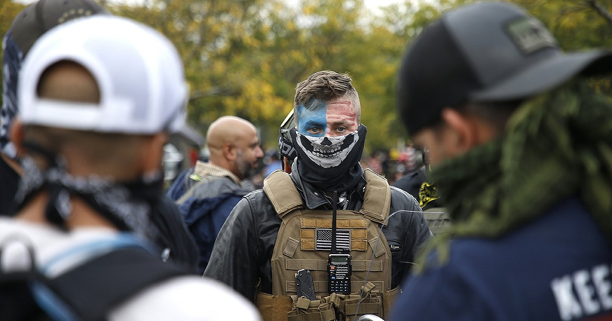

## Today's Agenda {background-image="Images/00-Leviathan_Cover_55.png" .center}

```{r}
library(tidyverse)
library(readxl)
library(kableExtra)
```

<br>

**III. How and why do non-state actors use political violence?**

<br>

The Future of Terrorism?

- Examining the interaction between the internet and terrorism

<br>

::: r-stack
Justin Leinaweaver (Fall 2025)
:::

::: notes
Prep for Class

1. Review submissions on Canvas

2. Markers x 3

<br>

In this final section of our work on terrorism we have been exploring the cutting-edge of terrorism research

- **SLIDE**: Last week...

:::


## A New "Wave" of Terrorism: FRT {background-image="Images/00-Leviathan_Cover_55.png" .center}

{style="display: block; margin: 0 auto"}


::: notes

Last week we examined the literature on the rise of far-right terrorism (FRT) as a new "wave" of terrorism

- We also explored the PIRUS dataset and brainstormed research projects to push this literature forward

<br>

**Refresh my memory, what were the projects you developed last week?**

<br>

**SLIDE**: Next steps

:::


## {background-image="Images/14_1-CyberTerrorism_v2.png" .center}

::: notes

This week we shift to examining the interaction between terrorism and the internet

<br>

I'd like us to consider how the internet has interacted with, and complicated, our understandings of terrorism

- How are terrorists adapting to a digital world?

- How are governments adapting their prevention strategies to meet these new threats?

- Where does the literature need to go next?

<br>

**SLIDE**: Assignment for today

:::


## For Today {background-image="Images/00-Leviathan_Cover_55.png" .center}

<br>

### The Future of Terrorism

Bring to class **TWO** examples of the internet changing terrorism as a political strategy. 

1. A terror group changing its operational behavior, and

2. States changing how they combat terrorism

::: notes

For today I asked everybody to submit two cases we could use to develop our intuitions about this complicated interaction.

<br>

**Everybody ready to go with this?**

<br>

*Split class in three*

- Sit with your groups and claim space on the board!

<br>

**SLIDE**: Groups, your job is to make an argument that I will assign to you

:::


## The Internet and Terrorism {background-image="Images/00-Leviathan_Cover_55.png" .center}

<br>

Group Arguments:

::: {.incremental}

1. Therefore, the internet means we need entirely new definitions and models of terror group behavior

2. Therefore, the internet means we need entirely new definitions and models of how states respond to terrorism

3. Therefore, our established definitions and models of terrorism remain applicable in the digital age

:::

::: notes

GROUPS, review the submitted cases and then diagram your assigned argument on the board

- Give us your strongest premises that support this assigned conclusion

<br>

**REVEAL x 3**: Assigned group arguments

<br>

**Questions on the task?**

- Go!

<br>

Let's focus first on the Group 1 argument

- *PRESENT*

- CLASS: **Can we make this stronger? Edits or additions needed?**

<br>

Repeat on Group 2 argument

Repeat on Group 3 argument

<br>

**SLIDE**: Wrapping up

:::


## {background-image="Images/14_1-CyberTerrorism_v2.png" .center}

::: notes

**So, where do we end up?**

- **Do we need to reinvent political studies of terrorism to account for the role of the internet or not?**

<br>

**To what degree are we convinced that cyber terrorism (terror on the internet) is a different thing from traditional conceptions of terrorism?**

<br>

**Does considering the internet change the debate between Pape and Abrams about the effectiveness of terrorism? Why or why not?**

<br>

**SLIDE**: Assignment for next class

:::


## For Next Class {background-image="Images/00-Leviathan_Cover_55.png" .center}

<br>

Müller & Schwarz (2021). Fanning the Flames of Hate: Social Media and Hate Crime. *Journal of the European Economic Association*

- Submit reflections on Canvas

::: notes

Müller, K., & Schwarz, C. (2021). Fanning the Flames of Hate: Social Media and Hate Crime. *Journal of the European Economic Association*, 19(4), 2131–2167.

Canvas Assignment: Analyze the Müller and Schwarz (2021) Argument

1. What is your level of confidence in the central conclusion of the Muller and Schwarz (2021) article? In other words, have the authors convinced you of their findings? Why or why not? (3+ sentences)

2. Assuming the research findings are correct, what do you believe should be done in our society to reduce the risks of social media on political violence? You can absolutely argue that nothing should be done, but you still have to explain why. (3+ sentences)


:::


