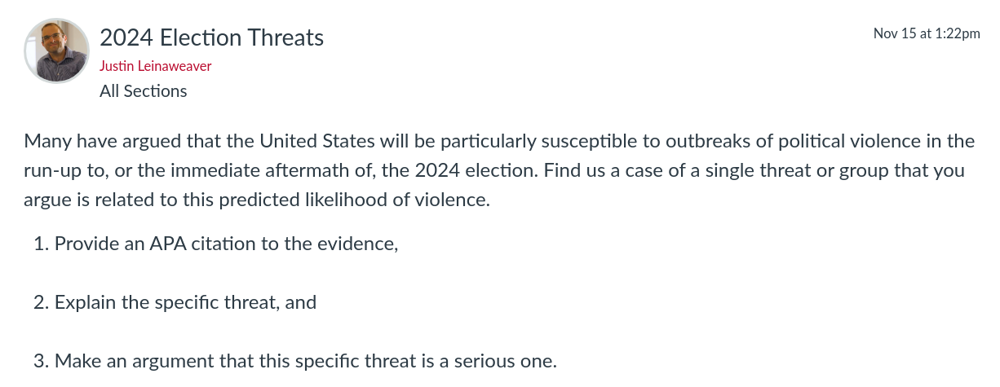
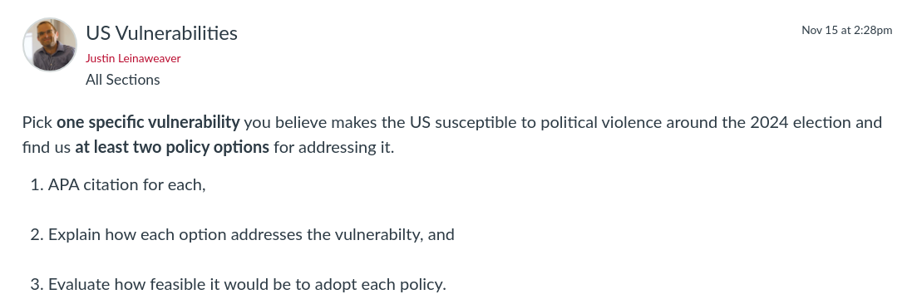

---
output:
  xaringan::moon_reader:
    css: ["default", "extra.css"]
    lib_dir: libs
    seal: false
    nature:
      highlightStyle: github
      highlightLines: true
      countIncrementalSlides: false
      ratio: '16:9'
---

```{r, echo = FALSE, warning = FALSE, message = FALSE}
##xaringan::inf_mr()
## For offline work: https://bookdown.org/yihui/rmarkdown/some-tips.html#working-offline
## Images not appearing? Put images folder inside the libs folder as that is the main data directory

library(tidyverse)
##library(readxl)
##library(stargazer)
##library(kableExtra)
##library(modelr)

knitr::opts_chunk$set(echo = FALSE,
                      eval = TRUE,
                      error = FALSE,
                      message = FALSE,
                      warning = FALSE,
                      comment = NA)
```

background-image: url('libs/Images/00-Leviathan_Cover_55.png')
background-size: 100%
background-position: center
class: middle

.center[.size40[**III. How and why do non-state actors use political violence?**]]

<br>

.size50[**Today's Agenda**

- Threats of political violence tied to the 2024 election

]

<br>

.center[.size40[
  Justin Leinaweaver (Fall 2023)
]]

???

### Prep for Class
1. IDEA Evals Day

2. Make sure paper 3 assignment is visible on Canvas

<br>


---

background-image: url('libs/Images/background-blue_triangles.jpg')
background-size: 100%
background-position: center
class: middle

.size60[
.content-box-white[**IDEA Course Evaluations**]

<br>

.content-box-white[https://drury.campuslabs.com/eval-home/]
]

???


---

background-image: url('libs/Images/background-blue_triangles.jpg')
background-size: 100%
background-position: center
class: middle

.size60[.content-box-purple[**For Today**]]

<br>

```{r, echo = FALSE, fig.align = 'center', out.width = '90%'}

```

???

### Everybody ready to go with this?

<br>

PRESENT each case and argument, DISCUSS and track list *ON BOARD*


---

background-image: url('libs/Images/14_3-2024_Violence_filtered.png')
background-size: 100%
background-position: center
class: top, center, inverse

.textwhite[.size45[**Overall, how serious is the threat of political violence in the US in 2024?**]]

???

### Overall, how serious is the threat of political violence in the US in 2024?


---

background-image: url('libs/Images/14_3-Capitol_Building_v2.png')
background-size: 100%
background-position: center
class: top, center, inverse

.textwhite[.size45[**What are the specific vulnerabilities that make these threats possible?**]]

???

### What are the specific vulnerabilities that make these threats possible?

- *BRAINSTORM on BOARD*

<br>

<br>

**SLIDE**: With all of this in mind, I would like to propose the following as the assignment for your final paper in this class.


---

background-image: url('libs/Images/background-blue_triangles.jpg')
background-size: 100%
background-position: center
class: middle

.size35[
.center[**Paper 3: How do we reduce the likelihood of political violence this coming election season?**]

Write a report advocating a specific policy recommendation at either the local, state or national level that you argue will help prevent, or minimize, the likelihood of political violence around the election. 

A strong proposal will:

- be specific (e.g. include the kinds of details a relevant stakeholder would need to implement your proposal), and

- provide evidence that your proposal is likely to be effective.
]

???

### Questions on the assignment?

<br>

**SLIDE**: To get you on track for the paper let's build on our work from today


---

background-image: url('libs/Images/background-blue_triangles.jpg')
background-size: 100%
background-position: center
class: middle

.size60[.content-box-purple[**For Next Class**]]

<br>

```{r, echo = FALSE, fig.align = 'center', out.width = '90%'}

```

???

### Questions on the assignment?


