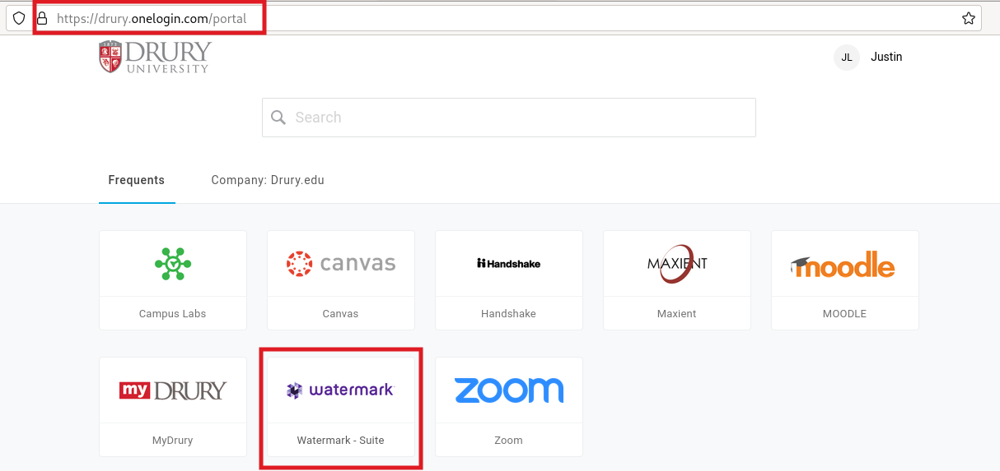

---
output:
  xaringan::moon_reader:
    css: ["default", "extra.css"]
    lib_dir: libs
    seal: false
    nature:
      highlightStyle: github
      highlightLines: true
      countIncrementalSlides: false
      ratio: '16:9'
---

```{r, echo = FALSE, warning = FALSE, message = FALSE}
##xaringan::inf_mr()
## For offline work: https://bookdown.org/yihui/rmarkdown/some-tips.html#working-offline
## Images not appearing? Put images folder inside the libs folder as that is the main data directory

library(tidyverse)
##library(readxl)
##library(stargazer)
##library(kableExtra)
##library(modelr)

knitr::opts_chunk$set(echo = FALSE,
                      eval = TRUE,
                      error = FALSE,
                      message = FALSE,
                      warning = FALSE,
                      comment = NA)
```

class: slideblue

.size80[**Today's Agenda**]

<br>

.size65[
Work on Final Paper Projects
]

<br>

.center[.size40[
  Justin Leinaweaver (Spring 2022)
]]

???


---

class: middle, slideblue

.center[.size50[**You must submit the final paper to Moodle AND Watermark**]]

```{r, out.width='80%', fig.align='center'}

```

???

Super important head's up!

Sorry to hit you with a bit of housekeeping, but I need everybody to submit their final paper twice.
- Once to Moodle, and once to Watermark for departmental assessment. 

- This will not impact your final grade. 

- It is designed to require every department on campus to continuously monitor student growth and learning.

- You access Watermark through the OneLogin portal (link on the Drury website). 

- Log in, select our class and you should see a link to this assignment.

<br>

My apologies for adding an extra item to your to-do list, but I'm told I will not be able to submit your final grade in this class at the end of term unless you have uploaded the paper to Watermark. 

### Any questions on this?


---

class: middle, slideblue

.center[.size50[**Final Paper Prompt**]]

.size35[Write a report analyzing a specific policy action taken by a state or a non-state actor meant to reduce the occurrence or severity of terrorism in a single country.

- Analyze Terrorism Data (GTD and EDTG)
- Analyze Political Violence Data (CIRIGHTS and PTS)

Does the evidence indicate that these interventions have reduced the frequency or scale of attacks? Have these interventions impacted citizens' experiences of political violence in the state?]

???

### Questions on the final paper?


---

class: middle, slideblue

.size70[**For Today**]

.size50[
What other evidence do you need to make this argument? 

- Go find it and bring to class!
]

???

### Everybody ready to go with this?


---

class: middle, slideblue

# The Key Analytical Questions
.size40[
1. Does the evidence indicate that these interventions have reduced the frequency or scale of attacks? 

2. Have these interventions impacted citizens' experiences of political violence in the state?
]

???

Here the two key analytical questions in the paper prompt.

--

.size40[
.center[**Do you have enough evidence to answer these two questions with some certainty?**]
]

???

<br>

<br>

Your job today is to present your answer to these two questions and the evidence you have so far to classmates.

Are they convinced you have a clear answer and sufficient evidence to support it?


