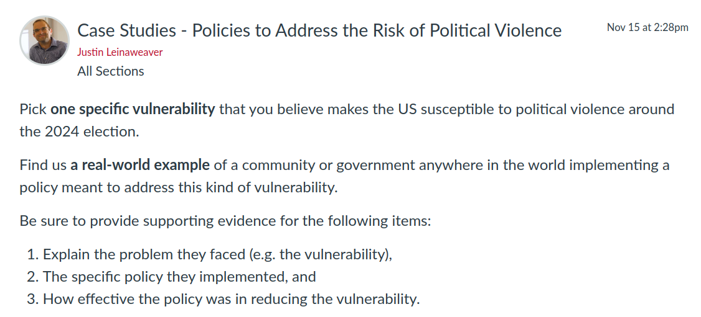

---
output:
  xaringan::moon_reader:
    css: ["default", "extra.css"]
    lib_dir: libs
    seal: false
    nature:
      highlightStyle: github
      highlightLines: true
      countIncrementalSlides: false
      ratio: '16:9'
---

```{r, echo = FALSE, warning = FALSE, message = FALSE}
##xaringan::inf_mr()
## For offline work: https://bookdown.org/yihui/rmarkdown/some-tips.html#working-offline
## Images not appearing? Put images folder inside the libs folder as that is the main data directory

library(tidyverse)
##library(readxl)
##library(stargazer)
##library(kableExtra)
##library(modelr)

knitr::opts_chunk$set(echo = FALSE,
                      eval = TRUE,
                      error = FALSE,
                      message = FALSE,
                      warning = FALSE,
                      comment = NA)
```

background-image: url('libs/Images/00-Leviathan_Cover_55.png')
background-size: 100%
background-position: center
class: middle

.center[.size40[**III. How and why do non-state actors use political violence?**]]

<br>

.size50[**Today's Agenda**

- Reviewing real-world policies designed to reduce political violence

]

<br>

.center[.size40[
  Justin Leinaweaver (Fall 2023)
]]

???

### Prep for Class
1. Review Canvas submissions


---

background-image: url('libs/Images/background-blue_triangles.jpg')
background-size: 100%
background-position: center
class: middle

.size35[
.center[**Paper 3: How do we reduce the likelihood of political violence this coming election season?**]

Write a report advocating a specific policy recommendation at either the local, state or national level that you argue will help prevent, or minimize, the likelihood of political violence around the election. 

A strong proposal will:

- be specific (e.g. include the kinds of details a relevant stakeholder would need to implement your proposal), and

- provide evidence that your proposal is likely to be effective.
]

???

Papers are due at end of final exam window
- Dec 14th, 12:20pm

- NO LATE PAPERS ACCEPTED

<br>

### Questions on the assignment?


---

background-image: url('libs/Images/background-blue_triangles.jpg')
background-size: 100%
background-position: center
class: middle

.size50[.content-box-purple[**For Today**]]

<br>

```{r, echo = FALSE, fig.align = 'center', out.width = '100%'}

```

???

For today I asked each of you to find us a real-world case study that answers the prompt for our final paper.

<br>

### How did this go?

<br>

*Split class into four groups (5 each?)*

- Go sit with your group!


---

background-image: url('libs/Images/15_2-civil-uncrest-stage_v3.png')
background-size: 100%
background-position: center
class: top, inverse

.size55[
.center[**Preventing Political Violence Using Policy**]
]

???

Groups, start by reviewing all the submitted cases

- Does anything need clarification?


---

background-image: url('libs/Images/15_2-civil-uncrest-stage_v3.png')
background-size: 100%
background-position: center
class: top, inverse

.size55[
.center[**Preventing Political Violence Using Policy**]

**Level of Effectiveness**
- Not Effective

- Somewhat Effective

- Very Effective
]

???

Let's categorize the cases in three lists ON THE BOARD

- *ON BOARD*


---

background-image: url('libs/Images/15_2-civil-uncrest-stage_v3.png')
background-size: 100%
background-position: center
class: middle, inverse

.size55[
**Identify the design advice from these cases:**

- What characterizes the successfully targeted vulnerabilities?

- What characterizes the more successful policies?
]

???

Groups, let's use our cases to make some inferences!

- Get ready to report back to the class

<br>

### Per these cases, what characterizes the successfully targeted vulnerabilities?

- *ON BOARD*

<br>

### Per these cases, what characterizes the more successful policies?

- *ON BOARD*


---

background-image: url('libs/Images/background-blue_triangles.jpg')
background-size: 100%
background-position: center
class: middle

.size35[
.center[**Paper 3: How do we reduce the likelihood of political violence this coming election season?**]

Write a report advocating a specific policy recommendation at either the local, state or national level that you argue will help prevent, or minimize, the likelihood of political violence around the election. 

A strong proposal will:

- be specific (e.g. include the kinds of details a relevant stakeholder would need to implement your proposal), and

- provide evidence that your proposal is likely to be effective.
]

???

### Ok, does everybody have a good start to their paper?

### - Anything we can help with?


---

background-image: url('libs/Images/background-blue_triangles.jpg')
background-size: 100%
background-position: center
class: middle

.size50[.content-box-purple[**For Next Class: Submit a Bullet-Point Outline**]]

<br>

.size45[
- Introduction (3 elements),

- At least three premises (with an indication of evidence needed), and

- A conclusion that addresses the feasibility of your proposal
]

???

The more you can give us the better our feedback in class on Friday

<br>

### Questions on my expectations?

<br>

- Introduction:
    1. What is the question?
    2. Why should we care?
    3. What is your argument?

- A good premise is a complete sentence that presents one of the big ideas that builds crucial support for your conclusion


